# Solid-to-shell coupling
The documentation describes the algorithm of solid-to-shell coupling for SPH solvers. The data transfer sequence is presented in the first section, then the mapping algorithm for unmatching interfaces are discussed in the second section.

## Shell motion as a constraint
Prof. Hu suggested an implementation of the solid-shell coupling similar to the deformable-rigid coupling. In the deformable-rigid coupling, the internal forces of the body is first computed (in `IstHalfIntegration`) with the assumption that the whole body is rigid. Then the internal forces on the rigid part is used to update the rigid body motion as the external loads. After the rigid-motion update, the velocitys and positions are mapped back to the rigid particles, which in turn affects the deformation rate of the elastic part (in `2ndHalfIntegration`) as a velocity constraint.  

Analogously, for solid-shell coupling, the union of solid and shell are treated as a volumetric solid body in `IstHalfIntegration`. Unlike the rigid-deformable case, here we construct two separate bodies. The solid body is extended by one layer, which is considered to overlap with the shell particles in this section. The shell particles are then updated with the external coupling forces equivilant to the solid internal forces. The velocity of the shell particles are applied to the connected solid extension particles before the `2ndHalfIntegration` of solid.

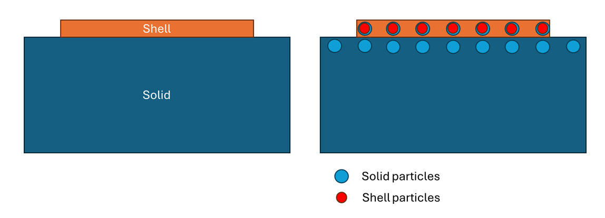

The algorithm is summarized below:

1. Execute 1st half integration of the solid body
2. Copy the internal forces `force_` on the extented particles to the external force 'force_prior_' of the overlapping shell particles
3. Execute 1st and 2nd half integration of the shell body
4. Copy the velocity of the shell particles to the overlapping solid particles
5. Execute 2nd half of the solid body

This method is similar to the staggered Dirichlet-Neumann coupling method, where the force is mapped from origin side to the destiny side and the displacement is mapped from the destiny side to the origin side. The data transfer sequence is depicted in the figure below, where n refers to the time step.

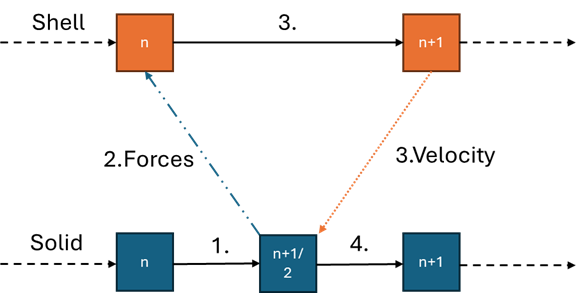

The stability of the staggered method is questionable when the stiffness ratio between two domains is similar. Usually, the softer body is selected as the origin side (which gives the force), while the stiffer body is selected as the destiny side (which gives the displacement). Hence, we assume that the shell body is stiffer than the volumetric body and is chosen as the destiny side.

## Data mapping for unmatching interfaces
Reference: Chapter 2.2, Lindner, Florian. "Data transfer in partitioned multi-physics simulations: interpolation & communication." (2019).

In case the solid side and shell side has different resolutions and particle distributions, a mapping is required to transfer the data. Following the formulations of the coupling problem in FEM, the continuous fields can be approximated by the shape functions and nodal values:

$$\mathbf{u_O(x)}\approx \mathbf{N_O(x)^T} \mathbf{U_O(x)}$$
$$\mathbf{t_O(x)}\approx \mathbf{N_O(x)^T} \mathbf{T_O(x)}$$
$$\mathbf{u_D(x)}\approx \mathbf{N_D(x)^T} \mathbf{U_D(x)}$$
$$\mathbf{t_D(x)}\approx \mathbf{N_D(x)^T} \mathbf{T_D(x)}$$

where $\mathbf{u}$ and $\mathbf{U}$ represent the continuous and nodal displacement respectively, while $\mathbf{t}$ and $\mathbf{T}$ represent the continuous and nodal traction respectively. The underscript O and D denote the origin side (solid) and destiny side (shell).

For displacement, usually a direct/consistent mapping is used, where the row sum of $\mathbf{H_{OD}}$ is equal to 1.

$$\mathbf{u_O} = \mathbf{H_{OD}} \mathbf{u_D}$$

For the force, a conservative mapping is usually required. The conservation of energy at the interface is expressed as

$$\int_{\Gamma} \mathbf{u_D(x)^T} \mathbf{t_D(x)}d\Gamma = \int_{\Gamma} \mathbf{u_O(x)^T} \mathbf{t_O(x)}d\Gamma$$

, which can be reformulated as

$$\mathbf{U_D(x)^T} \int_{\Gamma} \mathbf{N_D(x)}\mathbf{N_D(x)^T} \mathbf{T_D(x)} d\Gamma = 
\mathbf{U_O(x)^T} \int_{\Gamma} \mathbf{N_O(x)}\mathbf{N_O(x)^T} \mathbf{T_O(x)} d\Gamma
$$

With the nodal force defined as

$$\mathbf{F_D(x)} = \int_{\Gamma} \mathbf{N_D(x)}\mathbf{N_D(x)^T} \mathbf{T_D(x)} d\Gamma = \mathbf{M_{DD}}\mathbf{T_D(x)}$$
$$\mathbf{F_O(x)} = \int_{\Gamma} \mathbf{N_O(x)}\mathbf{N_O(x)^T} \mathbf{T_O(x)} d\Gamma = \mathbf{M_{OO}}\mathbf{T_O(x)}$$

, we have the discrete form of energy conservation:

$$\mathbf{U_D(x)^T}\mathbf{F_D(x)} = \mathbf{U_O(x)^T}\mathbf{F_O(x)}$$

From this equation, we can directly obtain the conservative mapping matrix of the nodal force:

$$\mathbf{F_D(x)} = \mathbf{H_{DO}} \mathbf{F_O(x)} = \mathbf{H_{OD}^T} \mathbf{F_O(x)}$$

Hence, the conservative mapping of traction can be written as:

$$\mathbf{T_D(x)} = \mathbf{M_{DD}^{-1}}\mathbf{H_{OD}^T}\mathbf{M_{OO}}\mathbf{T_O(x)}$$

## Direct/consistent mapping with SPH approximation
For SPH method, a direct consistent mapping matrix is available. Using the Shepard filter, the displacement of a solid (origin) particle i can be interpolated from all the shell (destination) particles:

$$\mathbf{U_{O,i}} = \sum_{j\in \Gamma_D} \tilde{\omega_{ij}} \mathbf{U_{D,j}}$$
$$\tilde{\omega_{ij}} = \frac{W_{ij}(h_{ij})V_j}{\sum_{j\in \Gamma_D} W_{ij}(h_{ij})V_j}$$

Note that this interpolation may have low accuracy, since there might be only a few interface particles in the neighborhood. 

As the coupling interface is 2D, I will use a reduced kernel in the following sections. The kernel summation is approximately 1 expect for particles near edges.

For a particle j outside of the neighborhood of i, the weight $\tilde{\omega_{ij}}$ is equal to 0. The (i,j) entry of the mapping matrix $\mathbf{H_{OD}}$ is the weight $\tilde{\omega_{ij}}$. Apparently, the consistency condition $\sum_j \tilde{\omega_{ij}} = 1$ is satisfied.

However, for the force mapping, we cannot directly use the SPH interpolation, since this consistent mapping is not conservative.

Unlike FEM, which defines the nodal force by the integration of traction, I would prefer to directly map the internal force on the particles to the other side, since it is difficult to integrate the non-piecewise SPH shape function.

$$\mathbf{F_{D,i}} = \sum_{j\in \Gamma_O} H_{OD,ji} \mathbf{F_{O,j}}$$

where the (j,i) entry of $\mathbf{H_{OD}}$ is:

$$H_{OD,ji} = \tilde{\omega_{ji}} = \frac{W_{ji}(h_{ji})V_i}{\sum_{k\in \Gamma_D} W_{jk}(h_{jk})V_k}$$

I choose $h_{ij} = max(h_i, h_j)$ as the smoothing length of two particles will different resolutions, which guarantees the symmetry $W_{ij} = W_{ji}$. Hence, the equation can also be written as:

$$H_{OD,ji} = \frac{W_{ij}(h_{ij})V_i}{\sum_{k\in \Gamma_D} W_{jk}(h_{jk})V_k}$$

Since $W_{ij}$ is zero outside of the neighborhood of i, we only need to consider the contribution of solid particles inside the neighborhood of shell particle i.

To implement this conservative mapping for the shell, we need to first compute and record $\sum_{k\in \Gamma_D} W_{jk}(h_{jk})V_k$ for each interfacial solid particle j. This value should be computed from the contact relation solid-shell, instead of shell-solid. 

## Total force summation in the extension test
A deduction of the discrete energy conservation is the nodal force conservation:

$$\sum_{i \in \Gamma_O} \mathbf{F_i} = \sum_{i \in \Gamma_D} \mathbf{F_i}$$

To prove that the force conservation is preserved, we record the summation of solid internal forces and shell coupling forces on the interface in the extension test of a solid reinforced by shell plates on top and bottom. The particle size of shell is twice that of the solid $dp_{\text{shell}}=2dp_{\text{solid}}$. As can be expected, if we use consistent mapping for both velocity and force, the total force of shell will be smaller than that of solid. The search radius of the contact relation is set to $dp_{\text{shell}}$, so that each solid particle can only see one shell neighbor, the velocity mapping is thus equivalent to the nearest neighbor mapping.

With the conservative force mapping, the total force of solid and two shell plates are plotted against the physical time:

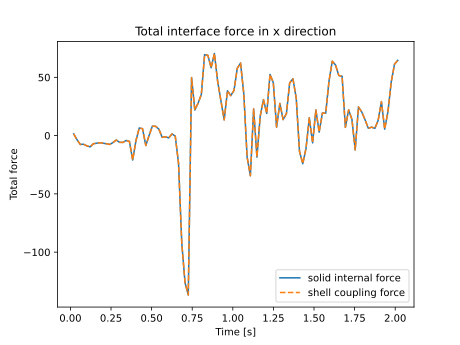
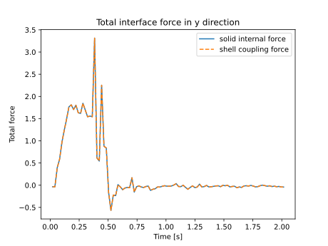
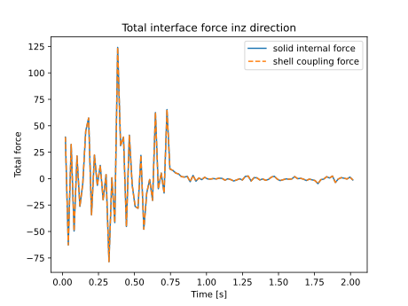

As can be seen from the figures, the force conservation is satisfied. However, the particle clustering can be observed in the second layer of the solid.

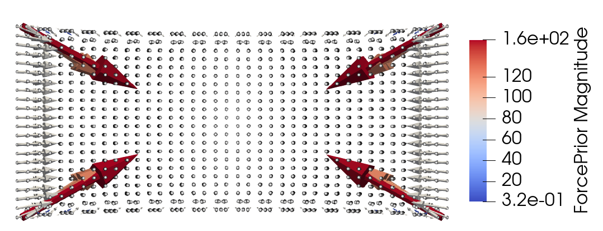

Compared with the nearest neighbor mapping, the one using the SPH interpolation behaves better:

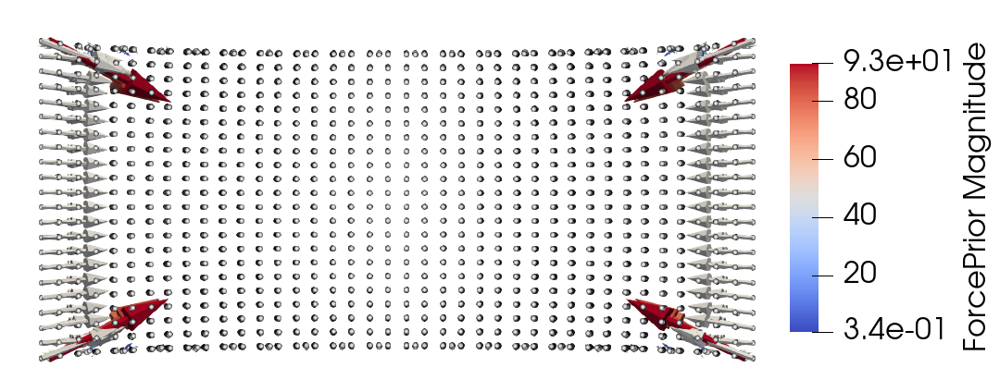

## Comparison with full-solid simulation results
We consider two simple examples: one is a brick reinforced at the top and bottom surfaces as mentioned in the previous section, the other is a brick reinforced at the mid-plane. The brick is deformed under extension or shearing loads. The displacements along the x-axis and y-axis on the bottom surface of solid are used for comparison.

The parameters of the problem are listed below:

- Length $L=40 \mathrm{mm}$, width and height $W=H=20 \mathrm{mm}$, 
shell thickness $t=0.5 \mathrm{mm}$
- Density $\rho = 1000 \mathrm{kg/m^3}$, Young's modulus of shell $E = 10 \mathrm{GPa}$, Young's modulus of solid $E = 1 \mathrm{GPa}$, Poisson ratio $\nu=0.3$
- End time $t=2 \mathrm{ms}$

The material uses the Saint-Venant Kirchhoff model. Note that for SPHinXsys, as the Saint-Venant Kirchhoff model is not implemented correctly for shell, the shell actually uses the linear elastic model for small strain. 

The resolution of the fully volumetric solid case is selected as $0.125 {mm}$. For the coupling case, the resolution of solid and shell is the same, but the solid body is relaxed so that the interface is non-matching. The interpolation mapping mentioned before is used to trasfer information between solids and shells.

The observer positions are:

- X-observer: $x \in [-L/2,L/2]$, $y = 0$, $z=-H/2$
- Y-observer: $y \in [-W/2,W/2]$, $x = 0$, $z=-H/2$

Due to the differences in geometry, for the mid-surface reinforced case, the Y-observers are located on $z=-H/2-t/2$ position.

It is not impossible to obtain a converged solution for the coupling case. The reason is that we use the velocity of the shell mid-surface instead of the velocity on the interface as the coupling velocity constraint. This approximation is only acceptable when the thickness is much smaller than the resolution. With refinement, this condition will be violated, introducing other errors. For the fully solid model, the convergence analysis is also not performed due to computational resource limitation. Despite these limitations, it is still possible to observer the overall trend of the coupling method. 

### Problem 1, extension
- X-observer
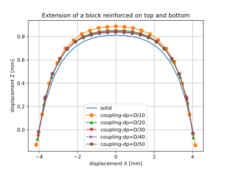

- Y-observer
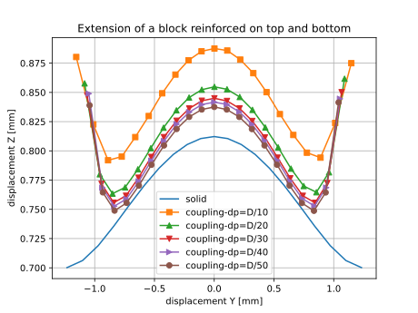

### Problem 1, shear

- X-observer
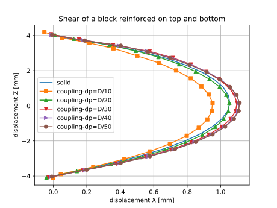

- Y-observer
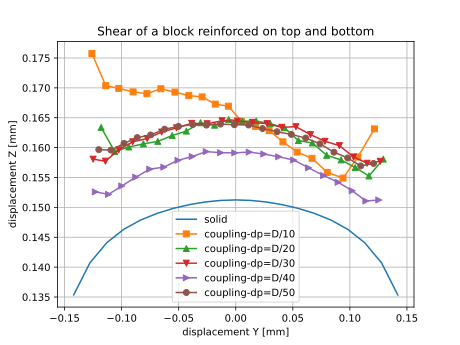

### Problem 2, extension
- X-observer
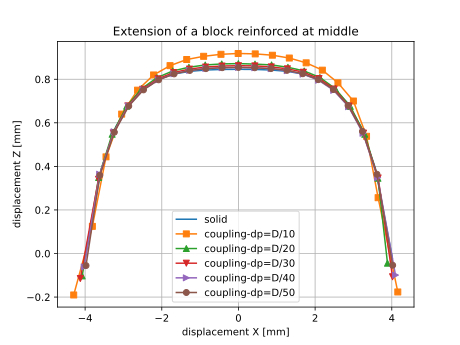

- Y-observer
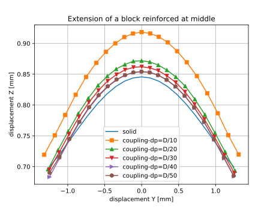

### Problem 2, shear
- X-observer
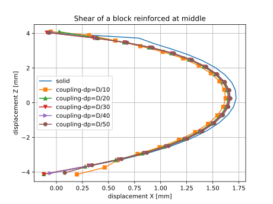

- Y-observer
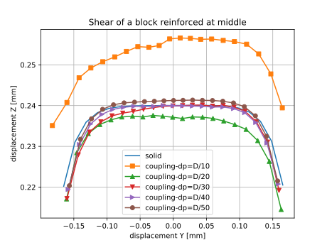

The difference in values might be explained by the error sources mentioned before, but the difference of deformation of oberver Y in the extension of problem 1 seems to be too large near the boundary. It is still not possible to tell if the solid-shell coupling is validate from the current tests.