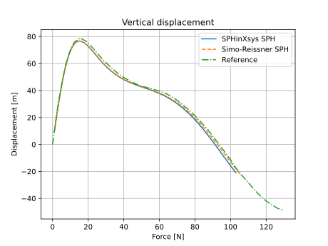

# Simo-Reissner Beam Theory
The beam theory considered here assumes that the beam cross-sections are rigid during the deformation. Hence, the kinematics at each point have 6 DOFS: three translational one representing the centroid position, and three rotational ones describing the rigid rotation of the cross sections. Hence, an orthogonal triad consisting of the base vectors $\mathbf{g}_1$, $\mathbf{g}_2$ and $\mathbf{g}_3$ is attached to the cross section.

The condition of vanishing in-plane stress component $S^{22}=S^{33}=0$ no longer holds due to the rigid cross-section assumption, which requires the existence of in-plane reaction forces in general.

Some notations that will be used in this note is listed below:

- $(\cdot)'=\frac{\partial(\cdot)}{\partial s}$: derivative to the arc length parameter $s$
- $\dot{(\cdot)}=\frac{\partial(\cdot)}{\partial t}$: derivative to time

## Kinematics
The variables that will be used in this section are listed below:

- $s\in [0,L] =: \Omega_L$: arc length parameter of the curve, where $L$ is the beam length in the initial configuration
- $(s_2, s_3)$: convective coordinates describing the position of a material point within the rigid cross-section
- $(s,s_1,s_2,t)$: the position vector
- $\mathbf{r}(s,t)$: the centroid line position vector
- $\mathbf{r}_0(s)$: initial centroid line position vector
- $\mathbf{E}_i,i=1,2,3$: the Cartesian frame
- $\mathbf{g}_i,i=1,2,3$: the orthogonal triad attached to the cross section, with $\mathbf{g}_1=\mathbf{g}_2 \times \mathbf{g}_3$. Note that $\mathbf{g}_1$ is not the same as the tangential direction of the centroid curve $\mathbf{r}'$
- $\mathbf{g}_{0i},i=1,2,3$: intial orthogonal triad attached to the cross section, with $\mathbf{g}_1={\mathbf{r}_0}'$
- $\boldsymbol{\Lambda}$: the orthogonal transformation that transforms the global frame to the local frame, with $\boldsymbol{\Lambda} = \mathbf{g}_i \otimes \mathbf{E}_i \text{ or } \mathbf{g}_i = \boldsymbol{\Lambda}\mathbf{E}_i$
- $\boldsymbol{\Lambda}_0$: the orthogonal transformation that transforms the global frame to the initial local frame
- $\boldsymbol{\psi}$: rotation vector defined in the Rodrigues formula, which can be used to parametrize the transformation matrix $\boldsymbol{\Lambda}(\boldsymbol{\psi})$

The configuration of the beam at time $t$ is given by $s,t \rightarrow C:=(\mathbf{r}, \boldsymbol{\Lambda}(\boldsymbol{\psi}))$, i.e., the configuration is defined by the centroid position $\mathbf{r}$ (3 translational DOFs) and the transformation matrix $\boldsymbol{\Lambda}$ given by the rotation vector $\boldsymbol{\psi}$ (3 rotational DOFs).

The transformation matrix could also be parametrized by the multiplicative rotation vector $\delta \boldsymbol{\theta}$, which will be described in later sections.

The basic kinematics assumption of the beam associated with the initial and deformed configuration is assumed to be:

$$\mathbf{X}(\mathbf{s})=\mathbf{r}_0(s) + s_2 \mathbf{g}_{02}(s) +  s_3 \mathbf{g}_{03}(s),\quad
\mathbf{x}(\mathbf{s},t)=\mathbf{r}(s,t) + s_2 \mathbf{g}_{2}(s,t) +  s_3 \mathbf{g}_{3}(s,t),\quad
\mathbf{s}:=(s,s_2,s_3)^T=:(s_1,s_2,s_3)^T
$$

## Orthogonal transformation

- $\mathbf{S(a)}$: the skew-symmetric tensor of vector $\mathbf{a}$, with $\mathbf{S(a)}\mathbf{b}=\mathbf{a}\times\mathbf{b}$
- $\delta \boldsymbol{\theta}, \delta \boldsymbol{\Theta}$: spatial and material multiplicative rotation vector/spin vector
$$\delta \boldsymbol{\Lambda} = \mathbf{S(\delta \boldsymbol{\theta})}\boldsymbol{\Lambda} \quad 
\delta \boldsymbol{\Lambda} = \boldsymbol{\Lambda}\mathbf{S(\delta \boldsymbol{\Theta})} \quad
\delta\mathbf{g}_i = \delta \boldsymbol{\theta} \times \mathbf{g}_i \quad {with} \quad
\delta \boldsymbol{\theta} = \delta \Theta \mathbf{g}_i \quad \delta \boldsymbol{\Theta} = \delta \Theta \mathbf{E}_i
$$
- $\mathbf{k}(s), \mathbf{K}(s)$: spatial and material curvature vector
$$\boldsymbol{\Lambda}' = \mathbf{S(\mathbf{k})}\boldsymbol{\Lambda} \quad 
\boldsymbol{\Lambda}' = \boldsymbol{\Lambda}\mathbf{S(\mathbf{K})} \quad
\mathbf{g}'_i = \mathbf{k} \times \mathbf{g}_i \quad {with} \quad
\mathbf{k} = K_i \mathbf{g}_i \quad \mathbf{K} = K_i\mathbf{E}_i
$$
- $\mathbf{w}(s), \mathbf{W}(s)$: material and spatial angular velocity
$$\dot{\boldsymbol{\Lambda}} = \mathbf{S(\mathbf{w})}\boldsymbol{\Lambda} \quad 
\dot{\boldsymbol{\Lambda}} = \boldsymbol{\Lambda}\mathbf{S(\mathbf{W})} \quad
\dot{\mathbf{g}}_i = \mathbf{w} \times \mathbf{g}_i \quad {with} \quad
\mathbf{w} = W_i \mathbf{g}_i \quad \mathbf{W} = W_i \mathbf{E}_i
$$

## Mechanical equilibrium 

The variables used in this section are listed below:

- $\dot{\mathbf{r}}$, $\ddot{\mathbf{r}}$: the translational velocity and acceleration of the centroid
- $\mathbf{w}, \mathbf{a}=\dot{\mathbf{w}}$: the angular velocity and acceleration of the rigid rotation, which is related to the frame base vectors by $\dot{\mathbf{g}}_i = \mathbf{w} \times {\mathbf{g}}_i$

- $\mathbf{P}=\mathbf{T}_i\otimes \mathbf{g}_{0i}$: first Piola-Kirchhoff stress
- $\mathbf{T}_1 = \mathbf{P}\cdot \mathbf{g}_{01}$: stress vector acting on the cross section
- $\mathbf{f} = \int_A \mathbf{T}_1 dA$: the resultant force per unit of reference length over the cross section $A$
- $\bar{\mathbf{l}}=\int_A \rho_0 \dot{\mathbf{x}}dA=\rho_0A \dot{\mathbf{r}}$: linear momentum per unit of reference arc length
- $\mathbf{f}_{\rho} = -\dot{\bar{\mathbf{l}}}$: inertia force
- $\bar{\mathbf{f}}=\sum_{\alpha=2,3}\int_{\Gamma}(\mathbf{T}_{\alpha} n_{\alpha})d\Gamma + \int_A \rho_0 \mathbf{b}dA$: the resultant surface force and body force
- $\mathbf{m} = \int_A [\mathbf{x}-\mathbf{r}]\times\mathbf{T}_1 dA$: the resultant momentum per reference length over the cross section $A$
- $\bar{\mathbf{m}}=\sum_{\alpha=2,3}\int_{\Gamma}(\mathbf{x}-\mathbf{r})\times(\mathbf{T}_{\alpha} n_{\alpha})d\Gamma + \int_A \rho_0 (\mathbf{x}-\mathbf{r})\times\mathbf{b}dA$
- $\bar{\mathbf{h}}=\int_A \rho_0 [\mathbf{x}-\mathbf{r}]\times \dot{\mathbf{x}}dA=\mathbf{I}_{\rho}\mathbf{w}$: the angular momentum per unit of reference arc length, where $\mathbf{I}_{\rho}$ is the inertia tensor
- $\mathbf{m}_{\rho} = -\dot{\bar{\mathbf{h}}}$: inertia momentum

### Strong form
The derivation of equilibrium equations is based on the Newton's second law:

$$\rho_0 \ddot{\mathbf{x}} = \nabla^0\cdot \mathbf{P} + \rho_0 \mathbf{b}$$

By integrating the force or the momentum on the cross section and applying the Newton's second law, we obtain:

$$\dot{\bar{\mathbf{l}}}=\rho_0 A \ddot{\mathbf{r}} = \mathbf{f}'+\bar{\mathbf{f}}$$
$$\dot{\bar{\mathbf{h}}}=\mathbf{I}_{\rho}\mathbf{a} + \mathbf{w}\times\bar{\mathbf{h}}=\mathbf{m}'+\mathbf{r}'\times \mathbf{f} + \bar{\mathbf{m}}$$

The inertia tensor is defined as:

$$\mathbf{I}_{\rho} = \rho J\mathbf{g}_1 \otimes \mathbf{g}_1 + \rho I_2\mathbf{g}_2 \otimes \mathbf{g}_2 + \rho I_3\mathbf{g}_3 \otimes \mathbf{g}_3$$

with

$$\rho I_2 = \int_A \xi_3^2 \rho_0 d\boldsymbol{\xi},\quad \rho I_3 = \int_A \xi_2^2 \rho_0 d\boldsymbol{\xi}, \quad \rho J =\rho I_2 +\rho I_3$$

### Weak form
Some variables used in this chapter are listed below:

- $\delta \mathbf{r}$: virtual displacement
- $\delta \boldsymbol{\theta}$: multiplicative virtual rotation
- $\delta_0\mathbf{a} := \delta\mathbf{a}-\delta\boldsymbol{\theta}\times \delta\mathbf{a}$: objective variation
- $\boldsymbol{\gamma}=\mathbf{r}'-\mathbf{g}_1$: the deformation measure representing axial tension and shear
- $\boldsymbol{\omega}=\mathbf{k}-\boldsymbol{\gamma}\boldsymbol{\gamma}_0^T\mathbf{k}_0$: the deformation measure representing torsion and bending
- $\boldsymbol{\Gamma}=\boldsymbol{\Lambda}^T\boldsymbol{\gamma}=\boldsymbol{\Lambda}^T\mathbf{r}'-\mathbf{E}_1$: the material deformation measure representing axial tension and shear
- $\boldsymbol{\Omega}=\boldsymbol{\Lambda}^T\boldsymbol{\omega}=\mathbf{K}-\mathbf{K}_0$: the material deformation measure representing torsion and bending
- $\mathbf{F}:=\boldsymbol{\Lambda}^T\mathbf{f}$: material resultant force
- $\mathbf{M}:=\boldsymbol{\Lambda}^T\mathbf{m}$: material resultant momentum

By multiplication of the strong form equations with $\delta \mathbf{r}$ and $\delta \boldsymbol{\theta}$, we obtain the week form:

$$G=\int_{0}^{l} [\delta_0 \boldsymbol{\omega}^T\mathbf{m} + \delta_0 \boldsymbol{\gamma}^T\mathbf{f}-\delta\boldsymbol{\theta}^T(\bar{\mathbf{m}}+\mathbf{m}_{\rho})-\delta \mathbf{r}^T(\bar{\mathbf{f}}+\mathbf{f}_{\rho})]ds
-[\delta \mathbf{r}^T \mathbf{f}_{\sigma}]_{\Tau_{\sigma}}
-[\delta \boldsymbol{\theta}^T \mathbf{m}_{\sigma}]_{\Tau_{\sigma}}
$$

Alternatively, it can be reformulated using the material deformation measures and resultant stresses:

$$G=\int_{0}^{l} [\delta \boldsymbol{\Omega}^T\mathbf{M} + \delta \boldsymbol{\Gamma}^T\mathbf{F}-\delta\boldsymbol{\theta}^T(\bar{\mathbf{m}}+\mathbf{m}_{\rho})-\delta \mathbf{r}^T(\bar{\mathbf{f}}+\mathbf{f}_{\rho})]ds
-[\delta \mathbf{r}^T \mathbf{f}_{\sigma}]_{\Tau_{\sigma}}
-[\delta \boldsymbol{\theta}^T \mathbf{m}_{\sigma}]_{\Tau_{\sigma}}
$$

## Configuration update

The centroid position can be simply updated by:

$$\mathbf{r}^{n+1} = \mathbf{r}^{n} + d\mathbf{r}$$

The rotation is updated by an exponential map:

$$\boldsymbol{\Lambda}^{n+1}=\exp(\mathbf{S}(\boldsymbol{d\theta}^{n+1}))\boldsymbol{\Lambda}^{n} \quad\text{with}\\
\exp(\mathbf{S}(\boldsymbol{d\theta}))=\mathbf{I}+\sin({d\theta})\mathbf{S}(\mathbf{e_{d\theta}})+[1-\cos(d\theta)]\mathbf{S}(\mathbf{e_{d\theta}})\mathbf{S}(\mathbf{e_{d\theta}})\\
d\theta = \lVert\boldsymbol{d\theta}\rVert \quad \mathbf{e_{d\theta}}=\boldsymbol{d\theta}/d\theta
$$

This map has a singularity at $d\boldsymbol{\theta} = \mathbf{0}$. To avoid this singularity, we set $\exp(\mathbf{S}(\boldsymbol{d\theta}))$ as the identity matrix, when $d\theta$ is smaller than a small real number.

## Stress computation
The reference paper [Simo1985](https://doi.org/10.1016/0045-7825(85)90050-7) computes the resultant stress and moment based on the tensile/shear strain measures:

$$\boldsymbol{\Gamma}=\boldsymbol{\Lambda}^T\mathbf{r}'-\mathbf{E}_1\\
\boldsymbol{\Omega}=\mathbf{K}-\mathbf{K}_0=\boldsymbol{\Lambda}^T(\boldsymbol{\Lambda}'-\boldsymbol{\Lambda}_0')$$

Then the material resultant forces are computed as:

$$\mathbf{F}=\mathbf{C}_{F} \cdot \boldsymbol{\Gamma}\\
\mathbf{M}=\mathbf{C}_{M} \cdot \boldsymbol{\Omega}
$$

where 

$$\mathbf{C}_{M} = \text{diag}[GJ, EI_2, EI_3]\\
\mathbf{C}_{F} = \text{diag}[EA, G\bar{A}_2, G\bar{A}_3]
$$

However, I used a more general way to calculate the resultant force. First, consider the deformation gradient tensor:

$$\mathbf{F}^L=[\frac{\partial \mathbf{x}^L}{\partial s}, \frac{\partial \mathbf{x}^L}{\partial s_2},\frac{\partial \mathbf{x}^L}{\partial s_3}] = \mathbf{F}_m^L + s_2 \mathbf{F}_2^L + s_3\mathbf{F}_3^L$$

where

$$\mathbf{F}_m^L = [\frac{\partial \mathbf{r}^L}{\partial s}, \mathbf{g}_2^L, \mathbf{g}_3^L]\\
\mathbf{F}_2^L = [\frac{\partial \mathbf{g}_2^L}{\partial s}, \mathbf{0}, \mathbf{0}]\\
\mathbf{F}_3^L = [\frac{\partial \mathbf{g}_3^L}{\partial s}, \mathbf{0}, \mathbf{0}]$$

Here the superscript $L$ denotes the initial local frame.

Then the 1st Piola-Kirchhoff at position $\mathbf{x}$ can be computed for any material model from the deformation gradient tensor. The resultant stress and momemtum can thus be integrated over the cross section by Gaussian quadrature.

## Algorithm

For simplicity, here we assume that an explicit Euler scheme is used for time stepping.

- Variables: the centroid position, velocity and acceleration $[\mathbf{r}, \dot{\mathbf{r}}, \ddot{\mathbf{r}}]$; the material multiplicative rotation increment, angular velocity, angular momentum $[\boldsymbol{\theta}, \mathbf{w}, \mathbf{a}]$

The procedure of solving the problem is:

1. Compute the 1st Piola Kirchhoff stress based on the deformation gradient tensor $\mathbf{P}$. Compute the resultant force $\mathbf{f}$ and moment $\mathbf{m}$ accordingly.

2. Obtain the acceleration $\ddot{\mathbf{r}}_i^{n+1}$ and $\mathbf{a}_i^{n+1}$ from the equilibrium equations

$$(\ddot{\mathbf{r}}, \mathbf{a})^{n+1}=\mathbf{f}((\mathbf{r}, \boldsymbol{\Lambda})_n, (\dot{\mathbf{r}}, \mathbf{w})_n)$$

3. Advance $\dot{\mathbf{r}}_i^{n+1}, \mathbf{r}_i^{n+1}$ and $\mathbf{w}_i^{n+1}, \boldsymbol{\theta}_i^{n+1}$

$$\dot{\mathbf{r}}^{n+1}=\dot{\mathbf{r}}^{n} + dt \ddot{\mathbf{r}}_i^{n+1}\\
\mathbf{w}^{n+1}=\mathbf{w}^{n} + dt \mathbf{a}^{n+1}
$$

$$\mathbf{r}^{n+1}=\mathbf{r}^{n} + dt \dot{\mathbf{r}}_i^{n+1}\\
\boldsymbol{\theta}^{n+1}=\boldsymbol{\theta}^{n} + dt \mathbf{w}^{n+1}
$$

4. Compute the transformation matrix $\boldsymbol{\Lambda}_i^{n+1}$ by $\boldsymbol{\Lambda}^{n+1}=\exp(\mathbf{S}(\boldsymbol{d\theta}^{n+1}))\boldsymbol{\Lambda}^{n}$ and update the principle axes by $\mathbf{g}_2^{n+1}=\boldsymbol{\Lambda}_i^{n+1} \mathbf{g}_2^0$ and $\mathbf{g}_3^{n+1}=\boldsymbol{\Lambda}_i^{n+1} \mathbf{g}_3^0$.

5. Compute the deformation gradient tensor.

## SPH discretization

Based on the Simo-Reissner formulation, the SPH discretized equations are presented in this section. The gradient of a vector can be approximated by:

$$\nabla^0 \mathbf{f}_i = (-\sum_j (\mathbf{f}_i - \mathbf{f}_j) \otimes \nabla^0 W_{ij}V_j^0) \mathbf{B}_i^0$$

where $\mathbf{B}_i^0$ is a linear correction matrix to retrieve 1st order consistency.

An alternative scheme is 

$$\nabla^0 \mathbf{f}_i = \sum_j (\mathbf{f}_i + \mathbf{f}_j) \otimes \nabla^0 W_{ij}V_j^0$$

This scheme does not have 1st order consistency, but preserves momentum conservation.

### Deformation gradient tensor

By applying the 1st discretization, the deformation gradient tensor can be computed as:

$$\nabla^{0,L} {r}_i^L = \mathbf{Q}^0(-\sum_j (\mathbf{r}_i - \mathbf{r}_j) \otimes \nabla^0 W_{ij}V_j^0) [\mathbf{Q}^0]^T \mathbf{B}_i^{L,0}$$

$$\nabla^{0,L} {g}_{\alpha,i}^L = \mathbf{Q}^0(-\sum_j (\mathbf{g}_{\alpha,i} - \mathbf{g}_{\alpha,j}) \otimes \nabla^0 W_{ij}V_j^0) [\mathbf{Q}^0]^T \mathbf{B}_i^{L,0},\quad \alpha=2,3$$

The variables without superscripts are the values in the global frame. Then $\frac{\partial \mathbf{r}^L}{\partial s}$ is the 1st column of $\nabla^{0,L} {r}^L$. It is the same for $\frac{\partial \mathbf{g}_2^L}{\partial s}$ and $\frac{\partial \mathbf{g}_3^L}{\partial s}$.

## Resultant force and moment

Assume that the cross section is rectangular. With the deformation gradient tensor, we can compute the 1st Piola Kirchhoff stress at the Gaussian integration point $(\xi_{I}, \eta_{J})$:

$$\mathbf{F}_{IJ}^L = \mathbf{F}_m^L + \frac{h_2}{2} \xi_{I} \mathbf{F}_2^L + \frac{h_3}{2} \eta_{J} \mathbf{F}_3^L$$

The 1st Piola Kirchhoff stress $\mathbf{P}_{IJ}^L$ can be computed from the material model.

The traction $\mathbf{T}_{IJ} = \mathbf{Q}^T \mathbf{P}_{IJ}^L \cdot \mathbf{g}_{1}^0$.

The momemtum at this Gaussian point is $\mathbf{r}_{IJ} \times \mathbf{T}_{IJ}$, with $\mathbf{r}_{IJ} = \mathbf{r} + \frac{h_2}{2}\xi_{I} \mathbf{g}_{2} + \frac{h_3}{2}\eta_{J} \mathbf{g}_{3} $.

The resultant values are integrated by:

$$\mathbf{f} = \sum_I \sum_J w_I w_J \mathbf{T}_{IJ} \frac{h_2}{2} \frac{h_3}{2} \\
\mathbf{m} = \sum_I \sum_J w_I w_J \mathbf{r}_{IJ} \times \mathbf{T}_{IJ} \frac{h_2}{2} \frac{h_3}{2}
$$

The derivate of $\mathbf{f}$ can be computed by the symmetric scheme:

$$\nabla^{0,L} \mathbf{f}_{i}^L = \mathbf{Q}^0(\sum_j (\mathbf{f}_{\alpha,i} + \mathbf{f}_{\alpha,j}) \otimes \nabla^0 W_{ij}V_j^0) [\mathbf{Q}^0]^T $$
$$\frac{ \partial\mathbf{f}^L}{\partial s} = \nabla^{0,L} \mathbf{f}_{i}^L \cdot \mathbf{g}_{1}^0$$
$$\frac{ \partial\mathbf{f}}{\partial s} = [\mathbf{Q}^0]^T \cdot \frac{ \partial\mathbf{f}^L}{\partial s}$$

Analogously, we can compute $\frac{ \partial\mathbf{m}}{\partial s}$.

Unlike the scheme in the reference paper, using Gaussian quadrature to approximate the resultant force introduces numerical errors.

## SPHinXsys shell-like formulation

Unlike the Simo-Reissner method which computes the angular acceleration and use the exponential map to update the configuration, an alternative is to compute the acceleration of principle axes, and use consecutive rotational angles for configuration update.

Multiply both sides of the momemtum equation by $s_2$ or $s_3$, we can obtain the following equations:

$$\rho I_3 \ddot{\mathbf{g}}_2 = \frac{\partial}{\partial s} \int_A s_2\mathbf{T}_1dA - \int_A \mathbf{T}_2dA + \bar{\mathbf{m}}_2 \quad (1)$$
$$\rho I_2 \ddot{\mathbf{g}}_3 = \frac{\partial}{\partial s} \int_A s_3\mathbf{T}_1dA - \int_A \mathbf{T}_3dA + \bar{\mathbf{m}}_3 \quad (2)$$

with
$$\bar{\mathbf{m}}_2 = \int_A \rho^0 s_2\mathbf{b} dA + \int_{\Tau} s_2 (\mathbf{T}_2 n_2 + \mathbf{T}_3 n_3) d{\Tau}$$
$$\bar{\mathbf{m}}_3 = \int_A \rho^0 s_3\mathbf{b} dA + \int_{\Tau} s_3 (\mathbf{T}_2 n_2 + \mathbf{T}_3 n_3) d{\Tau}$$

It can be shown that $\mathbf{g}_2 \times (1) + \mathbf{g}_3 \times (2)$ is equivalent to the angular momemtum equation in the reference paper.

Assume that the rotational matrix in the initial local coordinate consists of consecutive rotations around three axes:

$$\mathbf{R}^L = \begin{bmatrix}
  \cos(\theta_3) & -\sin(\theta_3) & 0 \\
  \sin(\theta_3) & \cos(\theta_3) & 0 \\
  0 & 0 & 1
\end{bmatrix}
\begin{bmatrix}
  \cos(\theta_2) & 0 & \sin(\theta_2) \\
   0 & 1 & 0\\
  -\sin(\theta_2) & 0 & \cos(\theta_2)
\end{bmatrix}
\begin{bmatrix}
   1 & 0 & 0\\
   0 & \cos(\theta_1) & -\sin(\theta_1) \\
   0 & \sin(\theta_1) & \cos(\theta_1)
\end{bmatrix} \\
= \begin{bmatrix}
   \cos(\theta_3)\cos(\theta_2) & \cos(\theta_3)\sin(\theta_2)\sin(\theta_1) - \sin(\theta_3)\cos(\theta_1)& \cos(\theta_3)\sin(\theta_2)\cos(\theta_1) + \sin(\theta_3)\sin(\theta_1)\\
   \sin(\theta_3)\cos(\theta_2) & \sin(\theta_3)\sin(\theta_2)\sin(\theta_1) + \cos(\theta_3)\cos(\theta_1)& \sin(\theta_3)\sin(\theta_2)\cos(\theta_1) - \cos(\theta_3)\sin(\theta_1)\\
   -\sin(\theta_2) & \cos(\theta_2)\sin(\theta_1) & \cos(\theta_2)\cos(\theta_1)
\end{bmatrix}
$$

The principle axes in the local coordinate are related to the initial principle axes by:

$$\mathbf{g}_2^L =\mathbf{g}_2^L = \mathbf{R}^L \mathbf{g}_2^{0,L} = \mathbf{R}^L \begin{bmatrix}
  0\\
  1\\
  0
\end{bmatrix} \quad
\mathbf{g}_3^L = \mathbf{R}^L \mathbf{g}_3^{0,L} = \mathbf{R}^L \begin{bmatrix}
  0\\
  0\\
  1
\end{bmatrix}
$$

Hence,
$$\mathbf{g}_2^L =\begin{cases}
 g_{2,1} = \cos(\theta_3)\sin(\theta_2)\sin(\theta_1) - \sin(\theta_3)\cos(\theta_1)\\
 g_{2,2} =  \sin(\theta_3)\sin(\theta_2)\sin(\theta_1) + \cos(\theta_3)\cos(\theta_1)\\
 g_{2,3} =  \cos(\theta_2)\sin(\theta_1) \end{cases}
$$

$$\mathbf{g}_3^L =\begin{cases}
 g_{3,1} = \cos(\theta_3)\sin(\theta_2)\cos(\theta_1) + \sin(\theta_3)\sin(\theta_1)\\
 g_{3,2} =  \sin(\theta_3)\sin(\theta_2)\cos(\theta_1) - \cos(\theta_3)\sin(\theta_1)\\
 g_{3,3} =  \cos(\theta_2)\cos(\theta_1) \end{cases}
$$

The rate of axes are:

$$\dot{\mathbf{g}}_2^L =\begin{cases}
 \dot{g}_{2,1} = -[\sin(\theta_3)\sin(\theta_2)\sin(\theta_1)+\cos(\theta_3)\cos(\theta_1)] \dot{\theta}_3 + \cos(\theta_3)\cos(\theta_2)\sin(\theta_1) \dot{\theta}_2 + [\cos(\theta_3)\sin(\theta_2)\cos(\theta_1)+\sin(\theta_3)\sin(\theta_1)] \dot{\theta}_1\\
 \dot{g}_{2,2} =  [\cos(\theta_3)\sin(\theta_2)\sin(\theta_1)-\sin(\theta_3)\cos(\theta_1)] \dot{\theta}_3 + \sin(\theta_3)\cos(\theta_2)\sin(\theta_1) \dot{\theta}_2 + [\sin(\theta_3)\sin(\theta_2)\cos(\theta_1)-\cos(\theta_3)\sin(\theta_1)] \dot{\theta}_1\\
 \dot{g}_{2,3} =  -\sin(\theta_2)\sin(\theta_1) \dot{\theta}_2 + \cos(\theta_2)\cos(\theta_1) \dot{\theta}_1 \end{cases}
$$

$$\dot{\mathbf{g}}_3^L = \begin{cases}
 \dot{g}_{3,1} = -[\sin(\theta_3)\sin(\theta_2)\cos(\theta_1)-\cos(\theta_3)\sin(\theta_1)] \dot{\theta}_3 + \cos(\theta_3)\cos(\theta_2)\cos(\theta_1) \dot{\theta}_2 - [\cos(\theta_3)\sin(\theta_2)\sin(\theta_1)-\sin(\theta_3)\cos(\theta_1)] \dot{\theta}_1\\
 \dot{g}_{3,2} =  [\cos(\theta_3)\sin(\theta_2)\cos(\theta_1)+\sin(\theta_3)\sin(\theta_1)] \dot{\theta}_3 + \sin(\theta_3)\cos(\theta_2)\cos(\theta_1) \dot{\theta}_2 - [\sin(\theta_3)\sin(\theta_2)\sin(\theta_1)+\cos(\theta_3)\cos(\theta_1)] \dot{\theta}_1\\
 \dot{g}_{3,3} =  -\sin(\theta_2)\cos(\theta_1) \dot{\theta}_2 - \cos(\theta_2)\sin(\theta_1) \dot{\theta}_1 \end{cases}
$$

The acceleration of axes:

$$\ddot{\mathbf{g}}_2^L =\begin{cases}
 \ddot{g}_{2,1} & = -\cos(\theta_3)\sin(\theta_2)\sin(\theta_1)[\dot{\theta}_3^2 + \dot{\theta}_2^2 + \dot{\theta}_1^2]
 -2[\sin(\theta_3)\cos(\theta_2)\sin(\theta_1)\dot{\theta}_2\dot{\theta}_3 + \sin(\theta_3)\sin(\theta_2)\cos(\theta_1)\dot{\theta}_1\dot{\theta}_3 - \cos(\theta_3)\cos(\theta_2)\cos(\theta_1)\dot{\theta}_1\dot{\theta}_2]\\
& + \sin(\theta_3)\cos(\theta_1)[\dot{\theta}_3^2 + \dot{\theta}_1^2] + 2\cos(\theta_3)\sin(\theta_1)\dot{\theta}_1\dot{\theta}_3 \\
& + [-\sin(\theta_3)\sin(\theta_2)\sin(\theta_1) - \cos(\theta_3)\cos(\theta_1)]\ddot{\theta}_3
 + cos(\theta_3)\cos(\theta_2)\sin(\theta_1)\ddot{\theta}_2
 + [\cos(\theta_3)\sin(\theta_2)\cos(\theta_1) + \sin(\theta_3)\sin(\theta_1)]\ddot{\theta}_1\\
\ddot{g}_{2,2}& =  -\sin(\theta_3)\sin(\theta_2)\sin(\theta_1)[\dot{\theta}_3^2 + \dot{\theta}_2^2 + \dot{\theta}_1^2]
 +2[\cos(\theta_3)\cos(\theta_2)\sin(\theta_1)\dot{\theta}_2\dot{\theta}_3 + \cos(\theta_3)\sin(\theta_2)\cos(\theta_1)\dot{\theta}_1\dot{\theta}_3 - \sin(\theta_3)\cos(\theta_2)\cos(\theta_1)\dot{\theta}_1\dot{\theta}_2]\\
& -\cos(\theta_3)\cos(\theta_1)[\dot{\theta}_3^2 + \dot{\theta}_1^2] + 2\sin(\theta_3)\sin(\theta_1)\dot{\theta}_1\dot{\theta}_3 \\
& + [\cos(\theta_3)\sin(\theta_2)\sin(\theta_1) - \sin(\theta_3)\cos(\theta_1)]\ddot{\theta}_3
 + sin(\theta_3)\cos(\theta_2)\sin(\theta_1)\ddot{\theta}_2
 + [\sin(\theta_3)\sin(\theta_2)\cos(\theta_1) - \cos(\theta_3)\sin(\theta_1)]\ddot{\theta}_1\\
\ddot{g}_{2,3}& =  -\cos(\theta_2)\sin(\theta_1)[\dot{\theta}_2^2 + \dot{\theta}_1^2]
 -2\sin(\theta_2)\cos(\theta_1)\dot{\theta}_1\dot{\theta}_2 \\
& - sin(\theta_2)\sin(\theta_1)\ddot{\theta}_2
 + cos(\theta_2)\cos(\theta_1)\ddot{\theta}_1
  \end{cases}
$$

$$\ddot{\mathbf{g}}_3^L =\begin{cases}
 \ddot{g}_{3,1} & = -\cos(\theta_3)\sin(\theta_2)\cos(\theta_1)[\dot{\theta}_3^2 + \dot{\theta}_2^2 + \dot{\theta}_1^2]
 -2[\sin(\theta_3)\cos(\theta_2)\cos(\theta_1)\dot{\theta}_2\dot{\theta}_3 - \sin(\theta_3)\sin(\theta_2)\sin(\theta_1)\dot{\theta}_1\dot{\theta}_3 + \cos(\theta_3)\cos(\theta_2)\sin(\theta_1)\dot{\theta}_1\dot{\theta}_2]\\
& - \sin(\theta_3)\sin(\theta_1)[\dot{\theta}_3^2 + \dot{\theta}_1^2] + 2\cos(\theta_3)\cos(\theta_1)\dot{\theta}_1\dot{\theta}_3 \\
& + [-\sin(\theta_3)\sin(\theta_2)\cos(\theta_1) + \cos(\theta_3)\sin(\theta_1)]\ddot{\theta}_3
 + cos(\theta_3)\cos(\theta_2)\cos(\theta_1)\ddot{\theta}_2
 + [-\cos(\theta_3)\sin(\theta_2)\sin(\theta_1) + \sin(\theta_3)\cos(\theta_1)]\ddot{\theta}_1\\
\ddot{g}_{3,2}& =  -\sin(\theta_3)\sin(\theta_2)\cos(\theta_1)[\dot{\theta}_3^2 + \dot{\theta}_2^2 + \dot{\theta}_1^2]
 +2[\cos(\theta_3)\cos(\theta_2)\cos(\theta_1)\dot{\theta}_2\dot{\theta}_3 - \cos(\theta_3)\sin(\theta_2)\sin(\theta_1)\dot{\theta}_1\dot{\theta}_3 - \sin(\theta_3)\cos(\theta_2)\sin(\theta_1)\dot{\theta}_1\dot{\theta}_2]\\
& +\cos(\theta_3)\sin(\theta_1)[\dot{\theta}_3^2 + \dot{\theta}_1^2] + 2\sin(\theta_3)\cos(\theta_1)\dot{\theta}_1\dot{\theta}_3 \\
& + [\cos(\theta_3)\sin(\theta_2)\cos(\theta_1) + \sin(\theta_3)\sin(\theta_1)]\ddot{\theta}_3
 + sin(\theta_3)\cos(\theta_2)\cos(\theta_1)\ddot{\theta}_2
 + [-\sin(\theta_3)\sin(\theta_2)\sin(\theta_1) - \cos(\theta_3)\cos(\theta_1)]\ddot{\theta}_1\\
\ddot{g}_{3,3}& =  -\cos(\theta_2)\cos(\theta_1)[\dot{\theta}_2^2 + \dot{\theta}_1^2]
 +2\sin(\theta_2)\sin(\theta_1)\dot{\theta}_1\dot{\theta}_2 \\
& - sin(\theta_2)\cos(\theta_1)\ddot{\theta}_2
 - cos(\theta_2)\sin(\theta_1)\ddot{\theta}_1
  \end{cases}
$$

They could also be written in matrix form as:

$$\mathbf{A} \ddot{\boldsymbol{\theta}} = \mathbf{b}\\
\mathbf{A} = \begin{bmatrix}
  \mathbf{A}_2\\
  \mathbf{A}_3
\end{bmatrix}, \quad
\mathbf{b} = \begin{bmatrix}
  \mathbf{b}_2\\
  \mathbf{b}_3
  \end{bmatrix}
$$

where

$$\mathbf{A}_2 = \begin{bmatrix}
  \cos(\theta_3)\sin(\theta_2)\cos(\theta_1) + \sin(\theta_3)\sin(\theta_1) & cos(\theta_3)\cos(\theta_2)\sin(\theta_1) & -\sin(\theta_3)\sin(\theta_2)\sin(\theta_1) - \cos(\theta_3)\cos(\theta_1)\\
  \sin(\theta_3)\sin(\theta_2)\cos(\theta_1) - \cos(\theta_3)\sin(\theta_1) & sin(\theta_3)\cos(\theta_2)\sin(\theta_1) & \cos(\theta_3)\sin(\theta_2)\sin(\theta_1) - \sin(\theta_3)\cos(\theta_1)\\
  cos(\theta_2)\cos(\theta_1) & - sin(\theta_2)\sin(\theta_1) & 0
\end{bmatrix}$$

$$\mathbf{A}_3 = \begin{bmatrix}
  -\cos(\theta_3)\sin(\theta_2)\sin(\theta_1) + \sin(\theta_3)\cos(\theta_1) & cos(\theta_3)\cos(\theta_2)\cos(\theta_1) & -\sin(\theta_3)\sin(\theta_2)\cos(\theta_1) + \cos(\theta_3)\sin(\theta_1)\\
 -\sin(\theta_3)\sin(\theta_2)\sin(\theta_1) - \cos(\theta_3)\cos(\theta_1) & sin(\theta_3)\cos(\theta_2)\cos(\theta_1) & \cos(\theta_3)\sin(\theta_2)\cos(\theta_1) + \sin(\theta_3)\sin(\theta_1)\\
  -cos(\theta_2)\sin(\theta_1) & - sin(\theta_2)\cos(\theta_1) & 0
\end{bmatrix}$$

$$\mathbf{b}_2 = \begin{bmatrix}
  C1 \\
  C2 \\
  C3
\end{bmatrix} = \begin{bmatrix}
   \ddot{g}_{2,1} + \cos(\theta_3)\sin(\theta_2)\sin(\theta_1)[\dot{\theta}_3^2 + \dot{\theta}_2^2 + \dot{\theta}_1^2]
 +2[\sin(\theta_3)\cos(\theta_2)\sin(\theta_1)\dot{\theta}_2\dot{\theta}_3 + \sin(\theta_3)\sin(\theta_2)\cos(\theta_1)\dot{\theta}_1\dot{\theta}_3 - \cos(\theta_3)\cos(\theta_2)\cos(\theta_1)\dot{\theta}_1\dot{\theta}_2]
- \sin(\theta_3)\cos(\theta_1)[\dot{\theta}_3^2 + \dot{\theta}_1^2] - 2\cos(\theta_3)\sin(\theta_1)\dot{\theta}_1\dot{\theta}_3 \\
\ddot{g}_{2,2} + \sin(\theta_3)\sin(\theta_2)\sin(\theta_1)[\dot{\theta}_3^2 + \dot{\theta}_2^2 + \dot{\theta}_1^2]
 -2[\cos(\theta_3)\cos(\theta_2)\sin(\theta_1)\dot{\theta}_2\dot{\theta}_3 + \cos(\theta_3)\sin(\theta_2)\cos(\theta_1)\dot{\theta}_1\dot{\theta}_3 - \sin(\theta_3)\cos(\theta_2)\cos(\theta_1)\dot{\theta}_1\dot{\theta}_2]
-\cos(\theta_3)\cos(\theta_1)[\dot{\theta}_3^2 + \dot{\theta}_1^2] - 2\sin(\theta_3)\sin(\theta_1)\dot{\theta}_1\dot{\theta}_3 \\
\ddot{g}_{2,3} + \cos(\theta_2)\sin(\theta_1)[\dot{\theta}_2^2 + \dot{\theta}_1^2]
 +2\sin(\theta_2)\cos(\theta_1)\dot{\theta}_1\dot{\theta}_2
\end{bmatrix}
$$

$$\mathbf{b}_3 = \begin{bmatrix}
  D1 \\
  D2 \\
  D3
\end{bmatrix} = \begin{bmatrix}
 \ddot{g}_{3,1} +\cos(\theta_3)\sin(\theta_2)\cos(\theta_1)[\dot{\theta}_3^2 + \dot{\theta}_2^2 + \dot{\theta}_1^2]
 +2[\sin(\theta_3)\cos(\theta_2)\cos(\theta_1)\dot{\theta}_2\dot{\theta}_3 - \sin(\theta_3)\sin(\theta_2)\sin(\theta_1)\dot{\theta}_1\dot{\theta}_3 + \cos(\theta_3)\cos(\theta_2)\sin(\theta_1)\dot{\theta}_1\dot{\theta}_2]
+ \sin(\theta_3)\sin(\theta_1)[\dot{\theta}_3^2 + \dot{\theta}_1^2] - 2\cos(\theta_3)\cos(\theta_1)\dot{\theta}_1\dot{\theta}_3 \\
\ddot{g}_{3,2} + \sin(\theta_3)\sin(\theta_2)\cos(\theta_1)[\dot{\theta}_3^2 + \dot{\theta}_2^2 + \dot{\theta}_1^2]
 -2[\cos(\theta_3)\cos(\theta_2)\cos(\theta_1)\dot{\theta}_2\dot{\theta}_3 - \cos(\theta_3)\sin(\theta_2)\sin(\theta_1)\dot{\theta}_1\dot{\theta}_3 - \sin(\theta_3)\cos(\theta_2)\sin(\theta_1)\dot{\theta}_1\dot{\theta}_2]
-\cos(\theta_3)\sin(\theta_1)[\dot{\theta}_3^2 + \dot{\theta}_1^2] - 2\sin(\theta_3)\cos(\theta_1)\dot{\theta}_1\dot{\theta}_3 \\
\ddot{g}_{3,3}+\cos(\theta_2)\cos(\theta_1)[\dot{\theta}_2^2 + \dot{\theta}_1^2]
 -2\sin(\theta_2)\sin(\theta_1)\dot{\theta}_1\dot{\theta}_2 
\end{bmatrix}
$$

This is a system with 6 equations and 3 unknowns. Before finding out a solution without singularity, I will use the SVD decomposition to solve the system.

For this method, the configuration is updated in this way:
1. Compute $\ddot{\mathbf{g}_2}$ and $\ddot{\mathbf{g}_3}$
2. Solve the linear equation system to obtain $\ddot{\boldsymbol{\theta}}$
3. Update $\dot{\boldsymbol{\theta}}^{n+1} = \dot{\boldsymbol{\theta}}^{n} + dt \ddot{\boldsymbol{\theta}}$ and compute $\dot{\mathbf{g}_2}$ and $\dot{\mathbf{g}_3}$
4. Update $\boldsymbol{\theta}^{n+1} =\dot{\boldsymbol{\theta}}^{n} + dt \dot{\boldsymbol{\theta}}^{n+1}$, $\mathbf{g}_2^{n+1} = \mathbf{g}_2^{n} + dt \dot{\mathbf{g}_2}$ and $\mathbf{g}_3^{n+1} = \mathbf{g}_3^{n} + dt \dot{\mathbf{g}_3}$

## Test cases
### Cantilver beam subject to follower end load
The material properties are $EI=3.5\times10^7$ and $GA=1.61538\times10^8$, and the total length is $L=100$. A loading increment of 1000 is selected.
After applying the new load, the SPH solver iterates until the velocity is lower than 1e-3 m/s, which is considered the steady state. The beam is discretized by 40 SPH particles.
To prevent the out-of plane instability observed for SPH beam, a in-plane constraint is applied to the beam. The tip displacements are compared to the reference results (Simo1985)[https://doi.org/10.1016/0045-7825(86)90079-4].

The SPH beam still has instability even with the in-plane constraint. When the load is larger than 100 kN, the beam can no longer reach the steady state. Both methods have similar results, but the Simo-Reissner method is a bit closer to the reference values near 100 kN.

### Cantilever 45-degree bend subject to fixed end load
The bend has a radius of 100 with a unit square cross-section. The material properties are $E=10^7$ and $G=0.5\times10^7$. The bend is subject to a sequence of three load increments of magnitude 300, 150, and 150.

The tip displacements are listed in the table below:

| Load level [N] | Type | disp-x [m] | disp-y [m] | disp-x [m] | error [%] |
|----------------|-------|------------|-------------|------------|-----------|
| 300  | Reference | -11.87 |  -6.96 | 40.08 | - |
| -| Simo-Reissner SPH | -8.398 | -28.251 | 43.012 |  51.38% |
| -| SPHinXsys SPH | -12.249 | -10.366 | 42.486 |  9.88% |
| 450  | Reference | -18.39 | -10.67 | 48.39 | - |
| -| Simo-Reissner SPH | -16.308| -28.432| 50.816 | 34.15% |
| -| SPHinXsys SPH | -18.859 |-14.761 | 50.425 |  8.69% |
| 600  | Reference | -23.48 |  -13.50 |  53.37 | - |
| -| Simo-Reissner SPH |  -22.182 |  -28.556 |  55.316 | 25.46% |
| -| SPHinXsys SPH |  -23.9822| -17.6837| 55.0244 |  7.56% |

The SPHinXsys SPH has a larger deviation with the reference data in y-direction, while the SPH Simo-Reissner produces a significant error for some reasons.

## Reference
- J.C. Simo, A finite strain beam formulation. The three-dimensional dynamic problem. Part I, https://doi.org/10.1016/0045-7825(85)90050-7
- J.C. Simo, A three-dimensional finite-strain rod model. part II: Computational aspects, https://doi.org/10.1016/0045-7825(86)90079-4
- Meier, C., Popp, A. & Wall, W.A. Geometrically Exact Finite Element Formulations for Slender Beams: Kirchhoff–Love Theory Versus Simo–Reissner Theory. Arch Computat Methods Eng 26, 163–243 (2019). https://doi.org/10.1007/s11831-017-9232-5
