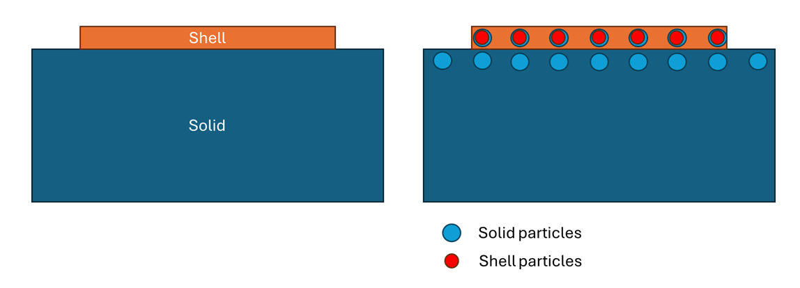
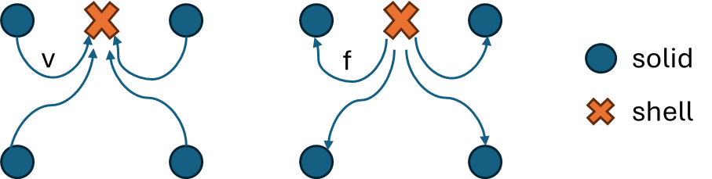

# Solid-to-shell coupling
The documentation describes the algorithm of solid-to-shell coupling for SPH solvers. The first section presents the data transfer sequence, and the second section discusses the mapping algorithm for unmatched interfaces.

## Dirichlet-Neumann coupling method
The Dirichlet-Neumann strategy is adopted for the coupling. Unlike FEM, the boundary of a body is not clearly defined in SPH. Hence, instead of exchanging information on the interface, we extend the solid by one layer and transfer data on the overlapping layer of the solid and shell. The displacement/velocity is mapped from the solid side to the shell side, while the force is mapped from the shell side to the solid side. The mapping method will be discussed in the next section.

The geometry of the problem is slightly different from the model, as the reference resolution of the shell can be different from the thickness, which can be a source of error.

The algorithm is summarized below:

1. Execute 1st half integration of the shell body
2. Distribute the internal forces `force_` on the extended particles to the external force 'force_prior_' of the coupled solid particles
3. Execute the 1st and 2nd half integration of the solid body
4. Distribute the velocity of the solid particles to the coupled shell particles
5. Execute the 2nd half of the shell body

## Data mapping for unmatched interfaces
A mapping is required to transfer the data between the solid and shell particles. Following the formulations of the coupling problem in FEM (see chapter 2.2[Lindner, Florian](https://web.archive.org/web/20200301143058id_/https://elib.uni-stuttgart.de/bitstream/11682/10598/3/Lindner%20-%20Data%20Transfer%20in%20Partitioned%20Multi-Physics%20Simulations.pdf)), usually a direct/consistent mapping is used for nodal displacements, where the row sum of $\mathbf{H_{OD}}$ is equal to 1.

$$\mathbf{U_D} = \mathbf{H_{DO}} \mathbf{U_O}$$

Here $\mathbf{U}$ represents the nodal displacement, while the subscripts O and D denote the origin side (which gives force and receives displacement) and destination side (which gives displacement and receives force).

For the force, a conservative mapping is usually required. The discrete form of energy conservation at the interface is expressed as:

$$\mathbf{U_D(x)^T}\mathbf{F_D(x)} = \mathbf{U_O(x)^T}\mathbf{F_O(x)}$$

with the nodal force denoted by $\mathbf{F}$.

From this equation, we can directly obtain the conservative mapping matrix of the nodal force:

$$\mathbf{F_O} = \mathbf{H_{OD}} \mathbf{F_D} = \mathbf{H_{DO}^T} \mathbf{F_D}$$

## Direct/consistent mapping with SPH approximation
For the SPH method, a natural choice of consistent mapping is the SPH interpolant with the Shepard filter. The displacement of a shell particle (denoted by subscription S) i can be interpolated from all the volumetric solid particles (denoted by subscription V):

$$\mathbf{U_{S,i}} = \sum_{j\in V} \tilde{\omega_{ij}} \mathbf{U_{V,j}}$$
$$\tilde{\omega_{ij}} = \frac{W_{ij}(h_{ij})V_j}{\sum_{j\in V} W_{ij}(h_{ij})V_j}$$

For a particle j outside of the neighborhood of i, the weight $\tilde{\omega_{ij}}$ is equal to 0. The (i,j) entry of the mapping matrix $\mathbf{H_{SV}}$ is the weight $\tilde{\omega_{ij}}$. Apparently, the consistency condition $\sum_j \tilde{\omega_{ij}} = 1$ is satisfied.

For the force mapping, from the discrete force of energy conservation, a conservative mapping matrix is obtained from the transpose of $\mathbf{H_{SV}}$.

$$\mathbf{F_{V,i}} = \sum_{j\in S} H_{SV,ji} \mathbf{F_{S,j}}$$

where the (j,i) entry of $\mathbf{H_{SV}}$ is:

$$H_{SV,ji} = \tilde{\omega_{ji}} = \frac{W_{ji}(h_{ji})V_i}{\sum_{k\in V} W_{jk}(h_{jk})V_k}$$

I choose $h_{ij} = max(h_i, h_j)$ as the smoothing length of two particles with different resolutions, which guarantees the symmetry $W_{ij} = W_{ji}$. Hence, the equation can also be written as:

$$H_{SV,ji} = \frac{W_{ij}(h_{ij})V_i}{\sum_{k\in V} W_{jk}(h_{jk})V_k}$$

Since $W_{ij}$ is zero outside of the neighborhood of i, we only need to consider the contribution of shell particles inside the neighborhood of solid particle i.

To implement this conservative mapping for the solid, we need to first compute and record $\sum_{k\in V} W_{jk}(h_{jk})V_k$ for each coupled shell particle j. This value should be computed from the contact relation shell-solid, instead of solid-shell. 

## Example
An example is used to prove the feasibility of this coupling method, where a solid cube is placed on a shell stripe. The cube is subjected to a constant gravity force $4\mathrm{mm/{ms}^2}$. The shell is fixed at the left and right ends. Neo-Hookean is used as the material model.

The geometrical and material parameters are listed below:

| Cube length [$\mathrm{mm}$] |  Shell length [$\mathrm{mm}$]| Shell width [$\mathrm{mm}$] | Shell thickness [$\mathrm{mm}$]|
|------------------|-------------------|------------------|---------------------|
| 1                | 5                 | 1                | 0.02                |

| Density [$\mathrm{kg/m^3}$] | Poisson ratio [-] | Young's modulus [$\mathrm{MPa}$] | 
|------------------|-------------------|------------------|
| 1000             | 0.45              | 3                |             

When the solid and shell particles have the same resolution and are uniformly distributed, i.e., overlapping on the coupling layer, the deflection and Von-Mises stress at the mid-point of the shell with different resolutions are listed in the table below. To avoid the error caused by the difference between the velocity and force on the surface and the mid-plane of the shell, we only consider the resolutions larger than the thickness. The end time is set as 30ms, when the semi-steady state is reached. As the resolution increases, the deflection and stress converge to 0.21 mm and 0.007 MPa, respectively.

| Resolution [$\mathrm{mm}$]        | Deflection [$\mathrm{mm}$] | Von-Mises Stress [$\mathrm{MPa}$] |
|-----------------------------------|----------------------------|-----------------------------------|
| 0.1   |0.237  |0.00552 |
| 0.05   |0.221  |0.0062  |                                                                       
| 0.033   |0.214  |0.0064  |
| 0.025   |0.213  |0.0067  |
| 0.02   |0.212  |0.0068  |

To show that the mapping is capable of dealing with unmatched particle position, the deflection and stress of solid and shell with different resolutions and relaxed particle distributions are listed in the table below. The deflections and stresses of unmatching interfaces are consistent with the results of matching interfaces.

| Solid resolution [$\mathrm{mm}$]   | Shell resolution [$\mathrm{mm}$] | Deflection [$\mathrm{mm}$] | Von-Mises Stress [$\mathrm{MPa}$] |
|---------|-------|------|-------|
|0.033  | 0.033| 0.214 | 0.0064 |
|0.033  | 0.025| 0.214 | 0.0065 |
|0.025  | 0.033| 0.209 | 0.0062 |

TODO: add fully solid-discretized result as a reference value

## Reference
Lindner, Florian. "Data transfer in partitioned multi-physics simulations: interpolation & communication." (2019).

