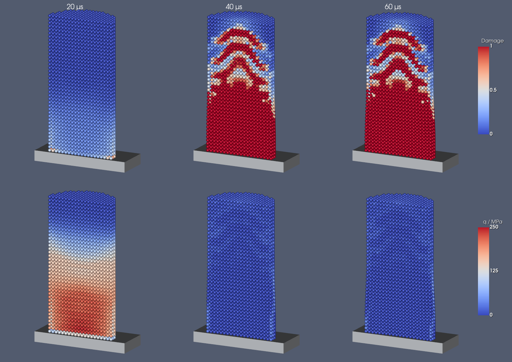
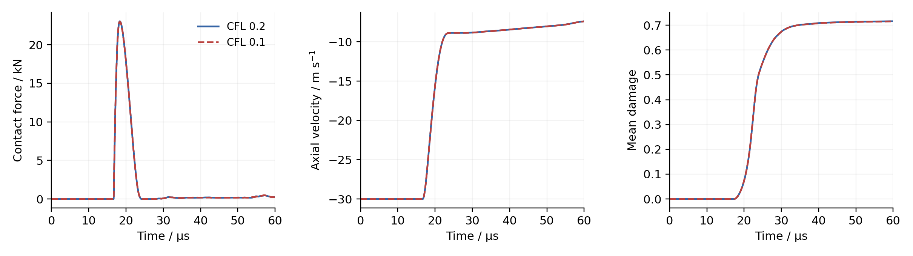

# Taylor-bar impact with HJC concrete

A concrete cylinder impacts a fixed wall, following the geometry and contact
workflow of the Taylor-bar examples. `HJCSolid` adds pressure-dependent strength,
rate sensitivity, irreversible compaction and scalar damage to the CPU solid
dynamics framework. The example outputs VTP fields and a `history.csv` file.

Build with 3D examples and unit tests enabled, then run in a separate directory:

```sh
cmake --build build --target test_hjc test_3d_taylor_bar_hjc
ctest --test-dir build -R 'HJC\.|^test_3d_taylor_bar_hjc$' --output-on-failure
mkdir impact && cd impact
../build/tests/3d_examples/test_3d_taylor_bar_hjc/bin/test_3d_taylor_bar_hjc
```

The cylinder is 10 mm in diameter and 20 mm long. Its initial surface gap is
the larger of 0.5 mm and one particle spacing, and its axial speed is 30 m/s.
The default particle spacing and gap are both 0.5 mm,
the acoustic CFL is 0.2, and the simulation lasts 60 microseconds. For a time
step comparison, run again in another directory with `--cfl=0.1`. `--spacing`,
`--speed` and `--end-time` accept values in metres, metres/second and seconds.
The coarse CTest case uses 1 mm spacing and a 1 mm gap, placing both cylinder
end faces between lattice layers. It has 1,600 concrete particles and compares
total kinetic energy and mean damage at 31 fixed times against the stored regression data, using the
library's ensemble-average test and its 1% relative standard-deviation floor.
It also checks that contact and damage occur, deformation determinants stay
positive, and damage remains bounded and irreversible. The parameters are
illustrative, not an experimental fit.

`--regression-test` selects this check and requires 1 mm spacing, 30 m/s,
CFL 0.2 and 60 microseconds. CMake copies the reference files into the CTest
working directory. Normal example runs use no reference files, so spacing,
speed, CFL and duration can still be varied.

To regenerate the references, start from the repository root with a fresh
working directory:

```sh
exe="$(pwd)/build/tests/3d_examples/test_3d_taylor_bar_hjc/bin/test_3d_taylor_bar_hjc"
mkdir -p reference_run/input && cd reference_run
for run in 1 2 3 4 5 6; do
    "$exe" --regression-test --spacing=0.001 --speed=30 --cfl=0.2 \
        --end-time=0.00006 --regression=true --state_recording=false || break
done
```

Both `input/*_runtimes.dat` files must begin with `true`; repeat if needed.
Copy those two files and the two `*_ensemble_averaged_mean_variance.xml` files
into this example's `regression_test_tool` directory, then reconfigure CMake.
The `1e-3` arguments to `generateDataBase` control convergence of the reference
statistics; the comparison uses the stored variance and the library's floor.



The figure retains the y >= 0 half of the cylinder. Each sphere displays its
particle value at the actual position; neither fields nor displacements are
smoothed or amplified. The gray-blue background, sphere glyphs and diverging
blue/white/red scale follow the solid examples in the main gallery. Damage
uses the same 0–1 scale in every frame. The wall is drawn as a gray slab.



Reproduce both figures with NumPy, Matplotlib and VTK installed:

```sh
python /path/to/test_3d_taylor_bar_hjc/plot.py impact --compare impact_half_dt
# On a headless X11-based VTK build, prefix the command with xvfb-run -a.
```

The plotter reads the generated `case.json` for particle spacing and CFL.
This file also records the initial gap and concrete particle count.
Use `--times` to select saved times in microseconds and `--output` for the
destination directory.

## Constitutive update

Use `solid_dynamics::HJCIntegration1stHalf` together with the existing
`solid_dynamics::Integration2ndHalf` and the new `HJCAcousticTimeStep`.
The first half converts the updated Cauchy stress to first Piola stress for
the existing total Lagrangian force calculation. Incremental polar rotation
and logarithmic stretch supply an objective material update; the volume
compression is taken directly from `mu = 1/det(F) - 1`.

The normalized equivalent strength in compression is

```text
q/fc = min(SFMAX, [A*(1-D) + B*(p/fc)^N] * rate_factor)
rate_factor = 1 + C*log(max(1, equivalent_strain_rate/reference_strain_rate))
```

In tension the strength term is `A*max(0, 1-D+p/T)`, meeting the pressure
cutoff `p = -T*(1-D)`. A radial return determines plastic shear strain;
damage then advances explicitly using

```text
fracture_strain = max(EFMIN, D1*max((p+T)/fc, 0)^D2)
delta_D = (delta_equivalent_plastic_strain + delta_plastic_volume)/fracture_strain
```

Damage starts at zero and is bounded by one. EFMIN is a denominator floor,
so plastic flow at zero pressure still causes damage. Plastic strain continues
to accumulate after cohesion vanishes. The pressure cutoff is reapplied after
damage advances. This explicit softening update requires time-step refinement.

The three-region EOS uses a continuous loading envelope. `lock_strain` is the
permanent compaction offset, not the total strain at locking pressure. The
total locking compression is found by matching the dense cubic
`p=K1*eta+K2*eta^2+K3*eta^3`, `eta=(mu-lock_strain)/(1+lock_strain)`, to
`lock_pressure`. The transition joins this point to the elastic crushing point.
Permanent compaction interpolates linearly between zero and `lock_strain`
with the maximum compression attained on this transition. Partial-compaction
unloading/reloading is linear through that permanent offset and the previous
peak. Once fully compacted, the dense EOS is reversible; its tensile extension
uses the linear term. This interpolation convention is explicit so parameter
sets can be interpreted and checked against their calibration. Nonnegative
quadratic/cubic coefficients and a transition softer than unloading are required.

History variables are registered for particle evolution/restart. Pressure is
positive in compression; stress is positive in tension. `HJCDamage`,
`HJCPlasticStrain`, `HJCPlasticVolume`, `Pressure` and `VonMisesStress` are
available for output. The acoustic estimate bounds both the elastic and dense
EOS moduli using the compression history.

## Verification and scope

Material tests cover elastic limits, tensor shear convention, damage under
unconfined plastic shear, crushing-only damage, tensile cutoff, rate scaling,
strength cap, EOS continuity and cyclic unloading, invalid inputs, mixed-path
time-step refinement and rigid rotation of particle stress.

In double precision the 0.5 mm case has 12,640 particles. Halving CFL from
0.2 to 0.1 gives peak-normalized RMS differences of 0.134% in contact force,
0.0189% in mean velocity and 0.0565% in mean damage, sampled on a common
uniform time grid. The minimum deformation determinant is 0.99267.
The wall impulse balances the change in axial momentum to within 2.1e-13
relative to initial momentum. At the final time, however, particle damage
differs by 0.0279 RMS and 0.358 maximum: agreement of global curves does not
establish convergence of local softening fields.

A 0.25 mm run (101,120 particles) keeps the same discrete 0.5 mm initial gap.
Its minimum determinant is 0.99007, peak contact force is 23.84 kN versus
23.04 kN, and final mean damage is 0.7681 versus 0.7158. These differences
show the remaining spatial sensitivity; the example is not a converged
damage-pattern benchmark. Spacings that do not divide the geometry can also
change the sampled initial gap: a 0.375 mm lattice gives an effective gap
of 0.375 mm, so its contact history is not a pure resolution comparison.

This is a local HJC damage model: fully damaged particles retain confined
strength and remain in the discretization. It does not prescribe crack opening,
erosion, fragmentation, fracture-energy regularization or thermal effects.
Pure hydrostatic tension is capped; a separate tensile cracking law is not
included. Localized damage therefore needs spatial-resolution and calibration
studies before quantitative fracture predictions. This addition targets CPU
solid dynamics; it does not add a device constitutive kernel.

## References

1. Holmquist, T. J., Johnson, G. R., and Cook, W. H. (1993).
   *A computational constitutive model for concrete subjected to large strains,
   high strain rates, and high pressures*. Proceedings of the 14th International
   Symposium on Ballistics, Quebec, pp. 591–600.
2. Meyer, C. S. (2011). [*Development of Geomaterial Parameters for Numerical
   Simulations Using the Holmquist-Johnson-Cook Constitutive Model for Concrete*](https://www.govinfo.gov/content/pkg/GOVPUB-D101-PURL-gpo10967/pdf/GOVPUB-D101-PURL-gpo10967.pdf).
   ARL-TR-5556, pp. 2–7, especially the fracture-strain lower bound in equations
   (2)–(3).
