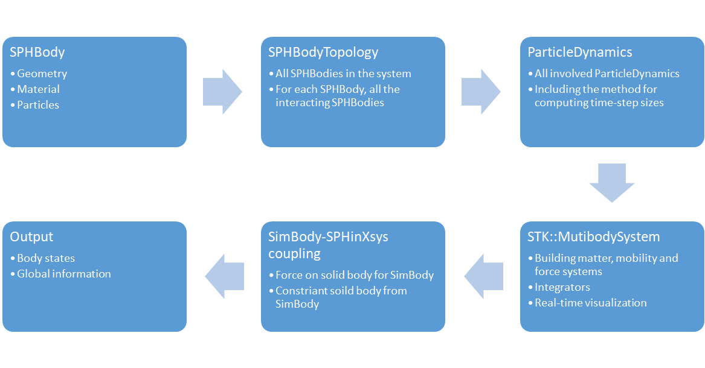
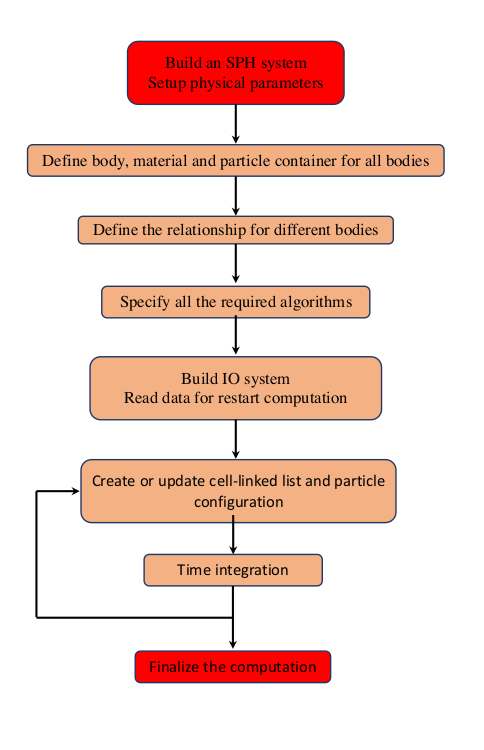

===============================
SPHinXsys architecture overview
===============================

SPHinXsys defines a collective objects and methods to applied as libraries 
for a multi-physics computation,
which is constructed and carried out in an application code.
The core object and method are :code:`SPHBody` 
and :code:`ParticleDynamics`, respectively.
While the former defines spatial and topological relations between particles, 
the latter describes physical dynamics of them.

Constructing a SPHinXsys system
-------------------------------
As shown in the figure below,
the first stage is creating all :code:`SPHBody` s based on their realizations.
There are :code:`RealBody` s modeling fluid and solid bodies, 
and :code:`FictitiousBody` s modeling observers 
which collecting data from :code:`RealBody` s during the computation. 

   Constructing a computation with ordered stages

At the second stage, the topology of :code:`SPHBody` s is constructed. 
It describe, for each :code:`SPHBody`, all the interacting :code:`SPHBody` s. 
After this, all :code:`ParticleDynamics` will be defined.
Specifically, each realization of :code:`ParticleDynamics` 
corresponds all the discretized right-hand-side terms of a fluid or solid dynamics equation.
If SPHinXsys is coupled with SimBody, one need create a :code:`SimTK` system in which all matters, 
mobility and forces are defined. The SimBody-SPHinXsys coupling, 
as a realization of :code:`ParticleDynamics`, 
such as computing forces on solid body for SimBody 
and imposing constraints of soild body by SimBody, are defined in the next stage.
Finally, :code:`Output` is created to specify the data will be saved in file during the computations.

Carrying out a computation
--------------------------

The computation is carried out by using an integrator defined in the application.
There are three layers in the main integration step according to their the time-step sizes.
While at the innermost layer the solid dynamics equations are integrated, 
at the middle layer the acoustic pressure relaxation of the fluid is computed 
and at the outside layer the effects of fluid viscosity is updated.
The FSI is imposed at the middle layer 
and the coupling with Simbody is implemented at the innermost layer.

The below figure shows a flow diagram to represent the successive steps involved 
in a complete execution.

   Workflow diagram for the implementation of SPHinXsys applications
