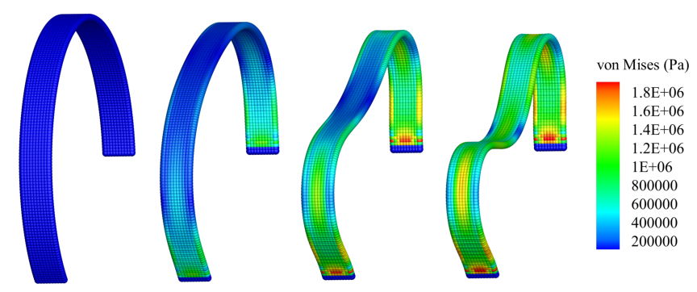

In Example 10, we explained how to build up a 2D shell case. 
Here we will give you a 3D arch case. 
Different form the previous case, the initial psudo-normal is not same between each particle.
Here we will emphasise the method differences for the 3D arch compared to the 2D plate.

===================================
Example 11: Shell cases: a 3D arch
===================================

The example of a deep circular arch shell structure is shown in the figure, 
of which two ends are fully clamped and the even-distributed downward body force is applied.

   The quasi-staitc responses of a deep circular arch shell structure.

First, we provide the parameters for geometric modeling, numerical setup, material properties, etc.

.. code-block:: cpp

	/**
	 * @file 	3d_arch.cpp
	 * @brief 	This is the benchmark test of the shell.
	 * @details  We consider large deformation of a cylindrical thin structure.
	 * @author 	Dong Wu, Chi Zhang and Xiangyu Hu
	 * @version  0.1
	 */
	#include "sphinxsys.h"

	using namespace SPH;

	/**
	 * @brief Basic geometry parameters and numerical setup.
	 */
	Real radius = 0.0975;								/** Radius of the inner boundary of the cylinderical thin structure. */
	Real height = 0.02;									/** Height of the cylinder. */
	Real thickness = 0.005;								/** Thickness of the cylinder. */
	Real radius_mid_surface = radius + thickness / 2.0; /** Radius of the mid surface. */
	int particle_number = 10;							/** Particle number in the height direction. */
	Real particle_spacing_ref = height / (Real)particle_number;
	int particle_number_mid_surface = int(2.0 * radius_mid_surface * Pi * 215.0 / 360.0 / particle_spacing_ref);
	int BWD = 1;								/** Width of the boundary layer measured by number of particles. */
	Real BW = particle_spacing_ref * (Real)BWD; /** Boundary width, determined by specific layer of boundary particles. */
	/** Domain bounds of the system. */
	BoundingBox system_domain_bounds(Vec3d(-radius - thickness, 0.0, -radius - thickness),
									 Vec3d(radius + thickness, height, radius + thickness));
	// Observer location
	StdVec<Vecd> observation_location = {Vecd(0.0, height / 2.0, radius_mid_surface)};
	/** For material properties of the solid. */
	Real rho0_s = 7.800;			 /** Normalized density. */
	Real Youngs_modulus = 210e6;	 /** Normalized Youngs Modulus. */
	Real poisson = 0.3;				 /** Poisson ratio. */
	Real physical_viscosity = 200.0; /** physical damping, here we choose the same value as numerical viscosity. */

	Real time_to_full_external_force = 0.001;
	Real gravitational_acceleration = -300000.0;

There is two more angular DOFs (Degrees of Freedom) for 3D thin structure dynamics than that for 3D solid dynamics. 
And we get the pseudo normal direction by rotating the normal direction according to these two angular DOFs.
:code:`time_to_full_external_force` is equal to 0.001, 
which means the external force increases linearly before 0.001 s and remains constant after 0.001 s.

Then we define to generate particles directly by giving each particle position and volume 
and initializing the normal direction, just like 2D case. 

.. code-block:: cpp

	class Cylinder : public ThinStructure
	{
	public:
		Cylinder(SPHSystem &system, std::string body_name, ParticleAdaptation* particle_adaptation, ParticleGenerator* particle_generator)
			: ThinStructure(system, body_name, particle_adaptation, particle_generator)
		{
			// the cylinder and boundary
			for (int i = 0; i < particle_number_mid_surface + 2 * BWD; i++)
			{
				for (int j = 0; j < particle_number; j++)
				{
					Real x = radius_mid_surface * cos(-17.5 / 180.0 * Pi + (i - BWD + 0.5) * 215.0 / 360.0 * 2 * Pi / (Real)particle_number_mid_surface);
					Real y = particle_spacing_ref * j + particle_spacing_ref * 0.5;
					Real z = radius_mid_surface * sin(-17.5 / 180.0 * Pi + (i - BWD + 0.5) * 215.0 / 360.0 * 2 * Pi / (Real)particle_number_mid_surface);
					body_input_points_volumes_.push_back(std::make_pair(Vecd(x, y, z), particle_spacing_ref * particle_spacing_ref));
				}
			}
		}
	};

Note that the volume is :code:`resolution_ref * particle_spacing_ref` for 3D shell particles.
And we define the boundary geometry and :code:`TimeDependentExternalForce` 
in following code piece.

.. code-block:: cpp

	/** Define the boundary geometry. */
	class BoundaryGeometry : public BodyPartByParticle
	{
	public:
		BoundaryGeometry(SPHBody &body, const std::string &body_part_name)
			: BodyPartByParticle(body, body_part_name)
		{
			TaggingParticleMethod tagging_particle_method = std::bind(&BoundaryGeometry::tagManually, this, _1);
			tagParticles(tagging_particle_method);
		};
		virtual ~BoundaryGeometry(){};

	private:
		void tagManually(size_t index_i)
		{
			if (base_particles_->pos_n_[index_i][2] < radius_mid_surface * sin(-17.5 / 180.0 * Pi))
			{
				body_part_particles_.push_back(index_i);
			}
		};
	};

	/**
	 * define time dependent external force
	 */
	class TimeDependentExternalForce : public Gravity
	{
	public:
		explicit TimeDependentExternalForce(Vecd external_force)
			: Gravity(external_force) {}
		virtual Vecd InducedAcceleration(Vecd &position) override
		{
			Real current_time = GlobalStaticVariables::physical_time_;
			return current_time < time_to_full_external_force ? current_time * global_acceleration_ / time_to_full_external_force : global_acceleration_;
		}
	};

Here we come to the :code:`int main()` function. 
In the first part of :code:`main` function, 
an object of :code:`SPHSystem` is created.

.. code-block:: cpp

	/** Setup the system. */
	SPHSystem system(system_domain_bounds, particle_spacing_ref);

	/** create a cylinder body with shell particles and linear elasticity. */
	SolidBody cylinder_body(system, makeShared<DefaultShape>("CylinderBody"));
	cylinder_body.defineParticlesAndMaterial<ShellParticles, LinearElasticSolid>(rho0_s, Youngs_modulus, poisson);
	cylinder_body.generateParticles<CylinderParticleGenerator>();

	/** Define Observer. */
	ProbeBody cylinder_observer(system, "CylinderObserver");
	cylinder_observer.generateParticles<ObserverParticleGenerator>(observation_location);

	/** Set body contact map
	 *  The contact map gives the data connections between the bodies
	 *  basically the the range of bodies to build neighbor particle lists
	 */
	BodyRelationInner cylinder_body_inner(cylinder_body);
	BodyRelationContact cylinder_observer_contact(cylinder_observer, {&cylinder_body});

	/** Common particle dynamics. */
	Gravity external_force(Vec3d(0.0, 0.0, gravitational_acceleration));
	TimeStepInitialization initialize_external_force(cylinder_body, external_force);

The material, particles and bodies are created. 
Then, the observer body and the contact map are defined. 
Using class :code:`InnerBodyRelation` means :code:`plate_body_inner` defines the inner data connections.
And using class :code:`ContactBodyRelation` means :code:`plate_observer_contact` 
defines the :code:`palte_observer` has data connections with :code:`plate_body`,
e.g. the :code:`palte_observer` gets data from :code:`plate_body`.
Note that the external force applied gives each particle the same acceleration since the load is equally distributed.
After this, all the physical dynamics are defined in the form of particle discretization.

.. code-block:: cpp

	/**
	 * This section define all numerical methods will be used in this case.
	 */
	/** Corrected configuration. */
	thin_structure_dynamics::ShellCorrectConfiguration
		corrected_configuration(cylinder_body_inner);
	/** Time step size calculation. */
	thin_structure_dynamics::ShellAcousticTimeStepSize computing_time_step_size(cylinder_body);
	/** stress relaxation. */
	thin_structure_dynamics::ShellStressRelaxationFirstHalf stress_relaxation_first_half(cylinder_body_inner);
	thin_structure_dynamics::ShellStressRelaxationSecondHalf stress_relaxation_second_half(cylinder_body_inner);
	/** Constrain the Boundary. */
	BoundaryGeometry boundary_geometry(cylinder_body, "BoundaryGeometry");
	thin_structure_dynamics::ConstrainShellBodyRegion constrain_holder(cylinder_body, boundary_geometry);
	DampingWithRandomChoice<DampingPairwiseInner<Vecd>>
		cylinder_position_damping(0.2, cylinder_body_inner, "Velocity", physical_viscosity);
	DampingWithRandomChoice<DampingPairwiseInner<Vecd>>
		cylinder_rotation_damping(0.2, cylinder_body_inner, "AngularVelocity", physical_viscosity);

First comes to the methods, correted configuration, that will be executed only once.
The configuration is corrected to ensure the first-order consistency.
Then, the methods that will used for multiple times are defined.

Before the computation, we also define the outputs, 
including the particle states and obervations.

.. code-block:: cpp

	/** Output */
	InOutput in_output(system);
	BodyStatesRecordingToVtp write_states(in_output, system.real_bodies_);
	RegressionTestDynamicTimeWarping<ObservedQuantityRecording<Vecd>>
		write_cylinder_max_displacement("Position", in_output, cylinder_observer_contact);

The initial conditions, including the cell-linked list and particle configuration, are executed once before the main loop.

.. code-block:: cpp

	/** Apply initial condition. */
	system.initializeSystemCellLinkedLists();
	system.initializeSystemConfigurations();
	corrected_configuration.parallel_exec();

For solid dynamics, we do not change the cell-linked list and particle configuration. 
So they are calculated only once before the simulation.
The basic control parameter for the simulation is defined in the following. 

.. code-block:: cpp

	/**
	 * From here the time stepping begins.
	 * Set the starting time.
	 */
	GlobalStaticVariables::physical_time_ = 0.0;
	write_states.writeToFile(0);
	write_cylinder_max_displacement.writeToFile(0);

	/** Setup time stepping control parameters. */
	int ite = 0;
	Real end_time = 0.006;
	Real output_period = end_time / 100.0;
	Real dt = 0.0;
	/** Statistics for computing time. */
	tick_count t1 = tick_count::now();
	tick_count::interval_t interval;

Here, the initial particle states and obervations is written. 
Then we come to the time-stepping loop.

.. code-block:: cpp

	/**
	 * Main loop
	 */
	while (GlobalStaticVariables::physical_time_ < end_time)
	{
		Real integral_time = 0.0;
		while (integral_time < output_period)
		{
			if (ite % 100 == 0)
			{
				std::cout << "N=" << ite << " Time: "
						  << GlobalStaticVariables::physical_time_ << "	dt: "
						  << dt << "\n";
			}
			initialize_external_force.parallel_exec(dt);
			stress_relaxation_first_half.parallel_exec(dt);
			constrain_holder.parallel_exec(dt);
			cylinder_position_damping.parallel_exec(dt);
			cylinder_rotation_damping.parallel_exec(dt);
			constrain_holder.parallel_exec(dt);
			stress_relaxation_second_half.parallel_exec(dt);

			ite++;
			dt = computing_time_step_size.parallel_exec();
			integral_time += dt;
			GlobalStaticVariables::physical_time_ += dt;
		}
		write_cylinder_max_displacement.writeToFile(ite);
		tick_count t2 = tick_count::now();
		write_states.writeToFile();
		tick_count t3 = tick_count::now();
		interval += t3 - t2;
	}
	tick_count t4 = tick_count::now();

	tick_count::interval_t tt;
	tt = t4 - t1 - interval;
	std::cout << "Total wall time for computation: " << tt.seconds() << " seconds." << std::endl;

	write_cylinder_max_displacement.newResultTest();

	return 0;

The main function is almost same with that of 2D case.
