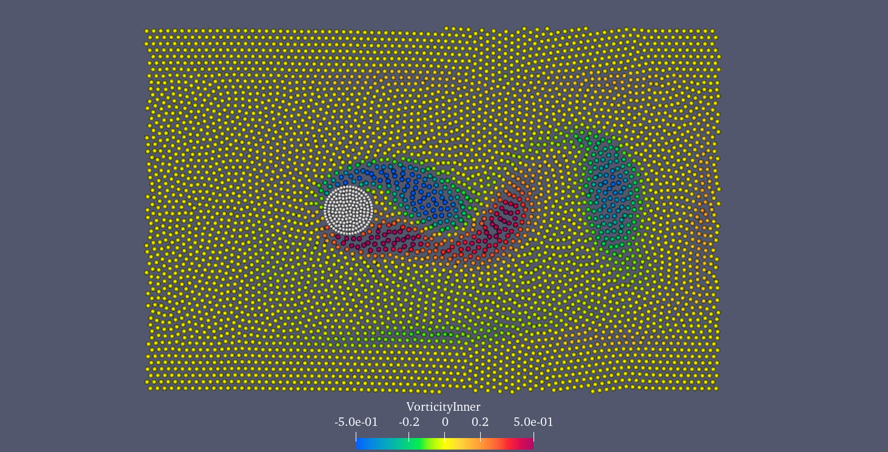
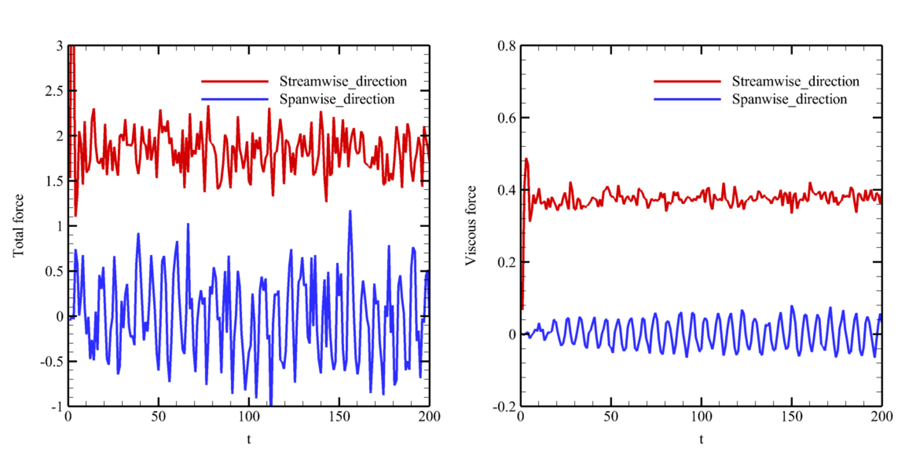

Here, let’s simulate a typical viscous flow problem, in which the fluids bypass an rigid cylinder in two dimension.

====================================
Example 12: Flow around a cylinder
====================================

As shown in the figure, initially, a rigid cylinder is placed in the center of the flow field. The left and right
boundaries are the inflow and outflow boundary conditions, respectively. Both the up and low boundaries are free-stream
conditions.

An snapshot of the particle distribution in the problem of flow around a cylinder

The inflow and free-stream boundary conditions are implemented by using a uniform buffer region. First of all, let us
set the basic geometry parameters for this case.

.. code-block:: cpp

	/**
	 * @brief Basic geometry parameters.
	 */
	Real DL = 15.0; 					            /**< Channel length. */
	Real DH = 10.0; 						        /**< Channel height. */
	Real resolution_ref = 0.2; 	                    /**< Initial reference particle spacing. */
	Real DL_sponge = resolution_ref * 10.0;	        /**< Sponge region to impose inflow condition. */
	Real DH_sponge = resolution_ref * 2.0;	        /**< Sponge region to impose inflow condition. */
	Vec2d insert_circle_center(4.0, 5.0);		    /**< Location of the cylinder center. */
	Real insert_circle_radius = 0.75;			    /**< Radius of the cylinder. */
	/** Domain bounds of the system. */
	BoundingBox system_domain_bounds(Vec2d(-DL_sponge, -DH_sponge), Vec2d(DL, DH + DH_sponge));

Then, the material parameters should be defined.

.. code-block:: cpp

	/**
	 * @brief Material properties of the fluid.
	 */
	Real rho0_f = 1.0;		  /**< Density. */
	Real U_f = 1.0;			  /**< free-stream velocity. */
	Real c_f = 10.0 * U_f;	  /**< Speed of sound. */
	Real Re = 100.0;		  /**< Reynolds number. */
	Real mu_f = rho0_f * U_f * (2.0 * insert_circle_radius) / Re;	/**< Dynamics viscosity. */

After that, the water body and the buffer region are defined by class inheritance.

.. code-block:: cpp

	/**
	* @brief define geometry of SPH bodies
	*/
	/** create a water block shape */
	std::vector<Vecd> CreatWaterBlockShape()
	{
		//geometry
		std::vector<Vecd> water_block_shape;
		water_block_shape.push_back(Vecd(-DL_sponge, -DH_sponge));
		water_block_shape.push_back(Vecd(-DL_sponge, DH + DH_sponge));
		water_block_shape.push_back(Vecd(DL, DH + DH_sponge));
		water_block_shape.push_back(Vecd(DL, -DH_sponge));
		water_block_shape.push_back(Vecd(-DL_sponge, -DH_sponge));

		return water_block_shape;
	}

	/** create a water block buffer shape. */
	std::vector<Vecd> CreatBufferShape()
	{
		std::vector<Vecd> buffer_shape;
		buffer_shape.push_back(Vecd(-DL_sponge, -DH_sponge));
		buffer_shape.push_back(Vecd(-DL_sponge, DH + DH_sponge));
		buffer_shape.push_back(Vecd(DL, DH + DH_sponge));
		buffer_shape.push_back(Vecd(DL, DH));
		buffer_shape.push_back(Vecd(0.0, DH));
		buffer_shape.push_back(Vecd(0.0, 0.0));
		buffer_shape.push_back(Vecd(DL, 0.0));
		buffer_shape.push_back(Vecd(DL, -DH_sponge));
		buffer_shape.push_back(Vecd(-DL_sponge, -DH_sponge));

		return buffer_shape;
	}
	/**
	 * @brief Define case dependent bodies material, constraint and boundary conditions.
	 */
	 /** Fluid body definition */
	class WaterBlock : public FluidBody
	{
	public:
		WaterBlock(SPHSystem& system, std::string body_name)
			: FluidBody(system, body_name)
		{
			/** Geometry definition. */
			std::vector<Vecd> water_block_shape = CreatWaterBlockShape();
			body_shape_ = new ComplexShape(body_name);
			body_shape_->addAPolygon(water_block_shape, ShapeBooleanOps::add);
			body_shape_->addACircle(insert_circle_center, insert_circle_radius, 100, ShapeBooleanOps::sub);
		}
	};
	/** Case-dependent material properties. */
	class WaterMaterial : public WeaklyCompressibleFluid
	{
	public:
		WaterMaterial() : WeaklyCompressibleFluid()
		{
			rho_0_ = rho0_f;
			c_0_ = c_f;
			mu_ = mu_f;
			/** supplementary material parameters derived from basic parameters. */
			assignDerivedMaterialParameters();
		}
	};

And similar to the rigid cylinder.

.. code-block:: cpp

	/** Definition of the cylinder. */
	class Cylinder : public SolidBody
	{
	public:
		Cylinder(SPHSystem& system, std::string body_name)
			: SolidBody(system, body_name, new ParticleAdaptation(1.15, 1))
		{
			/** Geomtry definition. */
			ComplexShape original_body_shape;
			original_body_shape.addACircle(insert_circle_center, insert_circle_radius, 100, ShapeBooleanOps::add);
			body_shape_ = new LevelSetComplexShape(this, original_body_shape);
		}
	};

Initially, all particles have been set to be at rest. The inflow velocity is set to be uniform in the buffer region by
using velocity relaxation as follows,

.. code-block:: cpp

	/** inflow buffer */
	class FreeStreamBuffer : public BodyPartByCell
	{
	public:
		FreeStreamBuffer(FluidBody* fluid_body, std::string constrained_region_name)
			: BodyPartByCell(fluid_body, constrained_region_name)
		{
			/** Geomtry definition. */
			std::vector<Vecd> inflow_buffer_shape = CreatBufferShape();
			body_part_shape_ = new ComplexShape(constrained_region_name);
			body_part_shape_->addAPolygon(inflow_buffer_shape, ShapeBooleanOps::add);

			//tag the constrained particle
			tagBodyPart();
		}
	};
	/** Case dependent inflow boundary condition. */
	class FreeStreamCondition : public fluid_dynamics::FlowRelaxationBuffer
	{
		Real u_ave_, u_ref_, t_ref;
	public:
		FreeStreamCondition(FluidBody* fluid_body,
			BodyPartByCell* constrained_region)
			: fluid_dynamics::FlowRelaxationBuffer(fluid_body, constrained_region)
		{
			u_ave_ = 0.0;
			u_ref_ = U_f;
			t_ref = 2.0;
		}
		Vecd getTargetVelocity(Vecd& position, Vecd& velocity)
		{
			return Vecd(u_ave_, 0.0);
		}
		void setupDynamics(Real dt = 0.0) override
		{
			Real run_time = GlobalStaticVariables::physical_time_;
			u_ave_ = run_time < t_ref ? 0.5 * u_ref_ * (1.0 - cos(Pi * run_time / t_ref)) : u_ref_;
		}
	};

Finally, some observing particles are also placed in the computational domain in order to measure the time variation of
relevant physical quantities.

.. code-block:: cpp

	/** an observer body to measure the flow profile */
	class FluidObserver : public FictitiousBody
	{
	public:
		FluidObserver(SPHSystem& system, std::string body_name)
			: FictitiousBody(system, body_name)
		{
			/** the measuring particles */
			Vec2d point_coordinate_1(3.0, 5.0);
			Vec2d point_coordinate_2(4.0, 5.0);
			Vec2d point_coordinate_3(5.0, 5.0);

			body_input_points_volumes_.push_back(std::make_pair(point_coordinate_1, 0.0));
			body_input_points_volumes_.push_back(std::make_pair(point_coordinate_2, 0.0));
			body_input_points_volumes_.push_back(std::make_pair(point_coordinate_3, 0.0));
		}
	};

In the main function, firstly, we create the :code:`SPHBody` s of :code:`water_block`, :code:`cylinder`, and :code:`fluid_observer`
by following piece of code.

.. code-block:: cpp

	/**
	* @brief Creating body, materials and particles for a water block.
	*/
	WaterBlock* water_block = new WaterBlock(system, "WaterBody");
	WaterMaterial* water_material = new WaterMaterial();
	FluidParticles 	fluid_particles(water_block, water_material);
	/**
	* @brief 	Creating the cylinder.
	*/
	Cylinder* cylinder = new Cylinder(system, "Cylinder");
	SolidParticles 	cylinder_particles(cylinder);
	/**
	* @brief 	Particle and body creation of fluid observers.
	*/
	FluidObserver* fluid_observer = new FluidObserver(system, "FluidObserver");
	BaseParticles	flow_observer_particles(fluid_observer);

Then, the topological relation of all bodies is defined by

.. code-block:: cpp

	/** body topology */
	ComplexBodyRelation* water_block_complex = new ComplexBodyRelation(water_block, {cylinder });
	ContactBodyRelation* cylinder_contact = new ContactBodyRelation(cylinder, { water_block });
	ContactBodyRelation* fluid_observer_contact = new ContactBodyRelation(fluid_observer, { water_block });

Here, the :code:`water_block` interacts with :code:`cylinder`, and both :code:`cylinder` and :code:`fluid_observer` only
contact with :code:`water_block`.

Before the simulation, if you hope to optimize the particle distribution of the cylinder, you can set
:code:`system.run_particle_relaxation_ = true` and the following particle relaxation will be executed.

.. code-block:: cpp

	/** check whether run particle relaxation for body fitted particle distribution. */
	if (system.run_particle_relaxation_)
	{
		/** body topology only for particle relaxation */
		InnerBodyRelation* cylinder_inner = new InnerBodyRelation(cylinder);
		/**
		 * @brief 	Methods used for particle relaxation.
		 */
		/** Random reset the insert body particle position. */
		RandomizeParticlePosition  random_inserted_body_particles(cylinder);
		/** Write the body state to Vtu file. */
		WriteBodyStatesToVtu 		write_inserted_body_to_vtu(in_output, { cylinder });
		/** Write the particle reload files. */
		ReloadParticleIO 		write_particle_reload_files(in_output, { cylinder });

		/** A  Physics relaxation step. */
		relax_dynamics::RelaxationStepInner relaxation_step_inner(cylinder_inner);
		/**
		  * @brief 	Particle relaxation starts here.
		  */
		random_inserted_body_particles.parallel_exec(0.25);
		relaxation_step_inner.surface_bounding_.parallel_exec();
		write_real_body_states.WriteToFile(0.0);

		/** relax particles of the insert body. */
		int ite_p = 0;
		while (ite_p < 1000)
		{
			relaxation_step_inner.parallel_exec();
			ite_p += 1;
			if (ite_p % 200 == 0)
			{
				std::cout << std::fixed << std::setprecision(9) << "Relaxation steps for the inserted body N = " << ite_p << "\n";
				write_inserted_body_to_vtu.WriteToFile(Real(ite_p) * 1.0e-4);
			}
		}
		std::cout << "The physics relaxation process of the cylinder finish !" << std::endl;

		/** Output results. */
		write_particle_reload_files.WriteToFile(0.0);
		return 0;
	}

After creating the bodies, the methods which are related to time-stepping, boundary conditions, fluid dynamics and
FSI dynamics will be defined.

.. code-block:: cpp

	/**
	* @brief 	Methods used for time stepping.
	*/
	/** Initialize particle acceleration. */
	InitializeATimeStep 	initialize_a_fluid_step(water_block);
	/** Periodic BCs in x direction. */
	PeriodicConditionInAxisDirectionUsingCellLinkedList 	periodic_condition_x(water_block, 0);
	/** Periodic BCs in y direction. */
	PeriodicConditionInAxisDirectionUsingCellLinkedList 	periodic_condition_y(water_block, 1);

	/** Evaluation of density by summation approach. */
	fluid_dynamics::DensitySummationComplex 	update_density_by_summation(water_block_complex);
	/** Time step size without considering sound wave speed. */
	fluid_dynamics::AdvectionTimeStepSize 	get_fluid_advection_time_step_size(water_block, U_f);
	/** Time step size with considering sound wave speed. */
	fluid_dynamics::AcousticTimeStepSize		get_fluid_time_step_size(water_block);
	/** Pressure relaxation using verlet time stepping. */
	/** Here, we do not use Riemann solver for pressure as the flow is viscous. */
	fluid_dynamics::PressureRelaxationWithWall pressure_relaxation(water_block_complex);
	fluid_dynamics::DensityRelaxationRiemannWithWall density_relaxation(water_block_complex);
	/** Computing viscous acceleration with wall model. */
	fluid_dynamics::ViscousAccelerationWithWall  viscous_acceleration(water_block_complex);
	/** Impose transport velocity. */
	fluid_dynamics::TransportVelocityCorrectionComplex 	transport_velocity_correction(water_block_complex);
	/** Computing vorticity in the flow. */
	fluid_dynamics::VorticityInner 	compute_vorticity(water_block_complex->inner_relation_);
	/** freestream boundary condition. */
	FreeStreamCondition freestream_condition(water_block, new FreeStreamBuffer(water_block, "FreestreamBuffer"));
	/**
	* @brief Algorithms of FSI.
	*/
	/** Compute the force exerted on solid body due to fluid pressure and viscosity. */
	solid_dynamics::FluidPressureForceOnSolid 	fluid_pressure_force_on_inserted_body(cylinder_contact);
	/** Computing viscous force acting on wall with wall model. */
	solid_dynamics::FluidViscousForceOnSolid	fluid_viscous_force_on_inserted_body(cylinder_contact);

Before the main loop, the computation system is initialized and the normal direction of the cylinder is calculated.

.. code-block:: cpp

	/** initialize cell linked lists for all bodies. */
	system.initializeSystemCellLinkedLists();
	/** periodic condition applied after the mesh cell linked list build up
	* but before the configuration build up. */
	periodic_condition_x.update_cell_linked_list_.parallel_exec();
	periodic_condition_y.update_cell_linked_list_.parallel_exec();
	/** initialize configurations for all bodies. */
	system.initializeSystemConfigurations();
	/** initialize surface normal direction for the insert body. */
	cylinder_particles.initializeNormalDirectionFromGeometry();

The main loops are defined in the following piece of code.

.. code-block:: cpp

	/**
	* @brief Main loop starts here.
	*/
	while (GlobalStaticVariables::physical_time_ < End_Time)
	{
		Real integration_time = 0.0;

		/** Integrate time (loop) until the next output time. */
		while (integration_time < D_Time)
		{
			initialize_a_fluid_step.parallel_exec();
			Dt = get_fluid_advection_time_step_size.parallel_exec();
			update_density_by_summation.parallel_exec();
		    viscous_acceleration.parallel_exec();
			transport_velocity_correction.parallel_exec(Dt);

			/** FSI for viscous force. */
			fluid_viscous_force_on_inserted_body.parallel_exec();
			inner_ite_dt = 0;
			Real relaxation_time = 0.0;
			while (relaxation_time < Dt)
			{
				dt = SMIN(get_fluid_time_step_size.parallel_exec(), Dt);
				/** Fluid pressure relaxation, first half. */
				pressure_relaxation.parallel_exec(dt);
				/** FSI for pressure force. */
				fluid_pressure_force_on_inserted_body.parallel_exec();
				/** Fluid pressure relaxation, second half. */
				density_relaxation.parallel_exec(dt);

				relaxation_time += dt;
				integration_time += dt;
				GlobalStaticVariables::physical_time_ += dt;
				freestream_condition.parallel_exec();
				inner_ite_dt++;
			}

			if (number_of_iterations % screen_output_interval == 0)
			{
				std::cout << std::fixed << std::setprecision(9) << "N=" << number_of_iterations << "	Time = "
					<< GlobalStaticVariables::physical_time_
					<< "	Dt = " << Dt << "	Dt / dt = " << inner_ite_dt << "\n";

				if (number_of_iterations % restart_output_interval == 0 && number_of_iterations != system.restart_step_)
					restart_io.WriteToFile(Real(number_of_iterations));
			}
			number_of_iterations++;

			/** Water block configuration and periodic condition. */
			periodic_condition_x.bounding_.parallel_exec();
			periodic_condition_y.bounding_.parallel_exec();
			water_block->updateCellLinkedList();
			periodic_condition_x.update_cell_linked_list_.parallel_exec();
			periodic_condition_y.update_cell_linked_list_.parallel_exec();
			/** one need update configuration after periodic condition. */
			water_block_complex->updateConfiguration();
			cylinder_contact->updateConfiguration();

		}

		tick_count t2 = tick_count::now();
		/** write run-time observation into file */
		compute_vorticity.parallel_exec();
		write_real_body_states.WriteToFile(GlobalStaticVariables::physical_time_);
		write_total_viscous_force_on_inserted_body.WriteToFile(GlobalStaticVariables::physical_time_);
		write_total_force_on_inserted_body.WriteToFile(GlobalStaticVariables::physical_time_);
		fluid_observer_contact->updateConfiguration();
		write_fluid_velocity.WriteToFile(GlobalStaticVariables::physical_time_);

		tick_count t3 = tick_count::now();
		interval += t3 - t2;
	}

Note that, the viscous related calculation is controlled by the advection time step, while the pressure and density
relaxation is controlled by the acoustic time step, and the dual time stepping is employed in this case. At certain
moments, the flow field, the vorticity field, the relevant forces on the cylinder, and the observing quantities are
output.

The relevant results are shown in the figures below.

Variation of the total and viscous force on the cylinder