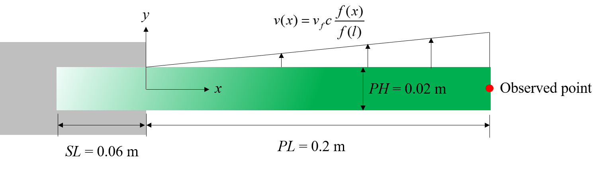
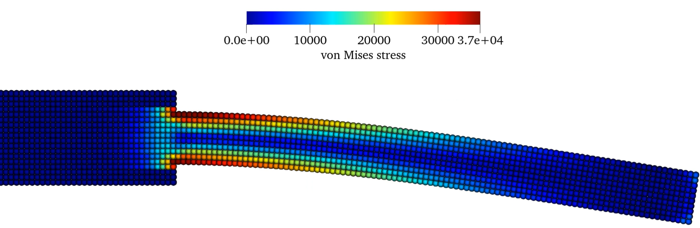

This is the one of the basic test cases, also the first case for understanding SPH method for solid simulation.                             
In this case, the constraint of the beam is implemented with internal constrained subregion. 

==================================================================================
Example 13: 2D oscillating beam
==================================================================================

As shown in the figure, 
the left end of the beam is inserted into the wall, and the other end is free.

   Initial configuration

First, we provide the parameters for geometric modeling and numerical setup.

.. code-block:: cpp

	#include "sphinxsys.h"
	using namespace SPH;
	//------------------------------------------------------------------------------
	//global parameters for the case
	//------------------------------------------------------------------------------
	Real PL = 0.2;	                     //beam length
	Real PH = 0.02;                      //for thick plate; =0.01 for thin plate
	Real SL = 0.06;                      //depth of the insert	                           
	Real resolution_ref = PH / 10.0;     //reference particle spacing
	Real BW = resolution_ref * 4;        //boundary width, at least three particles
	/** Domain bounds of the system. */
	BoundingBox system_domain_bounds(Vec2d(-SL - BW, -PL / 2.0),Vec2d(PL + 3.0 * BW, PL / 2.0));	

:code:`PL` is the beam length,
:code:`PH` is the baffle thickness,
:code:`SL` is the depth of the insert,
:code:`resolution_ref` gives the reference of initial particle spacing, 
:code:`BW` gives the boundary width,
and :code:`system_domain_bounds` defines the domain of this case.

Then we give the material properties and parameters for intial condition.

.. code-block:: cpp

    //----------------------------------------------------------------------
	//	Material properties of the solid.
	//----------------------------------------------------------------------
	Real rho0_s = 1.0e3;		     //reference density
	Real Youngs_modulus = 2.0e6;     //reference Youngs modulus
	Real poisson = 0.3975;		     //Poisson ratio

	//----------------------------------------------------------------------
	//	Parameters for initial condition on velocity
	//----------------------------------------------------------------------
	Real kl = 1.875;
	Real M = sin(kl) + sinh(kl);
	Real N = cos(kl) + cosh(kl);
	Real Q = 2.0 * (cos(kl) * sinh(kl) - sin(kl) * cosh(kl));
	Real vf = 0.05;

:code:`rho0_s` is the density of the solid,
:code:`Youngs_modulus` is the Youngs modulus of the solid,
:code:`poisson` is the Poisson ratio of the solid,
:code:`kl` is the wave number, 
and :code:`vf` is the constant which varies for the different cases.

Here,we creat the beam shape, beam base shape and define the beam body.

.. code-block:: cpp

	//----------------------------------------------------------------------
	// Geometric shapes used in the system.
	//----------------------------------------------------------------------
	// a beam base shape
	//----------------------------------------------------------------------
	std::vector<Vecd> beam_base_shape{
		Vecd(-SL - BW, -PH / 2 - BW), Vecd(-SL - BW, PH / 2 + BW), Vecd(0.0, PH / 2 + BW),
		Vecd(0.0, -PH / 2 - BW), Vecd(-SL - BW, -PH / 2 - BW)};

	// a beam shape
	std::vector<Vecd> beam_shape{
		Vecd(-SL, -PH / 2), Vecd(-SL, PH / 2), Vecd(PL, PH / 2), Vecd(PL, -PH / 2), Vecd(-SL, -PH / 2)};
	//----------------------------------------------------------------------
	//	Define the beam body
	//----------------------------------------------------------------------
	class Beam : public SolidBody
	{
	public:
		Beam(SPHSystem &system, const std::string &body_name)
			: SolidBody(system, body_name)
		{
			/** Geometry definition. */
			MultiPolygon multi_polygon;
			multi_polygon.addAPolygon(beam_base_shape, ShapeBooleanOps::add);
			multi_polygon.addAPolygon(beam_shape, ShapeBooleanOps::add);
			body_shape_.add<MultiPolygonShape>(multi_polygon);
		}
	};

Note that the gate is constrained on the left side.
Thus, the gate constrain needs to be defined.

.. code-block:: cpp

	//----------------------------------------------------------------------
	//	define the beam base which will be constrained.
	//----------------------------------------------------------------------
	MultiPolygon createBeamConstrainShape()
	{
		MultiPolygon multi_polygon;
		multi_polygon.addAPolygon(beam_base_shape, ShapeBooleanOps::add);
		multi_polygon.addAPolygon(beam_shape, ShapeBooleanOps::sub);
		return multi_polygon;
	};

We define initial velocity profile in following code piece.

.. code-block:: cpp

	//----------------------------------------------------------------------
	//	application dependent initial condition 
	//----------------------------------------------------------------------
	class BeamInitialCondition
		: public solid_dynamics::ElasticDynamicsInitialCondition
	{
	public:
		explicit BeamInitialCondition(SolidBody &beam)
			: solid_dynamics::ElasticDynamicsInitialCondition(beam){};

	protected:
		void Update(size_t index_i, Real dt) override
		{
			/** initial velocity profile */
			Real x = pos_n_[index_i][0] / PL;
			if (x > 0.0)
			{
				vel_n_[index_i][1] = vf * material_->ReferenceSoundSpeed() *(M * (cos(kl * x) - cosh(kl * x))
									 - N * (sin(kl * x) - sinh(kl * x))) / Q;
			}
		};
	};

:code:`pos_n_` is the position of the particle,
:code:`vel_n_` is the velocity of the particle,
:code:`material_->ReferenceSoundSpeed()` is the reference sound and the details refer 
to "DOI:10.1016/j.jcp.2017.02.016".

Here, we define observer body in following code piece.
The observer body includes only one point, located at the right end of the beam.

.. code-block:: cpp

	//----------------------------------------------------------------------
	//	Observer particle generator
	//----------------------------------------------------------------------
	class ObserverParticleGenerator : public ParticleGeneratorDirect
	{
	public:
		ObserverParticleGenerator() : ParticleGeneratorDirect()
		{
			positions_volumes_.push_back(std::make_pair(Vecd(PL, 0.0), 0.0));
		}
	};	

Then we come to the :code:`int main()` function. 
In the first part of :code:`main` function, 
an object of :code:`SPHSystem` is created.

.. code-block:: cpp

	//----------------------------------------------------------------------
	//	Build up the environment of a SPHSystem with global controls.
	//----------------------------------------------------------------------
	SPHSystem system(system_domain_bounds, resolution_ref);

The bodies, material and particles are also created in following code piece.

.. code-block:: cpp

	//----------------------------------------------------------------------
	//	Creating body, materials and particles.
	//----------------------------------------------------------------------
	//the oscillating beam
	Beam beam_body(system, "BeamBody");
	//create particles for the elastic body
	ElasticSolidParticles beam_particles(beam_body, makeShared<LinearElasticSolid>(rho0_s, Youngs_modulus, poisson));

And then the observer body and contact map are defined.

.. code-block:: cpp

	/** Define Observer. */
	ProbeBody beam_observer(system, "BeamObserver", makeShared<SPHAdaptation>(1.15, 2.0));
	//create observer particles
	ObserverParticles observer_particles(beam_observer, makeShared<ObserverParticleGenerator>());

	/** Set body contact map
	 *  The contact map gives the data connections between the bodies
	 *  basically the the range of bodies to build neighbor particle lists
	 */

    /** topology */
	BodyRelationInner beam_body_inner(beam_body);
	BodyRelationContact beam_observer_contact(beam_observer, {&beam_body});

When defining :code:`beam_observer`, two parameters are inputed.
In :code:`makeShared<SPHAdaptation>(1.15, 2.0)`, 1.15 is the smooth length ratio, 
which means the cutoff radius for searching neighbor particls is 2.3 * :code:`resolution_ref`.
And 2.0 is global refinement level, the particle spacing will be quarter * :code:`resolution_ref`.
If 2.0 is changed to 0, which means the particle spacing is still :code:`resolution_ref`.

Using class :code:`BodyRelationInner` means :code:`beam_body_inner` defines the inner data connections.
And using class :code:`BodyRelationContact` means :code:`beam_observer_contact` 
defines the :code:`beam_observer` has data connections with :code:`beam_body`,
e.g. the :code:`beam_observer` gets data from :code:`beam_body`.
After this, all the physical dynamics are defined in the form of particle discretization.

.. code-block:: cpp

	//-----------------------------------------------------------------------------
	//this section define all numerical methods will be used in this case
	//-----------------------------------------------------------------------------
	/** initial condition */
	BeamInitialCondition beam_initial_velocity(beam_body);

	//corrected strong configuration
	solid_dynamics::CorrectConfiguration
		beam_corrected_configuration(beam_body_inner);

	//time step size calculation
	solid_dynamics::AcousticTimeStepSize computing_time_step_size(beam_body);

	//stress relaxation for the beam
	solid_dynamics::StressRelaxationFirstHalf
		stress_relaxation_first_half(beam_body_inner);
	solid_dynamics::StressRelaxationSecondHalf
		stress_relaxation_second_half(beam_body_inner);

	// clamping a solid body part. This is softer than a driect constraint
	MultiPolygonShape beam_cobstrain_shape(createBeamConstrainShape());
	BodyRegionByParticle beam_base(beam_body, "BeamBase", beam_cobstrain_shape);
	solid_dynamics::ClampConstrainSolidBodyRegion clamp_constrain_beam_base(beam_body_inner, beam_base);

First, the intial condition is defined.
Initial condition defines the initial velocity of the beam.
Then comes to the methods, correted configuration, that will be executed only once,
is adapt to ensure the first-order consistency.
Next, the methods that will used for multiple times are defined. 
They are the SPH algorithms for time step criteria, solid dynamics, and boundary condition.

Before the computation, we also define the outputs, 
including the particle states and obervations.

.. code-block:: cpp

	//-----------------------------------------------------------------------------
	//outputs
	//-----------------------------------------------------------------------------
	In_Output in_output(system);
	BodyStatesRecordingToVtp write_beam_states(in_output, system.real_bodies_);
	RegressionTestEnsembleAveraged<ObservedQuantityRecording<Vecd>>
		write_beam_tip_displacement("Position", in_output, beam_observer_contact);

The :code:`Vtp` files can be read directly by the Paraview.
You can also save the files in Tecplot format by changing :code:`WriteBodyStatesToVtp` to :code:`WriteBodyStatesToPlt`.

The initial conditions, including the cell-linked list and particle configuration, are executed once before the main loop.

.. code-block:: cpp

	/**
	 * @brief Setup geometry and initial conditions
	 */
	system.initializeSystemCellLinkedLists();
	system.initializeSystemConfigurations();
	beam_initial_velocity.exec();
	beam_corrected_configuration.parallel_exec();

For solid dynamics, we do not change the cell-linked list and particle configuration. 
So they are calculated only once before the simulation.
The basic control parameter for the simulation is defined in the following, 
such as total simulation time, time step size for output file 
and time period for data observing. 

.. code-block:: cpp

	//----------------------------------------------------------------------
	//	Setup computing and initial conditions.
	//----------------------------------------------------------------------
	int ite = 0;
	Real T0 = 1.0;
	Real End_Time = T0;
	//time step size for output file
	Real D_Time = 0.01 * T0;
	Real Dt = 0.1 * D_Time; /**< Time period for data observing */
	Real dt = 0.0;			//default acoustic time step sizes

	//statistics for computing time
	tick_count t1 = tick_count::now();
	tick_count::interval_t interval;
	//-----------------------------------------------------------------------------
	//from here the time stepping begines
	//-----------------------------------------------------------------------------
	write_beam_states.writeToFile(0);
	write_beam_tip_displacement.writeToFile(0);

Here, the initial particle states and obervations are written. 
Then we come to the time-stepping loop.

.. code-block:: cpp

	//computation loop starts
	while (GlobalStaticVariables::physical_time_ < End_Time)
	{
		Real integration_time = 0.0;
		//integrate time (loop) until the next output time
		while (integration_time < D_Time)
		{

			Real relaxation_time = 0.0;
			while (relaxation_time < Dt)
			{
				stress_relaxation_first_half.parallel_exec(dt);
				clamp_constrain_beam_base.parallel_exec();
				stress_relaxation_second_half.parallel_exec(dt);

				ite++;
				dt = computing_time_step_size.parallel_exec();
				relaxation_time += dt;
				integration_time += dt;
				GlobalStaticVariables::physical_time_ += dt;

				if (ite % 100 == 0)
				{
					std::cout << "N=" << ite << " Time: "
							  << GlobalStaticVariables::physical_time_ << "	dt: "
							  << dt << "\n";
				}
			}
		}

		write_beam_tip_displacement.writeToFile(ite);

		tick_count t2 = tick_count::now();
		write_beam_states.writeToFile();
		tick_count t3 = tick_count::now();
		interval += t3 - t2;
	}
	tick_count t4 = tick_count::now();

	tick_count::interval_t tt;
	tt = t4 - t1 - interval;
	std::cout << "Total wall time for computation: " << tt.seconds() << " seconds." << std::endl;

	write_beam_tip_displacement.newResultTest();

	return 0;

During the looping outputs are scheduled.
On screen output will be the number of time steps, 
the current physical time and acoustic time-step size.
After the simulation is terminated, the statistics of computation time are outputed to the screen.
Note that the total computation time has excluded the time for writing files.

After the simulation process, one can use the Paraview to read the result files.
The following figure shows the von Mises stresses of oscillating beam.

   The von Mises stresses of oscillating beam.

