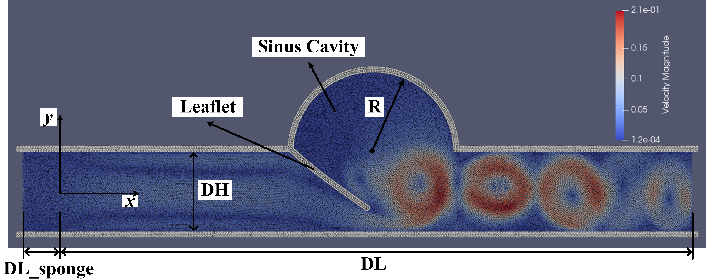

Here we’ll introduce the FSI case of 2D aortic valve. 

============================
Example 15: 2D aortic valve
============================

The parameter definition of the case of 2D aortic valve is shown in the figure, 
where the inlet fluid velocity varies periodically and the valve deforms.

   The distribution of the velocity magnititude and parameter definition.

First, we provide the following program to create a system for this problem.

.. code-block:: cpp

	/**
	 * @file 	test_2d_aortic_valve.cpp
	 * @brief 	This is the benchmark test for the aortic valve.
	 * @author 	Dong Wu
	 */

	/**
	 * @brief 	SPHinXsys Library.
	 */
	#include "sphinxsys.h"
	 /**
	* @brief Namespace cite here.
	*/
	using namespace SPH;
	/**
	 * @brief Basic geometry parameters.
	 */
	Real DL = 0.16; 					     		/**< Channel length. */
	Real DH = 0.02; 								/**< Channel height. */
	Real R = 0.02; 							        /**< Sinus cavity radius. */
	Real Leaflet_L = 0.024; 					    /**< Leaflet length. */
	Real Leaflet_T = 2.4e-3; 						/**< Leaflet thickness. */
	Real N = 180; 				        			/**< Particle number for creating sinus cavity. */
	Vec2d insert_circle_center(0.5 * DL, 0.5 * DH);	/**< Location of the sinus cavity center. */
	Real resolution_ref = Leaflet_T / 4.0; 			/**< Global reference resolution. */
	Real DL_sponge = resolution_ref * 20.0;	        /**< Sponge region to impose inflow condition. */
	Real BW = resolution_ref * 4.0; 			    /**< Boundary width. */
	Real Leaflet_base_length = BW; 			        /**< Length of constrained leaflet. */ 
	/** Domain bounds of the system. */
	BoundingBox system_domain_bounds(Vec2d(-DL_sponge - BW, -0.5 * DH - BW),
		Vec2d(DL + BW, 0.5 * DH + R + BW));
	/**
	 * @brief Material properties of the fluid.
	 */
	Real rho0_f = 1.0e3;	     	            /**< Density. */
	Real U_f = 0.13889;		        	        /**< Characteristic velocity. */
	Real c_f = 10.0 * U_f;      	            /**< Speed of sound. */
	Real mu_f = 4.3e-3;	                        /**< Dynamics viscosity. */
	Real Re = rho0_f * U_f * DH / mu_f;		    /**< Reynolds number. */
	/**
	 * @brief Material properties of the solid,
	 */
	Real rho0_s = 1.0e3; 	    	            /**< Reference density.*/
	Real poisson = 0.49; 		                /**< Poisson ratio.*/
	Real Youngs_modulus = 1.5e5;                /**< Youngs Modulus. */
	/**
	* @brief define geometry of SPH bodies
	*/
	/** create a water block shape */
	std::vector<Vecd> createWaterBlockShape()
	{
		//geometry
		std::vector<Vecd> water_block_shape;
		water_block_shape.push_back(Vecd(-DL_sponge, -0.5 * DH));
		water_block_shape.push_back(Vecd(-DL_sponge, 0.5 * DH));
		for (int i = 0; i < N + 1; ++i)
		{
			water_block_shape.push_back(Vecd(insert_circle_center[0] - R * cos(i * Pi / N),
				insert_circle_center[1] + R * sin(i * Pi / N)));
		}
		water_block_shape.push_back(Vecd(DL, 0.5 * DH));
		water_block_shape.push_back(Vecd(DL, -0.5 * DH));
		water_block_shape.push_back(Vecd(-DL_sponge, -0.5 * DH));

		return water_block_shape;
	}
	/** create a water block buffer shape. */
	MultiPolygon createInflowBufferShape()
	{
		std::vector<Vecd> inflow_buffer_shape;
		inflow_buffer_shape.push_back(Vecd(-DL_sponge, -0.5 * DH));
		inflow_buffer_shape.push_back(Vecd(-DL_sponge, 0.5 * DH));
		inflow_buffer_shape.push_back(Vecd(0.0, 0.5 * DH));
		inflow_buffer_shape.push_back(Vecd(0.0, -0.5 * DH));
		inflow_buffer_shape.push_back(Vecd(-DL_sponge, -0.5 * DH));

		MultiPolygon multi_polygon;
		multi_polygon.addAPolygon(inflow_buffer_shape, ShapeBooleanOps::add);
		return multi_polygon;
	}
	/** create outer wall shape */
	std::vector<Vecd> createOuterWallShape1()
	{
		//geometry
		std::vector<Vecd> outer_wall_shape1;
		outer_wall_shape1.push_back(Vecd(-DL_sponge - BW, -0.5 * DH - BW));
		outer_wall_shape1.push_back(Vecd(-DL_sponge - BW, 0.5 * DH + BW));
		outer_wall_shape1.push_back(Vecd(DL + BW, 0.5 * DH + BW));
		outer_wall_shape1.push_back(Vecd(DL + BW, -0.5 * DH - BW));
		outer_wall_shape1.push_back(Vecd(-DL_sponge - BW, -0.5 * DH - BW));

		return outer_wall_shape1;
	}
	/** create outer wall shape */
	std::vector<Vecd> createOuterWallShape2()
	{
		//geometry
		std::vector<Vecd> outer_wall_shape2;
		for (int i = 0; i < N + 1; ++i)
		{
			outer_wall_shape2.push_back(Vecd(insert_circle_center[0] - (R + BW) * cos(i * Pi / N),
				insert_circle_center[1] + (R + BW) * sin(i * Pi / N)));
		}
		outer_wall_shape2.push_back(Vecd(insert_circle_center[0] - R - BW, insert_circle_center[1]));

		return outer_wall_shape2;
	}
	/**
	* @brief create inner wall shape
	*/
	std::vector<Vecd> createInnerWallShape()
	{
		std::vector<Vecd> inner_wall_shape;
		inner_wall_shape.push_back(Vecd(-DL_sponge - BW, -0.5 * DH));
		inner_wall_shape.push_back(Vecd(-DL_sponge - BW, 0.5 * DH));
		inner_wall_shape.push_back(Vecd(DL + BW, 0.5 * DH));
		inner_wall_shape.push_back(Vecd(DL + BW, -0.5 * DH));
		inner_wall_shape.push_back(Vecd(-DL_sponge - BW, -0.5 * DH ));

		return inner_wall_shape;
	}
	/**
	* @brief create leaflet shape
	*/
	Vec2d BLB(0.5 * DL - R - (Leaflet_base_length + 0.5 * Leaflet_T) * cos(0.25 * Pi), 
		0.5 * DH + (Leaflet_base_length - 0.5 * Leaflet_T) * sin(0.25 * Pi));
	Vec2d BLT(0.5 * DL - R - (Leaflet_base_length - 0.5 * Leaflet_T) * cos(0.25 * Pi),
		0.5 * DH + (Leaflet_base_length + 0.5 * Leaflet_T) * sin(0.25 * Pi));
	Vec2d BRT(0.5 * DL - R + (Leaflet_L + 0.5 * Leaflet_T) * cos(0.25 * Pi),
		0.5 * DH - (Leaflet_L - 0.5 * Leaflet_T) * sin(0.25 * Pi));
	Vec2d BRB(0.5 * DL - R + (Leaflet_L - 0.5 * Leaflet_T) * cos(0.25 * Pi),
		0.5 * DH - (Leaflet_L + 0.5 * Leaflet_T) * sin(0.25 * Pi));
	std::vector<Vecd> createLeafletShape()
	{
		std::vector<Vecd> leaflet_shape;
		leaflet_shape.push_back(BLB);
		leaflet_shape.push_back(BLT);
		leaflet_shape.push_back(BRT);
		leaflet_shape.push_back(BRB);
		leaflet_shape.push_back(BLB);

		return leaflet_shape;
	}
	 /** Fluid body definition */
	class WaterBlock : public FluidBody
	{
	public:
		WaterBlock(SPHSystem& system, std::string body_name)
			: FluidBody(system, body_name)
		{
			/** Geomtry definition. */
			MultiPolygon multi_polygon;
			multi_polygon.addAPolygon(createWaterBlockShape(), ShapeBooleanOps::add);
			multi_polygon.addAPolygon(createLeafletShape(), ShapeBooleanOps::sub);
			body_shape_.add<MultiPolygonShape>(multi_polygon);
		}
	};
	/** Definition of the inserted body as a elastic structure. */
	class InsertedBody : public SolidBody
	{
	public:
		InsertedBody(SPHSystem& system, std::string body_name)
			: SolidBody(system, body_name, makeShared<SPHAdaptation>(1.15, 1.0))
		{
			/** Geomtry definition. */
			MultiPolygon multi_polygon;
			multi_polygon.addAPolygon(createOuterWallShape1(), ShapeBooleanOps::add);
			multi_polygon.addAPolygon(createOuterWallShape2(), ShapeBooleanOps::add);
			multi_polygon.addAPolygon(createInnerWallShape(), ShapeBooleanOps::sub);
			multi_polygon.addAPolygon(createWaterBlockShape(), ShapeBooleanOps::sub);
			multi_polygon.addAPolygon(createLeafletShape(), ShapeBooleanOps::add);
			MultiPolygonShape multi_polygon_shape(multi_polygon);
			body_shape_.add<LevelSetShape>(this, multi_polygon_shape);
		}
	};
	/** constrained part of the insert body. */
	MultiPolygon createLeafletBaseShape()
	{
		MultiPolygon multi_polygon;
		multi_polygon.addAPolygon(createOuterWallShape1(), ShapeBooleanOps::add);
		multi_polygon.addAPolygon(createOuterWallShape2(), ShapeBooleanOps::add);
		multi_polygon.addAPolygon(createInnerWallShape(), ShapeBooleanOps::sub);
		multi_polygon.addAPolygon(createWaterBlockShape(), ShapeBooleanOps::sub);
		multi_polygon.addAPolygon(createLeafletShape(), ShapeBooleanOps::sub);
		return multi_polygon;
	};
	/** Case dependent inflow boundary condition. */
	class ParabolicInflow : public fluid_dynamics::InflowBoundaryCondition
	{
		Real u_ave_, u_ref_, t_ref;
	public:
		ParabolicInflow(FluidBody& fluid_body, BodyPartByCell& constrained_region)
			: InflowBoundaryCondition(fluid_body, constrained_region)
		{
			u_ave_ = 0.0;
			u_ref_ = 0.13889;
			t_ref = 1.0;
		}
		Vecd getTargetVelocity(Vecd& position, Vecd& velocity)
		{
			Real u = velocity[0];
			Real v = velocity[1];
			if (position[0] < 0.0) {
				u = (-6.0 * position[1] * position[1] / DH / DH + 1.5) * u_ave_;
				v = 0.0;
			}
			return Vecd(u, v);
		}
		void setupDynamics(Real dt = 0.0) override
		{
			Real run_time = GlobalStaticVariables::physical_time_;
			u_ave_ = u_ref_ * 0.5 * (1.0 + sin(Pi * run_time / t_ref - 0.5 * Pi));
		}
	};
	/** observer body */
	class LeafletObserverParticleGenerator : public ParticleGeneratorDirect
	{
	public:
		LeafletObserverParticleGenerator() : ParticleGeneratorDirect()
		{
			/** the measuring particle with zero volume */
			positions_volumes_.push_back(std::make_pair(0.5 * (BRT + BRB), 0.0));
		}
	};
	/** an observer body to measure the flow profile */
	class FluidObserverParticleGenerator : public ParticleGeneratorDirect
	{
	public:
		FluidObserverParticleGenerator() : ParticleGeneratorDirect()
		{
			/** A line of measuring points at the entrance of the channel. */
			size_t number_observation_pionts = 21;
			Real range_of_measure = DH - resolution_ref * 4.0;
			Real start_of_measure = resolution_ref * 2.0 - 0.5 * DH;
			/** the measureing particles */
			for (size_t i = 0; i < number_observation_pionts; ++i) 
			{
				Vec2d point_coordinate(0.0, range_of_measure * Real(i) / Real(number_observation_pionts - 1) + start_of_measure);
				positions_volumes_.push_back(std::make_pair(point_coordinate, 0.0));
			}
		}
	};
	/** Main program starts here. */
	int main(int ac, char* av[])
	{
		/** Build up the environment of a SPHSystem with global controls. */
		SPHSystem system(system_domain_bounds, resolution_ref);
		/** Tag for run particle relaxation for the initial body fitted distribution. */
		system.run_particle_relaxation_ = false;
		/** Tag for computation start with relaxed body fitted particles distribution. */
		system.reload_particles_ = true;
		/** Tag for computation from restart files. 0: start with initial condition. */
		system.restart_step_ = 0;
		//handle command line arguments
		#ifdef BOOST_AVAILABLE
		system.handleCommandlineOptions(ac, av);
		#endif
		/** output environment. */
		In_Output in_output(system);
		/**
		 * @brief Creating body, materials and particles for a water block.
		 */
		WaterBlock water_block(system, "WaterBody");
		FluidParticles fluid_particles(water_block, makeShared<WeaklyCompressibleFluid>(rho0_f, c_f, mu_f));
		/**
		 * @brief 	Creating body, materials and particles for the inserted body.
		 */
		InsertedBody inserted_body(system, "InsertedBody");
		SharedPtr<ParticleGenerator> inserted_body_particle_generator = makeShared<ParticleGeneratorLattice>();
		if (!system.run_particle_relaxation_ && system.reload_particles_)
			inserted_body_particle_generator = makeShared<ParticleGeneratorReload>(in_output, inserted_body.getBodyName());
		ElasticSolidParticles inserted_body_particles(inserted_body,
			makeShared<LinearElasticSolid>(rho0_s, Youngs_modulus, poisson), inserted_body_particle_generator);
		/**
		 * @brief 	Particle and body creation of leaflet and fluid observers.
		 */
		ProbeBody leaflet_observer(system, "BeamObserver");
		ObserverParticles beam_observer_particles(leaflet_observer, makeShared<LeafletObserverParticleGenerator>());
		ProbeBody fluid_observer(system, "FluidObserver");
		ObserverParticles flow_observer_particles(fluid_observer, makeShared<FluidObserverParticleGenerator>());
		/**
		 * @brief Define body relation map.
		 * The contact map gives the topological connections between the bodies.
		 * Basically the the range of bodies to build neighbor particle lists.
		 */
		BodyRelationInner water_block_inner(water_block);
		BodyRelationInner inserted_body_inner(inserted_body);
		ComplexBodyRelation water_block_complex(water_block, { &inserted_body });
		BodyRelationContact inserted_body_contact(inserted_body, { &water_block });
		BodyRelationContact leaflet_observer_contact(leaflet_observer, { &inserted_body });
		BodyRelationContact fluid_observer_contact(fluid_observer, { &water_block });
		/** check whether run particle relaxation for body fitted particle distribution. */
		if (system.run_particle_relaxation_)
		{
			/**
			 * @brief 	Methods used for particle relaxation.
			 */
			/** Random reset the insert body particle position. */
			RandomizePartilePosition  random_inserted_body_particles(inserted_body);
			/** Write the body state to Vtu file. */
			BodyStatesRecordingToVtp write_inserted_body_to_vtp(in_output, { &inserted_body });
			/** Write the particle reload files. */
			ReloadParticleIO write_particle_reload_files(in_output, { &inserted_body });
			/** A  Physics relaxation step. */
			relax_dynamics::RelaxationStepInner relaxation_step_inner(inserted_body_inner);
			/**
			  * @brief 	Particle relaxation starts here.
			  */
			random_inserted_body_particles.parallel_exec(0.25);
			relaxation_step_inner.surface_bounding_.parallel_exec();
			write_inserted_body_to_vtp.writeToFile(0);

			/** relax particles of the insert body. */
			int ite_p = 0;
			while (ite_p < 2000)
			{
				relaxation_step_inner.parallel_exec();
				ite_p += 1;
				if (ite_p % 200 == 0)
				{
					std::cout << std::fixed << std::setprecision(9) << "Relaxation steps for the inserted body N = " << ite_p << "\n";
					write_inserted_body_to_vtp.writeToFile(ite_p);
				}
			}
			std::cout << "The physics relaxation process of inserted body finish !" << std::endl;
			/** Output results. */
			write_particle_reload_files.writeToFile(0);

			return 0;
		}
		/**
		 * @brief 	Define all numerical methods which are used in FSI.
		 */
		/** Corrected strong configuration for the elastic insertbody. */
		solid_dynamics::CorrectConfiguration inserted_body_corrected_configuration(inserted_body_inner);
		/**
		 * @brief 	Methods used for time stepping.
		 */
		 /** Initialize particle acceleration. */
		TimeStepInitialization 	initialize_a_fluid_step(water_block);
		/** Evaluation of density by summation approach. */
		fluid_dynamics::DensitySummationComplex	update_density_by_summation(water_block_complex);
		/** Time step size without considering sound wave speed. */
		fluid_dynamics::AdvectionTimeStepSize get_fluid_advection_time_step_size(water_block, U_f);
		/** Time step size with considering sound wave speed. */
		fluid_dynamics::AcousticTimeStepSize get_fluid_time_step_size(water_block);
		/** Pressure relaxation using verlet time stepping. */
		/** Here, we do not use Riemann solver for pressure as the flow is viscous. */
		fluid_dynamics::PressureRelaxationWithWall pressure_relaxation(water_block_complex);
		fluid_dynamics::DensityRelaxationRiemannWithWall density_relaxation(water_block_complex);
		/** Computing viscous acceleration. */
		fluid_dynamics::ViscousAccelerationWithWall 	viscous_acceleration(water_block_complex);
		/** Impose transport velocity. */
		fluid_dynamics::TransportVelocityCorrectionComplex	transport_velocity_correction(water_block_complex);
		/** viscous acceleration and transport velocity correction can be combined because they are independent dynamics. */
		CombinedInteractionDynamics viscous_acceleration_and_transport_correction(viscous_acceleration, transport_velocity_correction);
		/** Computing vorticity in the flow. */
		fluid_dynamics::VorticityInner 	compute_vorticity(water_block_inner);
		/** Inflow boundary condition. */
		MultiPolygonShape inflow_buffer_shape(createInflowBufferShape());
		BodyRegionByCell inflow_buffer(water_block, "Buffer", inflow_buffer_shape);
		ParabolicInflow parabolic_inflow(water_block, inflow_buffer);
		/** Periodic BCs in x direction. */
		PeriodicConditionInAxisDirectionUsingCellLinkedList periodic_condition(water_block, xAxis);
		/**
		 * @brief Algorithms of FSI.
		 */
		 /** Compute the force exerted on solid body due to fluid pressure and viscosity. */
		solid_dynamics::FluidForceOnSolidUpdate fluid_force_on_inserted_body(inserted_body_contact);
		/** Compute the average velocity of the insert body. */
		solid_dynamics::AverageVelocityAndAcceleration average_velocity_and_acceleration(inserted_body);
		/**
		 * @brief Algorithms of solid dynamics.
		 */
		 /** Compute time step size of elastic solid. */
		solid_dynamics::AcousticTimeStepSize inserted_body_computing_time_step_size(inserted_body);
		/** Stress relaxation for the inserted body. */
		solid_dynamics::StressRelaxationFirstHalf inserted_body_stress_relaxation_first_half(inserted_body_inner);
		solid_dynamics::StressRelaxationSecondHalf inserted_body_stress_relaxation_second_half(inserted_body_inner);
		/** Constrain region of the inserted body. */
		MultiPolygonShape leaflet_base_shape(createLeafletBaseShape());
		BodyRegionByParticle leaflet_base(inserted_body, "BeamBase", leaflet_base_shape);
		solid_dynamics::ConstrainSolidBodyRegion constrain_leaflet_base(inserted_body, leaflet_base);
		/** Update norm .*/
		solid_dynamics::UpdateElasticNormalDirection inserted_body_update_normal(inserted_body);	
		/**
		 * @brief Define the methods for I/O operations and observations of the simulation.
		 */
		BodyStatesRecordingToVtp write_real_body_states(in_output, system.real_bodies_);
		RestartIO restart_io(in_output, system.real_bodies_);
		BodyReducedQuantityRecording<solid_dynamics::TotalViscousForceOnSolid>
			write_total_viscous_force_on_inserted_body(in_output, inserted_body);
		ObservedQuantityRecording<Vecd> write_leaflet_tip_displacement("Position", in_output, leaflet_observer_contact);
		ObservedQuantityRecording<Vecd> write_fluid_velocity("Velocity", in_output, fluid_observer_contact);
		/**
		 * @brief Prepare the simulation with cell linked list, configuration
		 * and case specified initial condition if necessary.
		 */
		/** initialize cell linked lists for all bodies. */
		system.initializeSystemCellLinkedLists();
		/** periodic condition applied after the mesh cell linked list build up
		  * but before the configuration build up. */
		periodic_condition.update_cell_linked_list_.parallel_exec();
		/** initialize configurations for all bodies. */
		system.initializeSystemConfigurations();
		/** computing surface normal direction for the insert body. */
		inserted_body_particles.initializeNormalDirectionFromBodyShape();
		/** computing linear reproducing configuration for the insert body. */
		inserted_body_corrected_configuration.parallel_exec();
		/**
		 * @brief The time stepping starts here.
		 */
		if (system.restart_step_ != 0) {
			GlobalStaticVariables::physical_time_ = restart_io.readRestartFiles(system.restart_step_);
			inserted_body.updateCellLinkedList();
			water_block.updateCellLinkedList();
			periodic_condition.update_cell_linked_list_.parallel_exec();
			/** one need update configuration after periodic condition. */
			water_block_complex.updateConfiguration();
			inserted_body_contact.updateConfiguration();
			inserted_body_update_normal.parallel_exec();
		}
		/**
		 * @brief Setup for time-stepping control
		 */
		size_t number_of_iterations = system.restart_step_;
		int screen_output_interval = 100;
		int restart_output_interval = screen_output_interval * 10;
		Real End_Time = 4.0;			/**< End time. */
		Real D_Time = End_Time / 100.0;	/**< time stamps for output. */
		Real Dt = 0.0;					/**< Default advection time step sizes for fluid. */
		Real dt = 0.0; 					/**< Default acoustic time step sizes for fluid. */
		Real dt_s = 0.0;				/**< Default acoustic time step sizes for solid. */
		size_t inner_ite_dt = 0;
		size_t inner_ite_dt_s = 0;
		/** Statistics for computing time. */
		tick_count t1 = tick_count::now();
		tick_count::interval_t interval;
		/** First output before the main loop. */
		write_real_body_states.writeToFile();
		write_leaflet_tip_displacement.writeToFile(number_of_iterations);
		write_fluid_velocity.writeToFile(number_of_iterations);
		/**
		 * @brief Main loop starts here.
		 */
		while (GlobalStaticVariables::physical_time_ < End_Time)
		{
			Real integration_time = 0.0;
			/** Integrate time (loop) until the next output time. */
			while (integration_time < D_Time)
			{
				initialize_a_fluid_step.parallel_exec();
				Dt = get_fluid_advection_time_step_size.parallel_exec();
				update_density_by_summation.parallel_exec();
				viscous_acceleration_and_transport_correction.parallel_exec(Dt);

				/** FSI for viscous force. */
				fluid_force_on_inserted_body.viscous_force_.parallel_exec();
				/** Update normal direction on elastic body.*/
				inserted_body_update_normal.parallel_exec();
				inner_ite_dt = 0;
				Real relaxation_time = 0.0;
				while (relaxation_time < Dt)
				{
					dt = SMIN(get_fluid_time_step_size.parallel_exec(), Dt);
					/** Fluid pressure relaxation */
					pressure_relaxation.parallel_exec(dt);
					/** FSI for pressure force. */
					fluid_force_on_inserted_body.parallel_exec();
					/** Fluid density relaxation */
					density_relaxation.parallel_exec(dt);

					/** Solid dynamics. */
					inner_ite_dt_s = 0;
					Real dt_s_sum = 0.0;
					average_velocity_and_acceleration.initialize_displacement_.parallel_exec();
					while (dt_s_sum < dt) 
					{
						dt_s = SMIN(inserted_body_computing_time_step_size.parallel_exec(), dt - dt_s_sum);
						inserted_body_stress_relaxation_first_half.parallel_exec(dt_s);
						constrain_leaflet_base.parallel_exec();
						inserted_body_stress_relaxation_second_half.parallel_exec(dt_s);
						dt_s_sum += dt_s;
						inner_ite_dt_s++;
					}
					average_velocity_and_acceleration.update_averages_.parallel_exec(dt);

					relaxation_time += dt;
					integration_time += dt;
					GlobalStaticVariables::physical_time_ += dt;
					parabolic_inflow.parallel_exec();
					inner_ite_dt++;
				}

				if (number_of_iterations % screen_output_interval == 0)
				{
					std::cout << std::fixed << std::setprecision(9) << "N=" << number_of_iterations << "	Time = "
						<< GlobalStaticVariables::physical_time_
						<< "	Dt = " << Dt << "	Dt / dt = " << inner_ite_dt << "	dt / dt_s = " << inner_ite_dt_s << "\n";

					if (number_of_iterations % restart_output_interval == 0 && number_of_iterations != system.restart_step_)
						restart_io.writeToFile(number_of_iterations);
				}
				number_of_iterations++;

				/** Water block configuration and periodic condition. */
				periodic_condition.bounding_.parallel_exec();

				water_block.updateCellLinkedList();
				periodic_condition.update_cell_linked_list_.parallel_exec();
				water_block_complex.updateConfiguration();
				/** one need update configuration after periodic condition. */
				inserted_body.updateCellLinkedList();
				inserted_body_contact.updateConfiguration();
				/** write run-time observation into file */
				write_leaflet_tip_displacement.writeToFile(number_of_iterations);
			}

			tick_count t2 = tick_count::now();
			/** write run-time observation into file */
			compute_vorticity.parallel_exec();
			write_real_body_states.writeToFile();
			write_total_viscous_force_on_inserted_body.writeToFile(number_of_iterations);
			fluid_observer_contact.updateConfiguration();
			write_fluid_velocity.writeToFile(number_of_iterations);
			tick_count t3 = tick_count::now();
			interval += t3 - t2;
		}
		tick_count t4 = tick_count::now();

		tick_count::interval_t tt;
		tt = t4 - t1 - interval;
		std::cout << "Total wall time for computation: " << tt.seconds() << " seconds." << std::endl;

		return 0;
	}

Let’s go through the program line by line and see how it works. 
It begins with the include statement:

.. code-block:: cpp

	/**
	 * @file 	test_2d_aortic_valve.cpp
	 * @brief 	This is the benchmark test for the aortic valve.
	 * @author 	Dong Wu
	 */

	/**
	 * @brief 	SPHinXsys Library.
	 */
	#include "sphinxsys.h"

That gets us all the declarations we need to write a SPHinXsys-using application.

Next we import the :code:`SPH` namespace, 
which includes nearly all of the symbols used by SPHinXsys:

.. code-block:: cpp

	/**
	* @brief Namespace cite here.
	*/
	using namespace SPH;

Now, we provide the parameters for geometric modeling.

.. code-block:: cpp

	/**
	 * @brief Basic geometry parameters.
	 */
	Real DL = 0.16; 					     		/**< Channel length. */
	Real DH = 0.02; 								/**< Channel height. */
	Real R = 0.02; 							        /**< Sinus cavity radius. */
	Real Leaflet_L = 0.024; 					    /**< Leaflet length. */
	Real Leaflet_T = 2.4e-3; 						/**< Leaflet thickness. */
	Real N = 180; 				        			/**< Particle number for creating sinus cavity. */
	Vec2d insert_circle_center(0.5 * DL, 0.5 * DH);	/**< Location of the sinus cavity center. */
	Real resolution_ref = Leaflet_T / 4.0; 			/**< Global reference resolution. */
	Real DL_sponge = resolution_ref * 20.0;	        /**< Sponge region to impose inflow condition. */
	Real BW = resolution_ref * 4.0; 			    /**< Boundary width. */
	Real Leaflet_base_length = BW; 			        /**< Length of constrained leaflet. */ 
	/** Domain bounds of the system. */
	BoundingBox system_domain_bounds(Vec2d(-DL_sponge - BW, -0.5 * DH - BW),
		Vec2d(DL + BW, 0.5 * DH + R + BW));

Here, :code:`particle_spacing_ref` gives the reference initial particle spacing. 
:code:`BW` is the size (thickness) of a wall boundary, which is usually 4 times of particle spacing. 
:code:`DL_sponge` is used to define the sponge region for imposing inflow condition.
We give the the coordinates of lower and upper bounds of the domain 
in :code:`system_domain_bounds` 
which will be used as the bounds for a mesh used for building cell linked lists.

We also provide parameters for physical modeling, 
such as material properties of the fluid.

.. code-block:: cpp

	/**
	 * @brief Material properties of the fluid.
	 */
	Real rho0_f = 1.0e3;	     	            /**< Density. */
	Real U_f = 0.13889;		        	        /**< Characteristic velocity. */
	Real c_f = 10.0 * U_f;      	            /**< Speed of sound. */
	Real mu_f = 4.3e-3;	                        /**< Dynamics viscosity. */
	Real Re = rho0_f * U_f * DH / mu_f;		    /**< Reynolds number. */
	/**
	 * @brief Material properties of the solid,
	 */
	Real rho0_s = 1.0e3; 	    	            /**< Reference density.*/
	Real poisson = 0.49; 		                /**< Poisson ratio.*/
	Real Youngs_modulus = 1.5e5;                /**< Youngs Modulus. */

As we are using a weakly compressible model for imposing incompressibility, 
the maximum speed in the flow and artificial speed of sound are estimated. 
We also provide the material parameters of the solid.

Then, we define the realization of the :code:`SPHBody`.
First, the geometric shapes, 
:code:`water_block_shape`, :code:`inflow_buffer_shape`, :code:`outer_wall_shape` and :code:`inner_wall_shape`
are defined form the coordinates based on the geometric parameters.

.. code-block:: cpp

	/**
	* @brief define geometry of SPH bodies
	*/
	/** create a water block shape */
	std::vector<Vecd> createWaterBlockShape()
	{
		//geometry
		std::vector<Vecd> water_block_shape;
		water_block_shape.push_back(Vecd(-DL_sponge, -0.5 * DH));
		water_block_shape.push_back(Vecd(-DL_sponge, 0.5 * DH));
		for (int i = 0; i < N + 1; ++i)
		{
			water_block_shape.push_back(Vecd(insert_circle_center[0] - R * cos(i * Pi / N),
				insert_circle_center[1] + R * sin(i * Pi / N)));
		}
		water_block_shape.push_back(Vecd(DL, 0.5 * DH));
		water_block_shape.push_back(Vecd(DL, -0.5 * DH));
		water_block_shape.push_back(Vecd(-DL_sponge, -0.5 * DH));

		return water_block_shape;
	}
	/** create a water block buffer shape. */
	MultiPolygon createInflowBufferShape()
	{
		std::vector<Vecd> inflow_buffer_shape;
		inflow_buffer_shape.push_back(Vecd(-DL_sponge, -0.5 * DH));
		inflow_buffer_shape.push_back(Vecd(-DL_sponge, 0.5 * DH));
		inflow_buffer_shape.push_back(Vecd(0.0, 0.5 * DH));
		inflow_buffer_shape.push_back(Vecd(0.0, -0.5 * DH));
		inflow_buffer_shape.push_back(Vecd(-DL_sponge, -0.5 * DH));

		MultiPolygon multi_polygon;
		multi_polygon.addAPolygon(inflow_buffer_shape, ShapeBooleanOps::add);
		return multi_polygon;
	}
	/** create outer wall shape */
	std::vector<Vecd> createOuterWallShape1()
	{
		//geometry
		std::vector<Vecd> outer_wall_shape1;
		outer_wall_shape1.push_back(Vecd(-DL_sponge - BW, -0.5 * DH - BW));
		outer_wall_shape1.push_back(Vecd(-DL_sponge - BW, 0.5 * DH + BW));
		outer_wall_shape1.push_back(Vecd(DL + BW, 0.5 * DH + BW));
		outer_wall_shape1.push_back(Vecd(DL + BW, -0.5 * DH - BW));
		outer_wall_shape1.push_back(Vecd(-DL_sponge - BW, -0.5 * DH - BW));

		return outer_wall_shape1;
	}
	/** create outer wall shape */
	std::vector<Vecd> createOuterWallShape2()
	{
		//geometry
		std::vector<Vecd> outer_wall_shape2;
		for (int i = 0; i < N + 1; ++i)
		{
			outer_wall_shape2.push_back(Vecd(insert_circle_center[0] - (R + BW) * cos(i * Pi / N),
				insert_circle_center[1] + (R + BW) * sin(i * Pi / N)));
		}
		outer_wall_shape2.push_back(Vecd(insert_circle_center[0] - R - BW, insert_circle_center[1]));

		return outer_wall_shape2;
	}
	/**
	* @brief create inner wall shape
	*/
	std::vector<Vecd> createInnerWallShape()
	{
		std::vector<Vecd> inner_wall_shape;
		inner_wall_shape.push_back(Vecd(-DL_sponge - BW, -0.5 * DH));
		inner_wall_shape.push_back(Vecd(-DL_sponge - BW, 0.5 * DH));
		inner_wall_shape.push_back(Vecd(DL + BW, 0.5 * DH));
		inner_wall_shape.push_back(Vecd(DL + BW, -0.5 * DH));
		inner_wall_shape.push_back(Vecd(-DL_sponge - BW, -0.5 * DH ));

		return inner_wall_shape;
	}
	/**
	* @brief create leaflet shape
	*/
	Vec2d BLB(0.5 * DL - R - (Leaflet_base_length + 0.5 * Leaflet_T) * cos(0.25 * Pi), 
		0.5 * DH + (Leaflet_base_length - 0.5 * Leaflet_T) * sin(0.25 * Pi));
	Vec2d BLT(0.5 * DL - R - (Leaflet_base_length - 0.5 * Leaflet_T) * cos(0.25 * Pi),
		0.5 * DH + (Leaflet_base_length + 0.5 * Leaflet_T) * sin(0.25 * Pi));
	Vec2d BRT(0.5 * DL - R + (Leaflet_L + 0.5 * Leaflet_T) * cos(0.25 * Pi),
		0.5 * DH - (Leaflet_L - 0.5 * Leaflet_T) * sin(0.25 * Pi));
	Vec2d BRB(0.5 * DL - R + (Leaflet_L - 0.5 * Leaflet_T) * cos(0.25 * Pi),
		0.5 * DH - (Leaflet_L + 0.5 * Leaflet_T) * sin(0.25 * Pi));
	std::vector<Vecd> createLeafletShape()
	{
		std::vector<Vecd> leaflet_shape;
		leaflet_shape.push_back(BLB);
		leaflet_shape.push_back(BLT);
		leaflet_shape.push_back(BRT);
		leaflet_shape.push_back(BRB);
		leaflet_shape.push_back(BLB);

		return leaflet_shape;
	}

The :code:`leaflet_shape` is also defined according to the four points.

Then, we define the fluid body and solid body.

.. code-block:: cpp

	 /** Fluid body definition */
	class WaterBlock : public FluidBody
	{
	public:
		WaterBlock(SPHSystem& system, std::string body_name)
			: FluidBody(system, body_name)
		{
			/** Geomtry definition. */
			MultiPolygon multi_polygon;
			multi_polygon.addAPolygon(createWaterBlockShape(), ShapeBooleanOps::add);
			multi_polygon.addAPolygon(createLeafletShape(), ShapeBooleanOps::sub);
			body_shape_.add<MultiPolygonShape>(multi_polygon);
		}
	};
	/** Definition of the inserted body as a elastic structure. */
	class InsertedBody : public SolidBody
	{
	public:
		InsertedBody(SPHSystem& system, std::string body_name)
			: SolidBody(system, body_name, makeShared<SPHAdaptation>(1.15, 1.0))
		{
			/** Geomtry definition. */
			MultiPolygon multi_polygon;
			multi_polygon.addAPolygon(createOuterWallShape1(), ShapeBooleanOps::add);
			multi_polygon.addAPolygon(createOuterWallShape2(), ShapeBooleanOps::add);
			multi_polygon.addAPolygon(createInnerWallShape(), ShapeBooleanOps::sub);
			multi_polygon.addAPolygon(createWaterBlockShape(), ShapeBooleanOps::sub);
			multi_polygon.addAPolygon(createLeafletShape(), ShapeBooleanOps::add);
			MultiPolygonShape multi_polygon_shape(multi_polygon);
			body_shape_.add<LevelSetShape>(this, multi_polygon_shape);
		}
	};
	/** constrained part of the insert body. */
	MultiPolygon createLeafletBaseShape()
	{
		MultiPolygon multi_polygon;
		multi_polygon.addAPolygon(createOuterWallShape1(), ShapeBooleanOps::add);
		multi_polygon.addAPolygon(createOuterWallShape2(), ShapeBooleanOps::add);
		multi_polygon.addAPolygon(createInnerWallShape(), ShapeBooleanOps::sub);
		multi_polygon.addAPolygon(createWaterBlockShape(), ShapeBooleanOps::sub);
		multi_polygon.addAPolygon(createLeafletShape(), ShapeBooleanOps::sub);
		return multi_polygon;
	};

The :code:`WaterBlock` and  :code:`InsertedBody`, 
which are the derived class of :code:`FluidBody` and :code:`SolidBody` respectively, 
are difined with boolean operation, 
such as :code:`add` and :code:`sub`.
Then, we define the inflow boundary condition and observation body.

.. code-block:: cpp

	/** Case dependent inflow boundary condition. */
	class ParabolicInflow : public fluid_dynamics::InflowBoundaryCondition
	{
		Real u_ave_, u_ref_, t_ref;
	public:
		ParabolicInflow(FluidBody& fluid_body, BodyPartByCell& constrained_region)
			: InflowBoundaryCondition(fluid_body, constrained_region)
		{
			u_ave_ = 0.0;
			u_ref_ = 0.13889;
			t_ref = 1.0;
		}
		Vecd getTargetVelocity(Vecd& position, Vecd& velocity)
		{
			Real u = velocity[0];
			Real v = velocity[1];
			if (position[0] < 0.0) {
				u = (-6.0 * position[1] * position[1] / DH / DH + 1.5) * u_ave_;
				v = 0.0;
			}
			return Vecd(u, v);
		}
		void setupDynamics(Real dt = 0.0) override
		{
			Real run_time = GlobalStaticVariables::physical_time_;
			u_ave_ = u_ref_ * 0.5 * (1.0 + sin(Pi * run_time / t_ref - 0.5 * Pi));
		}
	};
	/** observer body */
	class LeafletObserverParticleGenerator : public ParticleGeneratorDirect
	{
	public:
		LeafletObserverParticleGenerator() : ParticleGeneratorDirect()
		{
			/** the measuring particle with zero volume */
			positions_volumes_.push_back(std::make_pair(0.5 * (BRT + BRB), 0.0));
		}
	};
	/** an observer body to measure the flow profile */
	class FluidObserverParticleGenerator : public ParticleGeneratorDirect
	{
	public:
		FluidObserverParticleGenerator() : ParticleGeneratorDirect()
		{
			/** A line of measuring points at the entrance of the channel. */
			size_t number_observation_pionts = 21;
			Real range_of_measure = DH - resolution_ref * 4.0;
			Real start_of_measure = resolution_ref * 2.0 - 0.5 * DH;
			/** the measureing particles */
			for (size_t i = 0; i < number_observation_pionts; ++i) 
			{
				Vec2d point_coordinate(0.0, range_of_measure * Real(i) / Real(number_observation_pionts - 1) + start_of_measure);
				positions_volumes_.push_back(std::make_pair(point_coordinate, 0.0));
			}
		}
	};

The :code:`ParabolicInflow` defines the parabolic velocity field at inflow boundary.
The :code:`LeafletObserverParticleGenerator` defines the observation body 
through adding the observation point located at the middle of the leaflet end.
The :code:`FluidObserverParticleGenerator` defines the observation body 
through adding the observation points along the line :code:`x = 0`.
The observation body obtains data from the body it is observing at.

After all :code:`SPHBody` s are defined, here comes to the :code:`int main()` function,
in which the application is defined.
In the first part of :code:`main` function, 
an object of :code:`SPHSystem` is created, 
whether to run the particle relaxation and reload particles, 
and whether the computation begins from restart files are checked, 
and input/output environment is initialized.

.. code-block:: cpp

	/** Build up the environment of a SPHSystem with global controls. */
	SPHSystem system(system_domain_bounds, resolution_ref);
	/** Tag for run particle relaxation for the initial body fitted distribution. */
	system.run_particle_relaxation_ = false;
	/** Tag for computation start with relaxed body fitted particles distribution. */
	system.reload_particles_ = true;
	/** Tag for computation from restart files. 0: start with initial condition. */
	system.restart_step_ = 0;
	//handle command line arguments
	#ifdef BOOST_AVAILABLE
	system.handleCommandlineOptions(ac, av);
	#endif
	/** output environment. */
	In_Output in_output(system);
	/**
	 * @brief Creating body, materials and particles for a water block.
	 */
	WaterBlock water_block(system, "WaterBody");
	FluidParticles fluid_particles(water_block, makeShared<WeaklyCompressibleFluid>(rho0_f, c_f, mu_f));
	/**
	 * @brief 	Creating body, materials and particles for the inserted body.
	 */
	InsertedBody inserted_body(system, "InsertedBody");
	SharedPtr<ParticleGenerator> inserted_body_particle_generator = makeShared<ParticleGeneratorLattice>();
	if (!system.run_particle_relaxation_ && system.reload_particles_)
		inserted_body_particle_generator = makeShared<ParticleGeneratorReload>(in_output, inserted_body.getBodyName());
	ElasticSolidParticles inserted_body_particles(inserted_body,
		makeShared<LinearElasticSolid>(rho0_s, Youngs_modulus, poisson), inserted_body_particle_generator);
	/**
	 * @brief 	Particle and body creation of leaflet and fluid observers.
	 */
	ProbeBody leaflet_observer(system, "BeamObserver");
	ObserverParticles beam_observer_particles(leaflet_observer, makeShared<LeafletObserverParticleGenerator>());
	ProbeBody fluid_observer(system, "FluidObserver");
	ObserverParticles flow_observer_particles(fluid_observer, makeShared<FluidObserverParticleGenerator>());
	/**
	 * @brief Define body relation map.
	 * The contact map gives the topological connections between the bodies.
	 * Basically the the range of bodies to build neighbor particle lists.
	 */
	BodyRelationInner water_block_inner(water_block);
	BodyRelationInner inserted_body_inner(inserted_body);
	ComplexBodyRelation water_block_complex(water_block, { &inserted_body });
	BodyRelationContact inserted_body_contact(inserted_body, { &water_block });
	BodyRelationContact leaflet_observer_contact(leaflet_observer, { &inserted_body });
	BodyRelationContact fluid_observer_contact(fluid_observer, { &water_block });

The material, particles and bodies are created for fluid body, solid body and observer. 
Note that, whether the wall particles are reloaded is checked.
Then, the collection of topological relations,
which specifies for each body the possible interacting bodies, 
are defined. 

After this, the particle relaxation will be run if :code:`system.run_particle_relaxation_ = true`.

.. code-block:: cpp

	/** check whether run particle relaxation for body fitted particle distribution. */
	if (system.run_particle_relaxation_)
	{
		/**
		 * @brief 	Methods used for particle relaxation.
		 */
		/** Random reset the insert body particle position. */
		RandomizePartilePosition  random_inserted_body_particles(inserted_body);
		/** Write the body state to Vtu file. */
		BodyStatesRecordingToVtp write_inserted_body_to_vtp(in_output, { &inserted_body });
		/** Write the particle reload files. */
		ReloadParticleIO write_particle_reload_files(in_output, { &inserted_body });
		/** A  Physics relaxation step. */
		relax_dynamics::RelaxationStepInner relaxation_step_inner(inserted_body_inner);
		/**
		  * @brief 	Particle relaxation starts here.
		  */
		random_inserted_body_particles.parallel_exec(0.25);
		relaxation_step_inner.surface_bounding_.parallel_exec();
		write_inserted_body_to_vtp.writeToFile(0);

		/** relax particles of the insert body. */
		int ite_p = 0;
		while (ite_p < 2000)
		{
			relaxation_step_inner.parallel_exec();
			ite_p += 1;
			if (ite_p % 200 == 0)
			{
				std::cout << std::fixed << std::setprecision(9) << "Relaxation steps for the inserted body N = " << ite_p << "\n";
				write_inserted_body_to_vtp.writeToFile(ite_p);
			}
		}
		std::cout << "The physics relaxation process of inserted body finish !" << std::endl;
		/** Output results. */
		write_particle_reload_files.writeToFile(0);

		return 0;
	}

In this way, we can get the initial body-fitted particle distribution.
Note that, we only need to run particle relaxation for the solid particles 
since the fluid partices can flow arond the body-fitted solid particles.

Then we define the corrected configuration for inserted body to ensure 1st-order consistency.

.. code-block:: cpp

	/** Corrected strong configuration for the elastic insertbody. */
	solid_dynamics::CorrectConfiguration inserted_body_corrected_configuration(inserted_body_inner);

After this, the fluid dynamics of system is defined 
as method classes in the form of particle discretization.

.. code-block:: cpp

	/**
	 * @brief 	Methods used for time stepping.
	 */
	 /** Initialize particle acceleration. */
	TimeStepInitialization 	initialize_a_fluid_step(water_block);
	/** Evaluation of density by summation approach. */
	fluid_dynamics::DensitySummationComplex	update_density_by_summation(water_block_complex);
	/** Time step size without considering sound wave speed. */
	fluid_dynamics::AdvectionTimeStepSize get_fluid_advection_time_step_size(water_block, U_f);
	/** Time step size with considering sound wave speed. */
	fluid_dynamics::AcousticTimeStepSize get_fluid_time_step_size(water_block);
	/** Pressure relaxation using verlet time stepping. */
	/** Here, we do not use Riemann solver for pressure as the flow is viscous. */
	fluid_dynamics::PressureRelaxationWithWall pressure_relaxation(water_block_complex);
	fluid_dynamics::DensityRelaxationRiemannWithWall density_relaxation(water_block_complex);
	/** Computing viscous acceleration. */
	fluid_dynamics::ViscousAccelerationWithWall 	viscous_acceleration(water_block_complex);
	/** Impose transport velocity. */
	fluid_dynamics::TransportVelocityCorrectionComplex	transport_velocity_correction(water_block_complex);
	/** viscous acceleration and transport velocity correction can be combined because they are independent dynamics. */
	CombinedInteractionDynamics viscous_acceleration_and_transport_correction(viscous_acceleration, transport_velocity_correction);
	/** Computing vorticity in the flow. */
	fluid_dynamics::VorticityInner 	compute_vorticity(water_block_inner);
	/** Inflow boundary condition. */
	MultiPolygonShape inflow_buffer_shape(createInflowBufferShape());
	BodyRegionByCell inflow_buffer(water_block, "Buffer", inflow_buffer_shape);
	ParabolicInflow parabolic_inflow(water_block, inflow_buffer);
	/** Periodic BCs in x direction. */
	PeriodicConditionInAxisDirectionUsingCellLinkedList periodic_condition(water_block, xAxis);

First, the particle acceleration is initialized to zero.
Then, the methods that will used for multiple times are defined.
They are the SPH algorithms for the fluid dynamics and the time step criteria.
Note that, the transport velocity is imposed to address the tensile instability which cases void region or particle dumping.
After that, the calculation of vorticity and inflow and periodic boundary conditions are difined.

Then, the alforithms of FSI are defined.

.. code-block:: cpp

	/**
	 * @brief Algorithms of FSI.
	 */
	 /** Compute the force exerted on solid body due to fluid pressure and viscosity. */
	solid_dynamics::FluidForceOnSolidUpdate fluid_force_on_inserted_body(inserted_body_contact);
	/** Compute the average velocity of the insert body. */
	solid_dynamics::AverageVelocityAndAcceleration average_velocity_and_acceleration(inserted_body);

The veloctity and acceleration are calculated according to the force exerted on solid body due to fluid pressure and viscosity.
Then, the algorithms of solid dynamics are defined.

.. code-block:: cpp

	/**
	 * @brief Algorithms of solid dynamics.
	 */
	 /** Compute time step size of elastic solid. */
	solid_dynamics::AcousticTimeStepSize inserted_body_computing_time_step_size(inserted_body);
	/** Stress relaxation for the inserted body. */
	solid_dynamics::StressRelaxationFirstHalf inserted_body_stress_relaxation_first_half(inserted_body_inner);
	solid_dynamics::StressRelaxationSecondHalf inserted_body_stress_relaxation_second_half(inserted_body_inner);
	/** Constrain region of the inserted body. */
	MultiPolygonShape leaflet_base_shape(createLeafletBaseShape());
	BodyRegionByParticle leaflet_base(inserted_body, "BeamBase", leaflet_base_shape);
	solid_dynamics::ConstrainSolidBodyRegion constrain_leaflet_base(inserted_body, leaflet_base);
	/** Update norm .*/
	solid_dynamics::UpdateElasticNormalDirection inserted_body_update_normal(inserted_body);	

Note that, the algorithm of upadting the elastic normal direction is also defined.
After the dynamics, we also define the outputs, 
including the particle states, restart files and observations.

.. code-block:: cpp

	/**
	 * @brief Define the methods for I/O operations and observations of the simulation.
	 */
	BodyStatesRecordingToVtp write_real_body_states(in_output, system.real_bodies_);
	RestartIO restart_io(in_output, system.real_bodies_);
	BodyReducedQuantityRecording<solid_dynamics::TotalViscousForceOnSolid>
		write_total_viscous_force_on_inserted_body(in_output, inserted_body);
	ObservedQuantityRecording<Vecd> write_leaflet_tip_displacement("Position", in_output, leaflet_observer_contact);
	ObservedQuantityRecording<Vecd> write_fluid_velocity("Velocity", in_output, fluid_observer_contact);

The :code:`Vtp` files can be read directly by the open-source visualization code ParaView.
You also have the option to save the files in Tecplot format.
The observation data are written in simple data format
and the restart files are in :code:`XML` data format. 

Before the computation, 
we need to prepare the simulation with the cell linked list, configuration and the wall normal direction.

.. code-block:: cpp

	/**
	 * @brief Prepare the simulation with cell linked list, configuration
	 * and case specified initial condition if necessary.
	 */
	/** initialize cell linked lists for all bodies. */
	system.initializeSystemCellLinkedLists();
	/** periodic condition applied after the mesh cell linked list build up
	  * but before the configuration build up. */
	periodic_condition.update_cell_linked_list_.parallel_exec();
	/** initialize configurations for all bodies. */
	system.initializeSystemConfigurations();
	/** computing surface normal direction for the insert body. */
	inserted_body_particles.initializeNormalDirectionFromBodyShape();
	/** computing linear reproducing configuration for the insert body. */
	inserted_body_corrected_configuration.parallel_exec();

Finally, the time stepping will almost start. 
However, if the computation begin from restart files. 
The system will be reset.  

.. code-block:: cpp

	/**
	 * @brief The time stepping starts here.
	 */
	if (system.restart_step_ != 0) {
		GlobalStaticVariables::physical_time_ = restart_io.readRestartFiles(system.restart_step_);
		inserted_body.updateCellLinkedList();
		water_block.updateCellLinkedList();
		periodic_condition.update_cell_linked_list_.parallel_exec();
		/** one need update configuration after periodic condition. */
		water_block_complex.updateConfiguration();
		inserted_body_contact.updateConfiguration();
		inserted_body_update_normal.parallel_exec();
	}

Note that, because the particles have been moved in the previous simulation, 
one need to update the cell-linked list and particle configuration.

The basic control parameter for the simulation is defined,
such as the restart file, output frequency, total simulation time, 
interval for writing output files, etc. 

.. code-block:: cpp

	/**
	 * @brief Setup for time-stepping control
	 */
	size_t number_of_iterations = system.restart_step_;
	int screen_output_interval = 100;
	int restart_output_interval = screen_output_interval * 10;
	Real End_Time = 4.0;			/**< End time. */
	Real D_Time = End_Time / 100.0;	/**< time stamps for output. */
	Real Dt = 0.0;					/**< Default advection time step sizes for fluid. */
	Real dt = 0.0; 					/**< Default acoustic time step sizes for fluid. */
	Real dt_s = 0.0;				/**< Default acoustic time step sizes for solid. */
	size_t inner_ite_dt = 0;
	size_t inner_ite_dt_s = 0;
	/** Statistics for computing time. */
	tick_count t1 = tick_count::now();
	tick_count::interval_t interval;
	/** First output before the main loop. */
	write_real_body_states.writeToFile();
	write_leaflet_tip_displacement.writeToFile(number_of_iterations);
	write_fluid_velocity.writeToFile(number_of_iterations);

Also the statistic for computation time is initialized and the initial body states and data are outputed.

Here comes the time-stepping loops. 
The computation is carried out with a dual-criteria time-stepping scheme,
as discussed in SPHinXsys's theory section.

.. code-block:: cpp

	/**
	 * @brief Main loop starts here.
	 */
	while (GlobalStaticVariables::physical_time_ < End_Time)
	{
		Real integration_time = 0.0;
		/** Integrate time (loop) until the next output time. */
		while (integration_time < D_Time)
		{
			initialize_a_fluid_step.parallel_exec();
			Dt = get_fluid_advection_time_step_size.parallel_exec();
			update_density_by_summation.parallel_exec();
			viscous_acceleration_and_transport_correction.parallel_exec(Dt);

			/** FSI for viscous force. */
			fluid_force_on_inserted_body.viscous_force_.parallel_exec();
			/** Update normal direction on elastic body.*/
			inserted_body_update_normal.parallel_exec();
			inner_ite_dt = 0;
			Real relaxation_time = 0.0;
			while (relaxation_time < Dt)
			{
				dt = SMIN(get_fluid_time_step_size.parallel_exec(), Dt);
				/** Fluid pressure relaxation */
				pressure_relaxation.parallel_exec(dt);
				/** FSI for pressure force. */
				fluid_force_on_inserted_body.parallel_exec();
				/** Fluid density relaxation */
				density_relaxation.parallel_exec(dt);

				/** Solid dynamics. */
				inner_ite_dt_s = 0;
				Real dt_s_sum = 0.0;
				average_velocity_and_acceleration.initialize_displacement_.parallel_exec();
				while (dt_s_sum < dt) 
				{
					dt_s = SMIN(inserted_body_computing_time_step_size.parallel_exec(), dt - dt_s_sum);
					inserted_body_stress_relaxation_first_half.parallel_exec(dt_s);
					constrain_leaflet_base.parallel_exec();
					inserted_body_stress_relaxation_second_half.parallel_exec(dt_s);
					dt_s_sum += dt_s;
					inner_ite_dt_s++;
				}
				average_velocity_and_acceleration.update_averages_.parallel_exec(dt);

				relaxation_time += dt;
				integration_time += dt;
				GlobalStaticVariables::physical_time_ += dt;
				parabolic_inflow.parallel_exec();
				inner_ite_dt++;
			}

			if (number_of_iterations % screen_output_interval == 0)
			{
				std::cout << std::fixed << std::setprecision(9) << "N=" << number_of_iterations << "	Time = "
					<< GlobalStaticVariables::physical_time_
					<< "	Dt = " << Dt << "	Dt / dt = " << inner_ite_dt << "	dt / dt_s = " << inner_ite_dt_s << "\n";

				if (number_of_iterations % restart_output_interval == 0 && number_of_iterations != system.restart_step_)
					restart_io.writeToFile(number_of_iterations);
			}
			number_of_iterations++;

			/** Water block configuration and periodic condition. */
			periodic_condition.bounding_.parallel_exec();

			water_block.updateCellLinkedList();
			periodic_condition.update_cell_linked_list_.parallel_exec();
			water_block_complex.updateConfiguration();
			/** one need update configuration after periodic condition. */
			inserted_body.updateCellLinkedList();
			inserted_body_contact.updateConfiguration();
			/** write run-time observation into file */
			write_leaflet_tip_displacement.writeToFile(number_of_iterations);
		}

		tick_count t2 = tick_count::now();
		/** write run-time observation into file */
		compute_vorticity.parallel_exec();
		write_real_body_states.writeToFile();
		write_total_viscous_force_on_inserted_body.writeToFile(number_of_iterations);
		fluid_observer_contact.updateConfiguration();
		write_fluid_velocity.writeToFile(number_of_iterations);
		tick_count t3 = tick_count::now();
		interval += t3 - t2;
	}
	tick_count t4 = tick_count::now();

	tick_count::interval_t tt;
	tt = t4 - t1 - interval;
	std::cout << "Total wall time for computation: " << tt.seconds() << " seconds." << std::endl;

	return 0;

Note that, the acoustic time-step size for solid is usually smaller than the acoustic time-step size for fluid.
During the looping outputs are scheduled.
On screen output will be the number of time steps, 
the current physical time, the advection time-step size, 
the number of acoustic time steps for fluid in an advection time-step size,
and the number of acoustic time steps for solid in an acoustic time-step size for fluid.
After the simulation is terminated, the statistics of computation time are output on the screen.