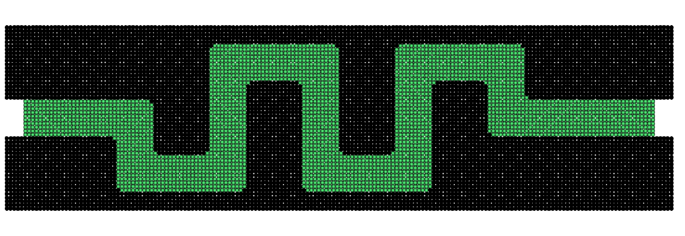
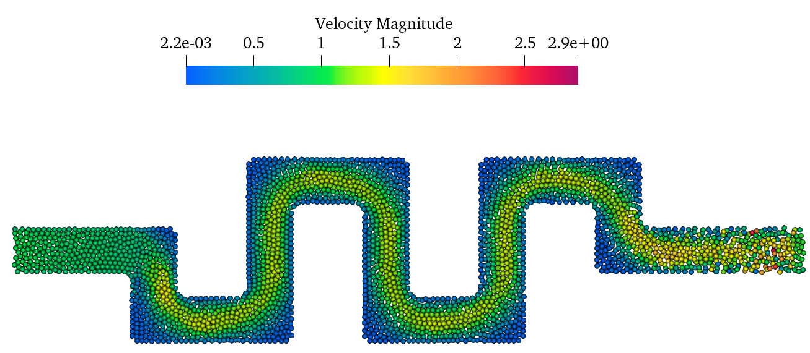

This is the first test case for Microfluidic Simulations.                             
In this case, the flow passes through a complex mirco-channel. 

==================================================================================
Example 16: 2D Channel flow
==================================================================================

As shown in the figure, the schematic sketch of the initial setup.

   Initial configuration

First, we provide the parameters for geometric modeling and numerical setup.

.. code-block:: cpp

	#include "sphinxsys.h"
	using namespace SPH;
	//------------------------------------------------------------------------------
	//global parameters for the case
	//------------------------------------------------------------------------------
	Real DL = 1.0; 					            /**< Channel unit length. */
	Real DH = 1.0; 						        /**< Channel unit height. */
	Real resolution_ref = 0.02;                 /**< Initial reference particle spacing. */
	Real DL_sponge = resolution_ref * 20;       /**< Sponge region to impose inflow condition. */
	Real BW = resolution_ref * 5; 	            /**< Extending width for BCs. */
	Real insert_circle_radius = 0.05;           /**< Radius of the cylinder. */

	Vec2d inlet_lower_point(-DL_sponge, 0.4*DH);
	Vec2d inlet_upper_point(-DL_sponge, 0.6*DH);
	Vec2d point_1(0.3*DL, 0.6*DH);
	Vec2d point_2(0.3*DL, 0.3*DH);
	Vec2d point_3(0.6*DL, 0.3*DH);
	Vec2d point_4(0.6*DL, 0.9*DH);
	Vec2d point_5(1.3*DL, 0.9*DH);
	Vec2d point_6(1.3*DL, 0.3*DH);
	Vec2d point_7(1.6*DL, 0.3*DH);
	Vec2d point_8(1.6*DL, 0.9*DH);
	Vec2d point_9(2.3*DL, 0.9*DH);
	Vec2d point_10(2.3*DL, 0.6*DH);
	Vec2d outlet_upper_point(3.0*DL, 0.6*DH);
	Vec2d outlet_lower_point(3.0*DL, 0.4*DH);
	Vec2d point_11(2.1*DL, 0.4*DH);
	Vec2d point_12(2.1*DL, 0.7*DH);
	Vec2d point_13(1.8*DL, 0.7*DH);
	Vec2d point_14(1.8*DL, 0.1*DH);
	Vec2d point_15(1.1*DL, 0.1*DH);
	Vec2d point_16(1.1*DL, 0.7*DH);
	Vec2d point_17(0.8*DL, 0.7*DH);
	Vec2d point_18(0.8*DL, 0.1*DH);
	Vec2d point_19(0.1*DL, 0.1*DH);
	Vec2d point_20(0.1*DL, 0.4*DH);
	Vec2d circle_assissant_1(-insert_circle_radius, -insert_circle_radius);
	Vec2d circle_assissant_2(-insert_circle_radius, insert_circle_radius);
	Vec2d circle_assissant_3(insert_circle_radius, insert_circle_radius);
	Vec2d circle_assissant_4(insert_circle_radius, -insert_circle_radius);

	/** Domain bounds of the system. */
	BoundingBox system_domain_bounds(Vec2d(-DL_sponge - BW, 0), Vec2d(3.0*DL + BW, DH));

:code:`DL` is the channel unit length,
:code:`DH` is the channel unit height,
:code:`DL_sponge` is the sponge region to impose inflow condition,
:code:`resolution_ref` gives the reference of initial particle spacing, 
:code:`BW` gives the boundary width,
:code:`system_domain_bounds` defines the domain of this case
and 28 points are used to build the channel flow shape.

Set the diffusion parameters.

.. code-block:: cpp

	Real diffusion_coff = 1.0e-3;
	Real bias_diffusion_coff = 0.0;
	Real alpha = Pi / 6.0;
	Vec2d bias_direction(cos(alpha), sin(alpha));

:code:`diffusion_coff` is the diffusion coefficient,
:code:`bias_diffusion_coff` is the bias diffusion coefficient along the fiber direction,
:code:`alpha` is the angle related to the diffusion direction,
and :code:`bias_direction` is diffusion direction.

Then we give the material properties.

.. code-block:: cpp

    //----------------------------------------------------------------------
	//	Material properties of the fluid.
	//----------------------------------------------------------------------
	Real rho0_f = 1.0;		            /**< Density. */
	Real U_f = 1.0;			            /**< freestream velocity. */
	Real c_f = 10.0 * U_f;	            /**< Speed of sound. */
	Real Re = 100.0;		            /**< Reynolds number. */
	Real mu_f = rho0_f * U_f * DH / Re;	/**< Dynamics viscosity. */

:code:`rho0_s` is the density of the fluid,
:code:`U_f` is velocity,
:code:`c_f` is speed of sound,
:code:`Re` is Reynolds number, 
and :code:`mu_f` is dynamics viscosity.

Here, we creat the channel shape  and  wall shape.

.. code-block:: cpp

	//----------------------------------------------------------------------
	// Geometric shapes used in the system.
	//----------------------------------------------------------------------
	// Create a water channel shape
	//----------------------------------------------------------------------
	std::vector<Vecd> CreatWaterChannelShape()
	{
		//geometry
		std::vector<Vecd> water_channel_shape;
		water_channel_shape.push_back(inlet_lower_point);
		water_channel_shape.push_back(inlet_upper_point);
		water_channel_shape.push_back(point_1);
		water_channel_shape.push_back(point_2);
		water_channel_shape.push_back(point_3);
		water_channel_shape.push_back(point_4);
		water_channel_shape.push_back(point_5);
		water_channel_shape.push_back(point_6);
		water_channel_shape.push_back(point_7);
		water_channel_shape.push_back(point_8);
		water_channel_shape.push_back(point_9);
		water_channel_shape.push_back(point_10);
		water_channel_shape.push_back(outlet_upper_point);
		water_channel_shape.push_back(outlet_lower_point);
		water_channel_shape.push_back(point_11);
		water_channel_shape.push_back(point_12);
		water_channel_shape.push_back(point_13);
		water_channel_shape.push_back(point_14);
		water_channel_shape.push_back(point_15);
		water_channel_shape.push_back(point_16);
		water_channel_shape.push_back(point_17);
		water_channel_shape.push_back(point_18);
		water_channel_shape.push_back(point_19);
		water_channel_shape.push_back(point_20);
		water_channel_shape.push_back(inlet_lower_point);

		return water_channel_shape;
	};

	//----------------------------------------------------------------------
	// Create a outerwall shape
	//----------------------------------------------------------------------
	std::vector<Vecd> CreatOuterWallShape()
	{
		//geometry
		std::vector<Vecd> outer_wall_shape;

		/** The first method to define the outerwall. You can have a try. */

		//outer_wall_shape.push_back(inlet_lower_point + Vec2d(-BW, -BW));
		//outer_wall_shape.push_back(inlet_upper_point + Vec2d(-BW, BW));
		//outer_wall_shape.push_back(point_1 + Vecd(BW, BW));
		//outer_wall_shape.push_back(point_2 + Vecd(BW, BW));
		//outer_wall_shape.push_back(point_3 + Vecd(-BW, BW));
		//outer_wall_shape.push_back(point_4 + Vecd(-BW, BW));
		//outer_wall_shape.push_back(point_5 + Vecd(BW, BW));
		//outer_wall_shape.push_back(point_6 + Vecd(BW, BW));
		//outer_wall_shape.push_back(point_7 + Vecd(-BW, BW));
		//outer_wall_shape.push_back(point_8 + Vecd(-BW, BW));
		//outer_wall_shape.push_back(point_9 + Vecd(BW, BW));
		//outer_wall_shape.push_back(point_10 + Vecd(BW, BW));
		//outer_wall_shape.push_back(outlet_upper_point + Vecd(BW, BW));
		//outer_wall_shape.push_back(outlet_lower_point + Vecd(BW, -BW));
		//outer_wall_shape.push_back(point_11 + Vecd(-BW, -BW));
		//outer_wall_shape.push_back(point_12 + Vecd(-BW, -BW));
		//outer_wall_shape.push_back(point_13 + Vecd(BW, -BW));
		//outer_wall_shape.push_back(point_14 + Vecd(BW, -BW));
		//outer_wall_shape.push_back(point_15 + Vecd(-BW, -BW));
		//outer_wall_shape.push_back(point_16 + Vecd(-BW, -BW));
		//outer_wall_shape.push_back(point_17 + Vecd(BW, -BW));
		//outer_wall_shape.push_back(point_18 + Vecd(BW, -BW));
		//outer_wall_shape.push_back(point_19 + Vecd(-BW, -BW));
		//outer_wall_shape.push_back(point_20 + Vecd(-BW, -BW));
		//outer_wall_shape.push_back(inlet_lower_point + Vecd(-BW, -BW));

		/** The second method to define the outerwall. Currently used. */

		outer_wall_shape.push_back(Vecd(-DL_sponge - BW, 0));
		outer_wall_shape.push_back(Vecd(-DL_sponge - BW, DH));
		outer_wall_shape.push_back(Vecd(3.0*DL + BW, DH));
		outer_wall_shape.push_back(Vecd(3.0*DL + BW, 0));
		outer_wall_shape.push_back(Vecd(-DL_sponge - BW, 0));

		return outer_wall_shape;
	};
	
	//----------------------------------------------------------------------
	// Create a innerwall shape
	//----------------------------------------------------------------------
	std::vector<Vecd> CreatInnerWallShape()
	{
		//geometry
		std::vector<Vecd> inner_wall_shape;
		inner_wall_shape.push_back(inlet_lower_point + Vecd(-2 * BW, 0));
		inner_wall_shape.push_back(inlet_upper_point + Vecd(-2 * BW, 0));
		inner_wall_shape.push_back(point_1);
		inner_wall_shape.push_back(point_2);
		inner_wall_shape.push_back(point_3);
		inner_wall_shape.push_back(point_4);
		inner_wall_shape.push_back(point_5);
		inner_wall_shape.push_back(point_6);
		inner_wall_shape.push_back(point_7);
		inner_wall_shape.push_back(point_8);
		inner_wall_shape.push_back(point_9);
		inner_wall_shape.push_back(point_10);
		inner_wall_shape.push_back(outlet_upper_point + Vecd(2 * BW, 0));
		inner_wall_shape.push_back(outlet_lower_point + Vecd(2 * BW, 0));
		inner_wall_shape.push_back(point_11);
		inner_wall_shape.push_back(point_12);
		inner_wall_shape.push_back(point_13);
		inner_wall_shape.push_back(point_14);
		inner_wall_shape.push_back(point_15);
		inner_wall_shape.push_back(point_16);
		inner_wall_shape.push_back(point_17);
		inner_wall_shape.push_back(point_18);
		inner_wall_shape.push_back(point_19);
		inner_wall_shape.push_back(point_20);
		inner_wall_shape.push_back(inlet_lower_point + Vecd(-2 * BW, 0));

		return inner_wall_shape;
	};

Then the fluid body and solid body are defined.

.. code-block:: cpp

	 /** Fluid body definition */
	class WaterChannel : public FluidBody
	{
	public:
		WaterChannel(SPHSystem& system, std::string body_name)
			: FluidBody(system, body_name)
		{

			/** Geomtry definition. */
			MultiPolygon multi_polygon;
			multi_polygon.addAPolygon(CreatWaterChannelShape(), ShapeBooleanOps::add);
			multi_polygon.addACircle(point_1, insert_circle_radius, 100, ShapeBooleanOps::sub);
			multi_polygon.addACircle(point_1 + circle_assissant_1, insert_circle_radius, 100, ShapeBooleanOps::add);
			multi_polygon.addACircle(point_2, insert_circle_radius, 100, ShapeBooleanOps::add);
			multi_polygon.addACircle(point_2 + circle_assissant_3, insert_circle_radius, 100, ShapeBooleanOps::sub);
			multi_polygon.addACircle(point_3, insert_circle_radius, 100, ShapeBooleanOps::add);
			multi_polygon.addACircle(point_3 + circle_assissant_2, insert_circle_radius, 100, ShapeBooleanOps::sub);
			multi_polygon.addACircle(point_4, insert_circle_radius, 100, ShapeBooleanOps::sub);
			multi_polygon.addACircle(point_4 + circle_assissant_4, insert_circle_radius, 100, ShapeBooleanOps::add);
			multi_polygon.addACircle(point_5, insert_circle_radius, 100, ShapeBooleanOps::sub);
			multi_polygon.addACircle(point_5 + circle_assissant_1, insert_circle_radius, 100, ShapeBooleanOps::add);
			multi_polygon.addACircle(point_6, insert_circle_radius, 100, ShapeBooleanOps::add);
			multi_polygon.addACircle(point_6 + circle_assissant_3, insert_circle_radius, 100, ShapeBooleanOps::sub);
			multi_polygon.addACircle(point_7, insert_circle_radius, 100, ShapeBooleanOps::add);
			multi_polygon.addACircle(point_7 + circle_assissant_2, insert_circle_radius, 100, ShapeBooleanOps::sub);
			multi_polygon.addACircle(point_8, insert_circle_radius, 100, ShapeBooleanOps::sub);
			multi_polygon.addACircle(point_8 + circle_assissant_4, insert_circle_radius, 100, ShapeBooleanOps::add);
			multi_polygon.addACircle(point_9, insert_circle_radius, 100, ShapeBooleanOps::sub);
			multi_polygon.addACircle(point_9 + circle_assissant_1, insert_circle_radius, 100, ShapeBooleanOps::add);
			multi_polygon.addACircle(point_10, insert_circle_radius, 100, ShapeBooleanOps::add);
			multi_polygon.addACircle(point_10 + circle_assissant_3, insert_circle_radius, 100, ShapeBooleanOps::sub);
			multi_polygon.addACircle(point_11, insert_circle_radius, 100, ShapeBooleanOps::sub);
			multi_polygon.addACircle(point_11 + circle_assissant_3, insert_circle_radius, 100, ShapeBooleanOps::add);
			multi_polygon.addACircle(point_12, insert_circle_radius, 100, ShapeBooleanOps::add);
			multi_polygon.addACircle(point_12 + circle_assissant_1, insert_circle_radius, 100, ShapeBooleanOps::sub);
			multi_polygon.addACircle(point_13, insert_circle_radius, 100, ShapeBooleanOps::add);
			multi_polygon.addACircle(point_13 + circle_assissant_4, insert_circle_radius, 100, ShapeBooleanOps::sub);
			multi_polygon.addACircle(point_14, insert_circle_radius, 100, ShapeBooleanOps::sub);
			multi_polygon.addACircle(point_14 + circle_assissant_2, insert_circle_radius, 100, ShapeBooleanOps::add);
			multi_polygon.addACircle(point_15, insert_circle_radius, 100, ShapeBooleanOps::sub);
			multi_polygon.addACircle(point_15 + circle_assissant_3, insert_circle_radius, 100, ShapeBooleanOps::add);
			multi_polygon.addACircle(point_16, insert_circle_radius, 100, ShapeBooleanOps::add);
			multi_polygon.addACircle(point_16 + circle_assissant_1, insert_circle_radius, 100, ShapeBooleanOps::sub);
			multi_polygon.addACircle(point_17, insert_circle_radius, 100, ShapeBooleanOps::add);
			multi_polygon.addACircle(point_17 + circle_assissant_4, insert_circle_radius, 100, ShapeBooleanOps::sub);
			multi_polygon.addACircle(point_18, insert_circle_radius, 100, ShapeBooleanOps::sub);
			multi_polygon.addACircle(point_18 + circle_assissant_2, insert_circle_radius, 100, ShapeBooleanOps::add);
			multi_polygon.addACircle(point_19, insert_circle_radius, 100, ShapeBooleanOps::sub);
			multi_polygon.addACircle(point_19 + circle_assissant_3, insert_circle_radius, 100, ShapeBooleanOps::add);
			multi_polygon.addACircle(point_20, insert_circle_radius, 100, ShapeBooleanOps::add);
			multi_polygon.addACircle(point_20 + circle_assissant_1, insert_circle_radius, 100, ShapeBooleanOps::sub);
			body_shape_.add<MultiPolygonShape>(multi_polygon);
		}
	};

	/** Solid Wall definition */
	class SolidWall : public SolidBody
	{
	public:
		SolidWall(SPHSystem &system, std::string body_name)
			: SolidBody(system, body_name)
		{
			/** Geomtry definition. */
			MultiPolygon multi_polygon;
			multi_polygon.addAPolygon(CreatOuterWallShape(), ShapeBooleanOps::add);
			multi_polygon.addAPolygon(CreatInnerWallShape(), ShapeBooleanOps::sub);
			multi_polygon.addACircle(point_1, insert_circle_radius, 100, ShapeBooleanOps::add);
			multi_polygon.addACircle(point_1 + circle_assissant_1, insert_circle_radius, 100, ShapeBooleanOps::sub);
			multi_polygon.addACircle(point_2, insert_circle_radius, 100, ShapeBooleanOps::sub);
			multi_polygon.addACircle(point_2 + circle_assissant_3, insert_circle_radius, 100, ShapeBooleanOps::add);
			multi_polygon.addACircle(point_3, insert_circle_radius, 100, ShapeBooleanOps::sub);
			multi_polygon.addACircle(point_3 + circle_assissant_2, insert_circle_radius, 100, ShapeBooleanOps::add);
			multi_polygon.addACircle(point_4, insert_circle_radius, 100, ShapeBooleanOps::add);
			multi_polygon.addACircle(point_4 + circle_assissant_4, insert_circle_radius, 100, ShapeBooleanOps::sub);
			multi_polygon.addACircle(point_5, insert_circle_radius, 100, ShapeBooleanOps::add);
			multi_polygon.addACircle(point_5 + circle_assissant_1, insert_circle_radius, 100, ShapeBooleanOps::sub);
			multi_polygon.addACircle(point_6, insert_circle_radius, 100, ShapeBooleanOps::sub);
			multi_polygon.addACircle(point_6 + circle_assissant_3, insert_circle_radius, 100, ShapeBooleanOps::add);
			multi_polygon.addACircle(point_7, insert_circle_radius, 100, ShapeBooleanOps::sub);
			multi_polygon.addACircle(point_7 + circle_assissant_2, insert_circle_radius, 100, ShapeBooleanOps::add);
			multi_polygon.addACircle(point_8, insert_circle_radius, 100, ShapeBooleanOps::add);
			multi_polygon.addACircle(point_8 + circle_assissant_4, insert_circle_radius, 100, ShapeBooleanOps::sub);
			multi_polygon.addACircle(point_9, insert_circle_radius, 100, ShapeBooleanOps::add);
			multi_polygon.addACircle(point_9 + circle_assissant_1, insert_circle_radius, 100, ShapeBooleanOps::sub);
			multi_polygon.addACircle(point_10, insert_circle_radius, 100, ShapeBooleanOps::sub);
			multi_polygon.addACircle(point_10 + circle_assissant_3, insert_circle_radius, 100, ShapeBooleanOps::add);
			multi_polygon.addACircle(point_11, insert_circle_radius, 100, ShapeBooleanOps::add);
			multi_polygon.addACircle(point_11 + circle_assissant_3, insert_circle_radius, 100, ShapeBooleanOps::sub);
			multi_polygon.addACircle(point_12, insert_circle_radius, 100, ShapeBooleanOps::sub);
			multi_polygon.addACircle(point_12 + circle_assissant_1, insert_circle_radius, 100, ShapeBooleanOps::add);
			multi_polygon.addACircle(point_13, insert_circle_radius, 100, ShapeBooleanOps::sub);
			multi_polygon.addACircle(point_13 + circle_assissant_4, insert_circle_radius, 100, ShapeBooleanOps::add);
			multi_polygon.addACircle(point_14, insert_circle_radius, 100, ShapeBooleanOps::add);
			multi_polygon.addACircle(point_14 + circle_assissant_2, insert_circle_radius, 100, ShapeBooleanOps::sub);
			multi_polygon.addACircle(point_15, insert_circle_radius, 100, ShapeBooleanOps::add);
			multi_polygon.addACircle(point_15 + circle_assissant_3, insert_circle_radius, 100, ShapeBooleanOps::sub);
			multi_polygon.addACircle(point_16, insert_circle_radius, 100, ShapeBooleanOps::sub);
			multi_polygon.addACircle(point_16 + circle_assissant_1, insert_circle_radius, 100, ShapeBooleanOps::add);
			multi_polygon.addACircle(point_17, insert_circle_radius, 100, ShapeBooleanOps::sub);
			multi_polygon.addACircle(point_17 + circle_assissant_4, insert_circle_radius, 100, ShapeBooleanOps::add);
			multi_polygon.addACircle(point_18, insert_circle_radius, 100, ShapeBooleanOps::add);
			multi_polygon.addACircle(point_18 + circle_assissant_2, insert_circle_radius, 100, ShapeBooleanOps::sub);
			multi_polygon.addACircle(point_19, insert_circle_radius, 100, ShapeBooleanOps::add);
			multi_polygon.addACircle(point_19 + circle_assissant_3, insert_circle_radius, 100, ShapeBooleanOps::sub);
			multi_polygon.addACircle(point_20, insert_circle_radius, 100, ShapeBooleanOps::sub);
			multi_polygon.addACircle(point_20 + circle_assissant_1, insert_circle_radius, 100, ShapeBooleanOps::add);
			body_shape_.add<MultiPolygonShape>(multi_polygon);
		}
	};

After defining the fluid body and solid body, the buffer body is defined to impose the periodic condition.

.. code-block:: cpp

	/** create a inflow buffer shape. */
	MultiPolygon createInflowBufferShape()
	{	
		std::vector<Vecd> inflow_buffer_shape;
		inflow_buffer_shape.push_back(inlet_lower_point);
		inflow_buffer_shape.push_back(inlet_upper_point);
		inflow_buffer_shape.push_back(Vecd(0, 0.6*DH));
		inflow_buffer_shape.push_back(Vecd(0, 0.4*DH));
		inflow_buffer_shape.push_back(inlet_lower_point);

		MultiPolygon multi_polygon;
		multi_polygon.addAPolygon(inflow_buffer_shape, ShapeBooleanOps::add);
		return multi_polygon;
	}

Setup material properties and heat conduction properties for fluid body and solid body. 
Here, we must insert a specie :code:`Temperature` resperenting heat being transferred between these two bodies.
:code:`DirectionalDiffusion` means diffussion is biased along a specific direction.

.. code-block:: cpp

	class WaterMaterial
		:public DiffusionReaction<FluidParticles, WeaklyCompressibleFluid>
	{
	public:
		WaterMaterial()
			: DiffusionReaction<FluidParticles, WeaklyCompressibleFluid>({ "Temperature" }, rho0_f, c_f, mu_f)
		{
			initializeAnDiffusion<DirectionalDiffusion>("Temperature", "Temperature", diffusion_coff, bias_diffusion_coff, bias_direction);
		};
	};

	//----------------------------------------------------------------------------------------

	class SolidMaterial
		:public DiffusionReaction<SolidParticles, Solid>
	{
	public:
		SolidMaterial()
			:DiffusionReaction<SolidParticles, Solid>({ "Temperature" })
		{
			initializeAnDiffusion<DirectionalDiffusion>("Temperature", "Temperature", diffusion_coff, bias_diffusion_coff, bias_direction);
		};
	};

Then impose the intial condition for fluid body and solid body. For solid body, the temperature of the bottom wall is high, 
and the temperature at the top wall is low. While the fluid body have the same temperature. 

.. code-block:: cpp

	class ThermosolidBodyInitialCondition
	: public DiffusionReactionInitialCondition<SolidBody, SolidParticles, Solid>
	{
	protected:
		size_t temperature_;

		void Update(size_t index_i, Real dt) override
		{
			/** set the lower wall initial temperature */
			if (pos_n_[index_i][1] <= 0.5*DH && pos_n_[index_i][0] <= 0.2*DL)
			{
				species_n_[temperature_][index_i] = temperature_lower_wall;
			}
			if (pos_n_[index_i][1] <= 0.2*DH)
			{
				species_n_[temperature_][index_i] = temperature_lower_wall;
			}
			if (pos_n_[index_i][1] <= 0.8*DH && pos_n_[index_i][0] >= 0.7*DL && pos_n_[index_i][0] <= 1.2*DL)
			{
				species_n_[temperature_][index_i] = temperature_lower_wall;
			}
			if (pos_n_[index_i][1] <= 0.8*DH && pos_n_[index_i][0] >= 1.7*DL && pos_n_[index_i][0] <= 2.2*DL)
			{
				species_n_[temperature_][index_i] = temperature_lower_wall;
			}
			if (pos_n_[index_i][1] <= 0.5*DH && pos_n_[index_i][0] >= 2.2*DL)
			{
				species_n_[temperature_][index_i] = temperature_lower_wall;
			}

			/** set the upper wall initial temperature */
			if (pos_n_[index_i][1] >= 0.5*DH && pos_n_[index_i][0] <= 0.3*DL)
			{
				species_n_[temperature_][index_i] = temperature_upper_wall;
			}
			if (pos_n_[index_i][1] >= 0.2*DH && pos_n_[index_i][0] >= 0.2*DL && pos_n_[index_i][0] <= 0.7*DL)
			{
				species_n_[temperature_][index_i] = temperature_upper_wall;
			}
			if (pos_n_[index_i][1] >= 0.8*DH)
			{
				species_n_[temperature_][index_i] = temperature_upper_wall;
			}
			if (pos_n_[index_i][1] >= 0.2*DH && pos_n_[index_i][0] >= 1.2*DL && pos_n_[index_i][0] <= 1.7*DL)
			{
				species_n_[temperature_][index_i] = temperature_upper_wall;
			}
			if (pos_n_[index_i][1] >= 0.5*DH && pos_n_[index_i][0] >= 2.2*DL)
			{
				species_n_[temperature_][index_i] = temperature_upper_wall;
			}
		}
	public:
		ThermosolidBodyInitialCondition(SolidBody &diffusion_solid_body)
			: DiffusionReactionInitialCondition<SolidBody, SolidParticles, Solid>(diffusion_solid_body) {
			temperature_ = material_->SpeciesIndexMap()["Phi"];
		};
	};

    //----------------------------------------------------------------------------------------------------

	class ThermofluidBodyInitialCondition
		: public  DiffusionReactionInitialCondition< FluidBody, FluidParticles, WeaklyCompressibleFluid>
	{
	protected:
		size_t temperature_;

		void Update(size_t index_i, Real dt) override
		{
			if (-DL_sponge <= pos_n_[index_i][1] && pos_n_[index_i][1] <= 3 * DH)
			{
				species_n_[temperature_][index_i] = temperature_fluid_initial;
			}
		};
	public:
		ThermofluidBodyInitialCondition(FluidBody &diffusion_fluid_body)
			: DiffusionReactionInitialCondition<FluidBody, FluidParticles, WeaklyCompressibleFluid >(diffusion_fluid_body) {
			temperature_ = material_->SpeciesIndexMap()["Temperature"];
		};
	};

Here is the definition of heat transfer relaxation method. In this case, there are two bodies, so we use the :code:`ComplexBodyRelation`. 
If there is only one body, :code:`InnerBodyRelation` works.

.. code-block:: cpp

	class ThermalRelaxationComplex
	: public RelaxationOfAllDiffusionSpeciesRK2<FluidBody, FluidParticles, WeaklyCompressibleFluid,
	RelaxationOfAllDiffussionSpeciesComplex<FluidBody, FluidParticles, WeaklyCompressibleFluid, SolidBody, SolidParticles, Solid>,
	ComplexBodyRelation>
	{
	public:
		ThermalRelaxationComplex(ComplexBodyRelation &body_complex_relation)
			: RelaxationOfAllDiffusionSpeciesRK2(body_complex_relation) {};
		virtual ~ThermalRelaxationComplex() {};
	};

Finally, the parabolic velocity of inlet is conducted.

.. code-block:: cpp

	class ParabolicInflow : public fluid_dynamics::FlowRelaxationBuffer
	{
		Real u_ave_, u_ref_, t_ref;
	public:
		ParabolicInflow(FluidBody &fluid_body,
			BodyPartByCell &constrained_region)
			: fluid_dynamics::FlowRelaxationBuffer(fluid_body, constrained_region)
		{
			u_ave_ = 0.0;
			u_ref_ = U_f;
			t_ref = 2.0;
		}
		Vecd getTargetVelocity(Vecd& position, Vecd& velocity)
		{
			return Vecd(u_ave_, 0.0);
		}
		void setupDynamics(Real dt = 0.0) override
		{
			Real run_time = GlobalStaticVariables::physical_time_;
			u_ave_ = run_time < t_ref ? 0.5 * u_ref_ * (1.0 - cos(Pi * run_time / t_ref)) : u_ref_;
		}
	};

After completing the initial geometric modeling and numerical setup, we come to the :code:`int main()` function. 
In the first part of :code:`main` function, an object of :code:`SPHSystem` is created.

.. code-block:: cpp

	/** Build up -- a SPHSystem -- */
	SPHSystem system(system_domain_bounds, resolution_ref);

Create body, materials and particles for water channel and solid wall

.. code-block:: cpp

	WaterChannel water_channel(system, "WaterChannel");
	DiffusionReactionParticles<FluidParticles, WeaklyCompressibleFluid>
		fluid_particles(water_channel, makeShared<WaterMaterial>());
    //-------------------------------------------------------------------
	SolidWall solid_wall(system, "SolidWall");
	DiffusionReactionParticles<SolidParticles, Solid>
		solid_particles(solid_wall, makeShared<SolidMaterial>());

Define outputs functions

.. code-block:: cpp

	In_Output	in_output(system);
	BodyStatesRecordingToVtp 				write_real_body_states(in_output, system.real_bodies_);

Define the contact map.

.. code-block:: cpp

	/** body topology */
	BodyRelationInner fluid_body_inner(water_channel);
	BodyRelationInner solid_body_inner(solid_wall);
	ComplexBodyRelation water_channel_complex(water_channel, {&solid_wall });

Using class :code:`BodyRelationInner` means :code:`beam_body_inner` defines the inner data connections.
And using class :code:`ComplexBodyRelation` means the relation combined an inner and a contactbody relation.

After creating the bodies, the method related with heat transfer will be defined.
First, we setup the initial condition.

.. code-block:: cpp

    ThermosolidBodyInitialCondition thermosolid_condition(solid_wall);
	ThermofluidBodyInitialCondition thermofluid_initial_condition(water_channel);

Then the main algorithm for fluid, solid and thermal transfer is defined, including the general methods: time stepping based on fluid dynamics and diffusion 
, fluid dynamics and the methods for thermal relaxtion as well as boundary conditions.

.. code-block:: cpp

	/** Corrected strong configuration for diffusion solid body. */
	solid_dynamics::CorrectConfiguration 	correct_configuration(solid_body_inner);

	/** Initialize particle acceleration. */
	TimeStepInitialization 	initialize_a_fluid_step(water_channel);

	/** Periodic BCs in x direction. */
	PeriodicConditionInAxisDirectionUsingCellLinkedList 	periodic_condition_x(water_channel, 0);

	/** Evaluation of density by summation approach. */
	fluid_dynamics::DensitySummationComplex 	update_density_by_summation(water_channel_complex);
	/** Time step size without considering sound wave speed. */
	fluid_dynamics::AdvectionTimeStepSize 	get_fluid_advection_time_step_size(water_channel, U_f);
	/** Time step size with considering sound wave speed. */
	fluid_dynamics::AcousticTimeStepSize		get_fluid_time_step_size(water_channel);
	/** Time step size calculation. */
	GetDiffusionTimeStepSize<FluidBody, FluidParticles, WeaklyCompressibleFluid> get_thermal_time_step(water_channel);
	/** Diffusion process between two diffusion bodies. */
	ThermalRelaxationComplex 	thermal_relaxation_complex(water_channel_complex);
	/** Pressure relaxation using verlet time stepping. */
	/** Here, we do not use Riemann solver for pressure as the flow is viscous. */
	fluid_dynamics::PressureRelaxationWithWall pressure_relaxation(water_channel_complex);
	fluid_dynamics::DensityRelaxationRiemannWithWall density_relaxation(water_channel_complex);
	/** Computing viscous acceleration with wall model. */
	fluid_dynamics::ViscousAccelerationWithWall  viscous_acceleration(water_channel_complex);
	/** Impose transport velocity. */
	fluid_dynamics::TransportVelocityCorrectionComplex 	transport_velocity_correction(water_channel_complex);
	/** Computing vorticity in the flow. */
	fluid_dynamics::VorticityInner 	compute_vorticity(water_channel_complex.inner_relation_);
	/** freestream boundary condition. */
	MultiPolygonShape buffer_shape(createInflowBufferShape());
	BodyRegionByCell  buffer(water_channel, "InflowBuffer", buffer_shape);
	ParabolicInflow   buffer_inflow_condition(water_channel, buffer);

Initialization includes cell linked lists for all bodies, configuration for all bodies, surface normal direction
and initial thermo condition.

.. code-block:: cpp

	/** initialize cell linked lists for all bodies. */
	system.initializeSystemCellLinkedLists();
	/** periodic condition applied after the mesh cell linked list build up but before the configuration build up. */
	periodic_condition_x.update_cell_linked_list_.parallel_exec();
	/** initialize configurations for all bodies. */
	system.initializeSystemConfigurations();
	/** initialize surface normal direction. */
	solid_particles.initializeNormalDirectionFromBodyShape();
	correct_configuration.parallel_exec();
	thermosolid_condition.parallel_exec();
	thermofluid_initial_condition.parallel_exec();

Finally, the time-stepping loop.
:code:`update_density_by_summation.parallel_exec()` : to compute density by summation considering  contribution from contact bodies.
:code:`viscous_acceleration.parallel_exec()` : to compute viscous acceleration.
:code:`transport_velocity_correction.parallel_exec(Dt)` : to eliminate the tensile instability.
:code:`pressure_relaxation.parallel_exec(dt)` : to compute the acceleration due to the pressure gradient.
:code:`density_relaxation.parallel_exec(dt)` : to compute the density.
:code:`thermal_relaxation_complex.parallel_exec(dt)` : to compute the heat diffusion process.
:code:`periodic_condition_x.bounding_.parallel_exec()` : to update the inflow condition.
:code:`water_channel.updateCellLinkedList()` : to update the cell link list of water channel.
:code:`periodic_condition_x.update_cell_linked_list_.parallel_exec()` : to update the cell link list of inlet.
:code:`water_channel_complex.updateConfiguration()` : to update configuration of channel flow.
:code:`compute_vorticity.parallel_exec()` : to compute the vorticity of the flow.

.. code-block:: cpp

	size_t number_of_iterations = system.restart_step_;
	int screen_output_interval = 100;
	int restart_output_interval = screen_output_interval * 10;
	Real End_Time = 20.0;			                         /**< End time. */
	Real D_Time = 0.01;	                                     /**< Time stamps for output. */
	Real Dt = 0.0;					                         /**< Default advection time step sizes for fluid. */
	Real dt = 0.0;                                           /**< Default acoustic time step sizes for fluid. */
	Real dt_thermal = get_thermal_time_step.parallel_exec(); /**< The time step for thermal duffusion. */
	size_t inner_ite_dt = 0;

	/** Statistics for computing time. */
	tick_count t1 = tick_count::now();
	tick_count::interval_t interval;

	/** Main loop starts here. */
	while (GlobalStaticVariables::physical_time_ < End_Time)
	{
		Real integration_time = 0.0;
		/** Integrate time (loop) until the next output time. */
		while (integration_time < D_Time) {
			initialize_a_fluid_step.parallel_exec();
			Dt = get_fluid_advection_time_step_size.parallel_exec();
			update_density_by_summation.parallel_exec();
			viscous_acceleration.parallel_exec();
			transport_velocity_correction.parallel_exec(Dt);

			inner_ite_dt = 0;
			Real relaxation_time = 0.0;
			while (relaxation_time < Dt) {
				dt = SMIN(SMIN(dt_thermal, get_fluid_time_step_size.parallel_exec()), Dt);
				pressure_relaxation.parallel_exec(dt);
				density_relaxation.parallel_exec(dt);
				thermal_relaxation_complex.parallel_exec(dt);

				relaxation_time += dt;
				integration_time += dt;
				GlobalStaticVariables::physical_time_ += dt;
				buffer_inflow_condition.exec();
				inner_ite_dt++;
			}

			if (number_of_iterations % screen_output_interval == 0)
			{
				std::cout << std::fixed << std::setprecision(9) << "N=" << number_of_iterations << "	Time = "
					<< GlobalStaticVariables::physical_time_
					<< "	Dt = " << Dt << "	Dt / dt = " << inner_ite_dt << "\n";
			}
			number_of_iterations++;

			/** Water block configuration and periodic condition. */
			periodic_condition_x.bounding_.parallel_exec();
			water_channel.updateCellLinkedList();
			periodic_condition_x.update_cell_linked_list_.parallel_exec();
			water_channel_complex.updateConfiguration();
		}
		tick_count t2 = tick_count::now();
		/** write run-time observation into file */
		compute_vorticity.parallel_exec();
		write_real_body_states.writeToFile(GlobalStaticVariables::physical_time_);
		tick_count t3 = tick_count::now();
		interval += t3 - t2;
	}

During the looping, outputs are scheduled.
On screen output will be the number of time steps, 
the current physical time and acoustic time-step size.
After the simulation is terminated, the statistics of computation time are outputed to the screen.
Note that the total computation time has excluded the time for writing files.

After the simulation process, you can use the Paraview to read the result files.
The following figure shows the velocity field.

   The velocity field of channel flow.

