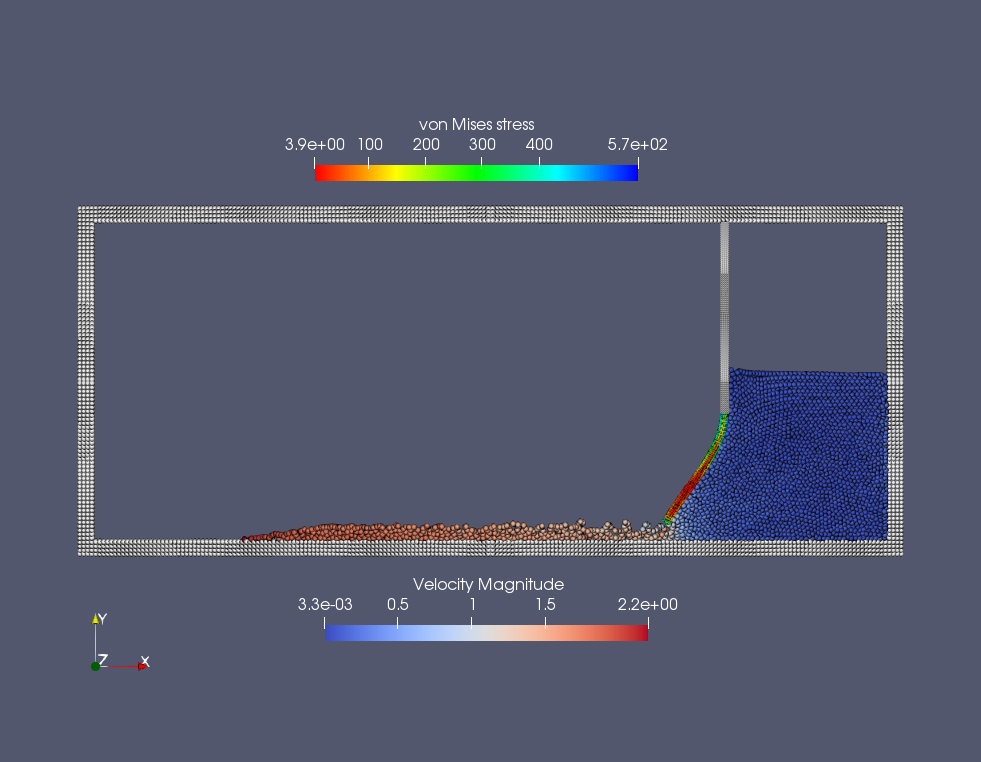
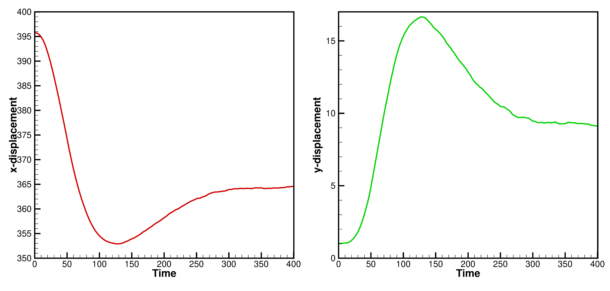

In the previous chapter we simulated a simple system with only a free-surface fluid and a static rigid wall. 
Now let’s make a jump into complexity, and simulate an typical FSI problem, in which the fluid interacts with several static walls and an elastic body. 

================================
Example 2: Elastic water gate
================================

As shown in the figure, the water gate is composed of two parts:
a constrained gate base and a deformable elastic lower section.

   An snapshot of the particle distribution in the problem of dam break with an elastic gate

There are two ways to achieve the constrain. 
One is modeling the base as an elastic body separated from the deformable part 
but constrained the particle motion.
The other way is modeling the entire gate as an elastic body but constrain only the upper base part. 
Here, we choose the first approach.
We give the geometry and material parameters for modeling the elastic gate.

.. code-block:: cpp

		/**
	* @brief 	Define the corner point of gate base geomerty.
	*/
	Vec2d BaseP_lb(DL - Dam_L - Rubber_width, Base_bottom_position); 	/**< Left bottom. */
	Vec2d BaseP_lt(DL - Dam_L - Rubber_width, DH); 						/**< Left top. */
	Vec2d BaseP_rt(DL - Dam_L, DH); 									/**< Right top. */
	Vec2d BaseP_rb(DL - Dam_L, Base_bottom_position); 					/**< Right bottom. */
	/**
	* @brief 	Define the corner point of gate geomerty.
	*/
	Vec2d GateP_lb(DL - Dam_L - Rubber_width, 0.0); 					/**< Left bottom. */
	Vec2d GateP_lt(DL - Dam_L - Rubber_width, Base_bottom_position); 	/**< Left top. */
	Vec2d GateP_rt(DL - Dam_L, Base_bottom_position); 					/**< Right top. */
	Vec2d GateP_rb(DL - Dam_L, 0.0); 									/**< Right bottom. */
	/**
	* @brief Material properties of the elastic gate.
	*/
	Real rho0_s = 1.1; 						/**< Reference density of gate. */
	Real poisson = 0.47; 					/**< Poisson ratio. */
	Real Ae = 7.8e3; 						/**< Normalized Youngs Modulus. */
	Real Youngs_modulus = Ae * rho0_f * U_f * U_f;

and define gate bodies and their initial with following code piece.

.. code-block:: cpp

	/**
	* @brief  Gate base body definition.
	*/
	class GateBase : public ElasticBody
	{
	public:
		GateBase(SPHSystem &system, string body_name, ElasticSolid* material,
			ElasticBodyParticles &elastic_particles,
			int refinement_level, ParticlesGeneratorOps op)
			: ElasticBody(system, body_name, material, elastic_particles,
				refinement_level, op)
		{
			/** Geometry definition. */
			std::vector<Point> gate_base_shape;
			gate_base_shape.push_back(BaseP_lb);
			gate_base_shape.push_back(BaseP_lt);
			gate_base_shape.push_back(BaseP_rt);
			gate_base_shape.push_back(BaseP_rb);
			gate_base_shape.push_back(BaseP_lb);
			body_region_.add_geometry(new Geometry(gate_base_shape), RegionBooleanOps::add);
			/** Finish the region modeling. */
			body_region_.done_modeling();
		}
		/**
		* @brief 	Initialize every gate base particle data.
		*/
		void InitialCondition()
		{
			SetAllParticleAtRest();
		}
	};
	/**
	* @brief  Define the elastic gate body.
	*/
	class Gate : public ElasticBody
	{
	public:
		Gate(SPHSystem &system, string body_name, ElasticSolid* material,
			ElasticBodyParticles &elastic_particles,
			int refinement_level, ParticlesGeneratorOps op)
			: ElasticBody(system, body_name, material, elastic_particles,
				refinement_level, op)
		{
			/** Geomerty definition. */
			std::vector<Point> gate_shape;
			gate_shape.push_back(GateP_lb);
			gate_shape.push_back(GateP_lt);
			gate_shape.push_back(GateP_rt);
			gate_shape.push_back(GateP_rb);
			gate_shape.push_back(GateP_lb);
			body_region_.add_geometry(new Geometry(gate_shape), RegionBooleanOps::add);
			/** Finish the region modeling. */
			body_region_.done_modeling();
		}
		/**
		* @brief 	Initialize every elastic gate particle data.
		*/
		void InitialCondition()
		{
			SetAllParticleAtRest();
		}
	};

Initially, all particles have been set to at rest.

In the main function, we create the :code:`SPHBody` s of :code:`gate_base` and :code:`gate` by following piece of code.  

.. code-block:: cpp

		/**
	* @brief 	Material property, particle and body creation of gate base.
	*/
	ElasticSolid 			solid_material("ElasticSolid", rho0_s, Youngs_modulus, poisson);
	ElasticBodyParticles 	gate_base_particles("GateBase");
	GateBase *gate_base = new GateBase(system, "GateBase", &solid_material,
	gate_base_particles, 1, ParticlesGeneratorOps::lattice);
	/**
	* @brief 	Material property, particle and body creation of elastic gate.
	*/
	ElasticBodyParticles 	gate_particles("Gate");
	Gate *gate = new Gate(system, "Gate", &solid_material,
	gate_particles, 1, ParticlesGeneratorOps::lattice);

Note that the parts of the gate share the same material properties.

Then, the topological relation of all bodies is defined by

.. code-block:: cpp

		/**
	* @brief 	Body contact map.
	* @details The contact map gives the data conntections between the bodies.
	* 			Basically the the rang of bidies to build neighbor particle lists.
	*/
	SPHBodyTopology body_topology = { { water_block, { wall_boundary, gate_base, gate } },
		{ wall_boundary, { } },{ gate_base, { gate } },
		{ gate, { gate_base, water_block} }, { gate_observer,{ gate } } };

Here, the :code:`water_block` interacts with :code:`wall_boundary`, :code:`gate_base` and :code:`gate`, 
the :code:`gate_base` with :code:`gate`, the :code:`gate` with :code:`gate_base` and :code:`water_block` and the :code:`gate_observer` only with :code:`gate`. 

After creating the bodies, the method related with solid dynamics and FSI will be defined.
First, the method will be used only once.

.. code-block:: cpp

		/** Initialize normal direction of the wall boundary. */
	solid_dynamics::NormalDirectionSummation 	get_wall_normal(wall_boundary, {});
	/** Initialize normal direction of the gate base. */
	solid_dynamics::NormalDirectionSummation 	get_gate_base_normal(gate_base, { gate });
	/** Initialize normal direction of the elastic gate. */
	solid_dynamics::NormalDirectionSummation 	get_gate_normal(gate, { gate_base });
	/** Corrected strong configuration. */
	solid_dynamics::CorrectConfiguration 		gate_base_corrected_configuration_in_strong_form(gate_base, { gate });
	solid_dynamics::CorrectConfiguration 		gate_corrected_configuration_in_strong_form(gate, { gate_base });

These are the methods for computing thr normal direction, 
and the reproducing kernel for correcting the SPH approximation of the deformation tensor,
as discussed in SPHinXsys's theory chapter.

Then the methods which will be used multiple times for solid dynamics are defined.

.. code-block:: cpp

	/**
	* @brief Algorithms of Elastic dynamics.
	*/
	/** Compute time step size of elastic solid. */
	solid_dynamics::ElasticSolidTimeStepSize 	gate_computing_time_step_size(gate);
	/** Stress relaxation stepping for the elastic gate. */
	solid_dynamics::StressRelaxation 			gate_stress_relaxation(gate, { gate_base });
	/** Stress update for contrained wall body(gate base). */
	solid_dynamics::StressInConstrinedElasticBodyFirstHalf 	gate_base_stress_update_first_half(gate_base, { gate });
	solid_dynamics::StressInConstrinedElasticBodySecondHalf gate_base_stress_update_second_half(gate_base, { gate });
	/** Update the norm of elastic gate. */
	solid_dynamics::UpdateElasticNormalDirection 	gate_update_normal(gate);
	/** Compute the average velocity of gate. */
	solid_dynamics::InitializeDisplacement 			gate_initialize_displacement(gate);
	solid_dynamics::UpdateAverageVelocity 			gate_average_velocity(gate);

We still need define the method for FSI, which computes the pressure force acting on solid particles.

.. code-block:: cpp

	/**
	* @brief Algorithms of FSI.
	*/
	/** Compute the force exerted on elastic gate due to fluid pressure. */
	solid_dynamics::FluidPressureForceOnSolid 	fluid_pressure_force_on_gate(gate, { water_block }, &fluid, &gravity);

The main loops are defined in the following piece of code.

.. code-block:: cpp

	/**
	* @brief Main loop starts here.
	*/
	while (GlobalStaticVariables::physical_time_ < End_Time)
	{
		Real integeral_time = 0.0;
		/** Integrate time (loop) until the next output time. */
		while (integeral_time < D_Time)
		{
			Dt = get_fluid_adevction_time_step_size.parallel_exec();
			update_fluid_desnity.parallel_exec();
			/** Acceleration due to viscous force and gravity. */
			initialize_fluid_acceleration.parallel_exec();
			add_fluid_gravity.parallel_exec();
			/** Update normal direction on elastic body. */
			gate_update_normal.parallel_exec();
			Real relaxation_time = 0.0;
			while (relaxation_time < Dt)
			{
				if (ite % 100 == 0) {
					cout << "N=" << ite << " Time: "
					<< GlobalStaticVariables::physical_time_ << "	dt: "
					<< dt << "\n";
				}
				/** Fluid relaxation and force computaton. */
				pressure_relaxation.parallel_exec(dt);
				fluid_pressure_force_on_gate.parallel_exec();
				/** Solid dynamics time stepping. */
				Real dt_s_sum = 0.0;
				gate_initialize_displacement.parallel_exec();
				while (dt_s_sum < dt)
				{
					Real dt_s = gate_computing_time_step_size.parallel_exec();
					if (dt - dt_s_sum < dt_s) dt_s = dt - dt_s_sum;
					if (ite % 100 == 0) {
						cout << "N=" << ite << " Time: "
						<< GlobalStaticVariables::physical_time_ << "	dt_s: "
						<< dt_s << "\n";
					}
					gate_base_stress_update_first_half.parallel_exec(dt_s);
					gate_stress_relaxation.parallel_exec(dt_s);
					gate_base_stress_update_second_half.parallel_exec(dt_s);
					dt_s_sum += dt_s;
				}
				gate_average_velocity.parallel_exec(dt);
				
				ite++;
				dt = get_fluid_time_step_size.parallel_exec();
				relaxation_time += dt;
				integeral_time += dt;
				GlobalStaticVariables::physical_time_ += dt;
			}
			/** Update cell linked list and configuration. */
			update_water_block_cell_linked_list.parallel_exec();
			update_water_block_configuration.parallel_exec();
			update_gate_cell_linked_list.parallel_exec();
			update_gate_interaction_configuration.parallel_exec();
			/** Output the observed data. */
			write_beam_tip_displacement.WriteToFile(GlobalStaticVariables::physical_time_);
		}
		tick_count t2 = tick_count::now();
		write_real_body_states_to_vtu.WriteToFile(GlobalStaticVariables::physical_time_  * 0.001);
		tick_count t3 = tick_count::now();
		interval += t3 - t2;
	}

Note that, since data exchanging frequency for FSI is defined 
by the acoustic time step of fluid computation, 
we need computed the time averaged velocity of elastic particles during this period.
Beside the particle position, pressure and stress distribution, 
we output the displacement of the gate tip,
as shown in the figure below.

   Temporal displacement of the tip point on the elastic gate

We should mention that we can add new features 
to the methods related with the observer for more quantitative information the simulation.

