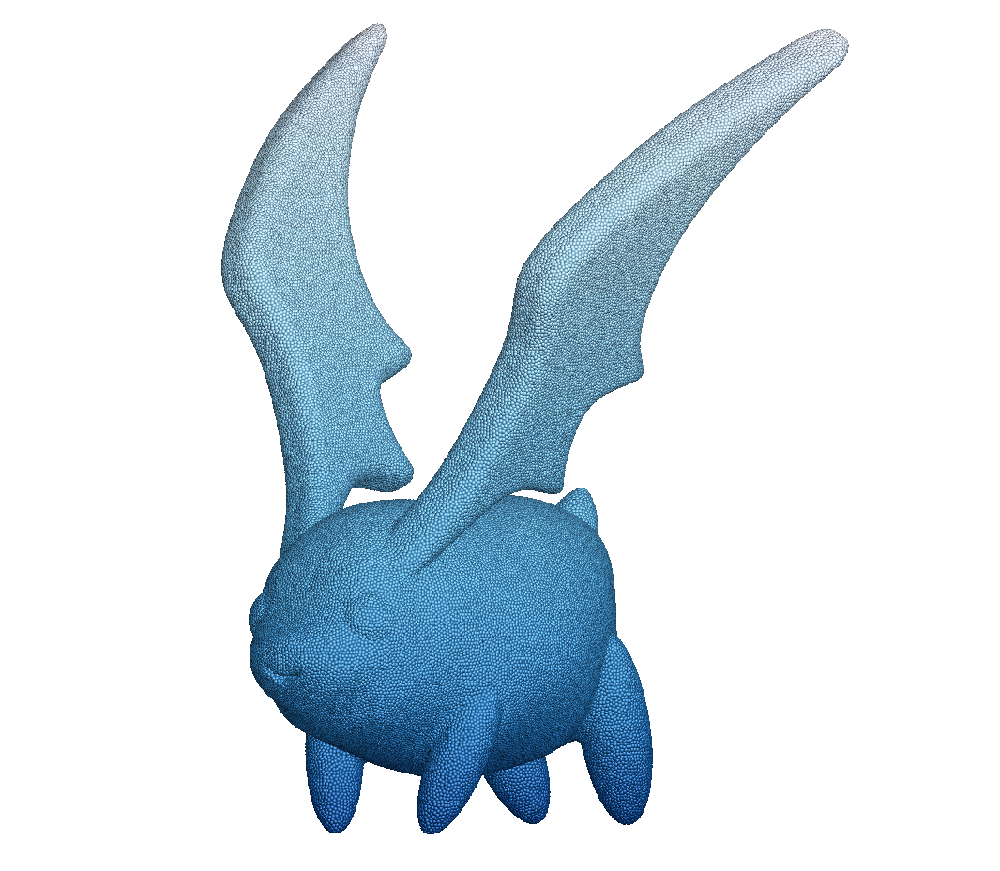
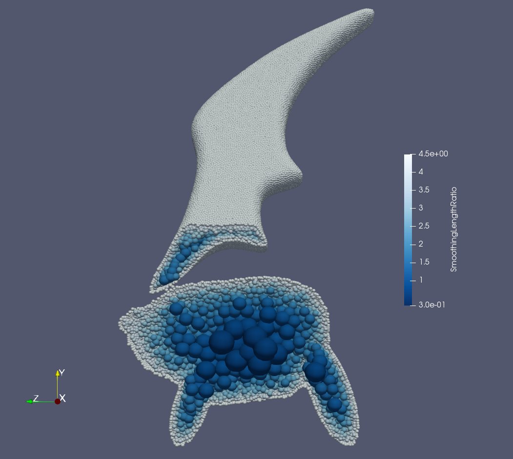

For real industrial applications, the simulation objects are mostly very complex geometry. Conventional methods clean the "dirty" geometry by 3D design software before the simulation starts, so as to meet the requirements of mesh generation. 
Here, we give a solution to automatically clean "dirty" geometry using Level-Set method, and generate an isotropic multi-resolution body-fitted paritcle distributions for the cleaned geometry, which provides the possibility for the SPH method to be applied in real industrial field. 

====================================================================================
Example 3: 3D Multi-resolution isotropic particle distribution of complex geometries
====================================================================================

   An snapshot of the multi-resolution isotropic particle distribution of a cartoon character

To generate a 3D body fited particle distribution, you need a 3D geometry model. In SPHinXsys, we load STL file to generate a Level-Set field, which is described by a distance function.
By modify the distance value of Level-Set field, we could achieve the purpose of cleaning up "dirty" geometry. In our code, this process is done automatically. The user only needs to specify whether to clean up the geometry,
and the code will judge if the geometry has inconsistent sharp areas need to be clean according to the rules we have given.
After the clean process, the code will generate a lattice particle distribution, single or multi resolution depends on the user's choice. By run the relaxation process, one can get a body fitted isotropic particle distribution.

First, We set the file path for loading the geometry file.

.. code-block:: cpp

	/**
	* @file 	3D_particle_generation.cpp
	* @brief 	This is the test of using levelset to generate particles relax particles.
	* @details	We use this case to test the particle generation and relaxation by levelset for a complex geometry (3D).
	*			Before particle generation, we clean the sharp corner and smooth 0 levelset value, then doing the re-initialization
	* @author 	Yongchuan Yu and Xiangyu Hu
	*/
		
	#pragma once

	#include "sphinxsys.h"

	using namespace SPH;

	//----------------------------------------------------------------------
	//	Set the file path to the data file.
	//----------------------------------------------------------------------
	std::string full_path_to_imported_model = "./input/cartoon.stl";

and define the basic geometry parameters, system domain size and refercnce resolution.

.. code-block:: cpp

	//----------------------------------------------------------------------
	//	Basic geometry parameters for cartoon.
	//----------------------------------------------------------------------
	Vec3d domain_lower_bound(-13.0, -9.0, 42.0); /**<the lower-right boundary of the calculation region. */
	Vec3d domain_upper_bound(12.0, 20.0, 61.0);  /**<the upper-left boundary of the calculation region.  */
	Real dp_0 = (domain_upper_bound[0] - domain_lower_bound[0]) / 50.0;  /**< refercnce particle spacing */
	/** Domain bounds of the system. */
	BoundingBox system_domain_bounds(domain_lower_bound, domain_upper_bound); /**< define the computational region */

Here we create triangle mesh by loading the STL file.

.. code-block:: cpp

	TriangleMeshShape *CreateImportedModelSurface()
	{
		Vecd translation(0.0, 0.0, 0.0);
		TriangleMeshShape *geometry_imported_model = new TriangleMeshShape(full_path_to_imported_model, translation, 1.0);
		/** Read the input STL geometry and create polygonal mesh for imported geometry. */
		return geometry_imported_model;
	}

From the piece of code below, one can choose whether the geometry need to be clean or not by simply set the third value of constructor of :code:`LevelSetComplexShape` to :code:`true`.
In additiion, it should be noted that, the first value of :code:`ParticleSpacingByBodyShape` is smoothing length ratio. The second value is global refinement level, which decide golbal particle space size.
The third value is local refinement level, which gives the finest particle spacing in multi-resolution, if this value is not equal to zero, then you have selected a multi-resolution particle distribution.
When you decide to choose multi-resolution particle distribution, the :code:`ParticleGeneratorMultiResolution` particle generation method is needed.

.. code-block:: cpp

	class ImportedModel : public SolidBody
	{
	public:
		ImportedModel(SPHSystem &system, std::string body_name)
			: SolidBody(system, body_name,
				new ParticleSpacingByBodyShape(1.15, 0, 2),
				/** this class is for multi resolution, parameters are "smoothing lenght ratio, 
				     global resolution ratio and local resolution ratio.                          
				*/
				new ParticleGeneratorMultiResolution())
				/**< this class is the particle generating method only for multi resolution      */
		{
			/** geometry definition. */
			/** create "ComplesShape" class for imported geometry by loading triangle mesh. */
			ComplexShape original_body_shape;
			original_body_shape.addTriangleMeshShape(CreateImportedModelSurface(), ShapeBooleanOps::add);
			/** Creat the levelset field for airfoil, parameter "true" denotes to clean the gemoetry. */
			body_shape_ = new LevelSetComplexShape(this, original_body_shape, true);
			
		}
	};

In the main function, we create :code:`SPHBody` for imported model, generate lattice distribution particles by following piece of code.

.. code-block:: cpp

	/**	Creating the imported body, materials and particles. */
	ImportedModel* imported_model = new ImportedModel(system, "ImportedModel");
	SolidParticles imported_model_particles(imported_model);
	imported_model_particles.addAVariableToWrite<indexScalar, Real>("SmoothingLengthRatio");

And define the in-out put function.

.. code-block:: cpp

	/**	Build up a SPHSystem by specifying computational domain and reference particle spacing. */
	SPHSystem system(system_domain_bounds, dp_0);
	/** Tag for run particle relaxation for the initial body fitted distribution. */
	system.run_particle_relaxation_ = true;
	//handle command line arguments
	#ifdef BOOST_AVAILABLE
	system.handleCommandlineOptions(ac, av);
	#endif
	/** output environment. */
	In_Output 	in_output(system);
	//----------------------------------------------------------------------
	//	Define simple file input and outputs functions.
	//----------------------------------------------------------------------
	/** Write the body state to Vtu file，one can simply change "Vtu" to "Plt" to get ".plt" file output */
	WriteBodyStatesToVtu		write_imported_model_to_vtu(in_output, { imported_model });
	WriteMeshToPlt 	write_mesh_cell_linked_list(in_output, imported_model, imported_model->mesh_cell_linked_list_);

Then, the topological relation of imported model is defined by	

.. code-block:: cpp

	//----------------------------------------------------------------------
	//	Define body relation map.
	//	The contact map gives the topological connections between the bodies.
	//	Basically the the range of bodies to build neighbor particle lists.
	//----------------------------------------------------------------------
	BaseInnerBodyRelation* imported_model_inner
		= new InnerBodyRelationVariableSmoothingLength(imported_model);

One should noted that, if the multi-resolution is selected, the :code:`InnerBodyRelationVariableSmoothingLength` is needed for define inner body relation.

After creating the body and its relation, the method for relax dynamics will be defiend.

.. code-block:: cpp

	//----------------------------------------------------------------------
	//	Methods used for particle relaxation.
	//----------------------------------------------------------------------
	/** Let the particles make small disturbances in the initial position. */
	RandomizePartilePosition  random_imported_model_particles(imported_model);
	/** Relaxation method for inner particles in a body, parameter "true" denotes using 
		"static confinement" method for boundary condition.
	*/ 
	relax_dynamics::RelaxationStepInner relaxation_step_inner(imported_model_inner, true);
	/** Update the smoothing length ratio for each particle during relaxation process */
	relax_dynamics::UpdateSmoothingLengthRatioByBodyShape update_smoothing_length_ratio(imported_model);

Then, we start to initialize the process of relaxation from making a small random disturbance to the particle distribution.

.. code-block:: cpp

	//----------------------------------------------------------------------
	//	Particle relaxation starts here.
	//----------------------------------------------------------------------
	random_imported_model_particles.parallel_exec(0.25);
	/** Ensure that the particles will not escape the geometry 
		boundary during the relaxation process.
	*/
	relaxation_step_inner.surface_bounding_.parallel_exec();
	update_smoothing_length_ratio.parallel_exec();
	write_imported_model_to_vtu.WriteToFile(0.0);
	imported_model->updateCellLinkedList();
	write_mesh_cell_linked_list.WriteToFile(0.0);

The main relaxation loops are defined in the following piece of code.

.. code-block:: cpp

	//----------------------------------------------------------------------
	//	Particle relaxation time stepping start here.
	//----------------------------------------------------------------------
	int ite_p = 0;
	while (ite_p < 1000)
	{
		update_smoothing_length_ratio.parallel_exec();
		relaxation_step_inner.parallel_exec();
		ite_p += 1;
		if (ite_p % 100 == 0) /** output particle position every 100 step. */  
		{
			std::cout << std::fixed << std::setprecision(9) << "Relaxation steps for the imported model N = " << ite_p << "\n";
			write_imported_model_to_vtu.WriteToFile(Real(ite_p) * 1.0e-4);
		}
	}
	

After the relaxation process, one can get the multi-resolution isotropic body fitted particle distribution. Following figure shows the particle distribution and particle radius inside a complex geometry.

   Particle distribution and radius inside a complex geometry

We should mention that we can add new features 
to the methods related with the observer for more quantitative information the simulation.

