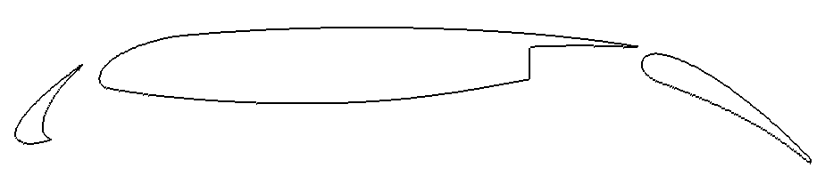
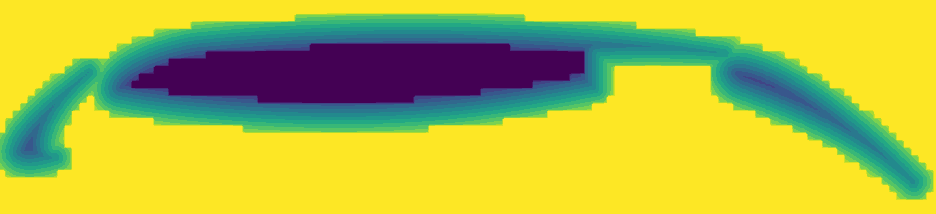
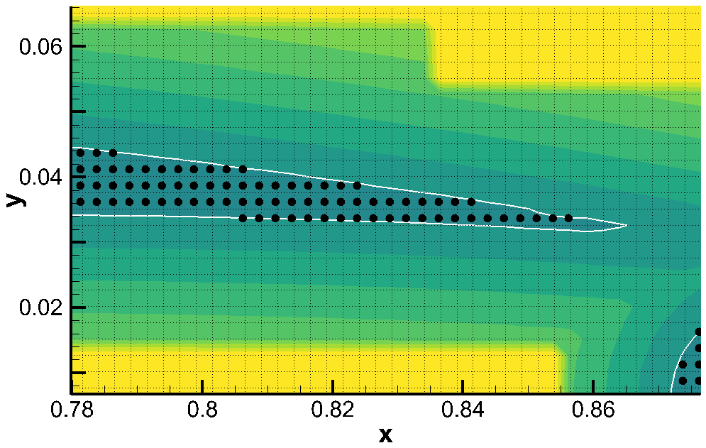
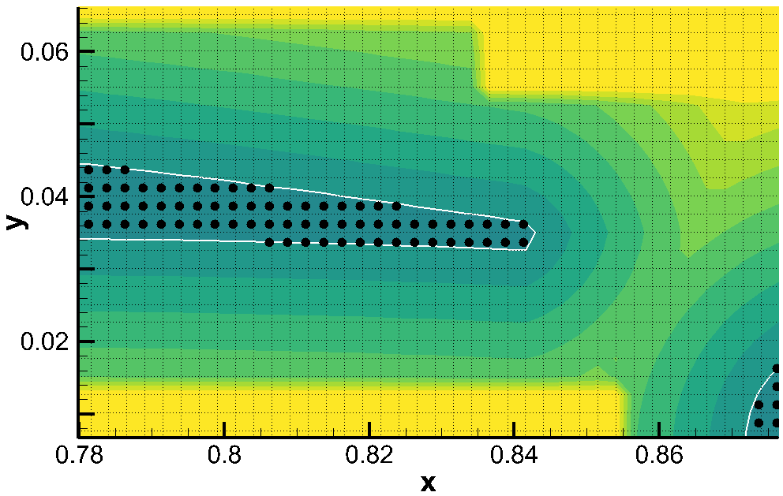
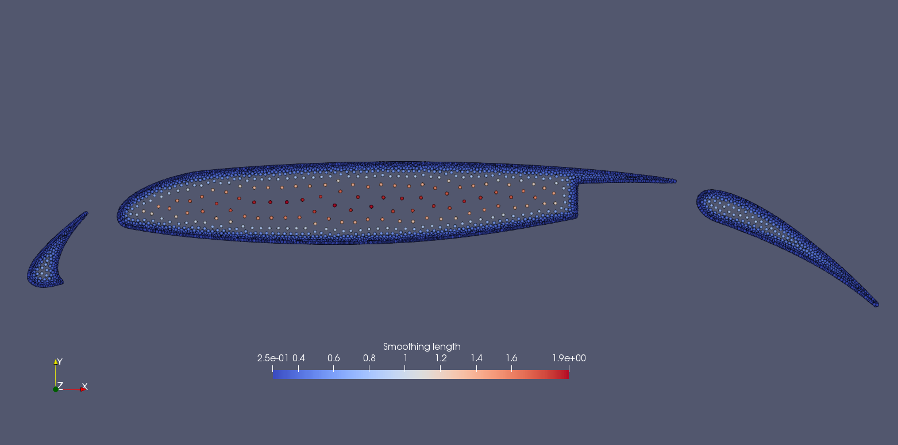

In Example 3, we explain how to set a case of 3D multi-resolution body fitted particle distribution, here we will give you a 2D multi-resolution body fitted particle distribution case. 
Different form the previous case, here we will emphasize the result of dirty geometry clean up process.

====================================================================================
Example 4: 2D Multi-resolution isotropic particle distribution of complex geometries
====================================================================================

Different from 3D case, the code read "dat" file as the 2D geometry model, generate a Level-Set field according the geometry model. 、
Below are the geometry and its Level-Set field.

   An snapshot of airfoil with flap

   The Level-Set field of airfoil

First, We set the file path for loading the geometry file.

.. code-block:: cpp

	/**
	* @file 	airfoil_2d.h
	* @brief 	This is the test of using levelset to generate particles in a relax configuration.
	* @details	We use this case to test the particle generation and relaxation by levelset for a complex geometry (2D).
	*			Before particle generation, we clean the sharp corner and smooth zero levelset contour, 
	*			which represent the body surface then doing the particle relaxation.
	* @author 	Yongchuan Yu and Xiangyu Hu
	*/

	#pragma once

	#include "sphinxsys.h"

	using namespace SPH;

	//----------------------------------------------------------------------
	//	Set the file path to the data file.
	//----------------------------------------------------------------------
	std::string airfoil_flap_front = "./input/airfoil_flap_front.dat";
	std::string airfoil_wing = "./input/airfoil_wing.dat";
	std::string airfoil_flap_rear = "./input/airfoil_flap_rear.dat";

and define the basic geometry parameters, system domain size and refercnce resolution.

.. code-block:: cpp

	//----------------------------------------------------------------------
	//	Basic geometry parameters and numerical setup.
	//----------------------------------------------------------------------
	Real DL = 1.25; 				/**< airfoil length rear part. */
	Real DL1 = 0.25;				/**< airfoil length front part. */
	Real DH = 0.25; 				/**< airfoil height. */
	Real resolution_ref = 0.01; 	/**< Reference resolution. */	
	/** Domain bounds of the system. */
	BoundingBox system_domain_bounds(Vec2d(-DL1, -DH), Vec2d(DL, DH)); /**< the lower-right and uppr-left boundaries of the calculation region. */

From the piece of code below, one can choose whether the geometry need to be clean or not by simply set the third value of constructor of :code:`LevelSetComplexShape` to :code:`true`.
In additiion, it should be noted that, the first value of :code:`ParticleSpacingByBodyShape` is smoothing length ratio. The second value is global refinement level, which decide golbal particle space size.
The third value is local refinement level, which gives the finest particle spacing in multi-resolution, if this value is not equal to zero, then you have selected a multi-resolution particle distribution.
When you decide to choose multi-resolution particle distribution, the :code:`ParticleGeneratorMultiResolution` particle generation method is needed.

.. code-block:: cpp

	/** Airfoil	as a solid body */
	class Airfoil : public SolidBody
	{
	public:
		Airfoil(SPHSystem &system, std::string body_name)
			: SolidBody(system, body_name, 
				new ParticleSpacingByBodyShape(1.15, 0, 2),  
				/** this class is for multi resolution, parameters are "smoothing lenght ratio, 
				     global resolution ratio and local resolution ratio.                          
				*/
				new ParticleGeneratorMultiResolution())
				/**< this class is the particle generating method only for multi resolution      */
		{
			/** Geometry definition. */
			/** Creat polygonal mesh for airfoil by loading the input "data" type files, 
			    The boolean operation "add" denotes particles will be generated inside the Shape,
				the boolean operation "sub" denotes particles will not be generated in this region.
			*/
			ComplexShape original_body_shape;
			original_body_shape.addAPolygonFromFile(airfoil_flap_front, ShapeBooleanOps::add);
			original_body_shape.addAPolygonFromFile(airfoil_wing, ShapeBooleanOps::add);
			original_body_shape.addAPolygonFromFile(airfoil_flap_rear, ShapeBooleanOps::add);
			/** Creat the levelset field for airfoil, parameter "true" denotes to clean the gemoetry. */
			body_shape_ = new LevelSetComplexShape(this, original_body_shape, true);
			
		}
	};

In the main function, we create :code:`SPHBody` for imported model, generate lattice distribution particles by following piece of code.

.. code-block:: cpp

	/**	Build up a SPHSystem by specifying computational domain and reference particle spacing. */
	SPHSystem system(system_domain_bounds, resolution_ref);
	/** Tag for run particle relaxation for the initial body fitted distribution. */
	system.run_particle_relaxation_ = true;
	//handle command line arguments
	#ifdef BOOST_AVAILABLE
	system.handleCommandlineOptions(ac, av);
	#endif
	/** IO system. */
	In_Output 	in_output(system);
	/**	Creating the airfoil body, materials and particles. */
	Airfoil* airfoil = new Airfoil(system, "Airfoil");
	SolidParticles airfoil_particles(airfoil);
	airfoil_particles.addAVariableToWrite<indexScalar, Real>("SmoothingLengthRatio");

Now we will show the difference between "cleaned" geometry and "dirty" geometry. By comparing the following two figures, you can find that the original geometry has a very sharp area on the trailing edge of the wing.
This area can only pass through one grid at a specific mesh resolution. Therefore, when particles are generated at the position of back ground mesh, only single-layer of particles can be generated in this area as shown in the first figure.
If the solid dynamic simulation has tacken in this area, since there are no interaction force from upper or lower layer of this single-layer particles, a big deviation of result will happen during simulation with a calculation unstable.
It should be noted that no matter how much the mesh resolution is increased, there will be such a single-layer particle distribution area.

   Particles generated by "dirty" geometry

By judging this inconsistent area according to the built-in method of this code and resetting the Level-Set value near this area, this part of the "dirty" geometry can be cleaned. 
In this way, at least two layers of particles can be generated at the trailing edge (as shown in the figure). So that it can ensure the stability and a rationable simulation. 

   Particles generated by "cleaned" geometry

After getting an ideal initial particle distribution, we need to define the rest functions.
First, in-out put function.

.. code-block:: cpp

	/**	Define simple file input and outputs functions. */
	In_Output in_output(system);
	/** Write the body state to Vtu file，one can simply change "Vtu" to "Plt" to get ".plt" file output */
	WriteBodyStatesToVtu write_airfoil_to_vtu(in_output, { airfoil });  
	WriteMeshToPlt 	write_mesh_cell_linked_list(in_output, airfoil, airfoil->mesh_cell_linked_list_);

Then, the topological relation of imported model is defined by	

.. code-block:: cpp

	//----------------------------------------------------------------------
	//	Define body relation map.
	//	The contact map gives the topological connections between the bodies.
	//	Basically the the range of bodies to build neighbor particle lists.
	//----------------------------------------------------------------------
	BaseInnerBodyRelation* airfoil_inner = new InnerBodyRelationVariableSmoothingLength(airfoil);

One should noted that, if the multi-resolution is selected, the :code:`InnerBodyRelationVariableSmoothingLength` is needed for define inner body relation.

After creating the body and its relation, the method for relax dynamics will be defiend.

.. code-block:: cpp

	//----------------------------------------------------------------------
	//	Methods used for particle relaxation.
	//----------------------------------------------------------------------
	/** Let the particles make small disturbances in the initial position. */
	RandomizePartilePosition  random_airfoil_particles(airfoil);
	/** Relaxation method for inner particles in a body, parameter "true" denotes using 
		"static confinement" method for boundary condition.
	*/ 
	relax_dynamics::RelaxationStepInner relaxation_step_inner(airfoil_inner, true);
	/** Update the smoothing length ratio for each particle during relaxation process */
	relax_dynamics::UpdateSmoothingLengthRatioByBodyShape update_smoothing_length_ratio(airfoil);

Then, we start to initialize the process of relaxation from making a small random disturbance to the particle distribution.

.. code-block:: cpp

	//----------------------------------------------------------------------
	//	Particle relaxation starts here.
	//----------------------------------------------------------------------
	random_airfoil_particles.parallel_exec(0.25);
	/** Ensure that the particles will not escape the geometry 
		boundary during the relaxation process.
	*/
	relaxation_step_inner.surface_bounding_.parallel_exec();
	update_smoothing_length_ratio.parallel_exec();
	write_airfoil_to_vtu.WriteToFile(0.0);
	airfoil->updateCellLinkedList();
	write_mesh_cell_linked_list.WriteToFile(0.0);

The main relaxation loops are defined in the following piece of code.

.. code-block:: cpp

	//----------------------------------------------------------------------
	//	Particle relaxation time stepping start here.
	//----------------------------------------------------------------------
	int ite_p = 0;
	while (ite_p < 2000)
	{
		update_smoothing_length_ratio.parallel_exec();
		relaxation_step_inner.parallel_exec();
		ite_p += 1;
		if (ite_p % 100 == 0) /** output particle position every 100 step. */  
		{
			std::cout << std::fixed << std::setprecision(9) << "Relaxation steps for the airfoil N = " << ite_p << "\n";
			write_airfoil_to_vtu.WriteToFile(Real(ite_p) * 1.0e-4);
		}
	}
	std::cout << "The physics relaxation process of airfoil finish !" << std::endl;
	

After the relaxation process, one can get the multi-resolution isotropic body fitted particle distribution. Following figure shows the particle distribution and particle smoothing length variation inside a airfoil.

   Particle distribution and smoothing length variation in a airfoil

We should mention that we can add new features 
to the methods related with the observer for more quantitative information the simulation.

