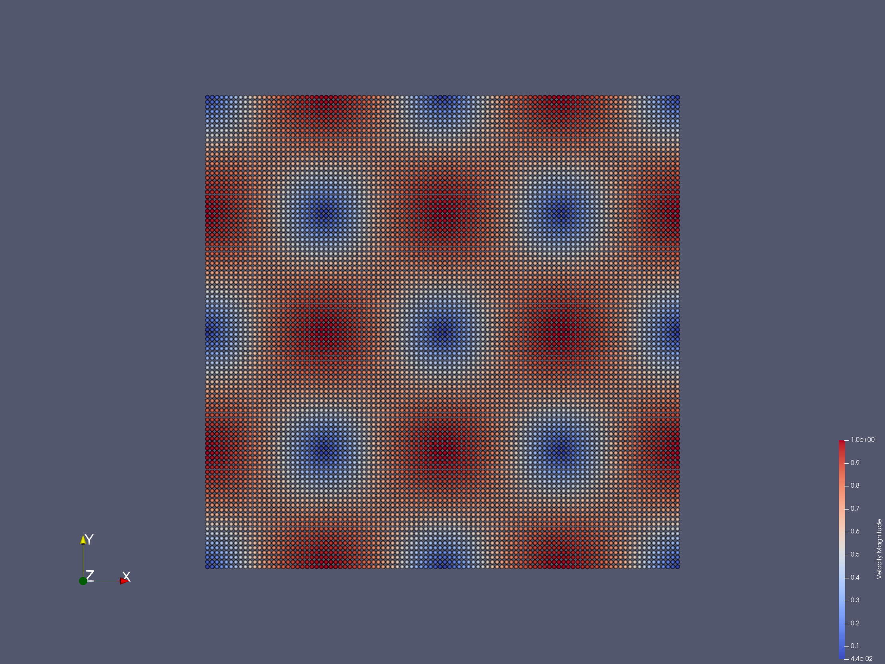

==================================
Example 5: 2D Taylor-Green vortex
==================================

The following program is that vortexes change process in a water block .
It simulates the behavior of this system over a time interval.

As is shown in the figure, there are several vortexes in waterblock. 

   An snapshot of the vlocity distribution of vortexes in the taylor green problem

Now, we provide the parameters for geometric modeling.

.. code-block:: cpp

	/**
	* @brief Basic geometry parameters and numerical setup.
	*/
	Real DL = 1.0; 						/**< box length. */
	Real DH = 1.0; 						/**< box height. */
	Real resolution_ref = 1.0/100.0; 	/**< Global reference resolution. */

Here, :code:`particle_spacing_ref` gives 
the reference initial particle spacing for multi-resolution modeling, e.g. for refinement level 0. 

We also provide parameters for physical modeling, 
such as material properties of the fluid and physical parameters of the tayloy green problem.

.. code-block:: cpp

	/**
	* @brief Material properties of the fluid.
	*/
	Real rho0_f = 1.0;						/**< Reference density of fluid. */
	Real U_f = 1.0;							/**< Characteristic velocity. */
	Real c_f = 10.0*U_f;					/**< Reference sound speed. */
	Real Re = 100;							/**< Reynolds number. */
	Real mu_f = rho0_f * U_f * DL / Re;		/**< Dynamics viscosity. */

As we are using a weakly compressible model for imposing incompressibility, 
the maximum speed in the flow and artificial speed of sound are estimated.

Then, we define the reinitialization of :code:`SPHBody` s. 
First, We give the geometry for modeling the taylor green.

.. code-block:: cpp

	/**
	* @brief 	Fluid body definition.
	*/
	class WaterBlock : public FluidBody
	{
		public:
		WaterBlock(SPHSystem &system, std::string body_name)
			: FluidBody(system, body_name)
		{
			/** Geomtry definition. */
			std::vector<Vecd> water_block_shape;
			water_block_shape.push_back(Vecd(0.0, 0.0));
			water_block_shape.push_back(Vecd(0.0, DH));
			water_block_shape.push_back(Vecd(DL, DH));
			water_block_shape.push_back(Vecd(DL, 0.0));
			water_block_shape.push_back(Vecd(0.0, 0.0));
			body_shape_ = new ComplexShape(body_name);
			body_shape_->addAPolygon(water_block_shape, ShapeBooleanOps::add);
		}
	};

and define material of the water body.

.. code-block:: cpp

	/**
	* @brief 	Case dependent material properties definition.
	*/
	class WaterMaterial : public WeaklyCompressibleFluid
	{
	public:
		WaterMaterial()	: WeaklyCompressibleFluid()
		{
			rho_0_ = rho0_f;
			c_0_ = c_f;
			mu_ = mu_f;

			assignDerivedMaterialParameters();
		}
	};

Next we define the initial vlocities according to the coordinates of the particles

.. code-block:: cpp

	/**
	* application dependent initial condition 
	*/
	class TaylorGreenInitialCondition
		: public fluid_dynamics::FluidInitialCondition
	{
	public:
		TaylorGreenInitialCondition(FluidBody *water)
			: fluid_dynamics::FluidInitialCondition(water) {};
	protected:
		void Update(size_t index_i, Real dt) override 
		{
			/** initial velocity profile */
			vel_n_[index_i][0] = -cos(2.0 * Pi * pos_n_[index_i][0]) *
					sin(2.0 * Pi * pos_n_[index_i][1]);
			vel_n_[index_i][1] = sin(2.0 * Pi * pos_n_[index_i][0]) *
					cos(2.0 * Pi * pos_n_[index_i][1]);
		}
	};

After all :code:`SPHBody` s are defined, here comes to the :code:`int main()` function,
which the application is defined.
In the first part of :code:`main` function, 
an object of :code:`SPHSystem` is created, global physical time initialized,
and whether the computation begin from restart files is checked.

.. code-block:: cpp

	/**
	* @brief Build up -- a SPHSystem --
	*/
	SPHSystem sph_system(system_domain_bounds, resolution_ref);
	/** Set the starting time. */
	GlobalStaticVariables::physical_time_ = 0.0;
	/** Tag for computation start with relaxed body fitted particles distribution. */
	sph_system.reload_particles_ = false;
	/** Tag for computation from restart files. 0: not from restart files. */
	sph_system.restart_step_ = 0;
	/** output environment. */
	In_Output 	in_output(sph_system);
	//handle command line arguments
	sph_system.handleCommandlineOptions(ac, av);
	/**
	* @brief Material property, partilces and body creation of fluid.
	*/
	WaterBlock *water_block = new WaterBlock(sph_system, "WaterBody");
	if (sph_system.reload_particles_) 	 // Using relaxed particle distribution if needed
	{
		water_block->particle_generator_->~ParticleGenerator();
		water_block->particle_generator_ = new ParticleGeneratorReload(&in_output, water_block->getBodyName());
	}
	WaterMaterial 	*water_material = new WaterMaterial();
	FluidParticles 	fluid_particles(water_block, water_material);
	/** topology */
	BaseInnerBodyRelation* water_block_inner = new InnerBodyRelation(water_block);

Note that the constructor of :code:`SPHSystem` requires the coordinates of 
lower and upper bounds of the domain, which will be used as the bounds 
for a mesh used for building cell linked lists.
The material, particles and body are also created for water block and 
the topological relations of water block is set as  inner realatiion.
The function :code:`reload_particles_` can be used when particle distribution relaxation is used.

After this, the physical dynamics of system is defined 
as method classes in the form of particle discretization.

.. code-block:: cpp

	/**
	* @brief 	Define all numerical methods which are used in this case.
	*/
	/**
	* @brief 	Methods used only once.
	*/
	/** Initial velocity field */
	TaylorGreenInitialCondition setup_taylor_green_velocity(water_block);
	/**
	* @brief 	Methods used for time stepping.
	*/
	/** Initialize particle acceleration. */
	InitializeATimeStep 	initialize_a_fluid_step(water_block);
	/** Periodic BCs in x direction. */
	PeriodicConditionInAxisDirectionUsingCellLinkedList 	periodic_condition_x(water_block, 0);
	/** Periodic BCs in y direction. */
	PeriodicConditionInAxisDirectionUsingCellLinkedList 	periodic_condition_y(water_block, 1);

Note that we initialize the velocity distribution of the waterblock and the external force is defined.
After that we define the boundary condition to the period boundary in both the X and Y axis.

Then algorithms of fluid dynamics is showed in following codes.

.. code-block:: cpp

	/**
	* @brief 	Algorithms of fluid dynamics.
	*/
	/** Evaluation of density by summation approach. */
	fluid_dynamics::DensitySummationInner	update_density_by_summation(water_block_inner);
	/** Time step size without considering sound wave speed. */
	fluid_dynamics::AdvectionTimeStepSize 	get_fluid_advection_time_step_size(water_block, U_f);
	/** Time step size with considering sound wave speed. */
	fluid_dynamics::AcousticTimeStepSize 	get_fluid_time_step_size(water_block);
	/** Pressure relaxation algorithm by using verlet time stepping. */
	/** Here, we do not use Riemann solver for pressure as the flow is viscous. 
	* The other reason is that we are using transport velocity formulation, 
	* which will also introduce numerical disspation slightly. */
	fluid_dynamics::PressureRelaxationInner pressure_relaxation(water_block_inner);
	fluid_dynamics::DensityRelaxationRiemannInner density_relaxation(water_block_inner);
	/** Computing viscous acceleration. */
	fluid_dynamics::ViscousAccelerationInner 	viscous_acceleration(water_block_inner);
	/** Impose transport velocity. */
	fluid_dynamics::TransportVelocityCorrectionInner transport_velocity_correction(water_block_inner);

Note that these are the methods for computing dual time step and density by summation,
and we can choose to use different Riemann solver or not here.
Then we also define algorithms of computing viscous acceleration 
and transport velocity to correct vlocities and locations of particles.

Before the computation, we also define the outputs including the particle states, restart files.

.. code-block:: cpp

	/**
	* @brief Output.
	*/
	/** Output the body states. */
	WriteBodyStatesToVtu 	write_body_states(in_output, sph_system.real_bodies_);
	/** Write the particle reload files. */
	ReloadParticleIO 		write_particle_reload_files(in_output, { water_block });
	/** Output the body states for restart simulation. */
	RestartIO				restart_io(in_output, sph_system.real_bodies_);
	/** Output the mechanical energy of fluid body. */
	WriteBodyReducedQuantity<fluid_dynamics::TotalMechanicalEnergy> 	
	write_total_mechanical_energy(in_output, water_block, new Gravity(Vec2d(0)));
	/** Output the maximum speed of the fluid body. */
	WriteBodyReducedQuantity<MaximumSpeed> write_maximum_speed(in_output, water_block);

The :code:`Vtu` files can be read directly by the open-source visualization code ParaView.
You also have the option to save the files in Tecplot format.
The global information and maximun speed are written in simple data format. 
The restart files are in :code:`XML` data format.

Next we need to apply velocity initialization and boundary conditions in following codes.

.. code-block:: cpp

	/**
	* @brief Setup geomtry and initial conditions
	*/
	setup_taylor_green_velocity.exec();
	sph_system.initializeSystemCellLinkedLists();
	periodic_condition_x.update_cell_linked_list_.parallel_exec();
	periodic_condition_y.update_cell_linked_list_.parallel_exec();
	sph_system.initializeSystemConfigurations();

Note that we have to apply boundary conditions before computation 
and all innerneibor particles can be searched for every single particle in all areas including edges and corners.

Finally, the time stepping will almost start. 
However, if the computation begin from restart files. 
The system will be reset.  

.. code-block:: cpp

	/**
	* @brief The time stepping starts here.
	*/
	/** If the starting time is not zero, please setup the restart time step ro read in restart states. */
	if (sph_system.restart_step_ != 0)
	{
		GlobalStaticVariables::physical_time_ = restart_io.readRestartFiles(sph_system.restart_step_);
		water_block->updateCellLinkedList();
		periodic_condition_x.update_cell_linked_list_.parallel_exec();
		periodic_condition_y.update_cell_linked_list_.parallel_exec();
		water_block_inner->updateConfiguration();
	}
	/** Output the start states of bodies. */
	write_body_states.WriteToFile(GlobalStaticVariables::physical_time_);
	/** Output the mechanical energy of fluid. */
	write_total_mechanical_energy.WriteToFile(GlobalStaticVariables::physical_time_);

Note that, because the particles have been moved in the previous simulation, 
one need to update the cell-linked list and particle configuration. 
After that, the states from the starting time step will be outputted. 

The basic control parameter for the simulation is defined.
Such as the restart file output frequency, total simulation time 
and interval for writing output files. 

.. code-block:: cpp

	/**
	* @brief 	Basic parameters.
	*/
	size_t number_of_iterations = sph_system.restart_step_;
	int screen_output_interval = 100;
	int restart_output_interval = screen_output_interval*10;
	Real End_Time = 5.0; 	/**< End time. */
	Real D_Time = 0.1;		/**< Time stamps for output of body states. */
	Real Dt = 0.0;			/**< Default advection time step sizes. */
	Real dt = 0.0; 			/**< Default acoustic time step sizes. */
	/** statistics for computing CPU time. */
	tick_count t1 = tick_count::now();
	tick_count::interval_t interval;

Also the statistic for computation time is initialized.
A case setup file will be written as a summary of the case. This file goes together with other output data for later reference.

Here comes the time-stepping loops. 
The computation is carried out with a dual-criteria time-stepping scheme,
as discussed in SPHinXsys's theory section.

.. code-block:: cpp

	/**
	 * @brief 	Main loop starts here.
	 */
	while (GlobalStaticVariables::physical_time_ < End_Time)
	{
		Real integration_time = 0.0;
		/** Integrate time (loop) until the next output time. */
		while (integration_time < D_Time)
		{
			/** Acceleration due to viscous force. */
			initialize_a_fluid_step.parallel_exec();
			Dt = get_fluid_advection_time_step_size.parallel_exec();
			update_density_by_summation.parallel_exec();
			viscous_acceleration.parallel_exec();
			transport_velocity_correction.parallel_exec(Dt);
			/** Dynamics including pressure relaxation. */
			Real relaxation_time = 0.0;
			while (relaxation_time < Dt)
			{
				//avoid possible smaller acoustic time step size for viscous flow
				dt = SMIN(get_fluid_time_step_size.parallel_exec(), Dt);
				relaxation_time += dt;
				integration_time += dt;
				pressure_relaxation.parallel_exec(dt);
				density_relaxation.parallel_exec(dt);
				GlobalStaticVariables::physical_time_ += dt;
			}

			if (number_of_iterations % screen_output_interval == 0)
			{
				std::cout << std::fixed << std::setprecision(9) << "N=" << number_of_iterations << "	Time = "
					<< GlobalStaticVariables::physical_time_
					<< "	Dt = " << Dt << "	dt = " << dt << "\n";

				if (number_of_iterations % restart_output_interval == 0) {
					restart_io.WriteToFile(Real(number_of_iterations));
				}
			}
			number_of_iterations++;

			/** Water block configuration and periodic condition. */
			periodic_condition_x.bounding_.parallel_exec();
			periodic_condition_y.bounding_.parallel_exec();
			water_block->updateCellLinkedList();
			periodic_condition_x.update_cell_linked_list_.parallel_exec();
			periodic_condition_y.update_cell_linked_list_.parallel_exec();
			water_block_inner->updateConfiguration();
		}

		tick_count t2 = tick_count::now();
		write_total_mechanical_energy.WriteToFile(GlobalStaticVariables::physical_time_);
		write_maximum_speed.WriteToFile(GlobalStaticVariables::physical_time_);
		write_body_states.WriteToFile(GlobalStaticVariables::physical_time_);
		tick_count t3 = tick_count::now();
		interval += t3 - t2;
	}
	tick_count t4 = tick_count::now();

	tick_count::interval_t tt;
	tt = t4 - t1 - interval;
	std::cout << "Total wall time for computation: " << tt.seconds()
		<< " seconds." << std::endl;

	write_particle_reload_files.WriteToFile();

	return 0;

During the looping outputs are scheduled.
On screen output will be the number of time steps, 
the current physical time and acoustic time-step size.
After the simulation is terminated, the statistics of computation time are output to the screen.
Note that the total computation time has excluded the time for writing files.