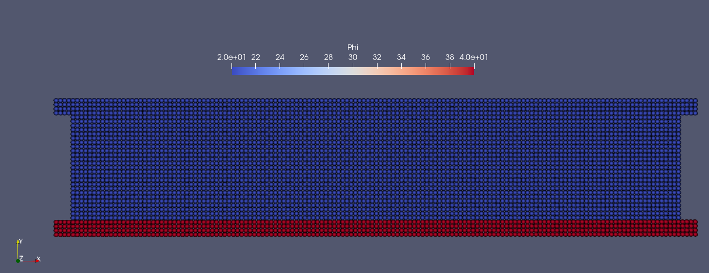
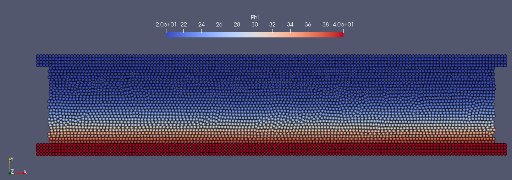

In the previous chapters we simulated some simple fluid cases and typical FSI problem. Now we may have a look at the heat transfer problem, in which heat is being transferred between  solid walls and flowing fluid. 

========================
Example 6: Heat transfer 
========================

As shown in the figure, there is flowing fluid between an upper wall and a lower wall. The initial temperature, which is phi value in this case, of fluid and the upper wall is 20, while the lower wall is 40. 
In this case we can see how heat transfer occurs from the hot lower wall to the fluid.

   An snapshot of the initial temperature distribution of fluid and walls

We give the geometry and material parameters for modeling the walls and the fluid, including the length and height of the fluid block and wall, particle reference resolution, diffusion coefficient, etc.

.. code-block:: cpp

		/**
	* @brief 	Define the geometry parameter.
	*/
	Real DL = 2.0;                /**< Channel length. */
        Real DH = 0.4;              /**< Channel height. */
	Real resolution_ref = DH / 25.0;          /**< Global reference reoslution. */
	Real DL_sponge = resolution_ref * 20.0;	/**< Sponge region to impose inflow condition. */
	/**< Boundary width, determined by specific layer of boundary particles. */
	Real BW = resolution_ref * 4.0; 	/** Domain bounds of the system. */
	BoundingBox system_domain_bounds(Vec2d(-DL_sponge - BW, -BW), Vec2d(DL + BW, DH + BW));
	/** Material properties. */
	Real diffusion_coff = 1.0e-3;
	Real bias_diffusion_coff = 0.0;
	Real alpha = Pi / 6.0;
	Vec2d bias_direction(cos(alpha), sin(alpha));

	/**
	*@brief Material properties of the fluid.
	*/
	Real rho0_f = 1.0;		/**< Density. */
	Real U_f =1.0;		 /**< Characteristic velocity. */
	Real c_f = 10.0 * U_f;	/**< Speed of sound. */
	Real Re = 100.0;		/**< Reynolds number100. */
	Real mu_f = rho0_f * U_f * DH / Re;	/**< Dynamics viscosity. */

	/**
	*@brief Temperatures.
	*/
	Real phi_upper_wall = 20.0;
	Real phi_lower_wall = 40.0;
	Real phi_fluid_initial = 20.0;

and define solid wall bodies as well as fluid body with following code piece.

.. code-block:: cpp

	/** create a water block shape */
	std::vector<Vecd> CreatShape()
	{
	//geometry
		std::vector<Vecd> shape;
		shape.push_back(Vecd(0.0 - DL_sponge, 0.0));
		shape.push_back(Vecd(0.0 - DL_sponge, DH));
		shape.push_back(Vecd(DL, DH));
		shape.push_back(Vecd(DL, 0.0));
		shape.push_back(Vecd(0.0 - DL_sponge, 0.0));
		return shape;
	}
	/** create outer wall shape */
	std::vector<Vecd> CreatOuterWallShape()
	{
		std::vector<Vecd> outer_wall_shape;
		outer_wall_shape.push_back(Vecd(-DL_sponge - BW, -BW));
		outer_wall_shape.push_back(Vecd(-DL_sponge - BW, DH + BW));
		outer_wall_shape.push_back(Vecd(DL + BW, DH + BW));
		outer_wall_shape.push_back(Vecd(DL + BW, -BW));
		outer_wall_shape.push_back(Vecd(-DL_sponge - BW, -BW));
		return outer_wall_shape;
	}

	/** create inner wall shape */
	std::vector<Vecd> CreatInnerWallShape()
	{	
		std::vector<Vecd> inner_wall_shape;
		inner_wall_shape.push_back(Vecd(-DL_sponge - 2.0 * BW, 0.0));
		inner_wall_shape.push_back(Vecd(-DL_sponge - 2.0 * BW, DH));
		inner_wall_shape.push_back(Vecd(DL + 2.0 * BW, DH));
		inner_wall_shape.push_back(Vecd(DL + 2.0 * BW, 0.0));
		inner_wall_shape.push_back(Vecd(-DL_sponge - 2.0 * BW, 0.0));

		return inner_wall_shape;
	}
	
After the typical points for the geometry of different parts are given, we define bodies based on shape creating.
The :code:`ThermofluidBody` is inherited from :code:`FluidBody`, while :code:`ThermosolidBody` is inherited from :code:`SolidBody`.

.. code-block:: cpp

	/**  Thermofluid body definition */
	class ThermofluidBody : public FluidBody
	{
	public: 
		ThermofluidBody(SPHSystem &system, std::string body_name)
			: FluidBody(system, body_name)
		{	
			std::vector<Vecd> body_shape = CreatShape();	
			body_shape_ = new ComplexShape(body_name);
			body_shape_->addAPolygon(body_shape, ShapeBooleanOps::add);
		}
	};

	/**  Thermosolid body definition */
	class ThermosolidBody : public SolidBody
	{
	public:
		ThermosolidBody(SPHSystem &system, std::string body_name)
			: SolidBody(system, body_name)
		{
			std::vector<Vecd>  outer_wall_shape = CreatOuterWallShape();
			std::vector<Vecd> inner_wall_shape = CreatInnerWallShape();
			body_shape_ = new ComplexShape(body_name);
			body_shape_->addAPolygon(outer_wall_shape, ShapeBooleanOps::add);
			body_shape_->addAPolygon(inner_wall_shape, ShapeBooleanOps::sub);

		}
	};

Initially, all particles have been set to at rest. we also setup material properties and initial condition for different bodies. The thermal relaxation between different bodies is also set.
Here, we must insert a specie `Phi` resperenting heat being transferred between these two bodies.

.. code-block:: cpp

	/**
 	* Setup heat conduction material properties for diffusion fluid body 
 	*/
	class ThermofluidBodyMaterial
		: public DiffusionReactionMaterial<FluidParticles, WeaklyCompressibleFluid>
	{
	public:
		ThermofluidBodyMaterial()
			: DiffusionReactionMaterial<FluidParticles, WeaklyCompressibleFluid>()
		{
			rho_0_ = rho0_f;
			c_0_ = c_f;
			mu_ = mu_f;

			//add a scalar for temperature in fluid
			insertASpecies("Phi");
			assignDerivedMaterialParameters();
			initializeDiffusion();
		}
		/** Initialize diffusion reaction material. */
		virtual void initializeDiffusion() override {
			DirectionalDiffusion* phi_diffusion
				= new DirectionalDiffusion(species_indexes_map_["Phi"], species_indexes_map_["Phi"],
					diffusion_coff, bias_diffusion_coff, bias_direction);
			species_diffusion_.push_back(phi_diffusion);
		};
	};

	/**
	 * Setup heat conduction material properties for diffusion solid body
	 */
	class ThermosolidBodyMaterial
		: public DiffusionReactionMaterial<SolidParticles, Solid>
	{
	public:
		ThermosolidBodyMaterial()
			: DiffusionReactionMaterial<SolidParticles, Solid>()
		{
			//add a scalar for temperature in solid
			insertASpecies("Phi");
			assignDerivedMaterialParameters();
			initializeDiffusion();
		}
		/** Initialize diffusion reaction material. */
		virtual void initializeDiffusion() override {
			DirectionalDiffusion*  phi_diffusion
				= new DirectionalDiffusion(species_indexes_map_["Phi"], species_indexes_map_["Phi"],
					diffusion_coff, bias_diffusion_coff, bias_direction);
			species_diffusion_.push_back(phi_diffusion);
		};
	};

	/**
	 * application dependent solid body initial condition
	 */
	class ThermosolidBodyInitialCondition
		: public  DiffusionReactionInitialCondition<SolidBody, SolidParticles, Solid>
	{
	protected:
		size_t phi_;

		void Update(size_t index_i, Real dt) override
		{
		
			if (-BW <= pos_n_[index_i][1] && pos_n_[index_i][1] <= 0.0)
			{
				species_n_[phi_][index_i] = phi_lower_wall;
			}

			if (DH <= pos_n_[index_i][1] && pos_n_[index_i][1] <= DH+BW)
			{
				species_n_[phi_][index_i] = phi_upper_wall;
			}
			
		};
	public: 
		ThermosolidBodyInitialCondition(SolidBody* diffusion_solid_body)
			: DiffusionReactionInitialCondition<SolidBody, SolidParticles, Solid>(diffusion_solid_body) {
			phi_ = material_->SpeciesIndexMap()["Phi"];
		};
	};

	/**
	 * application dependent fluid body initial condition
	*/
	class ThermofluidBodyInitialCondition
		: public  DiffusionReactionInitialCondition< FluidBody, FluidParticles, WeaklyCompressibleFluid>
	{
	protected:
		size_t phi_;

		void Update(size_t index_i, Real dt) override
		{

			if (0 <= pos_n_[index_i][1] && pos_n_[index_i][1] <= DH)
			{
				species_n_[phi_][index_i] = phi_fluid_initial;
			}

		};
	public:
		ThermofluidBodyInitialCondition(FluidBody* diffusion_fluid_body)
			: DiffusionReactionInitialCondition<FluidBody, FluidParticles, WeaklyCompressibleFluid >	(diffusion_fluid_body) {
			phi_ = material_->SpeciesIndexMap()["Phi"];
		};
	};

	
Here is the definition of heat transfer relaxation method. In this case, there are two bodies, so we use the :code:`ComplexBodyRelation`. 
If there is only one body, :code:`InnerBodyRelation` works.

.. code-block:: cpp

	/**
 	*Set thermal relaxation between different bodies 
 	*/
	class ThermalRelaxationComplex
		: public RelaxationOfAllDiffusionSpeciesRK2<FluidBody, FluidParticles, WeaklyCompressibleFluid,
		RelaxationOfAllDiffussionSpeciesComplex<FluidBody, FluidParticles, WeaklyCompressibleFluid, SolidBody, 	SolidParticles, Solid>,
		ComplexBodyRelation>
	{
	public:
		ThermalRelaxationComplex(ComplexBodyRelation* body_complex_relation)
			: RelaxationOfAllDiffusionSpeciesRK2(body_complex_relation) {};
		virtual ~ThermalRelaxationComplex() {};
	};

In the main function, we need to build up a :code:`SPHSystem`, in which the boundings of the whole calculation domain are defined.
Then we create the :code:`SPHBody` s of :code:`ThermofluidBody` and :code:`ThermosolidBody` by following piece of code. 
Particles and materials should also be assigned to the bodies here.

.. code-block:: cpp

		/**
	 * @brief Creating body, materials and particles for a ThermofluidBody .
	 */
	ThermofluidBody *thermofluid_body = new ThermofluidBody(system, "ThermofluidBody");
	ThermofluidBodyMaterial *thermofluid_body_material = new ThermofluidBodyMaterial();
	DiffusionReactionParticles<FluidParticles, WeaklyCompressibleFluid>	
		diffusion_fluid_body_particles(thermofluid_body, thermofluid_body_material);

	/**
    	* @brief Creating body and particles for the ThermosolidBody.
   	 */
	ThermosolidBody *thermosolid_body = new ThermosolidBody(system, "ThermosolidBody");
	ThermosolidBodyMaterial *thermosolid_body_material = new ThermosolidBodyMaterial();
	DiffusionReactionParticles<SolidParticles, Solid>	
		diffusion_solid_body_particles(thermosolid_body, thermosolid_body_material);
		

Then, the topological relation of all bodies is defined by

.. code-block:: cpp

	/** topology */
	InnerBodyRelation* fluid_body_inner = new InnerBodyRelation(thermofluid_body);
	InnerBodyRelation* solid_body_inner = new InnerBodyRelation(thermosolid_body);
	ComplexBodyRelation* fluid_body_complex = new ComplexBodyRelation(fluid_body_inner, {thermosolid_body });

	
Here, the :code:`fluid_body_inner` interacts with :code:`thermosolid_body` by introducing the :code:`ComplexBodyRelation`.

After creating the bodies, the method related with heat transfer will be defined.
First, we setup the initial condition.

.. code-block:: cpp

		 /** Case setup */
	ThermosolidBodyInitialCondition thermosolid_condition(thermosolid_body);
	ThermofluidBodyInitialCondition thermofluid_initial_condition(thermofluid_body);
	/** Corrected strong configuration for diffusion solid body. */
	solid_dynamics::CorrectConfiguration 			correct_configuration(solid_body_inner);

Then the main algorithm for fluid flowing and thermal transfer is defined, including the general methods: time stepping based on fluid dynamics and diffusion, 
fluid dynamics, and the methods for thermal relaxtion as well as boundary conditions.

.. code-block:: cpp

	/**
	* @brief Algorithms of Elastic dynamics.
	*/
	/** Evaluation of density by summation approach. */
	fluid_dynamics::DensitySummationComplex	update_density_by_summation(fluid_body_complex);
	/** Time step size without considering sound wave speed. */
	fluid_dynamics::AdvectionTimeStepSize 	get_fluid_advection_time_step(thermofluid_body, U_f);
	/** Time step size with considering sound wave speed. */
	fluid_dynamics::AcousticTimeStepSize		get_fluid_time_step(thermofluid_body);
	/** Time step size calculation. */
	GetDiffusionTimeStepSize<FluidBody, FluidParticles, WeaklyCompressibleFluid> get_thermal_time_step(thermofluid_body);
	/** Diffusion process between two diffusion bodies. */
	ThermalRelaxationComplex 	thermal_relaxation_complex(fluid_body_complex);
	/** Pressure relaxation using verlet time stepping. */
	/** Here, we do not use Riemann solver for pressure as the flow is viscous. */
	fluid_dynamics::PressureRelaxationWithWall	pressure_relaxation(fluid_body_complex);
	fluid_dynamics::DensityRelaxationRiemannWithWall density_relaxation(fluid_body_complex);
	/** Computing viscous acceleration. */
	fluid_dynamics::ViscousAccelerationWithWall 	viscous_acceleration(fluid_body_complex);
	/** Impose transport velocity. */
	fluid_dynamics::TransportVelocityCorrectionComplex	transport_velocity_correction(fluid_body_complex);
	/** Computing vorticity in the flow. */
	fluid_dynamics::VorticityInner 	compute_vorticity(fluid_body_inner);

The main loops are defined in the following piece of code. :code:`parallel_exec()` is the main caculation part in the loop. 
Pressure, density and thermal value are updated in :code:`pressure_relaxation.parallel_exec(dt)`, :code:`density_relaxation.parallel_exec(dt)`, and :code:`thermal_relaxation_complex.parallel_exec(dt)`.
Cell linked lists and configurations will be updated in :code:`thermofluid_body->updateCellLinkedList()` and :code:`fluid_body_complex->updateConfiguration()`.

.. code-block:: cpp

	/**
	* @brief Main loop starts here.
	*/
		while (GlobalStaticVariables::physical_time_ < End_Time)
	{
		Real integration_time = 0.0;
		/** Integrate time (loop) until the next output time. */
 		while (integration_time < D_Time) {
			initialize_a_fluid_step.parallel_exec();
			Dt = get_fluid_advection_time_step.parallel_exec();
			update_density_by_summation.parallel_exec();
			viscous_acceleration.parallel_exec();
			transport_velocity_correction.parallel_exec(Dt);

			inner_ite_dt = 0;
			Real relaxation_time = 0.0;
			while (relaxation_time < Dt) {
				dt = SMIN(SMIN(dt_thermal, get_fluid_time_step.parallel_exec()), Dt);
				pressure_relaxation.parallel_exec(dt);
				density_relaxation.parallel_exec(dt);			
				thermal_relaxation_complex.parallel_exec(dt);

				relaxation_time += dt;
				integration_time += dt;
				GlobalStaticVariables::physical_time_ += dt;
				parabolic_inflow.exec();
				inner_ite_dt++;
			}

			if (number_of_iterations % screen_output_interval == 0)
			{
				std::cout << std::fixed << std::setprecision(9) << "N=" << number_of_iterations << "	Time = "
					<< GlobalStaticVariables::physical_time_
					<< "	Dt = " << Dt << "	Dt / dt = " << inner_ite_dt << "\n";
			}
			number_of_iterations++;

			/** Water block configuration and periodic condition. */
			periodic_condition.bounding_.parallel_exec();
			thermofluid_body->updateCellLinkedList();
			periodic_condition.update_cell_linked_list_.parallel_exec();
            fluid_body_complex->updateConfiguration();
		}
		tick_count t2 = tick_count::now();
		/** write run-time observation into file */
		compute_vorticity.parallel_exec();
		fluid_observer_contact->updateConfiguration();
		write_real_body_states.WriteToFile(GlobalStaticVariables::physical_time_);
	    write_fluid_phi.WriteToFile(GlobalStaticVariables::physical_time_);
	    write_fluid_velocity.WriteToFile(GlobalStaticVariables::physical_time_);
		tick_count t3 = tick_count::now();
		interval += t3 - t2;
	}
	

Note that,  we need to find the samller time step size between :code:`GetDiffusionTimeStepSize` and :code:`AcousticTimeStepSize` to decide data exchanging frequency.
Beside the particle position, velocity, we output the feature :code:`Phi` to value the temperature in this case as shown in the figure below.

   Temporal Phi distribution in wall and fluid

We should mention that we can add new features to the methods related with the observer for more quantitative information the simulation.

