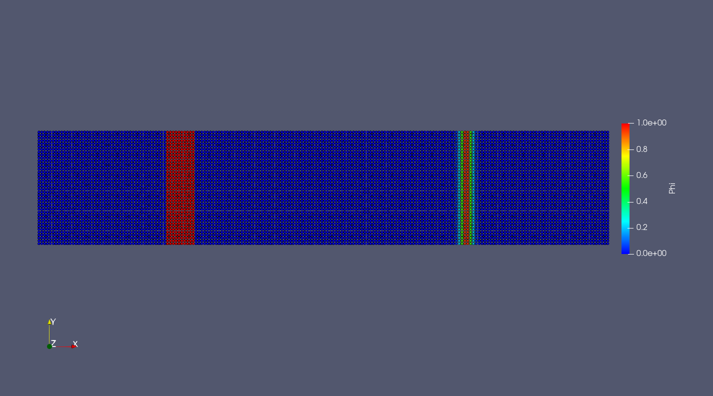

In this chapter, we will introduce a new physical process - diffusion, which can be the mass transfer,
heat transfer and some other diffusion process involved in biology, chemistry, physics, and so on.
We will use a simpl diffusion case to help us to understand the building up of diffusion in SPHinXsys.

=======================
Example 7: 2D diffusion
=======================

The following program is a system where the diffusion body has diffusion sources,
and the diffusion method in this case is the anisotropic diffusion.

As shown in the following figure, there are two diffusion sources within the solid body,
the left side one is a uniform diffusion source and the right side one is a variable 
diffusion source.

   Initial distribution of diffusion sources within the diffusion body.
   
Let's go through the code to see how to build up and simulate a diffusion process.

First, we need define the geometry parameters and material properties, including 
the length and height of the diffusion body, particle reference resolution, diffsuion body boundings,
diffusion coefficient, etc.

.. code-block:: cpp

	/** SPHinXsys Library. */
	#include "sphinxsys.h"
	/** Namespace cite here. */
	using namespace SPH;
	/** Geometry parameter. */
	Real L = 2.0; 	
	Real H = 0.4;
	/** Particle spacing. */
	Real resolution_ref = H / 40.0;
	/** Domain bounds of the system. */
	BoundingBox system_domain_bounds(Vec2d(0.0, 0.0), Vec2d(L, H));

	/** Material properties. */
	Real diffusion_coff = 1.0e-4;
	Real bias_diffusion_coff = 0.0;
	Real alpha = Pi / 6.0;
	Vec2d bias_direction(cos(alpha), sin(alpha));

Then we creat the shape of the diffusion body with typical points. Please note the point is defined as clockwise

.. code-block:: cpp

	/**
	* @brief create a block shape
	*/
	std::vector<Vecd> CreatShape()
	{
			//geometry
			std::vector<Vecd> shape;
			shape.push_back(Vecd(0.0, 0.0));
			shape.push_back(Vecd(0.0,  H));
			shape.push_back(Vecd( L,  H));
			shape.push_back(Vecd( L, 0.0));
			shape.push_back(Vecd(0.0, 0.0));

			return shape;
	}

The geometry and initial conditions of diffusion body are defined here.
The :code:`DiffusionBody` is inherited from :code:`SolidBody`, and has it own case-dependent
building method. The material of the diffusion body is defined with the 
directional diffusion property, which is a kind of anisotropic diffusion.
The initial condition of the solid body is defined with constant temperature.

.. code-block:: cpp

	/** Define geometry and initial conditions of SPH bodies. */
	class DiffusionBody : public SolidBody
	{
	public:
			DiffusionBody(SPHSystem &system, std::string body_name)
					: SolidBody(system, body_name)
			{
					std::vector<Vecd> body_shape = CreatShape();
					body_shape_ = new ComplexShape(body_name);
					body_shape_->addAPolygon(body_shape, ShapeBooleanOps::add);
			}
	};
	/**
 	* Setup diffusion material properties
 	*/
	class DiffusionBodyMaterial
			: public DiffusionReactionMaterial<SolidParticles, Solid>
	{
	public:
			DiffusionBodyMaterial()
					: DiffusionReactionMaterial<SolidParticles, Solid>()
			{
					insertASpecies("Phi");
					assignDerivedMaterialParameters();
					initializeDiffusion();
			}

			/** Initialize diffusion reaction material. */
			virtual void initializeDiffusion() override {
					DirectionalDiffusion* phi_diffusion
							= new DirectionalDiffusion(species_indexes_map_["Phi"], species_indexes_map_["Phi"],
									diffusion_coff, bias_diffusion_coff, bias_direction);
					species_diffusion_.push_back(phi_diffusion);
			};
	};
	
The dependent initial condition of diffusion socures are defined here.
One is the uniform diffusion source and the other one is the exponential
distribution diffusion source.

.. code-block:: cpp

	/**
 	* application dependent initial condition 
 	*/
	class DiffusionBodyInitialCondition 
			: public DiffusionReactionInitialCondition<SolidBody, SolidParticles, Solid>
	{
	protected:
			size_t phi_;

			void Update(size_t index_i, Real dt) override
			{

       		 if(pos_n_[index_i][0] >= 0.45 && pos_n_[index_i][0] <= 0.55)
					 {
							 species_n_[phi_][index_i] = 1.0;
					 }
	         if(pos_n_[index_i][0] >= 1.0)
		       {
		           species_n_[phi_][index_i] = exp(-2500.0 
				           * ((pos_n_[index_i][0] - 1.5) * (pos_n_[index_i][0] - 1.5)));
	       	 }
     	};
	public:
			DiffusionBodyInitialCondition(SolidBody* diffusion_body) : 
					DiffusionReactionInitialCondition<SolidBody, SolidParticles, Solid>(diffusion_body) {
					phi_ = material_->SpeciesIndexMap()["Phi"];
			};
	};
	
Here is the definition of diffusion relaxation method. In this case, there is only one body,
so we use the :code:`InnerBodyRelation`. If you have several diffusion bodies, you can choose different
body relationship, such as :code:`ContactBodyRelation` and :code:`ComplexBodyRelation`. 

.. code-block:: cpp

	/** Set diffusion relaxation. */
	class DiffusionBodyRelaxation
			: public RelaxationOfAllDiffusionSpeciesRK2<SolidBody, SolidParticles, Solid,
			RelaxationOfAllDiffussionSpeciesInner<SolidBody, SolidParticles, Solid>, 
			InnerBodyRelation>
	{
	public:
			DiffusionBodyRelaxation(InnerBodyRelation* body_inner_relation)
					: RelaxationOfAllDiffusionSpeciesRK2(body_inner_relation) {
			};
			virtual ~DiffusionBodyRelaxation() {};
	};
	

In the main function, we need to build up a :code:`SPHSystem`, in which the boundings 
of the whole calculation domain are defined. Then we need to creat the :code:`diffusion_body`
as well as the :code:`diffusion_body_material` and :code:`diffusion_body_particles` in the case
from the class we have defined previous. The relation in the diffusion body :code:`diffusion_body_inner_relation`
is also defined here.

.. code-block:: cpp

	/** Build up context -- a SPHSystem. */
	SPHSystem sph_system(system_domain_bounds, relosution_ref);
	GlobalStaticVariables::physical_time_ = 0.0;
	/** Configuration of materials, crate particle container and diffusion body. */
	DiffusionBody *diffusion_body  =  new DiffusionBody(sph_system, "DiffusionBody");
	DiffusionBodyMaterial *diffusion_body_material = new DiffusionBodyMaterial();
	DiffusionReactionParticles<SolidParticles, Solid>	diffusion_body_particles(diffusion_body, diffusion_body_material);
	
	/** topology */
	InnerBodyRelation* diffusion_body_inner_relation = new InnerBodyRelation(diffusion_body);

Next is the define the methed used in this case, including the general method: time stepping, 
solid dynamics, and the methods for diffusion relaxtion as well as boundary conditions.
These are also instantiating some previous defined classes

.. code-block:: cpp

	/**
	 * The main dynamics algorithm is defined start here.
	 */
	/** Case setup */
	DiffusionBodyInitialCondition setup_diffusion_initial_condition(diffusion_body);
	/** Corrected strong configuration for diffusion body. */	
	solid_dynamics::CorrectConfiguration 			correct_configuration(diffusion_body_inner_relation);
	/** Time step size calculation. */
	GetDiffusionTimeStepSize<SolidBody, SolidParticles, Solid> get_time_step_size(diffusion_body);
	/** Diffusion process for diffusion body. */
	DiffusionBodyRelaxation 			diffusion_relaxation(diffusion_body_inner_relation);
	/** Periodic BCs. */
	PeriodicConditionInAxisDirectionUsingCellLinkedList	periodic_condition_y(diffusion_body, 1);
	
Before the main loop, we define the output files. By changing :code:`WriteBodyStatesToVtu` to :code:`WriteBodyStatesToPlt`, 
we can use software Tecplot to check the particle distribution in .plt files.

And then generate the initial cell linked lists and configurations, and define the output time interval.
We also need to setup the initial condition, the periodic boundary conditions to build up the initial 
state of the diffusion body system.

.. code-block:: cpp

	In_Output 							in_output(sph_system);
	WriteBodyStatesToVtu 				write_states(in_output, sph_system.real_bodies_);

	/** Pre-simultion*/
	sph_system.initializeSystemCellLinkedLists();
	periodic_condition_y.update_cell_linked_list_.parallel_exec();
	sph_system.initializeSystemConfigurations();
	correct_configuration.parallel_exec();
	setup_diffusion_initial_condition.exec();
	/** Output global basic parameters. */
	write_states.WriteToFile(GlobalStaticVariables::physical_time_);

	int ite 				      = 0;
	Real T0 				      = 1.0;
	Real End_Time 		    = T0;
	Real Output_Time 	    = 0.1 * End_Time;
	Real Observe_time 		= 0.1 * Output_Time;
	Real dt		 		      	= 0.0;
	/** Statistics for computing time. */
	tick_count t1 = tick_count::now();
	tick_count::interval_t interval;
	
The main loops are defined in the following piece of code. In the SPHinxsys, 
we use the second order Runge-Kutta method to solve the diffusion equations.
During the calulation, we also need to output the result with defined intervals.

.. code-block:: cpp

	/** Main loop starts here. */ 
	while (GlobalStaticVariables::physical_time_ < End_Time)
	{
			Real integration_time = 0.0;
			while (integration_time < Output_Time) 
			{
					Real relaxation_time = 0.0;
					while (relaxation_time < Observe_time)
					{
							if (ite % 1 == 0)
							{
									std::cout << "N=" << ite << " Time: "
											<< GlobalStaticVariables::physical_time_ << "	dt: "
											<< dt << "\n";
							}

							diffusion_relaxation.parallel_exec(dt);

							ite++;
							dt = get_time_step_size.parallel_exec();
							relaxation_time += dt;
							integration_time += dt;
							GlobalStaticVariables::physical_time_ += dt;
							write_states.WriteToFile(GlobalStaticVariables::physical_time_);
					}
			}

			tick_count t2 = tick_count::now();
			write_states.WriteToFile(GlobalStaticVariables::physical_time_);
			tick_count t3 = tick_count::now();
			interval += t3 - t2;
	}
	tick_count t4 = tick_count::now();

	tick_count::interval_t tt;
	tt = t4 - t1 - interval;
	std::cout << "Total wall time for computation: " << tt.seconds() << " seconds." << std::endl;
	std::system("Pause");
	return 0;
	
Now, we have finished the whole process of the diffusion case. When we get the result, we can use the visualization
software ParaView to produce the distribution of parameter as shown in the following figure.

   An snapshot of the distribution after 1 second diffusion process.

Actually, this parameter can be the temperature, mass, concentration and any other materials can be diffuses. There are 
also several other diffusion methods defined in the SPHinXsys, which can deal with different physical problems.
