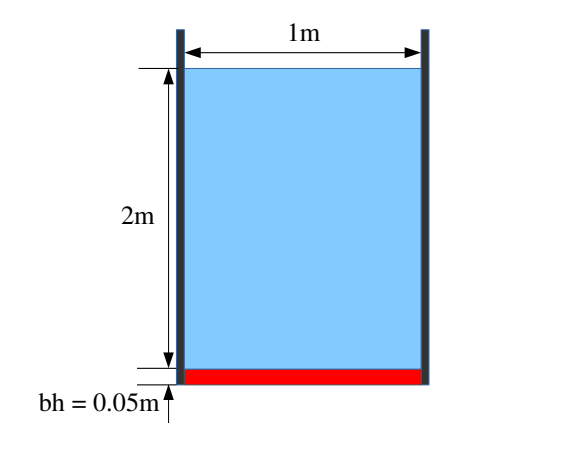
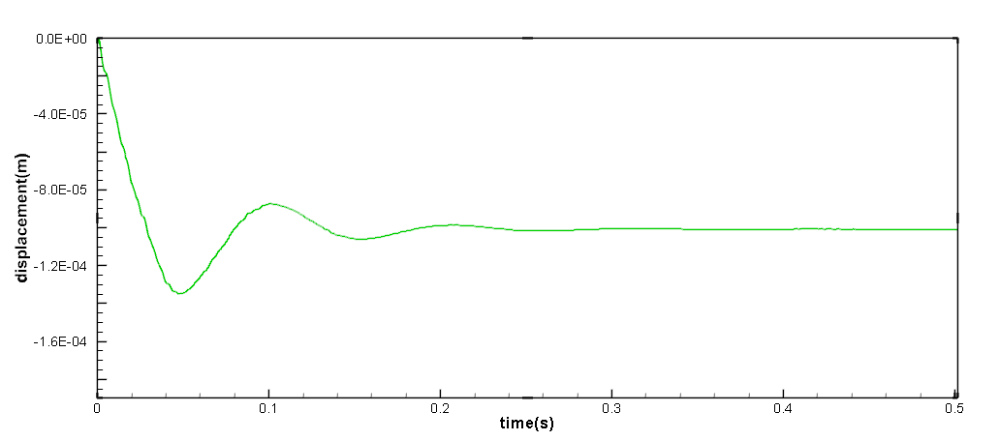

This case relates to the deformation of an elastic plate induced by hydrostatic pressure of a water column. 
At the begining, the aluninum plate is suddenly exposed to the hydrostatic pressure and an equilibrium 
state can be reached after initial oscillations.
A dynamic relaxation method is imposed to accelerate the convergence rate.

=======================================================
Example 8: Hydrostatic water column on an elastic plate
=======================================================

As shown in the figure, 
the aluminum palte locates at the bottom of the water column with two sides constrained.

   Initial configuration

First, we define the geometries for modeling the elastic plate and water.

.. code-block:: cpp

		/**
	* @brief 	Basic geometry parameters and numerical setup.
	*/
	Real DL = 1.0; 									/**< Tank length. */
	Real DH = 2.1; 									/**< Tank height. */
	Real Dam_L = 1.0; 								/**< Water block width. */
	Real Dam_H = 2.0; 								/**< Water block height. */
	Real Gate_width = 0.05;							/**< Width of the gate. */
	Real particle_spacing_ref = Gate_width / 4.0; 	/**< Initial reference particle spacing. 8, 10, 12 */
	Real BW = 4.0 * particle_spacing_ref; 			/**< Extending width for BCs. */
	BoundingBox system_domain_bounds(Vec2d(-BW, -BW), Vec2d(DL + BW, DH + BW));
	/** The offset that the rubber gate shifted above the tank. */
	Real dp_s = 0.5 * particle_spacing_ref;
	Vec2d offset = Vec2d(0.0, 0.0);
	//----------------------------------------------------------------------
	//	Define the corner point of water block geomerty.
	//----------------------------------------------------------------------
	Vec2d DamP_lb(0.0, 0.0); 		/**< Left bottom. */
	Vec2d DamP_lt(0.0, Dam_H); 		/**< Left top. */
	Vec2d DamP_rt(Dam_L, Dam_H); 	/**< Right top. */
	Vec2d DamP_rb(Dam_L, 0.0); 		/**< Right bottom. */
	//----------------------------------------------------------------------
	//	Define the corner point of gate geomerty.
	//----------------------------------------------------------------------
	Vec2d GateP_lb(-BW, -Gate_width);
	Vec2d GateP_lt(-BW, 0.0);
	Vec2d GateP_rt(Dam_L + BW, 0.0);
	Vec2d GateP_rb(Dam_L + BW, -Gate_width);
	//----------------------------------------------------------------------
	//	Define the geomerty for gate constrian.
	//----------------------------------------------------------------------
	Vec2d ConstrainLP_lb(-BW, -Gate_width);
	Vec2d ConstrainLP_lt(-BW, 0.0);
	Vec2d ConstrainLP_rt(0.0, 0.0);
	Vec2d ConstrainLP_rb(0.0, -Gate_width);
	Vec2d ConstrainRP_lb(Dam_L, -Gate_width);
	Vec2d ConstrainRP_lt(Dam_L, 0.0);
	Vec2d ConstrainRP_rt(Dam_L + BW, 0.0);
	Vec2d ConstrainRP_rb(Dam_L + BW, -Gate_width);

Then, we give material properites regarding to the fluid and the elastic gate by the following code piece.

.. code-block:: cpp
	
	//----------------------------------------------------------------------
	//	Material properties of the fluid.
	//----------------------------------------------------------------------
	Real rho0_f = 1000.0;							/**< Reference density of fluid. */
	Real gravity_g = 9.81; 							/**< Value of gravity. */
	Real U_max = 2.0 * sqrt(Dam_H * gravity_g); ;	/**< Characteristic velocity. */
	Real c_f = 10.0 * U_max; 						/**< Reference sound speed. */
	Real Re = 0.1;							/**< Reynolds number. */
	Real mu_f = rho0_f * U_max * DL / Re;		/**< Dynamics viscosity. */
	//----------------------------------------------------------------------
	//	Material properties of the elastic gate.
	//----------------------------------------------------------------------
	Real rho0_s = 2700.0; 					/**< Reference solid density. */
	Real poisson = 0.34; 					/**< Poisson ratio. */
	Real Ae = 6.75e10; 						/**< Normalized Youngs Modulus. */
	Real Youngs_modulus = Ae;

The fluid body is created and the water block is defined.

.. code-block:: cpp

	/**
	* @brief  fluid body definition.
	*/
	std::vector<Vecd> CreatWaterBlockShape()
	{
		std::vector<Vecd> water_block_shape;
		water_block_shape.push_back(DamP_lb);
		water_block_shape.push_back(DamP_lt);
		water_block_shape.push_back(DamP_rt);
		water_block_shape.push_back(DamP_rb);
		water_block_shape.push_back(DamP_lb);

		return water_block_shape;
	}
	class WaterBlock : public FluidBody
	{
	public:
		WaterBlock(SPHSystem& system, std::string body_name)
			: FluidBody(system, body_name)
		{
			/** Geomerty definition. */
			std::vector<Vecd> water_block_shape = CreatWaterBlockShape();
			body_shape_ = new ComplexShape(body_name);
			body_shape_->addAPolygon(water_block_shape, ShapeBooleanOps::add);
		}
	};
	/**
	* @brief 	Case dependent material properties definition.
	*/
	class WaterMaterial : public WeaklyCompressibleFluid
	{
	public:
		WaterMaterial() : WeaklyCompressibleFluid()
		{
			rho_0_ = rho0_f;
			c_0_ = c_f;
			assignDerivedMaterialParameters();
		}
	};	

The shape of the wall is created and the wall boundary is defined.

.. code-block:: cpp

	/**
	* @brief  wall body definition.
	*/
	std::vector<Vecd> CreatOuterWallShape()
	{
		std::vector<Vecd> outer_wall_shape;
		outer_wall_shape.push_back(Vecd(-BW, 0.0));
		outer_wall_shape.push_back(Vecd(-BW, DH));
		outer_wall_shape.push_back(Vecd(0.0, DH));
		outer_wall_shape.push_back(Vecd(0.0, 0.0));
		outer_wall_shape.push_back(Vecd(-BW, 0.0));

		return outer_wall_shape;
	}

	std::vector<Vecd> CreatInnerWallShape()
	{
		std::vector<Vecd> inner_wall_shape;
		inner_wall_shape.push_back(Vecd(DL, 0.0));
		inner_wall_shape.push_back(Vecd(DL, DH));
		inner_wall_shape.push_back(Vecd(DL + BW, DH));
		inner_wall_shape.push_back(Vecd(DL + BW, 0.0));
		inner_wall_shape.push_back(Vecd(DL, 0.0));

		return inner_wall_shape;
	}

	class WallBoundary : public SolidBody
	{
	public:
		WallBoundary(SPHSystem& system, std::string body_name)
			: SolidBody(system, body_name)
		{
			/** Geomerty definition. */
			std::vector<Vecd> outer_wall_shape = CreatOuterWallShape();
			std::vector<Vecd> inner_wall_shape = CreatInnerWallShape();
			body_shape_ = new ComplexShape(body_name);
			body_shape_->addAPolygon(outer_wall_shape, ShapeBooleanOps::add);
			body_shape_->addAPolygon(inner_wall_shape, ShapeBooleanOps::add);
		}
	};

Then creat the gate shape and define the gate body.

.. code-block:: cpp

	//----------------------------------------------------------------------
	//	create a gate shape
	//----------------------------------------------------------------------
	std::vector<Vecd> CreatGateShape()
	{
		std::vector<Vecd> gate_shape;
		gate_shape.push_back(GateP_lb);
		gate_shape.push_back(GateP_lt);
		gate_shape.push_back(GateP_rt);
		gate_shape.push_back(GateP_rb);
		gate_shape.push_back(GateP_lb);

		return gate_shape;
	}
	//----------------------------------------------------------------------
	//	Define the elastic gate body.
	//----------------------------------------------------------------------
	class Gate : public SolidBody
	{
	public:
		Gate(SPHSystem& system, std::string body_name)
			: SolidBody(system, body_name, new ParticleAdaptation(1.15, 0))
		{
			/** Geomerty definition. */
			std::vector<Vecd> gate_shape = CreatGateShape();
			body_shape_ = new ComplexShape(body_name);
			body_shape_->addAPolygon(gate_shape, ShapeBooleanOps::add);
		}
	};

Note that the gate is constrained on both left and right sides.
Thus, the gate constrain needs to be defined.

.. code-block:: cpp

	//----------------------------------------------------------------------
	//	create left Gate constrain shape
	//----------------------------------------------------------------------
	std::vector<Vecd> CreatGateConstrainShapeLeft()
	{
		//geometry
		std::vector<Vecd> gate_constrain_shape;
		gate_constrain_shape.push_back(ConstrainLP_lb);
		gate_constrain_shape.push_back(ConstrainLP_lt);
		gate_constrain_shape.push_back(ConstrainLP_rt);
		gate_constrain_shape.push_back(ConstrainLP_rb);
		gate_constrain_shape.push_back(ConstrainLP_lb);

		return gate_constrain_shape;
	}
	//----------------------------------------------------------------------
	//	create right Gate constrain shape
	//----------------------------------------------------------------------
	std::vector<Vecd> CreatGateConstrainShapeRight()
	{
		//geometry
		std::vector<Vecd> gate_constrain_shape;
		gate_constrain_shape.push_back(ConstrainRP_lb);
		gate_constrain_shape.push_back(ConstrainRP_lt);
		gate_constrain_shape.push_back(ConstrainRP_rt);
		gate_constrain_shape.push_back(ConstrainRP_rb);
		gate_constrain_shape.push_back(ConstrainRP_lb);

		return gate_constrain_shape;
	}
	//----------------------------------------------------------------------
	//	create define body part which will be constrained.
	//----------------------------------------------------------------------
	class GateConstrain : public BodyPartByParticle
	{
	public:
		GateConstrain(SolidBody* solid_body, std::string constrianed_region_name)
			: BodyPartByParticle(solid_body, constrianed_region_name)
		{
			/* Geometry defination */
			std::vector<Vecd> gate_constrain_shape_left = CreatGateConstrainShapeLeft();
			body_part_shape_ = new ComplexShape(constrianed_region_name);
			body_part_shape_->addAPolygon(gate_constrain_shape_left, ShapeBooleanOps::add);
	
			/* Geometry defination */
			std::vector<Vecd> gate_constrain_shape_right = CreatGateConstrainShapeRight();
			body_part_shape_->addAPolygon(gate_constrain_shape_right, ShapeBooleanOps::add);

			//tag the constrained particle
			tagBodyPart();
		}
	};

Here, the gate material is imposed.

.. code-block:: cpp

	//----------------------------------------------------------------------
	//	Define gate material.
	//----------------------------------------------------------------------
	class GateMaterial : public LinearElasticSolid
	{
	public:
		GateMaterial() : LinearElasticSolid()
		{
			rho_0_ = rho0_s;
			E_0_ = Youngs_modulus;
			nu_ = poisson;
			assignDerivedMaterialParameters();
		}
	};	

Initially, all particles have been set to be at rest.

In the main function, we need to build up a SPHSystem, in which the bounds of the whole calculation domain are defined. 
Then we create the fluid body, wall and gate as well as their relations in the case. 
Note that the "observer" is defined for outputing the concerned variables.

.. code-block:: cpp

	//----------------------------------------------------------------------
	//	Build up -- a SPHSystem
	//----------------------------------------------------------------------
	SPHSystem system(system_domain_bounds, particle_spacing_ref);
	/** Define the external force. */
	Gravity gravity(Vecd(0.0, -gravity_g));
	/** Set the starting time to zero. */
	GlobalStaticVariables::physical_time_ = 0.0;
	//----------------------------------------------------------------------
	//	Creating body, materials and particles.
	//----------------------------------------------------------------------
	WaterBlock* water_block = new WaterBlock(system, "WaterBody");
	WaterMaterial* water_material = new WaterMaterial();
	FluidParticles 	fluid_particles(water_block, water_material);
	WallBoundary* wall_boundary = new WallBoundary(system, "Wall");
	SolidParticles 	wall_boundary_particles(wall_boundary);
	GateMaterial* gate_material = new GateMaterial();
	Gate* gate = new Gate(system, "Gate");
	ElasticSolidParticles 	gate_particles(gate, gate_material);
	//----------------------------------------------------------------------
	//	Particle and body creation of gate observer.
	//----------------------------------------------------------------------
	Observer* gate_observer = new Observer(system, "Observer");
	BaseParticles 	observer_particles(gate_observer);
	//----------------------------------------------------------------------
	//	Define body relation map.
	//	The contact map gives the topological connections between the bodies.
	//	Basically the the range of bodies to build neighbor particle lists.
	//----------------------------------------------------------------------
	BodyRelationInner* water_block_inner = new BodyRelationInner(water_block);
	BodyRelationInner* gate_inner = new BodyRelationInner(gate);
	ComplexBodyRelation* water_block_complex = new ComplexBodyRelation(water_block_inner, { wall_boundary, gate });
	BodyRelationContact* gate_contact = new BodyRelationContact(gate, { water_block });
	BodyRelationContact* gate_observer_contact = new BodyRelationContact(gate_observer, { gate });

After creating the bodies, the method related with fluid, solid dynamics and FSI will be defined.
First, initialize particle acceleration.

.. code-block:: cpp

	/** Initialize particle acceleration. */
	InitializeATimeStep 	initialize_a_fluid_step(water_block, &gravity);

Then, we give the algorithms for fluid dynamics.

.. code-block:: cpp

	//----------------------------------------------------------------------
	//	Define all numerical methods which are used in this case.
	//----------------------------------------------------------------------
	/** Initialize particle acceleration. */
	TimeStepInitialization 	initialize_a_fluid_step(water_block, &gravity);
	 /** Evaluation of fluid density by summation approach. */
	fluid_dynamics::DensitySummationFreeSurfaceComplex		update_fluid_density(water_block_complex);
	/** Compute time step size without considering sound wave speed. */
	fluid_dynamics::AdvectionTimeStepSize			get_fluid_advection_time_step_size(water_block, U_max);
	/** Compute time step size with considering sound wave speed. */
	fluid_dynamics::AcousticTimeStepSize get_fluid_time_step_size(water_block);
	/** Pressure relaxation using verlet time stepping. */
	fluid_dynamics::PressureRelaxationWithWall
		pressure_relaxation(water_block_complex);
	fluid_dynamics::DensityRelaxationRiemannWithWall
		density_relaxation(water_block_complex);
	fluid_dynamics::ViscousAccelerationWithWall 	viscous_acceleration(water_block_complex);
	DampingWithRandomChoice<DampingPairwiseWithWall<indexVector, Vec2d, DampingPairwiseInner>>
		fluid_damping(water_block_complex, 0.2, "Velocity", mu_f);

Note that the :code:`DampingWithRandomChoice` is the function to impose the artificial-viscosity-based damping into the system.
The damping is efficient and can accelerate the convergence rate to steady state for a dynamic system.
The solid dynamcis algorithms are as follows.

.. code-block:: cpp

	/** Corrected strong configuration. */
	solid_dynamics::CorrectConfiguration 	gate_corrected_configuration_in_strong_form(gate_inner);
	/** Compute time step size of elastic solid. */
	solid_dynamics::AcousticTimeStepSize 	gate_computing_time_step_size(gate);
	/** Stress relaxation stepping for the elastic gate. */
	solid_dynamics::StressRelaxationFirstHalf	gate_stress_relaxation_first_half(gate_inner);
	solid_dynamics::StressRelaxationSecondHalf	gate_stress_relaxation_second_half(gate_inner);
	/**Constrain a solid body part.  */
	solid_dynamics::ConstrainSolidBodyRegion
		gate_constrain(gate, new GateConstrain(gate, "GateConstrain"));
	/** Update the norm of elastic gate. */
	solid_dynamics::UpdateElasticNormalDirection 	gate_update_normal(gate);
	/** Compute the average velocity of gate. */
	solid_dynamics::AverageVelocityAndAcceleration 		average_velocity_and_acceleration(gate);
	 

We still need to define the method for FSI, which computes the pressure force acting on solid particles.

.. code-block:: cpp

	/**
	* @brief Algorithms of FSI.
	*/
	/** Compute the force exerted on elastic gate due to fluid pressure. */
	solid_dynamics::FluidPressureForceOnSolid 	fluid_pressure_force_on_gate(gate_contact);

Before the main loop, 
we define the output files. 
If using the software Paraview to visualize the outputs, 
you can choose the :code:`WriteBodyStatesToVtu`.
Otherwise,
the :code:`WriteBodyStatesToPlt` leads .plt files, which can be readed by Tecplot.

.. code-block:: cpp
	
	//----------------------------------------------------------------------
	//	Define simple file input and outputs functions.
	//----------------------------------------------------------------------
	In_Output in_output(system);
	/** Output body states for visualization. */
	BodyStatesRecordingToPlt 	rite_real_body_states_to_plt(in_output, system.real_bodies_);
	/** Output body states for visualization. */
	BodyStatesRecordingToVtu 	write_real_body_states_to_vtu(in_output, system.real_bodies_);
	/** Output the observed displacement of gate free end. */
	ObservedQuantityRecording<indexVector, Vecd>
	write_beam_tip_displacement("Position", in_output, gate_observer_contact);

Then, we need to generate the initial cell linked lists and configurations, and define the output time interval.   
   
.. code-block:: cpp

	//----------------------------------------------------------------------
	//	Prepare quantities will be used once only and initial condition.
	//----------------------------------------------------------------------
	/** initialize cell linked lists for all bodies. */
	system.initializeSystemCellLinkedLists();
	/** initialize configurations for all bodies. */
	system.initializeSystemConfigurations();
	/** computing surface normal direction for the wall. */
	wall_boundary_particles.initializeNormalDirectionFromGeometry();
	/** computing surface normal direction for the insert body. */
	gate_particles.initializeNormalDirectionFromGeometry();
	/**
	 * @brief Pre-simulation.
	 */
	 /** computing linear reproducing configuration for the insert body. */
	gate_corrected_configuration_in_strong_form.parallel_exec();
	write_real_body_states_to_vtu.writeToFile(0);
	write_beam_tip_displacement.writeToFile(0);
	//----------------------------------------------------------------------
	//	Basic control parameters for time stepping.
	//----------------------------------------------------------------------
	size_t number_of_iterations = 0;
	int screen_output_interval = 100;
	Real End_Time = 0.5;			/**< End time. */
	Real D_Time = End_Time / 50.0;	/**< time stamps for output. */
	Real Dt = 0.0;					/**< Default advection time step sizes. */
	Real dt = 0.0; 					/**< Default acoustic time step sizes. */
	Real dt_s = 0.0;				/**< Default acoustic time step sizes for solid. */
	tick_count t1 = tick_count::now();
	tick_count::interval_t interval;

The main loops are defined in the following piece of code.

.. code-block:: cpp

	/**
	* @brief Main loop starts here.
	*/
	while (GlobalStaticVariables::physical_time_ < End_Time)
	{
		Real integeral_time = 0.0;
		/** Integrate time (loop) until the next output time. */
		while (integeral_time < D_Time)
		{
			/** Acceleration due to viscous force and gravity. */
			initialize_a_fluid_step.parallel_exec();
			Dt = get_fluid_adevction_time_step_size.parallel_exec();
			update_fluid_desnity.parallel_exec();
			/** Update normal direction on elastic body. */
			gate_update_normal.parallel_exec();
			Real relaxation_time = 0.0;
			while (relaxation_time < Dt)
			{
				dt = SMIN(get_fluid_time_step_size.parallel_exec(), Dt);
				fluid_damping.parallel_exec(dt);
				/** Fluid relaxation and force computaton. */
				pressure_relaxation.parallel_exec(dt);
				fluid_pressure_force_on_gate.parallel_exec();
				density_relaxation.parallel_exec(dt);
				/** Solid dynamics time stepping. */
				Real dt_s_sum = 0.0;
				average_velocity_and_acceleration.initialize_displacement_.parallel_exec();
				while (dt_s_sum < dt)
				{
					if (dt - dt_s_sum < dt_s) dt_s = dt - dt_s_sum;
					gate_stress_relaxation_first_half.parallel_exec(dt_s);
					gate_constrain.parallel_exec();
					gate_stress_relaxation_second_half.parallel_exec(dt_s);
					dt_s_sum += dt_s;
					dt_s = gate_computing_time_step_size.parallel_exec();
				}
				average_velocity_and_acceleration.update_averages_.parallel_exec(dt);
				relaxation_time += dt;
				integeral_time += dt;
				GlobalStaticVariables::physical_time_ += dt;
			}
			if (number_of_iterations % screen_output_interval == 0)
			{
				std::cout << std::fixed << std::setprecision(9) << "N=" << number_of_iterations << "	Time = "
					<< GlobalStaticVariables::physical_time_
					<< "	Dt = " << Dt << "	dt = " << dt << "	dt_s = " << dt_s << "\n";
			}
			number_of_iterations++;

			/** Update cell linked list and configuration. */

			water_block->updateCellLinkedList();
			water_block_complex->updateConfiguration();
			/** one need update configuration after periodic condition. */
			gate->updateCellLinkedList();
			gate_contact->updateConfiguration();
		
			/** Output the observed data. */
			write_beam_tip_displacement.WriteToFile(GlobalStaticVariables::physical_time_);
		}
		tick_count t2 = tick_count::now();
		write_real_body_states_to_vtu.WriteToFile(GlobalStaticVariables::physical_time_ * 0.001);
		tick_count t3 = tick_count::now();
		interval += t3 - t2;
	}

The below figure shows the displacement of the mid-span of the plate.
It can be observed that the solution reaches the equilibrium state rapidly with the artificial-viscosity-based damping imposed. 
We also want to mention that the added damping improves the numerical stability of the method and a larger time-step size is allowed.

   The time history of the mid-span displacement

