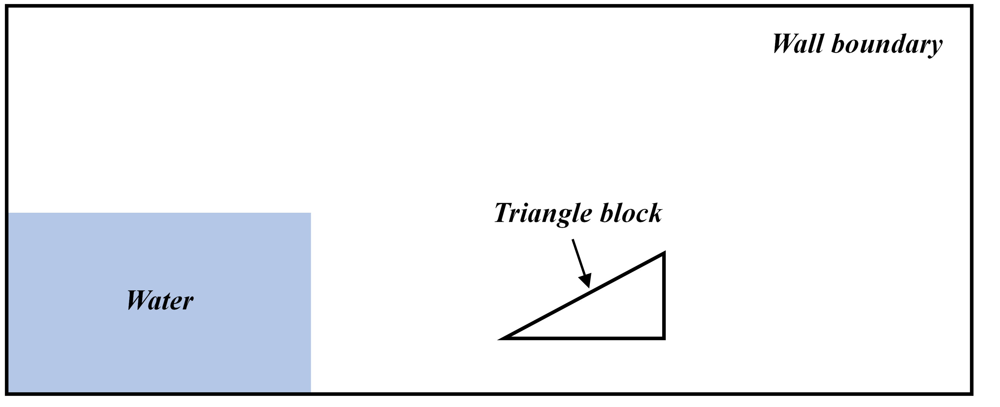
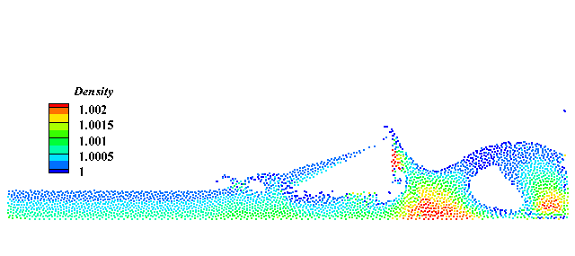
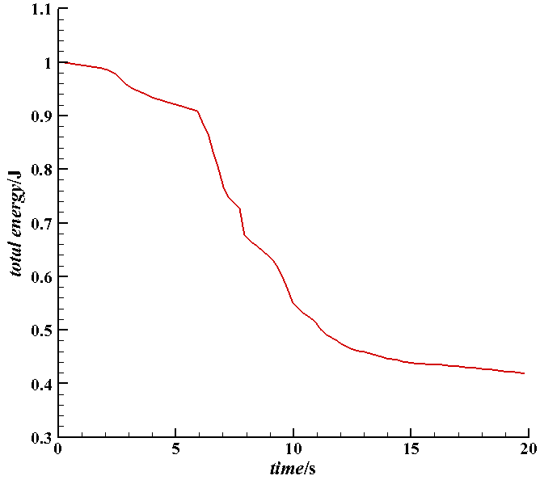

In this section we will simulate a system with a new wall boundary model, in which the solid wall is static confinement. 
The static confinement boundary model can be applied to handle complex geometry boundary with multi-resolution method.  

=================================
Example 9: 2D static confinement
=================================

The following program creates a system for the dam break with a triangle block as shown in the figure. 
The wall and the triangle block boundary are static confinement. 

   Initial geometry model in the 2D static confinement problem

There is no need to use particles to present the solid wall boundary.
The wall boundary surface are modeled by level set method.
The density summation near the wall and fluid-wall interaction force are calculated by integration.

Let's go through the code to see how to implement the static confinment boundary.

First, we define the geometry parameters, including length :code:`DL` and height :code:`DH` of the tank, 
the length :code:`LL` and height :code:`LH` of the water colume, the particle size :code:`resolution_ref`,
as well as material properties, including density of fluid :code:`rho0_f`, gravity :code:`gravity_g`, 
Characteristic velocity :code:`U_max`and sound speed :code:`c_f`.
:code:`BoundingBox` is used to define the bound of the computational domain. Considered the thick of the boundary, 
left bottom corner and right upper coner coordinates should be given to define the bound of computational domain.

.. code-block:: cpp

  /**
  * @brief 	SPHinXsys Library.
  */
  #include "sphinxsys.h"
	/**
   * @brief Namespace cite here.
   */
  using namespace SPH;
  /**
   * @brief Basic geometry parameters and numerical setup.
   */
  Real DL = 5.366; 						/**< Tank length. */
  Real DH = 5.366; 						/**< Tank height. */
  Real LL = 2.0; 							/**< Liquid colume length. */
  Real LH = 1.0; 							/**< Liquid colume height. */
  Real resolution_ref = 0.025; 			/**< Global reference resolution. */
  Real BW = resolution_ref * 4; 			/**< Extending width for BCs. */
  /** Domain bounds of the system. */
  BoundingBox system_domain_bounds(Vec2d(-BW, -BW), Vec2d(DL + BW, DH + BW));
  /**
   * @brief Material properties of the fluid.
   */
  Real rho0_f = 1.0;						/**< Reference density of fluid. */
  Real gravity_g = 1.0;					/**< Gravity force of fluid. */
  Real U_max = 2.0*sqrt(gravity_g*LH);		/**< Characteristic velocity. */
  Real c_f = 10.0* U_max;					/**< Reference sound speed. */
	
Then we create the shape of the wall and the triangle block. To create the wall geometry, 
we create a vector named :code:`inner_wall_shape` and input the coordinates of every boundary corner clockwisely to the vector 
by using :code:`.push_back`. Similar way is used to create the geometry of the triangle block.

.. code-block:: cpp

	/**
	* @brief create wall shape
	**/

    std::vector<Vecd> createWallShape()
	{
	std::vector<Vecd> inner_wall_shape;
	inner_wall_shape.push_back(Vecd(0.0, 0.0));
	inner_wall_shape.push_back(Vecd(0.0, DH));
	inner_wall_shape.push_back(Vecd(DL, DH));
	inner_wall_shape.push_back(Vecd(DL, 0.0));
	inner_wall_shape.push_back(Vecd(0.0, 0.0));

	return inner_wall_shape;
	}
	
	/** create a structure shape */
	std::vector<Vecd> createStructureShape()
	{
	//geometry
	std::vector<Vecd> water_block_shape;
	water_block_shape.push_back(Vecd(0.5 * DL, 0.05 * DH));
	water_block_shape.push_back(Vecd(0.5 * DL + 0.5 * LL, 0.05 * DH + 0.5 * LH));
	water_block_shape.push_back(Vecd(0.5 * DL + 0.5 * LL, 0.05 * DH));
	water_block_shape.push_back(Vecd(0.5 * DL, 0.05 * DH));
	return water_block_shape;
	}

The fluid body and material properties are defined. The function :code:`createWaterBlockShape()` is applied to 
related to the geometry we have already defined in above step. We use :code:`addAPolygon` and switch :code:`ShapeBooleanOps` to 
:code:`add` to add the shape of the fluid body.
We define the fluid material by using :code:`public WeaklyCompressibleFluid`. The basic material like density :code:`rho0_f` and 
sound speed :code:`c_f` is defined in the above step. By calling the function :code:`assignDerivedMaterialParameters()`, some derived 
parameters are calculated, as reference pressure.

.. code-block:: cpp

	/**
	*@brief 	Fluid body definition.
	*/
	class WaterBlock : public FluidBody
	{
	public:
		WaterBlock(SPHSystem& sph_system, string body_name)
			: FluidBody(sph_system, body_name)
		{
			/** Geomtry definition. */
			std::vector<Vecd> water_block_shape = createWaterBlockShape();
			body_shape_ = new ComplexShape(body_name);
			body_shape_->addAPolygon(water_block_shape, ShapeBooleanOps::add);
		}
	};
	/**
	 * @brief 	Case dependent material properties definition.
	 */
	class WaterMaterial : public WeaklyCompressibleFluid
	{
	public:
		WaterMaterial() : WeaklyCompressibleFluid()
		{
			/** Basic material parameters*/
			rho_0_ = rho0_f;    /*define density of fluid*/
			c_0_ = c_f;         /*define sound speed*/
	
			/** Compute the derived material parameters*/
			assignDerivedMaterialParameters();
		}
	};

And then we use the same way to define the wall and triangle structure surface as follows. 
The geometry is defined from the coordinates based on the geometric parameters and binary operations, 
such as :code:`add` and :code:`sub`.

.. code-block:: cpp

	/**
	* @brief 	wall and structure surface definition.
	*/
   ComplexShape* createWallAndStructureShape()
   {
	   /** Geomtry definition. */
	   std::vector<Vecd> wall_shape = createWallShape();
	   std::vector<Vecd> structure_shape = createStructureShape();
	   ComplexShape* wall_and_structure_shape = new ComplexShape();
	   wall_and_structure_shape->addAPolygon(wall_shape, ShapeBooleanOps::add);
	   wall_and_structure_shape->addAPolygon(structure_shape, ShapeBooleanOps::sub);
	   return wall_and_structure_shape;
   }

In the main function, 
firstly, we need to build up a :code:`SPHSystem`, in which the bounds and the resolution of the whole 
calculation domain are defined; 
Secondly, Set a initial calculation time; 
Thirdly, if the computation starts from a data file, :code:`sph_system.restart_step_` is a non-zero number. Otherwise it is set to 0.0;
Then we create the fluid body and body relation in the case. 
As there is no solid wall body in the static confinment case, only :code:`BaseInnerBodyRelation` is bulit in most circumstances.

.. code-block:: cpp

   /**
   * @brief Build up -- a SPHSystem --
   */
  SPHSystem sph_system(system_domain_bounds, resolution_ref);
  /** Set the starting time. */
  GlobalStaticVariables::physical_time_ = 0.0;
  /** Tag for computation from restart files. 0: not from restart files. */
  sph_system.restart_step_ = 0;
  /**
   * @brief Material property, partilces and body creation of fluid.
   */
  WaterBlock *water_block = new WaterBlock(sph_system, "WaterBody");
  WaterMaterial 	*water_material = new WaterMaterial();
  FluidParticles 	fluid_particles(water_block, water_material);
  /** topology */
  BaseInnerBodyRelation* water_block_inner = new InnerBodyRelation(water_block);
 
Next is to define the method used in the case, including the general methods: external force and time stepping, 
and the methods for fluid dynamics: density summation, dual time step and pressure relaxation.
First, define the external force, for example, define the gravity force by using class :code:`Gravity`.
Second, initial the time step using :code:`InitializeATimeStep`.
Third, for the fluid dynamics, :code:`DensitySummationFreeSurfaceVariableSmoothingLength` is used to calculate density summation
for multi-resolution method. :code:`AdvectionTimeStepSize` and :code:`AcousticTimeStepSize` are applied to get the time step in 
dual time step model.:code:`PressureRelaxationRiemannInner` and :code:`DensityRelaxationRiemannInner` are used to obtain the pressure
and density for inner relation.

.. code-block:: cpp

  /**
   * @brief 	Define all numerical methods which are used in this case.
   */
   /** Define external force. */
  Gravity	gravity(Vecd(0.0, -gravity_g));
  /**
   * @brief 	Methods used for time stepping.
   */
   /** Initialize particle acceleration. */
  InitializeATimeStep 	initialize_a_fluid_step(water_block, &gravity);
  /**
  * @brief 	Algorithms of fluid dynamics.
  */
  /** Evaluation of density by summation approach. */
 fluid_dynamics::DensitySummationFreeSurfaceVariableSmoothingLength		update_density_by_summation(water_block_inner);
 /** Time step size without considering sound wave speed. */
 fluid_dynamics::AdvectionTimeStepSize 			get_fluid_advection_time_step_size(water_block, U_max);
 /** Time step size with considering sound wave speed. */
 fluid_dynamics::AcousticTimeStepSize get_fluid_time_step_size(water_block);
 /** Pressure relaxation algorithm by using position verlet time stepping. */
 fluid_dynamics::PressureRelaxationRiemannInner pressure_relaxation(water_block_inner);
	 fluid_dynamics::DensityRelaxationRiemannInner	density_relaxation(water_block_inner);

The last part of fluid dynamics comes to the static confinement condition part. We create the wall surface by using :code:`NearShapeSurface`,
and define the methods used for static confinement condition. In static confinment case, the wall is presented by level set method. The fluid-
solid interaction force is calculated by the integral, which is different from the particle boundary. Therefore, confiment condition has 
special treatment on density summation :code:`&confinement_condition.density_summation_`, pressure relaxation :code:`&confinement_condition.pressure_relaxation_` 
and density relaxation :code:`&confinement_condition.density_relaxation_`.

.. code-block:: cpp

	/** Confinement condition for wall and structure. */
	fluid_dynamics::StaticConfinement confinement_condition(water_block, 
		new NearShapeSurface(water_block, createWallAndStructureShape(), "WallAndStructure"));
	update_density_by_summation.post_processes_.push_back(&confinement_condition.density_summation_);
	pressure_relaxation.post_processes_.push_back(&confinement_condition.pressure_relaxation_);
	density_relaxation.post_processes_.push_back(&confinement_condition.density_relaxation_);
	
Before the main loop, we define the output :code:`In_Output` for calculation. By changing :code:`WriteBodyStatesToVtu` 
to :code:`WriteBodyStatesToPlt`, we can use software Tecplot to check the particle distribution in .plt files. 
:code:`ReadRestart` and :code:`WriteRestart` is for the restart simulation. When we provide a result file and switch 
:code:`sph_system.restart_step_` to a non-zero number, the code will read the file and start the calculation at a certain time step.
The function of :code:`WriteRestart` is to output the result at a certain time interval in case the calculation accidentally breaks 
down so that we can restart it.
:code:`WriteTotalMechanicalEnergy` is used to output the total mechanical energy in the system for post processing.
For the initialization, :code:`initializeSystemCellLinkedLists()` and :code:`initializeSystemConfigurations()` are 
used to generate the initial cell linked lists and particle configurations.
:code:`write_body_states` is to output the result in initial time step.
:code:`write_water_mechanical_energy` is to output the mechanical energy in initial time step.
Then, we define the iteration number:code:`number_of_iterations`, output time interval:code:`screen_output_interval`, 
calculation ending time:code:`End_Time`, default time steps:code:`Dt` :code:`dt` and some time interval to 
check the computational costs.

.. code-block:: cpp

	/**
	 * @brief Output.
	 */
	In_Output in_output(sph_system);
	/** Output the body states. */
	WriteBodyStatesToPlt		write_body_states(in_output, sph_system.real_bodies_);
	/** Output the body states for restart simulation. */
	ReadRestart		read_restart_files(in_output, sph_system.real_bodies_);
	WriteRestart	write_restart_files(in_output, sph_system.real_bodies_);
	/** Output the mechanical energy of fluid body. */
	WriteTotalMechanicalEnergy 	write_water_mechanical_energy(in_output, water_block, &gravity);

	/** Pre-simulation*/
	sph_system.initializeSystemCellLinkedLists();
	sph_system.initializeSystemConfigurations();
	/**
	 * @brief The time stepping starts here.
	 */
	 /** If the starting time is not zero, please setup the restart time step ro read in restart states. */
	if (sph_system.restart_step_ != 0)
	{
		GlobalStaticVariables::physical_time_ = read_restart_files.ReadRestartFiles(sph_system.restart_step_);
		water_block->updateCellLinkedList();
		water_block_inner->updateConfiguration();
	}

	/** Output the start states of bodies. */
	write_body_states.WriteToFile(GlobalStaticVariables::physical_time_);
	/** Output the Hydrostatic mechanical energy of fluid. */
	write_water_mechanical_energy.WriteToFile(GlobalStaticVariables::physical_time_);
	/**
	 * @brief 	Basic parameters.
	 */
	size_t number_of_iterations = sph_system.restart_step_;  /*initial the iteration number*/
	int screen_output_interval = 100;                        /*define the output time interval on screen*/
	int observation_sample_interval = screen_output_interval * 2;   /*define the output time interval on observation*/
	int restart_output_interval = screen_output_interval * 10;      /*define the output time interval on the result for restart*/
	Real End_Time = 20.0; 	/**< End time. */
	Real D_Time = 0.1;		/**< Time stamps for output of body states. */
	Real Dt = 0.0;			/**< Default advection time step sizes. */
	Real dt = 0.0; 			/**< Default acoustic time step sizes. */
	/** statistics for computing CPU time. */
	tick_count t1 = tick_count::now();
	tick_count::interval_t interval;
	tick_count::interval_t interval_computing_time_step;
	tick_count::interval_t interval_computing_pressure_relaxation;
	tick_count::interval_t interval_updating_configuration;
	tick_count time_instance;

The main loops are defined in the following piece of code. In the calculation integration, 
First, acceleration due to the viscous force and external force as gravity is calculated. Density summation is updated by 
:code:`update_density_by_summation`.
Second, we calculate the pressure :code:`pressure_relaxation` and density relaxation :code:`density_relaxation` in a 
different time step to improve the efficiency. When the relaxation time is larger than one advection time step, the relaxation part ends.
Third, after the calculation, the result will be output on the screen or in the file. Total energy and pressure at the observer 
are output by :code:`write_water_mechanical_energy` and :code:`write_recorded_water_pressure`.
Last, update the cell linked lists :code:`updateCellLinkedList()` and particle configuration:code:`updateConfiguration()`.

.. code-block:: cpp

	/**
	 * @brief 	Main loop starts here.
	 */
	while (GlobalStaticVariables::physical_time_ < End_Time)
	{
		Real integration_time = 0.0;
		/** Integrate time (loop) until the next output time. */
		while (integration_time < D_Time)
		{
			/** Acceleration due to viscous force and gravity. */
			time_instance = tick_count::now();
			initialize_a_fluid_step.parallel_exec();                   /** calculate the acceleration caused by gravity*/
			Dt = get_fluid_advection_time_step_size.parallel_exec();   /** obtain advection time step*/
			update_density_by_summation.parallel_exec();               /** calculate density summation*/
			interval_computing_time_step += tick_count::now() - time_instance;

			/** Dynamics including pressure relaxation. */
			time_instance = tick_count::now();
			Real relaxation_time = 0.0;
			while (relaxation_time < Dt)
			{
				pressure_relaxation.parallel_exec(dt);                
				density_relaxation.parallel_exec(dt);
				dt = get_fluid_time_step_size.parallel_exec();
				relaxation_time += dt;
				integration_time += dt;
				GlobalStaticVariables::physical_time_ += dt;
			}
			interval_computing_pressure_relaxation += tick_count::now() - time_instance;

			if (number_of_iterations % screen_output_interval == 0)     /** output the result*/
			{
				cout << fixed << setprecision(9) << "N=" << number_of_iterations << "	Time = "
					<< GlobalStaticVariables::physical_time_
					<< "	Dt = " << Dt << "	dt = " << dt << "\n";

				if (number_of_iterations % observation_sample_interval == 0) {
					write_water_mechanical_energy.WriteToFile(GlobalStaticVariables::physical_time_); 
					write_recorded_water_pressure.WriteToFile(GlobalStaticVariables::physical_time_);
				}
				if (number_of_iterations % restart_output_interval == 0)
					write_restart_files.WriteToFile(Real(number_of_iterations));
			}
			number_of_iterations++;

			/** Update cell linked list and configuration. */
			time_instance = tick_count::now();
			water_block->updateCellLinkedList();           /** update cell linked lists*/
			water_block_inner->updateConfiguration();      /** update particle configuration*/
			interval_updating_configuration += tick_count::now() - time_instance;
		}

		tick_count t2 = tick_count::now();
		write_body_states.WriteToFile(GlobalStaticVariables::physical_time_);
		tick_count t3 = tick_count::now();
		interval += t3 - t2;
	}
	tick_count t4 = tick_count::now();

	tick_count::interval_t tt;   /** calculate the computational costs*/
	tt = t4 - t1 - interval;
	cout << "Total wall time for computation: " << tt.seconds()
		<< " seconds." << endl;
	cout << fixed << setprecision(9) << "interval_computing_time_step ="
		<< interval_computing_time_step.seconds() << "\n";
	cout << fixed << setprecision(9) << "interval_computing_pressure_relaxation = "
		<< interval_computing_pressure_relaxation.seconds() << "\n";
	cout << fixed << setprecision(9) << "interval_updating_configuration = "
		<< interval_updating_configuration.seconds() << "\n";

	return 0;
	}

In the visualization software Tecplot you can produces the particle distribution as shown in the following figure. 

   An snapshot of the particle distribution in the 2D static confinement problem

In the center of the water tank, there is a triangle wall blocking the water flow. 
The total mechanical energy are shown as follows.  

   
   Change of total mechanical energy with time

It should be mentioned that the confinement condition can be applied to more complex shapes of solid boundary,
as well as regular moving boundary.
   

