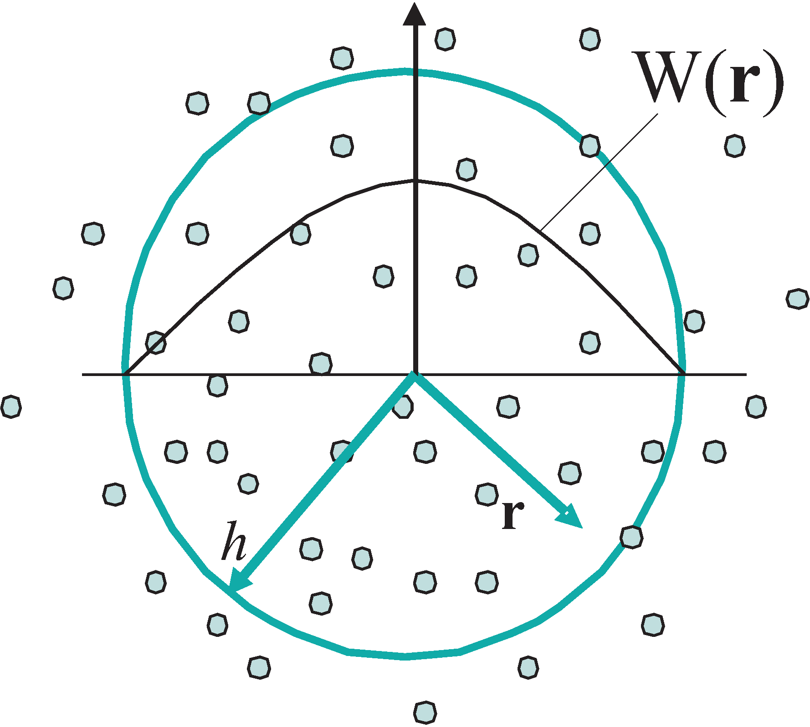
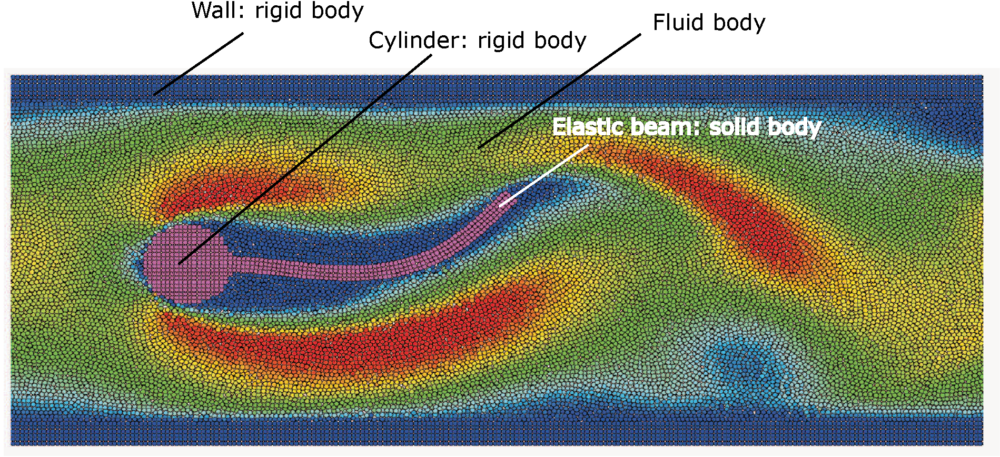

=====================
The SPHinXsys library
=====================

SPHinXsys (pronunciation: s'finksis) is an acronym from 
Smoothed Particle Hydrodynamics 
for industrial complex systems.
It aims to model coupled industrial dynamic systems including fluid, 
solid, multi-body dynamics and beyond with SPH (smoothed particle hydrodynamics), 
a Lagrangian computational method using particle discretization.
The code presently includes fluid dynamics, solid dynamics, fluid-structure interactions (FSI), 
and their coupling to rigid-body dynamics (with Simbody_ library).

.. _Simbody: https://simtk.org

====================
Fundamentals of SPH
====================

SPH is a fully Lagrangian particle method,  
in which the continuum media is discretized into Lagrangian particles
and the mechanics is approximated as the interaction between them
with the help of a kernel, usually a Gaussian-like function, as shown in the following figure.

   SPH particles and the kernel function W(r)
 
In SPH, the continuum media is discretized into Lagrangian particles 
and the mechanics are approximated as the interaction between them using a kernel function, 
usually a Gaussian-like function.
For a variable field :math:`f(\mathbf{r})` 
the particle-average based discretization is given as   
 
.. math::
	:label: particle-average

	f_i  = \int f(\mathbf{r}) W(\mathbf{r}_i - \mathbf{r}, h)d \mathbf{r}. 
	
 
Here, :math:`i` is the particle index, :math:`f_i` the discretized particle-average variable and
:math:`\mathbf{r}_{i}` the particle position.
The compact-support kernel function :math:`W(\mathbf{r}_{i} - \mathbf{r}, h)`, 
where :math:`h` is the smoothing length, 
is radially symmetric with respect to :math:`\mathbf{r}_{i}`. 
Since we assume that the mass of each particle :math:`m_i` is known and invariant (indicating mass conservation),
one has the particle volume :math:`V_i = m_i/\rho_i`, where :math:`\rho_i` is the particle-average density.

By introducing particle summation, 
Eq. :eq:`particle-average` can be approximated by
 
.. math::
	:label: particle-reconstuction

	f(\mathbf{r}) \approx \sum_{j}  V_j W(\mathbf{r} - \mathbf{r}_{j}, h) f_j = \sum_{j}  \frac{m_j}{\rho_j} W(\mathbf{r} - \mathbf{r}_{j}, h) f_j,  
 
where the summation is over all the neighboring particles :math:`j` located in the support domain of the particle of interest :math:`i`.
Substituting the variable :math:`f(\mathbf{r})` with density one gets the approximation of the particle-average density 
 
.. math::
	:label: particle-density-reconstuction

	\rho_i \approx \sum_{j}  \frac{m_j}{\rho_j} W(\mathbf{r}_{i} - \mathbf{r}_{j}, h) \rho_j = \sum_{j}  m_j W_{ij}, 
 
which is an alternative way to write the continuity equation for updating the fluid density.

The dynamics of other particle-average variables are based on a general form of interaction between a particle and its neighbors,
i.e. the approximation of the spatial derivative operators on the right hand sides (RHS) of the evolution equations.
The original SPH approximation of the derivative of a variable field :math:`f(\mathbf{r})` at particle :math:`i`  is obtained by 
the following formulation
 
.. math::
	:label: eq:gradsph

	\begin{split}
	\nabla f_i & \approx \int_{\Omega} \nabla f (\mathbf{r}) W(\mathbf{r}_i - \mathbf{r}, h) dV  \\
	& =  - \int_{\Omega} f (\mathbf{r}) \nabla W(\mathbf{r}_i - \mathbf{r}, h) dV \approx  - \sum_{j}  V_j \nabla_i W_{ij}f_j. 
	\end{split}
 

Here, :math:`\nabla_i W_{ij} = \mathbf{e}_{ij} \frac{\partial W_{ij}}{\partial r_{ij}}` with :math:`r_{ij}` and :math:`\mathbf{e}_{ij}` 
are the distance and unit vector of the particle pair :math:`(i,j)`, respectively.

Note that, Eq. :eq:`eq:gradsph` can be modified into a strong form
 
.. math::
	:label: eq:gradsph-strong

	\nabla f_i = f_{i}\nabla 1 + \nabla f_i \approx   \sum_{j} V_j \nabla_i W_{ij} f_{ij}, 
 
where :math:`f_{ij} = f_{i} - f_{j}` is the inter-particle difference value. 
The strong-form approximation of the derivative is used to determine the local structure of a field.
Also, with a slight different modification, Eq. :eq:`eq:gradsph` can be rewritten into a weak form as
 
.. math::
	:label: eq:gradsph-weak

	\nabla f_i = \nabla f_i - f_{i}\nabla 1 \approx   -2\sum_{j}  V_j\nabla W_{ij} \widetilde{f}_{ij}, 
 
where :math:`\widetilde{f}_{ij} = \left(f_{i} + f_{j}\right)/2` is the inter-particle average value. 
The weak-form approximation of derivative is used to compute 
the surface integration with respect to a variable for solving its conservation law.
Due to the anti-symmetric property of the derivative of the kernel function, 
i.e. :math:`\nabla_i W_{ij} = - \nabla _j W_{ji}`, it implies the momentum conservation of the particle system.

=============================================
Unified modeling for fluid and solid dynamics
=============================================

Generally, for continuum mechanics, 
we consider three types of media according their level of deformation:

  - The first type is rigid solid characterized by uniform translate and angular velocities.
  - The second type is elastic solid characterized by regular velocity field and deformation-induced stress.
  - The third type is fluid characterized by velocity-gradient-induced stress.
  

In SPHinxSys, all media are modeled as SPH bodies. 
Each body is composed of a group of SPH particles.
Below you see a typical example in a simulation.  

   A typical FSI problem involving a rigid solid (wall) body, 
   a composite solid (insert) body and a fluid body. The wall body has two 
   (upper and lower) components. 
   The insert body is composed of a rigid (cylinder) and an elastic (beam) components.

Note that a SPH solid body may be composed of more than one components.
As shown in figure above, 
while the wall body has two rigid solid components,
the insert is composed of a rigid and an elastic solid components.

The SPH algorithms are used to discretize the continuum mechanics equations, 
and compute the dynamics of particles, i.e. their trajectory, velocity and acceleration. 
The algorithms for the discretization of the fluid dynamics equations are based on a weakly compressible fluid formulation, 
which is suitable for the problems with incompressible flows, and compressible flows with low Mach number (less than 0.3). 
The solid dynamics equations are discretized by a total Lagrangian formulation, 
which is suitable to study the problems involving linear and non-linear elastic materials. 
The FSI coupling algorithm is implemented in a kinematic-force fashion, 
in which the solid structure surface describes the material-interface and, at the same time, 
experiences the surface forces imposed by the fluid pressure and friction. 
SPHinxSys couples the rigid bodies with elastic solid and fluid in a kinematic-force fashion too,
in which, while experiencing forces from elastic solid and/or fluid, 
the rigid bodies and their interactions (handled by Simbody library) 
determines the position and velocity their own particles. 

=============================
Ownership design in SPHinXsys
=============================

SPHinXsys aims to follow the concept of resource acquisition is initialization (RAII) strictly. 
Therefore, the ownership of all objects have been clarified.
Basically, there are three types of ownerships.  

First, the SPHsystem, bodies, body relations, gravities and particle-dynamics methods are owned by the application,
i.e. the main function. This requires that these objects are defined in the main function.
Second, the particles and materials are owned by SPHbody; 
Third, though the geometries, are owned by SPHBody; the shapes owned by complex shape or body part during the simualtion,
these objects are temporaly owned by base and derived constrcutors.   
Therefore, we need to use shared pointer for them.

One important choice in SPHinXsys is that the ownship is only clarified at the constrcution phase.
After that, observers of raw pointers are assigned and used during the simulation.

