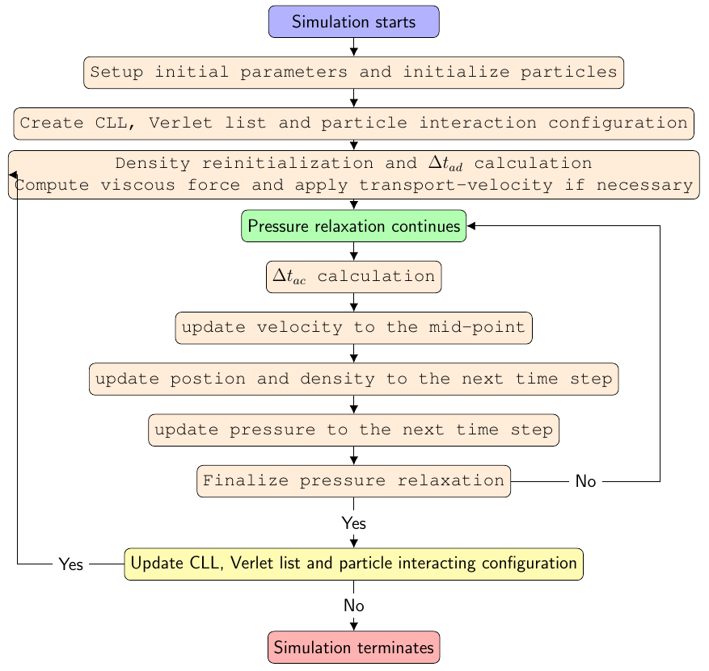
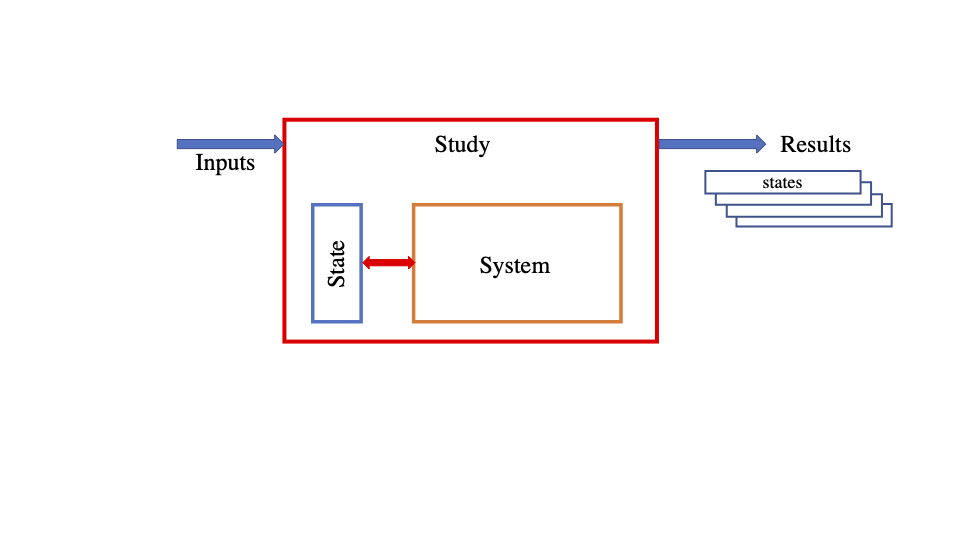
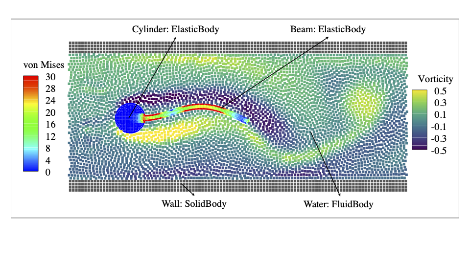
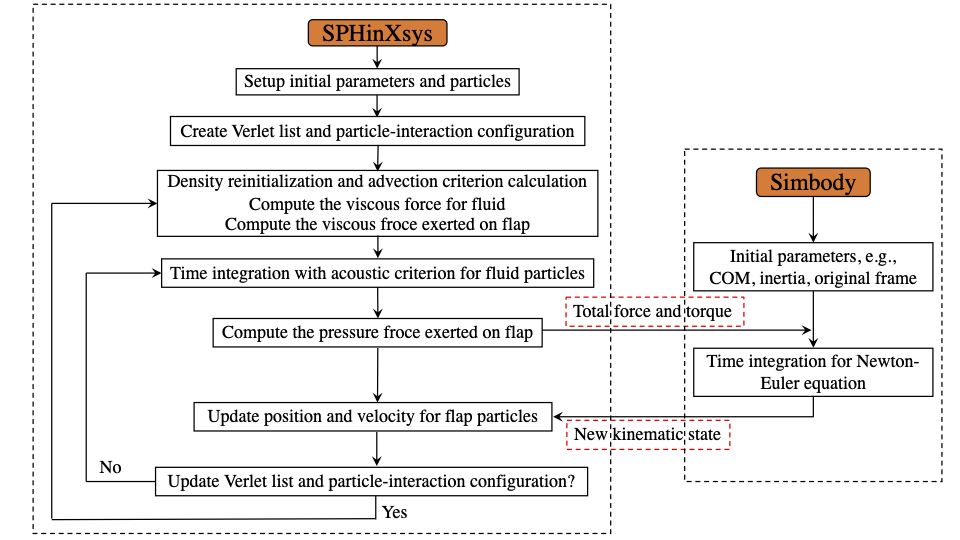

===================================
Schemes for fluid dynamics
===================================

Governing equation
----------------------

In the Lagrangian frame, the conservation of mass and momentum for fluid dynamics can be written as

.. math:: 
	:label: governingeq
	
	\begin{cases}
	\frac{\text{d} \rho}{\text{d} t}  =  - \rho \nabla \cdot \mathbf{v} \\
	\rho \frac{\text{d} \mathbf{v}}{\text{d} t}  =   - \nabla p +  \eta \nabla^2 \mathbf{v} + \rho \mathbf{g}
	\end{cases}
 

where :math:`\mathbf{v}` is the velocity, :math:`\rho` the density, 
:math:`p` the pressure, :math:`\eta` the dynamic viscosity, :math:`\mathbf{g}` the gravity  
and :math:`\frac{\text{d}}{\text{d} t}=\frac{\partial}{\partial t} + \mathbf{v} \cdot \nabla` stands for the material derivative.
For modeling incompressible flow with weakly compressible assumption (Monaghan1994_ and Morris1997_), 
the WCSPH method uses an artificial isothermal equation of state (EoS) to close Eq. :eq:`governingeq`

.. math:: 
	:label: eqeos

	p = c^2(\rho - \rho^0)

Usually, the density varies around :math:`1 \%` (Morris1997_) 
if an artificial sound speed of :math:`c = 10 U_{max}` is employed, 
with :math:`U_{max}` being the maximum anticipated flow speed.

WCSPH method based on Riemann solvers
--------------------------------------

In SPHinXsys, 
the WCSPH method based on Riemann solvers is applied for 
discretizing the continuity and momentum equations as Zhang2017a_ and  Zhang2020_

.. math:: 
	:label: riemannsph

	\begin{cases}
		\frac{\text{d} \rho_i}{\text{d} t} = 2\rho_i \sum_j\frac{m_j}{\rho_j}(U^{\ast} - \mathbf{v}_{i}\mathbf{e}_{ij} ) \frac{\partial W_{ij}}{\partial r_{ij}} \\
		\frac{\text{d} \mathbf{v}_i}{\text{d} t}  = - 2\sum_j  m_j\frac{P^{\ast}}{\rho_i \rho_j}  \nabla_i W_{ij}
	\end{cases}
 

Here, 
:math:`U^{\ast}` and :math:`P^{\ast}` are the solutions of an 
inter-particle Riemann problem along the unit vector :math:`\mathbf{e}_{ij} = -\mathbf{r}_{ij}/r_{ij}` pointing from particle :math:`i` to :math:`j` 
obtained from a low-dissipation Riemann solver (Zhang2017a_).
	
For viscous flows, the physical shear term can be discretized as Hu2006_

.. math::
	:label: eqviscous

	\bigg( \frac{\text{d} \mathbf{v}_i}{\text{d} t} \bigg)^{(\nu)} 
	= 2\sum_j m_j \frac{\eta}{\rho_i \rho_j} \frac{{{\mathbf{v}}_{ij}}}{{{r}_{ij}}} \frac{\partial {{W}_{ij}}}{\partial {{r}_{ij}}}
 
 
where :math:`\eta` is the dynamic viscosity. 
 

Wall boundary condition
-----------------------

The interaction between fluid particles and wall particles is determined by
solving a one-sided Riemann problem (Zhang2017a_) along the wall normal direction.
In the one-sided Riemann problem the left state is defined as

.. math::
	:label: eqriepartial

	(\rho_L, U_L, P_L)  = (\rho_f,- \mathbf{n}_w \cdot \mathbf{v}_{f},P_f)
 
 
where the subscript :math:`f` represents the fluid particles and :math:`\mathbf{n}_w` the local wall normal direction.
According to the physical wall boundary condition, 
the right state velocity :math:`U_R` is assumed as

.. math::
	:label: eqrienoslip

	U_R =  -U_L + 2u_{w}  
 

where :math:`u_w` is the wall velocity. 
Similar to Adami2012_ the right state pressure is assumed as   

.. math::
	:label: eqriepright

	P_R =  P_L + \rho_{f} \mathbf{g} \cdot \mathbf{r}_{fw}, 
 
 
where :math:`\mathbf{r}_{fw} = \mathbf{r}_w - \mathbf{r}_f`,
and the right state density is obtained by applying the artificial EOS. 

SPH discretization as coarse-graining model
-------------------------------------------

Assume that the continuum field is coarse-grained into a particle system 
with spatial filtering Hu2012_, the variables on particles are obtained by
 
.. math::
	:label: filtering

	\psi_i  =  G_i * \psi  =  \int \psi(\mathbf{r}) W(\mathbf{r} - \mathbf{r}_i, h)d\mathbf{r}, 

where :math:`\mathbf{r}_{i}` and :math:`h` are the center and width, respectively, of the filter.

.. _Hu2012: https://doi.org/10.1016/j.piutam.2015.11.007

Note that this filter can also take the role as the SPH kernel function with smoothing length :math:`h`. 
Substitute :math:`\psi(\mathbf{r})` with the coordinate :math:`\mathbf{r}` into Eq. :eq:`filtering`,
that is
 
.. math::
   :label: filtered-particle-position

	\mathbf{r}_i  =  G_i * \mathbf{r}  =  \int \mathbf{r} W(\mathbf{r} - \mathbf{r}_i, h)d\mathbf{r}, 

one has the particle position :math:`\mathbf{r}_i` at the center of the filter.
The motion of particle is determined by its transport velocity, i.e.
 
.. math::
   :label: particle-trajectory

	\frac{\widetilde{d} \mathbf{r}_i} {dt} =  \widetilde{\mathbf{v}}_i.
 
Note that :math:`\widetilde{\mathbf{v}}_i` can be different from the filtered or momentum particle velocity :math:`\mathbf{v}_i`,
which is obtained by substitute :math:`\psi` with velocity :math:`\mathbf{v}` into Eq. :eq:`filtering`, 
that is
 
.. math::
   :label: momentum-particle-velocity

	\mathbf{v}_i  =  G_i * \mathbf{v}  =  \int \mathbf{v}(\mathbf{r}) W(\mathbf{r} - \mathbf{r}_i, h)d\mathbf{r}. 

Similarly, the filtered derivatives on particles can be written as
 
.. math::
   :label: derivative

	G_i * \nabla \psi & = & \int \nabla\psi W(\mathbf{r} - \mathbf{r}_i, h)d\mathbf{r} \nonumber \\
	& = & - \int \psi \nabla W(\mathbf{r} - \mathbf{r}_i, h)d\mathbf{r},  

.. math::
   :label: full-derivative

	G_i * \frac{d \psi}{dt} & = & \frac{\partial \psi_i}{\partial t}  + \int \nabla\psi\cdot \mathbf{v} W(\mathbf{r} - \mathbf{r}_i, h)d\mathbf{r} \nonumber \\
	& = & \frac{\partial \psi_i}{\partial t} - \int \psi \mathbf{v}\cdot \nabla W(\mathbf{r} - \mathbf{r}_i, h)d\mathbf{r},  
 
 
Note that Eq. :eq:`full-derivative` assumes the incompressibility, 
i.e. the velocity field is divergence free.
Since only the filtered values :math:`\psi_i` are known for the particle system, 
it is impossible to apply the exact filtering :math:`G_i * \nabla \psi` and :math:`G_i * d\psi/d t`,
an approximated filtering is carried out after the flow field is first reconstructed 
 
.. math::
	:label: reconstruction

	\psi(\mathbf{r})  \approx  \frac{\sum_j\psi_j W(\mathbf{r} - \mathbf{r}_j)}{\sum_k W(\mathbf{r} - \mathbf{r}_k)}
	= \frac{1}{\sigma}\sum_j\psi_j W(\mathbf{r} - \mathbf{r}_j),

where 
:math:`\sigma = \sum_k W(\mathbf{r} - \mathbf{r}_k)` 
is a measure of particle number density,
which is larger in a dense particle region than in a
dilute particle region Koshizuka1998_.

.. _Koshizuka1998: https://doi.org/10.1002/(SICI)1097-0363(19980415)26:7%3C751::AID-FLD671%3E3.0.CO;2-C

From the identity :math:`\sum_j W(\mathbf{r} - \mathbf{r}_j)/\sigma = 1`,
the total volume :math:`V` can be written as
 
.. math::
   :label: volume

	V = \sum_j V_j = \sum_j \int\frac{1}{\sigma}W(\mathbf{r} - \mathbf{r}_j)d\mathbf{r} \approx \sum_j \frac{1}{\sigma_j}, 

where :math:`\sigma_j` equals to the inverse of particle volume approximately, i.e. :math:`\sigma_j = \sum_k W(\mathbf{r}_j - \mathbf{r}_k) = \sum_k W_{jk} \approx 1/V_j`. 
With Eq. :eq:`derivative` and by using Eq. :eq:`reconstruction` and the properties of the kernel function, 
the approximation of :math:`G_i * \nabla \psi` can be obtained by
 
.. math::
   :label: approx-derivative

	G_i *\nabla \psi  & \approx & - \sum_j \psi_{j}  \int\frac{1}{\sigma}\nabla W(\mathbf{r} - \mathbf{r}_i)W(\mathbf{r} - \mathbf{r}_j)d\mathbf{r} \nonumber \\
	& \approx & - \sum_j  \psi_{j} \nabla W_{ij} V_j. 
 
Note that Eq. :eq:`approx-derivative` is a typical SPH discretization of the gradient operator.
Using particle transport velocity :math:`\widetilde{\mathbf{v}}_{i}`, :math:`G_i * d\psi/d t` can be rewritten as
 
.. math::
   :label: approx-full-derivative

	G_i *\frac{d \psi}{dt} & \approx & \frac{\partial \psi_i}{\partial t}  - \sum_j  \psi_{j} \mathbf{v}_{j} \nabla W_{ij} V_j  \nonumber \\
	& \approx & \frac{\partial \psi_i}{\partial t} + \widetilde{\mathbf{v}}_{i}\cdot \nabla \psi_i 
	- \sum_j  \psi_{j} (\mathbf{v}_{j} - \widetilde{\mathbf{v}}_{j}) \nabla W_{ij} V_j, \nonumber \\
	& \approx & \frac{\widetilde{d} \psi}{dt} - \sum_j  \psi_{j} (\mathbf{v}_{j} - \widetilde{\mathbf{v}}_{j}) \nabla W_{ij} V_j.
 
Note that Eq. :eq:`approx-full-derivative` assume the incompressible condition, 
i.e. :math:`\nabla \cdot \widetilde{\mathbf{v}}_{i} = 0` or the variation of particle density :math:`\widetilde{d} \rho/dt = 0`.
Also note that the approximations in Eqs. :eq:`approx-derivative` and :eq:`approx-full-derivative` can be further modified into strong and weak forms.  

Transport-velocity formulation
------------------------------
For high Reynolds number flows, the WCSPH method may suffer from tensile instability which induces 
particle clumping or void region.
To remedy this issue, we apply the transport velocity formulation (Adami2013_ and Zhang2017b_)

Using Eq. :eq:`volume`, the particle density is given by
 
.. math::
   :label: density_summation

	\rho_{i} = m_{i}\sigma_{i},
 
where :math:`m_i` is the constant mass of a particle.
Another way to update the particle density is by computing the density variation with
 
.. math::
	:label: density-variation

	\frac{\widetilde{d}\rho_{i}}{dt}= -  \rho_{i}\sum_j \frac{1}{\sigma_i} \widetilde{\mathbf{v}}_{ij} \cdot  \nabla W_{ij},

where :math:`\widetilde{\mathbf{v}}_{ij} = \widetilde{\mathbf{v}}_{i} - \widetilde{\mathbf{v}}_{j}` is the difference of transport velocity between particle :math:`i` and particle :math:`j`.
With the transport-velocity formulation Adami2013_
the momentum equation is discretized as 
 
.. math::
	:label: discretized-momentum-equation-transport

	\frac{\widetilde{d}\mathbf{v}_{i}}{dt} =  \frac{d \mathbf{v}_{i}}{dt} - \frac{2}{m_i}\sum_{j\in s}  \mathbb{A}_{ij} \nabla W_{ij} V_i V_j,
 
where :math:`\mathbb{A} = \rho \mathbf{v}\otimes \left(\widetilde{\mathbf{v}} - \mathbf{v} \right)` is an extra stress due to the application of transport velocity and
 
.. math::
	:label: discretized-momentum-equation

	\frac{d \mathbf{v}_{i}}{dt} =  \frac{2}{m_i}\sum_{j\in s}  \overline{p}_{ij} \nabla W_{ij} V_i V_j
	- \frac{2\eta(d+2)}{m_i}\sum_{j\in s}\frac{\mathbf{v}_{ij}\cdot \mathbf{e}_{ij}}{r_{ij}} \nabla W_{ij}  V_i V_j
 
is the original SPH discretization.

Note that the effect of the extra stress term in Eq. :eq:`discretized-momentum-equation-transport` 
is usually negligible when velocity filed is regular, i.e., the Reynolds number of the flow is small.

Dual-criteria time stepping
---------------------------

The dual-criteria time-stepping method employs two time-step size criteria 
characterized by the particle advection and the acoustic velocities, respectively (Zhang2020_).
The time-step size determined by the advection criterion, 
termed as :math:`\Delta t_{ad}`, 
has the following form
 
.. math::
   :label: dt-advection

	\Delta t_{ad}   =  {CFL}_{ad} \min\left(\frac{h}{|\mathbf{v}|_{max}}, \frac{h^2}{\nu}\right),

 
where :math:`CFL_{ad} = 0.25`, 
:math:`|\mathbf{v}|_{max}` is the maximum particle advection speed in the flow 
and :math:`\nu` is the kinematic viscosity.
The time-step size according to the acoustic criterion, 
termed as :math:`\Delta t_{ac}`, 
has the form as

.. math::
   :label: dt-relax

	\Delta t_{ac}   = {CFL}_{ac} \frac{h}{c + |\mathbf{v}|_{max}},
 
where :math:`{CFL}_{ac} = 0.6`. 
Note that this criterion gives much larger time-step size
than that employed in conventional time integration for WCSPH simulations.

While the advection criterion controls the updating frequency of the particle neighbor list 
and the corresponding kernel function values,
the acoustic criterion determines the frequency of the pressure relaxation process, 
namely the time integration of the particle density, pressure and velocity.
Accordingly, 
during one advection criterion step, 
the pressure relaxation process is carried out multiple times approximated as :math:`k \simeq \frac{\Delta t_{ad}}{\Delta t_{ac}}`.
During these pressure relaxation processes, the particle interaction configuration is considered to be fixed in space.
The details of the time stepping procedure are given in the following.

Here, we denote the values at the beginning of a time step by superscript :math:`n`, 
at the mid-point by :math:`n + \frac{1}{2}` and eventually at the end of time-step by :math:`n + 1`.
At the beginning of the advection-criterion time step, the fluid density field of free-surface flows is reinitialized by

.. math::
   :label: eqrhosum

	\rho_i = \max\left(\rho^*, \rho^0 \frac{ \sum W_{ij}}{\sum W^0_{ij}}\right) ,
 
where :math:`\rho^*` denotes the density before re-initialization and superscript :math:`0` represents the initial reference state.
For flows without free surface, Eq.  :eq:`eqrhosum` is merely modified as 

.. math::
   :label: eqrhosumnosurface

	\rho_i =  \rho^0 \frac{ \sum W_{ij}}{\sum W^0_{ij}} .

Eq. :eq:`eqrhosum` or :eq:`eqrhosumnosurface` stabilizes the density 
which is updated by the discretization of Eq. :eq:`governingeq` 
in the pressure relaxation process without updating the particle interaction configuration.
Also, the viscous force is computed and transport-velocity is applied here if necessary.
After the time-step sizes :math:`\Delta t_{ad}` is calculated, 
the pressure relaxation process is repeated 
employing a standard velocity Verlet scheme
with the time-step size :math:`\Delta t_{ac}` until the accumulated time interval is larger than :math:`\Delta t_{ad}`. 
In the Verlet scheme, the velocity fields are first updated to the mid-point by
 
.. math::
   :label: verlet-first-half-1

	\mathbf{v}_i^{n + \frac{1}{2}} = \mathbf{v}_i^n + \frac{1}{2}\Delta t_{ac} \big( \frac{d \mathbf{v}_i}{dt} \big)^{n}.

Then particle position and density are updated to the new time step in the following form
 
.. math::
   :label: verlet-first-mediate-1

	\begin{cases}
	\mathbf{r}_i^{n + 1} = \mathbf{r}_i^{n + \frac{1}{2}} +  \Delta t_{ac} \mathbf{v}_i^{n +\frac{1}{2}} \\
	\rho_i^{n + 1} = \rho_i^{n} + \frac{1}{2} \Delta t_{ac} \big( \frac{d \rho_i}{dt} \big)^{n+\frac{1}{2}}.
	\end{cases}
 
Finally, the velocity and density of the particle is updated at the end of the time step by 
 
.. math::
   :label: verlet-first-final-1

	\mathbf{v}_i^{n + 1} = \mathbf{v}_i^n +  \frac{1}{2} \Delta t_{ac} \big( \frac{d \mathbf{v}_i}{dt} \big)^{n + 1}.

An overview of the proposed time stepping method is shown in the following flowchart.
Note that the present time stepping recovers the traditional scheme 
by removing the outer loop and density reinitialization, 
and applying :math:`{CFL}_{ac} = 0.25` and updating the neighbor list 
and kernel function values at every time step.
 

   Flowchart of the dual-criteria time stepping incorporate with WCSPH method

===================================
Schemes for solid dynamics
===================================

Kinematics and governing equation
---------------------------------

The kinematics of the finite deformations can be characterized by introducing a deformation map :math:`\varphi`, 
which maps a material point :math:`\mathbf{\mathbf{r}^0}` from the initial reference configuration :math:`\Omega^0 \subset \mathbb{R}^d` 
to the point :math:`\mathbf{r} = \mathbf{\varphi}\left(\mathbf{r}^0, t\right)` 
in the deformed configuration :math:`\Omega = \mathbf{\varphi} \left(\Omega^0\right)`. 
Here, the superscript :math:`\left( {\bullet} \right)^0` denotes the quantities in the initial reference configuration. 
Then, the deformation tensor :math:`\mathbb{F}` can be defined by its derivative with respect to the initial reference configuration as 

.. math:: 
	:label: eq:deformationtensor

	\mathbb{F} = \nabla^{0} {\varphi} =  \frac{\partial \varphi}{\partial \mathbf{r}^0}  = \frac{\partial \mathbf{r}}{\partial \mathbf{r}^0} .
 
 
Also, the deformation tensor :math:`\mathbb{F}` can be calculated from the displacement :math:`\mathbf{u} = \mathbf{r} - \mathbf{r}^0` through

.. math:: 
	:label: eq:deformationtensor-displacement

	\mathbb{F} = \nabla^{0} {\mathbf{u}}  + \mathbb{I},
 
 
where :math:`\mathbb{I}` represents the unit matrix. 

In a Lagrangian framework, 
the conservation of mass and the linear momentum corresponding to the solid mechanics can be expressed as

.. math::
 	:label: eq:mechanical-mom

	\begin{cases}
	\rho =  {\rho_0} \frac{1}{J} \quad \\
	\rho^0 \frac{\text{d} \mathbf{v}}{\text{d} t}  =  \nabla^{0} \cdot \mathbb{P}^T  + \rho^0 \mathbf{g} \quad  
	\end{cases} \Omega^0 \times \left[0, T \right]
 
 
where :math:`\rho` is the density, :math:`J = \det(\mathbb{F})` and :math:`\mathbb{P}` the first Piola-Kirchhoff stress tensor 
and :math:`\mathbb{P} =  \mathbb{F} \mathbb{S}` with :math:`\mathbb{S}` denoting the second Piola-Kirchhoff stress tensor. 
In particular, when the material is linear elastic and isotropic, the constitutive equation is simply given by

.. math::
	:label: isotropic-linear-elasticity

	\mathbb{S} & = & K \mathop{\mathrm{tr}}\left(\mathbb{E}\right)  \mathbb{I} + 2 G \left(\mathbb{E} - \frac{1}{3}\mathop{\mathrm{tr}}\left(\mathbb{E}\right)  \mathbb{I} \right) \nonumber \\
	& = & \lambda \mathop{\mathrm{tr}}\left(\mathbb{E}\right) \mathbb{I} + 2 \mu \mathbb{E}

where :math:`\lambda` and :math:`\mu` are the Lamé parameters (Sokolnikoff1956_), 
:math:`K = \lambda + (2\mu/3)` the bulk modulus and :math:`G = \mu` the shear modulus. 
The relation between the two modulus is given by

.. math::
	:label: relation-modulus

	E = 2G \left(1+2\nu\right) = 3K\left(1 - 2\nu\right)
 
 
with :math:`E` denoting the Young's modulus and :math:`\nu` the Poisson's ratio. 
Note that the sound speed of solid structure is defined as :math:`c^{S} = \sqrt{K/\rho}`. 
The Neo-Hookean material model can be defined in general form by the strain-energy density function

.. math::
	:label: Neo-Hookean-energy

	\mathfrak W  =  \mu \mathop{\mathrm{tr}} \left(\mathbb{E}\right) - \mu \ln J + \frac{\lambda}{2}(\ln J)^{2} .

Note that the second Piola-Kirchhoff stress :math:`\mathbb{S}` can be derived as 

.. math::
	:label: 2rd-PK

	\mathbb{S} = \frac{\partial \mathfrak W}{\partial \mathbb{E}}
 
 
from strain-energy density function. 

Total Lagrangian formulation
----------------------------

For solid mechanics, 
SPHinXsys applies the total Lagrangian formulation 
where the initial reference configuration is used for finding the neighboring particles and 
the set of neighboring particles is not altered.  

Firstly, 
a correction matrix :math:`\mathbb{B}^0` (Vignjevic2006_) is introduced as

.. math:: 
 	:label: eq:sph-correctmatrix

	\mathbb{B}^0_i = \left( \sum_j V_j \left( \mathbf{r}^0_j - \mathbf{r}^0_i \right) \otimes \nabla^0_i W_{ij} \right) ^{-1} ,
 
 
where 

.. math::
 	:label: strongkernel

	\nabla^0_i W_{ij} = \frac{\partial W\left( |\mathbf{r}^0_{ij}|, h \right)}  {\partial |\mathbf{r}^0_{ij}|} \mathbf{e}^0_{ij}
 
 
denotes the gradient of the kernel function evaluated at the initial reference configuration. 
It is worth noting that the correction matrix is computed in the initial configuration and therefore, 
it is calculated only once before the simulation. 
Then, the mass and momentum conservation equations, :eq:`eq:mechanical-mom`, can be discretized as 

.. math::
 	:label: eq:sph-mechanical-mom

	\begin{cases}
	\rho_i =  {\rho^0} \frac{1}{\text{det}\left(\mathbb{F}\right) } \quad \\
	\frac{\text{d}\mathbf{v}_i}{\text{d}t} = \frac{2}{m_i} \sum_j V_i V_j \tilde{\mathbb{P}}_{ij} \nabla^0_i W_{ij} + \mathbf{g}
	\end{cases}
 
where the inter-particle averaged first Piola-Kirchhoff stress :math:`\tilde{\mathbb{P}}` is defined as

.. math::

	\tilde{\mathbb{P}}_{ij} = \frac{1}{2} \left( \mathbb{P}_i \mathbb{B}^0_i + \mathbb{P}_j \mathbb{B}^0_j \right). 
 
Note that the first Piola-Kirchhoff stress tensor is computed from the constitutive law with the deformation tensor :math:`\mathbb{F}` given by

.. math::

	\mathbb{F} = \left( \sum_j V_j \left( \mathbf{u}_j - \mathbf{u}_i \right) \otimes \nabla^0_i W_{ij}  \right) \mathbb{B}^0_i + \mathbb{I} .
 
 

=======================================
Schemes for thermal and mass diffusion
=======================================

Governing equation
---------------------------

Thermal or mass diffusion, 
in particular anisotropic diffusion, 
occurs in many physical applications, e.g.
thermal conduction in fusion plasma, 
image processing, 
biological processes and medical imaging.
The governing equation for thermal or mass diffusion reads

.. math::
	:label: eq:diffusion-eq

	\frac{\text{d}C}{\text{d}t}  = \nabla \cdot \left( \mathbb{D} \nabla C \right) 
  
where :math:`C` is the concentration of a compound and :math:`\mathbb{D}` the diffusion coefficient in iso- and anisotropic forms. 

SPH discretization for the anisotropic diffusion equation
---------------------------------------------------------

In SPHinXsys, 
the diffusion equation is discretized by an anisotropic SPH dicretization scheme modified from the work of Tran-Duc2016_. 
Different from the previous strategies for the discretization of diffusion equation (Biriukov2018_ and Rezavand2019_), 
we employ and modify the anisotropic SPH dicretization proposed by Tran-Duc2016_. 
Following Tran-Duc2016_,  
the diffusion tensor :math:`\mathbb{D}` is considered to be a symmetric positive-definite matrix and can be decomposed by Cholesky decomposition as 

.. math::
 	:label: eq:chol

	\mathbb{D} = \mathbb{L} \mathbb{L}^T ,
 
 
where :math:`\mathbb{L}` is a lower triangular matrix with real and positive diagonal entries and :math:`\mathbb{L}^T` denotes the transpose of :math:`\mathbb{L}`. 
The diffusion operator in Eq. :eq:`eq:diffusion` can be rewritten in isotropic form as 

.. math::
 	:label: eq:diffusion-trans

	\nabla \cdot (\mathbb{D} \nabla) =  \nabla \cdot (\mathbb{\mathbb{L} \mathbb{L}^T} \nabla) 
	=  (\mathbb{L}^T \nabla)^T \cdot (\mathbb{L}^T\nabla) = \widetilde{\nabla}^2, 
 
 
where :math:`\widetilde{\nabla} = \mathbb{L}^T \nabla`.
Then, the new isotropic diffusion operator is approximated by the following kernel integral neglecting the high-order terms

.. math::
 	:label: eq:diffusion-int

	\widetilde{\nabla} \cdot (\widetilde{\nabla})  C \left( \widetilde{\mathbf{r}} \right) =   
	2 \int_{\Omega} \left( C (\widetilde{\mathbf{r}}) - C (\widetilde{\mathbf{r'}}) \right)  \frac{1}{|\widetilde{\mathbf r} - \widetilde{\mathbf{r}' }|} \frac{\partial W\left(|\widetilde{\mathbf r} - \widetilde{\mathbf{r}' }|, \widetilde{h}\right) }{\partial \left( | \widetilde{\mathbf r} - \widetilde{\mathbf{r}' } |\right)  } d \widetilde{\mathbf r}, 
 
 
where :math:`\widetilde{\mathbf r} = \mathbb{L}^{-1} \mathbf r` 
and :math:`\widetilde{h} = \mathbb{L}^{-1} h` denotes a second-order tensor  so that the smoothing length will be :math:`h` under the inverse transformation  (Tran-Duc2016_). 
Upon the coordinate transformation, 
the kernel gradient can be rewritten as

.. math::
 	:label: eq:diffusion-kernel-trans

	\frac{\partial W\left(|\widetilde{\mathbf r} - \widetilde{\mathbf{r}' }|, \widetilde{h}\right) }{\partial | \widetilde{\mathbf r} - \widetilde{\mathbf{r}' } | }=
	\frac{1}{|\mathbb{L}^{-1}||\mathbb{L}^{-1} \mathbf e_{\mathbf{r} \mathbf r'}|} \frac{\partial W\left(|\mathbf r - \mathbf{r}' |, h\right) }{\partial \left( | \mathbf r - \mathbf{r}'  |\right)  } .
 
 
At this stage, 
Eq. :eq:`eq:diffusion-eq` can be discretized as 

.. math::
 	:label: grad-laplace

	\begin{split}
		\widetilde{\nabla}^2 C_i  & \approx  2 \sum_{j} V_j \bigg(C_i - C_j\bigg) \frac{1}{(\overline{\mathbb{L}}_{ij}^{-1}\mathbf{e}_{ij})^2} \frac{1}{|\mathbf{r}_{ij}|} \frac{\partial W\left( |\mathbf{r}_{ij}|, h \right)}  {\partial \left( |\mathbf{r}_{ij}|\right) }
	\end{split},
 
 
where :math:`\overline{\mathbb{D}}_{ij} = \overline{\mathbb{L}}_{ij} \overline{\mathbb{L}}_{ij}^T` 
and :math:`\overline{\mathbb{D}}_{ij} =\frac{\mathbb{D}_i \mathbb{D}_j}{\mathbb{D}_i + \mathbb{D}_j}`, 
which ensure the antisymmetric for conservation property. 
Note that Eq. :eq:`grad-laplace` is excessively computational expensive due to the fact that one time of Cholesky decomposition and the corresponding matrix inverse are required for each pair of particle interaction. 
To optimize the computational efficiency, 
we modify Eq. :eq:`grad-laplace` by replacing the term :math:`\mathbb{L}_{ij}^{-1}`  with its linear approximation 
:math:`\widetilde{\mathbb{L}}_{ij}` defined as 

.. math:: 
 	:label: eq:l_ij

	\widetilde{\mathbb{L}}_{ij} = \frac{\widetilde{\mathbb{L}}_{i}\widetilde{\mathbb{L}}_{j} }{\widetilde{\mathbb{L}}_{i} + \widetilde{\mathbb{L}}_{j} } ,
 

where :math:`\widetilde{\mathbb{L}}_{i}` is given by 

.. math::

	\widetilde{\mathbb L}_i  = \left( \mathbb L^{-1}_{i}\right)  \left( \mathbb L^{-1}_{i}\right) ^T .
 
 
Subsequently, 
the Cholesky decomposition and the corresponding matrix inverse are computed once for each particle before the simulation. 
Also, Eq. :eq:`grad-laplace` can be rewritten by introducing the kernel correction matrix Eq. :eq:`eq:sph-correctmatrix` as 

.. math::
 	:label: grad-laplace-v

	\small
	\quad \frac{\text{d}C_{i}}{\text{d}t} = 2 \sum_{j} V_j \left(\mathbb B^0_i C_i - \mathbb B^0_j C_j \right)  \frac{1}{(\widetilde{\mathbb{L}}_{ij} \mathbf{e}_{ij})^2} \frac{1}{|\mathbf{r}_{ij}|} \frac{\partial W\left( |\mathbf{r}_{ij}|, h \right)}  {\partial \left( |\mathbf{r}_{ij}|\right) } .
 
 

====================================
Schemes for reaction-diffusion model
====================================

Governing equation
---------------------------

In recent years, 
the reaction-diffusion model has attracted a considerable deal of attention due to its ubiquitous application in many fields of science. 
The reaction-diffusion model can generate a wide variety of spatial patterns, 
which has been widely applied in chemistry, biology, and physics, 
even used to explain self-regulated pattern formation in the developing animal embryo. 
The general form of the reaction-diffusion model reads 

.. math::
 	:label: eq:diffusion-reaction

	\frac{\text{d}V}{\text{d}t}  = \nabla \cdot (\mathbb{D} \nabla V) + I(V) , 
 
 
where :math:`\mathbb{D}` is the diffusion tensor and :math:`I(V)` a nonlinear function. 
For :math:`I(V)  = V - V^3`, 
Eq. :eq:`eq:diffusion-reaction` becomes the Allen-Cahn equation, which describes the mixture of two incompressible fluids. 
When the FitzHugh1961_ model is applied, 
Eq. :eq:`eq:diffusion-reaction` becomes the well-known monodomain equation (Quarteroni2017_) which describes the cell electrophysiological dynamics. 
Electrophysiological dynamics of the heart describe how electrical currents flow through the heart, 
controlling its contractions, and are used to ascertain the effects of certain drugs designed to treat, for example, arrhythmia. 

The FitzHugh-Nagumo (FHN) model reads (FitzHugh1961_) 

.. math::
 	:label: eq:fhn

	\begin{cases}
	I(V, w) = -V(V - a)(V - 1) - w \\
	\dot{w} = g(V, w) = \epsilon_0 ( \beta V - \gamma w - \sigma)
	\end{cases},
 
 
where :math:`\epsilon_0`, :math:`\beta`, :math:`\gamma` and :math:`\sigma` are suitable constant parameters, given specifically. 

The Aliev1996_ (AP) model, 
a variant of the FHN model, 
has been successfully implemented in the simulations of ventricular fibrillation in real heart geometries (Panfilov1999_)
and it is particularly suitable for the problems where electrical activity of the heart is of the main interest. 
The AP model has the following form

.. math::
 	:label: eq:a-p

	\begin{cases}
	I(V, w) = -k V(V - a)(V - 1) - w V \\
	\dot{w} = g(V, w) = \epsilon(V, w)(-k V (V - b - 1) - w)
	\end{cases},
 
 
where :math:`\epsilon(V_m, w) = \epsilon_0 + \mu_1 w / (\mu_2 + V_m)` and :math:`k`, :math:`a`, :math:`b`,  :math:`\epsilon_0`, :math:`\mu_1` and :math:`\mu_2` are suitable constant parameters. 

SPH method for reaction-diffusion
----------------------------------

The reaction-diffusion model consists of a coupled system of partial differential equations (PDE) governing the diffusion process 
as well as ordinary differential equations (ODE) governing the reactive kinetics of the gating variable. 
In SPHinXsys, 
the operator splitting method of Quarteroni2017_ is applied and results in a PDE governing the anisotropic diffusion

.. math::
 	:label: eq:diffusion

	\frac{\text{d}V}{\text{d}t}  = \nabla \cdot (\mathbb{D} \nabla V), 
 
 
and two ODEs 

.. math::
 	:label: eq:ode-system

	\begin{cases}
	\frac{\text{d}V}{\text{d}t}  = I(V, w) \\
	\frac{\text{d}w}{\text{d}t} = g(V, w) 
	\end{cases},  
 
 
where :math:`I(V, w)` and :math:`g(V, w)` are defined by the FHN model in Eq. :eq:`eq:fhn` or the AP model in Eq. :eq:`eq:a-p`. 
The schemes for discretizing the diffusion equation are presented in the previous Section.

Reaction-by-reaction splitting
------------------------------

In SPHinXsys, a reaction-by-reaction splitting method of Wang2019_ is introduced for solving 
the system of ODEs defined by Eq. :eq:`eq:ode-system`, which is generally stiff and induces numerical instability when the integration time step is not sufficiently small.  
The multi-reaction system can be decoupled using the second-order accurate Strange splitting as

.. math::
 	:label: eq:ode-spliting-2rd

	R^{(\Delta t)} = R_V^{(\frac{\Delta t}{2})} \circ R_w^{(\frac{\Delta t}{2})} \circ R_w^{(\frac{\Delta t}{2})} \circ R_V^{(\frac{\Delta t}{2})},
 
 
where the :math:`\circ` symbol separates each reaction and 
indicates that the operator :math:`R_V^{(\Delta t)}` is applied after :math:`R_w^{(\Delta t)}`. 
Note that the reaction-by-reaction splitting methodology can be extended to more complex ionic models, 
e.g. the Tusscher-Panfilov model (Tusscher2004_). 

Following Wang2019_, we rewrite the Eq. :eq:`eq:ode-system` in the following form 

.. math::
 	:label: eq:ode-new-form

	\frac{\text{d} y}{\text{d} t} = q(y,t) - p(y,t) y, 
 
 
where :math:`q(y,t)` is the production rate and :math:` p(y,t) y` is the loss rate (Wang2019_).
The general form of Eq. :eq:`eq:ode-new-form`, where the analytical solution is not explicitly known or difficult to derive, 
can be solved by using the quasi steady state (QSS) method for an approximate solution as

.. math::
 	:label: eq:ode-qss

	y^{n + 1} = y^n e^{-p(y^n, t) \Delta t } + \frac{q(y^n, t) }{p(y^n, t)} \left(1 - e^{-p(y^n, t) \Delta t} \right).
 
Note that the QSS method is unconditionally stable due to the analytical form, 
and thus a larger time step is allowed for the splitting method, 
leading to a higher computational efficiency. 

===================================
Multi-resolution FSI coupling
===================================

SPHinXsys benefits from a multi-resolution framework, i.e. 
the fluid and solid equations are discretized by different spatial-temporal resolutions, 
for modeling FSI problems. 
More precisely, 
different particle spacing, hence different smoothing lengths, 
and different time steps are utilized to discretize the fluid and solid equations (Zhang2021_). 
Here, we introduce :math:`h^F` and :math:`h^S` to denote the smoothing length for fluid and solid discretization, respectively. 
Generally,
we assume :math:`h^F \geqslant h^S` due to the fact that the solid structure is able to be resolved at a higher spatial resolution, 
the computational efficiency is enhanced when a lower resolution discretization for the fluid is sufficient. 

In the multi-resolution framework, the governing equations of 
Eq. :eq:`governingeq` are discretized as

.. math:: 
	:label: eq:mr-fluid

	\begin{cases}
		\frac{\text{d} \rho_i}{\text{d} t} = 2\rho_i \sum_j\frac{m_j}{\rho_j}(U^{\ast} - \mathbf{v}_{i}\mathbf{e}_{ij} ) \frac{\partial W_{ij}^{h^F}}{\partial r_{ij}} \\
		\frac{\text{d} \mathbf{v}_i}{\text{d} t}  = - 2\sum_j  m_j\frac{P^{\ast}}{\rho_i \rho_j}  \nabla_i W_{ij}^{h^F}  + \mathbf{g} + \mathbf{f}_i^{S:p}\left(h^F\right) + \mathbf{f}_i^{S:v}\left(h^F\right)
	\end{cases}
 

where :math:`h^F` represents the smoothing length used for fluid. 

Also, the discretization of solid equation of Eq. :eq:`eq:sph-mechanical-mom` is modified to

.. math::
 	:label: eq:mr-solid

	\begin{cases}
		\rho_a =  {\rho_0} \frac{1}{\text{det}\left(\mathbb{F}\right) } \quad \\
		\frac{\text{d}\mathbf{v}_a}{\text{d}t} = \frac{2}{m_a} \sum_b V_a V_b \tilde{\mathbb{P}}_{ab} \nabla^0_a W_{ab} + \mathbf{g} + \mathbf{f}_a^{F:p}\left(h^F\right) + \mathbf{f}_a^{F:v}\left(h^F\right)
	\end{cases},
 
  
where :math:`h^S` denotes the smoothing length used for solid discretization. 
In more details, 
the forces :math:`\mathbf{f}_i^{S:p}\left(h^F\right)` and :math:`\mathbf{f}_i^{S:v}\left(h^F\right)` of Eq. :eq:`eq:mr-fluid` are given by

.. math::
 	:label: fs-force-mr-sp

	\mathbf{f}_i^{S:p}\left(h^F\right) =  - 2  \sum_a V_i V_a \frac{p_i \rho_a^d + p^d_a \rho_i}{\rho_i + \rho^d_a} \nabla_i W(\mathbf{r}_{ia}, h^F )
 
 
and

.. math::
 	:label: fs-force-mr-sv

	\mathbf{f}_i^{S:v}\left(h^F\right)= 2\sum_a  \eta V_i V_a \frac{\mathbf{v}_i - \mathbf{v}^d_a}{|\mathbf{r}_{ia}| + 0.01h} \frac{\partial W(\mathbf{r}_{ia}, h^F )}{\partial {{r}_{ia}}}.
 
 
The fluid forces exerting on the solid structure :math:`\mathbf{f}_a^{F:p}\left(h^F\right)` and :math:`\mathbf{f}_a^{F:v}\left(h^F\right)` are straightforward to derive. 

The multi time stepping scheme for FSI is coupled with the dual-criteria time stepping presented in previous Sections. More precisely, 
during each fluid acoustic time step (Eq. :eq:`dt-relax`) 
the structure time integration :math:`\kappa = [\frac{\Delta t_{ac}^F}{\Delta t^S}] + 1` marches with the
solid time-step criterion

.. math::
 	:label: dts-advection

	\Delta t^S   =  0.6 \min\left(\frac{h^S}{c^S + |\mathbf{v}|_{max}},
	\sqrt{\frac{h^S}{|\frac{\text{d}\mathbf{v}}{\text{d}t}|_{max}}} \right).
	 
 
As different time steps are applied in the integration of fluid and solid equations, 
we redefine the imaginary pressure :math:`p_a^d` and velocity :math:`\mathbf{v}_a^d` in Eqs. :eq:`fs-force-mr-sp` and :eq:`fs-force-mr-sv` as

.. math:: 
 	:label: fs-coupling-mr

	\begin{cases}
	p_a^d = p_i + \rho_i max(0, (\mathbf{g} - \widetilde{\frac{\text{d} \mathbf{v}_a}{\text{d}t}}) \cdot \mathbf{n}^S) (\mathbf{r}_{ia} \cdot \mathbf{n}^S) \\
	\mathbf{v}_a^d = 2 \mathbf{v}_i  - \widetilde{\mathbf{v}}_a
	\end{cases}, 
 
 
where :eq:`fs-coupling-mr` :math:`\widetilde{\mathbf{v}}_a` and :math:`\widetilde{\frac{d\mathbf{v}_a}{dt}}` 
represent the single averaged velocity and acceleration of solid particles during a fluid acoustic time step. 

===================================
Position-based Verlet scheme
===================================

SPHinXsys applies the position-based Verlet scheme for the time integration of fluid and solid equation.
As presented by Zhang2021_, 
the position-based Verlet achieves strict momentum conservation in fluid-structure coupling when multiple time steps are employed.
In the position-based Verlet scheme,
a half step for position is followed by a full step for velocity and another half step for position. 
Denoting the values at the beginning of a fluid acoustic time step by superscript :math:`n`, 
at the mid-point by :math:`n + \frac{1}{2}` and eventually at the end of the time-step by :math:`n + 1`, here we 
summarize the scheme.
At first, the integration of the fluid is conducted as

.. math::
 	:label: verlet-first-half

	\begin{cases}
		\rho_i^{n + \frac{1}{2}} = \rho_i^n + \frac{1}{2}\Delta t_{ac}^F  \frac{d \rho_i}{dt}\\
		\mathbf{r}_i^{n + \frac{1}{2}} = \mathbf{r}_i^n + \frac{1}{2} \Delta t_{ac}^F {\mathbf{v}_i}^{n}
	\end{cases}, 
 
 
by updating the density and position fields into the mid-point. 
The particle velocity is next updated to the new time step in the following form

.. math::
 	:label: verlet-first-mediate

	\mathbf{v}_i^{n + 1} = \mathbf{v}_i^{n} +  \Delta t_{ac}^F  \frac{d \mathbf{v}_i}{dt}. 
 
 
Finally, the position and density of fluid particles are updated to the new time step by 

.. math::
 	:label: verlet-first-final

	\begin{cases}
	\mathbf{r}_i^{n + 1} = \mathbf{r}_i^ {n + \frac{1}{2}} +  \frac{1}{2} \Delta t_{ac}^F \mathbf{v}_i^{n+1} \\
	\rho_i^{n + 1} = \rho_i^{n + \frac{1}{2}} + \frac{1}{2} \Delta t_{ac}^F \frac{d \rho_i}{dt}
	\end{cases}
 

For solid equations, index :math:`\varkappa = 0, 1, ...,  \kappa-1` is used to denote the integration step for solid particles.  
With the position-based Verlet scheme, 
the deformation tensor, density and particle position are updated to the midpoint as 

.. math::
 	:label: verlet-first-half-solid

	\begin{cases}
		\mathbb{F}_a^{\varkappa + \frac{1}{2}} = \mathbb{F}_a^{\varkappa} + \frac{1}{2} \Delta t^S \frac{\text{d} \mathbb{F}_a}{\text{d}t}\\
		\rho_a^{\varkappa + \frac{1}{2}} = \rho_a^0 \frac{1}{J} \\
		\mathbf{r}_a^{\varkappa + \frac{1}{2}} = \mathbf{r}_a^{\varkappa} + \frac{1}{2} \Delta t^S \mathbf{v}_a^{\varkappa}
	\end{cases}. 
 
 
The velocity is next updated by

.. math::
 	:label: verlet-first-mediate-solid

	\mathbf{v}_a^{\varkappa + 1} = \mathbf{v}_a^{\varkappa} +  \Delta t^S  \frac{d \mathbf{v}_a}{dt}. 
 
 
Lastly, the deformation tensor and the position of solid particles are updated to the new time step of the solid structure with 

.. math::
 	:label: verlet-first-final-solid

	\begin{cases}
		\mathbb{F}_a^{\varkappa + 1} = \mathbb{F}_a^{\varkappa + \frac{1}{2}} + \frac{1}{2} \Delta t^S \frac{\text{d} \mathbb{F}_a}{\text{d}t}\\
		\rho_a^{\varkappa + 1} = \rho_a^0 \frac{1}{J} \\
		\mathbf{r}_a^{\varkappa + 1} = \mathbf{r}_a^{\varkappa + \frac{1}{2}} + \frac{1}{2} \Delta t^S {\mathbf{v}_a}^{\varkappa + 1}
	\end{cases}. 
 
 

===================================
Electromechanics
===================================

As the multi-physics modeling of the complete cardiac process, including the muscle tissues,
is one of the main future goals of SPHinXsys,
the active stress approach is applied for electromechanics modeling.
Following the work of Nash2004_, 
the stress tensor is coupled with the transmembrane potential :math:`V_m` through the active stress approach, 
which decomposes the first Piola-Kirchhoff stress :math:`\mathbb{P}` into passive and active parts 

.. math::

	\mathbb{P} = \mathbb{P}_{passive} + \mathbb{P}_{active}. 
 
 
Here,  
the passive component :math:`\mathbb{P}_{passive}` describes the stress required to obtain a given deformation of the passive myocardium, 
and an active component :math:`\mathbb{P}_{active}` denotes the tension generated by the depolarization 
of the propagating transmembrane potential. 

Associated with the deformation tensor :math:`\mathbb{F}`, the left Cauchy-Green deformation tensors is defined by 

.. math::
 	:label: eq:cauchy-green

	\mathbb{C} = \mathbb{F}^{T} \cdot \mathbb{F}, 
 
  
which has the principal invariants,

.. math::
 	:label: principle-invariants

	I_1 = \mathop{\mathrm{tr}} \mathbb{C}, \quad I_2 = \frac{1}{2}\left[I^2_1 - \mathop{\mathrm{tr}}(\mathbb{C}^2)\right], \quad I_3 = \det(\mathbb{C}) = J^2,
 
 
and three other independent invariants due to the directional preferences

.. math::
 	:label: extra-principle-invariants

	I_{ff}  =   \mathbb{C} : \mathbf{f}^0 \otimes\mathbf{f}^0,
	\quad I_{ss}  =   \mathbb{C} : \mathbf{s}^0 \otimes\mathbf{s}^0,
	\quad I_{fs}  =   \mathbb{C} : \mathbf{f}^0 \otimes\mathbf{s}^0,
	 
 
where :math:`\mathbf{f}^0` and :math:`\mathbf{s}^0`  are the undeformed myocardial fiber and sheet unit direction, respectively. 

Here, :math:`\mathit{I}_{fs}` indicates the fiber-sheet shear, 
and the structure-based invariants :math:`\mathit{I}_{ff}` and :math:`\mathit{I}_{ss}` are the isochoric fiber and sheet 
stretch computed as the squared lengths of the deformed fiber and sheet vectors, 
i.e. :math:`\mathbf{f} = \mathbb{F} \mathbf{f}^0` and :math:`\mathbf{s} = \mathbb{F} \mathbf{s}^0` (Holzapfel2009_). 

For the passive mechanical response,    
we consider the Holzapfel-Odgen model (Holzapfel2009_) which proposes the following strain energy function, considering different contributions and taking the anisotropic nature of the myocardium into account.
To ensure that the stress vanishes in the reference configuration and encompasses the finite extensibility, 
we modify the strain-energy function as 

.. math::
	:label: new-muscle-energy

	\begin{align}
	\mathfrak W = &  \frac{a}{2b}\exp\left[b (I_1 - 3 )\right] - a \ln J  + \frac{\lambda}{2}(\ln J)^{2} \nonumber + \\
	& \sum_{i = f,s} \frac{a_i}{2b_i}\{\text{exp}\left[b_i\left(\mathit{I}_{ii}- 1 \right)^2\right] - 1\} \nonumber + \\
	& \frac{a_{fs}}{2b_{fs}}\{\text{exp}\left[b_{fs}\mathit{I}^2_{fs} \right] - 1\} ,
	\end{align}

where :math:`a`, :math:`b`, :math:`a_f`, :math:`b_f`, :math:`a_s`, :math:`b_s`, :math:`a_{fs}` and :math:`b_{fs}` are eight positive material constants, 
with the :math:`a` parameters having dimension of stress and the :math:`b` parameters being dimensionless. 
Here, :math:`\lambda` is the Lamé parameter (Sokolnikoff1956_) and the second Piola-Kirchhoff stress :math:`\mathbb{S}` is defined as

.. math::
 	:label: eq:second-PK

	\mathbb{S} = 2\sum_{j} \frac{\partial \mathfrak W}{\partial \mathit{I}_j} \frac{\partial \mathit{I}_j}{\partial \mathbb{C}} -p\mathbb{C}^{-1}; \quad j = \left\lbrace 1, ff,ss,fs\right\rbrace ; \quad  p = \frac{\partial \mathfrak W}{\partial J}.
 
 
Here, :math:`p` is the penalty parameter which represents the compressibility of the material. 
Note that a weakly compressible material model is applied herein by choosing a relative large :math:`\lambda`,
and applying incompressible material model is of importance to study the mechanical response, 
which will be conducted in our future work.
Substituting Eq. :eq:`eq:second-PK` into Eq. :eq:`new-muscle-energy` the second Piola-Kirchhoff stress is given as

.. math::

	\begin{align}
		\mathbb{S} = & a~ \text{exp} \left[b\left({\mathit{I}}_{1} - 3 \right)\right] \mathbb{I} + \left\{ \lambda\ln J - a \right\}\mathbb{C}^{-1} \nonumber + \\ 
		& 2a_f \left({\mathit{I}}_{ff}- 1 \right)  \text{exp}\left[b_f\left({\mathit{I}}_{ff}- 1 \right)^2\right] \mathbf{f}^0 \otimes \mathbf{f}^0  \nonumber + \\
		& 2a_s \left({\mathit{I}}_{ss}- 1 \right)  \text{exp}\left[b_s\left({\mathit{I}}_{ss}- 1 \right)^2\right] \mathbf{s}^0 \otimes \mathbf{s}^0  \nonumber + \\
		& a_{fs} {\mathit{I}}_{fs} \text{exp}\left[b_{fs}\left({\mathit{I}}_{fs}\right)^2\right] \left(\mathbf{f}^0 \otimes \mathbf{s}^0 + \mathbf{s}^0 \otimes \mathbf{f}^0\right) .
	\end{align}

Subsequently, 
the passive first Piola-Kirchhoff stress :math:`\mathbb{P}_{passive}` is computed as

.. math::
 	:label: eq:passive

	\mathbb{P}_{passive} = \mathbb{F} \mathbb{S}.
 
  
Following the active stress approach proposed by Nash2004_, 
the active component provides the internal active contraction stress by

.. math::

	\mathbb{P}_{active} = T_a \mathbb{F} \mathbf{f}_0 \otimes \mathbf{f}_0,
 
 
where :math:`T_a` represents the active magnitude of the stress and its evolution is given by an ODE as 

.. math::

	\dot{T_a} = \epsilon\left(V_m\right)\left[k_a\left(V_m - {V}_r \right) - T_a\right], 
 
 
where parameters :math:`k_a` and :math:`{V}_r` control the maximum active force, the resting action potential 
and the activation function (Wong2011_)

.. math::

	\epsilon\left(V_m \right) = \epsilon_0 + \left(\epsilon_{\infty} -\epsilon_{-\infty} \right) \text{exp}\left\{-\text{exp}\left[-\xi\left(V_m - \overline{V}_m\right)\right]\right\}.
 
  
Here, the limiting values :math:`\epsilon_{-\infty}` at :math:`V_m \rightarrow -\infty` and :math:`\epsilon_{\infty}` at :math:`V_m \rightarrow \infty`, 
the phase shift :math:`\overline{V}_m` and the transition slope :math:`\xi` will ensure a smooth activation of the muscle traction. 

===================================
Coupling with multi-body dynamics
===================================

Multi-body dynamics or fluid interaction with multi-body objects are present in daily life or scientific appliations. 
One notable example would be wave interaction with Wave Energy Converters (WECs) which have been developed to harvest electrical power from ocean waves. 
SPHinXsys presents efficient, accurate and fully Lagrangian numerical solver for modeling wave interaction with oscillating wave surge converter (OWSC). 
The key idea is to couple SPHinXsys, 
an open-source multi-physics library in unified smoothed particle hydrodynamic (SPH) framework, 
with Simbody which presents an object-oriented application programming interface for multi-body dynamics (Zhang2021owsc_). 
More precisely, 
the wave dynamics and its interaction with OWSC is resolved by a Riemann-based weakly-compressible SPH method in SPHinXsys, 
and the solid-body kinematics is computed by Simbody library. 

Simbody library
----------------------------------

As an open-source library licensed under Apache License 2.0, 
Simbody_ is distributed in binary form for multiple platforms 
and presents an object-oriented API to the application programmers 
who are of interest to handle the modeling and computational aspects of multi-body dynamics. 
The  Simbody library
can be applied for incorporating robust, high-performance and minimal-coordinate :math:`O\left( n\right)` 
multi-body dynamics into a variety range of domain-specific end-user applications, 
for example, 
it is used by biomechanists in OpenSim, 
by roboticists in Gazebo, 
and by biomolecular researcher in MacroMoleculeBuilder (MMB).

In the top-level architecture, 
Simbody consists of three primary objects, i.e., System, State and Study. 
The System object encapsulates of bodies, joints and forces of a model and defines its parameterization. 
A complete set of values for each of the System's parameters is called a "state" and 
the response of a System is determined by the state values. 
A System's compatible State object has the entries for the values of each "state", 
for example, time, position and velocity. 
A Study object couples a System and one or more States, 
and represents a computational experiment intended to reveal something about the System. 
For example, 
a simple evaluation Study merely asks the System to evaluate specific quantities, 
such as the position, using the values taken from a particular State. 

   Architecture overview of the Simbody library.

SPHinXsys-Simbody coupling
----------------------------------

As mentioned in the previous Section, 
an object-oriented C++ API is provided by Simbody 
and this feature makes its coupling with SPHinXsys straightforward.
In the present framework, 
the hydrodynamic force exerted on the rigid body is computed by SPHinXsys 
and passed to Simbody to predict the combined translational and rotational motion by solving the Newton–Euler equation. 
All the kinematic states, e.g., station location, velocity and acceleration, 
are stored in Simbody and passed back to SPHinXsys for 
updating the position, velocity and normal of an ensemble of particles belonging to the corresponding rigid body. 

In SPHinXsys, 
all media are modeled as SPH bodies and each body is composed of an ensemble of SPH particles as shown in 
the figure below, which represents a typical example of modeling flow induced vibration of a flexible beam attached to a rigid cylinder. 
In this framework, 
whole or parts of solid particles can be constrained to characterize the rigid-body dynamics. 
For example, 
the cylinder part can be fixed or moving accordingly by solving Newton-Euler equation 
and the beam part is constrained to the cylinder meanwhile deformed under the interaction with the surrounding flow. 

   Architecture overview of the Simbody library.

For modeling of fluid-structure interactions,  
the total force exerted on the structure by the surrounding fluid is evaluated through

.. math::
	
	\mathbf F = \sum_{a \in N} \mathbf f_a ,

where :math:`N` is the total particle number for the solid structure and :math:`\mathbf f_a` is calculated through 

.. math::

	\mathbf f_a =  - 2  \sum_i V_i V_a \frac{p_i \rho_a^d + p^d_a \rho_i}{\rho_i + \rho^d_a} \nabla_a W_{ai} + 2\sum_i  \nu V_i V_a \frac{\mathbf v_i - \mathbf v^d_a}{r_{ai}} \frac{\partial W_{ai}}{\partial r_{ai}}, 

where the subscript letter :math:`a` and :math:`i` represent particle belong to solid and fluid body, respectively. 
Here, 
the first and second term in the right-hand-side (RHS) denote the pressure and viscous force, 
respectively. 
The imaginary pressure :math:`p_a^d` and velocity :math:`\mathbf{v}_a^d` are defined by

.. math::

	\begin{cases}
		p_a^d = p_i + \rho_i \max \left( 0, \left( \mathbf g - {\frac{\text d \mathbf v_a}{\text d t}} \right)  \cdot \mathbf n \right)  \left( \mathbf r_{ai} \cdot \mathbf n \right)  \\
		\mathbf v_a^d = 2\mathbf v_i - \mathbf v_a
	\end{cases}, 

where :math:`\mathbf n` denotes the normal pointing from solid to fluid. 
Then, 
the total torque acting about the center of mass of the solid body can be expressed as

.. math::

	\mathbf \tau = \sum_{a \in N} \left( \mathbf r_a - \mathbf r_{com} \right) \times  \mathbf f_a,

where :math:`\mathbf r_{com}` is the center of mass. 
At the end of each fluid time step, 
the total force and torque are obtained and passed to Simbody for solving the Newton-Euler equation

.. math::

	\left( 
		\begin{array}{c}\mathbf F \\ \mathbf \tau\end{array} 
	\right)  = 
	\left( 
	\begin{array}{cc}m \mathbb I & 0 \\0 & \mathbf I\end{array} 
	\right)  
	\left( 
	\begin{array}{c} \frac{\text d \mathbf v}{\text d t} \\ \frac{\text d \mathbf \Omega}{\text d t}\end{array} 
	\right)   
	+
	\left( 
	\begin{array}{c} 0 \\ -k_d \mathbf\Omega \end{array} 
	\right), 

where :math:`m` is the mass of flap, 
:math:`\mathbb I` the identity matrix,
:math:`\mathbf I` the moment of inertia about the center of mass, 
:math:`\mathbf\Omega` the angular velocity  and 
:math:`k_d` the damping coefficient. 
Here a linear damper is introduced for modeling the PTO damping of OWSC.  

An overview of the coupling procedure is shown as follows. 

   Flow chart of coupling SPHinXsys with Simbody.

.. _Monaghan1994: https://doi.org/10.1006/jcph.1994.1034
.. _Morris1997: https://doi.org/10.1006/jcph.1997.5776
.. _Zhang2017a: https://doi.org/10.1016/j.jcp.2017.01.027
.. _Zhang2020: https://doi.org/10.1016/j.jcp.2019.109135
.. _Hu2006: https://doi.org/10.1016/j.jcp.2005.09.001
.. _Adami2013: https://doi.org/10.1016/j.jcp.2013.01.043
.. _Zhang2017b: https://doi.org/10.1016/j.jcp.2017.02.016
.. _Adami2012: https://doi.org/10.1016/j.jcp.2012.05.005
.. _Sokolnikoff1956: https://www.semanticscholar.org/paper/Mathematical-theory-of-elasticity-Sokolnikoff/1d933ecc71169e06eadffff2a70addf2daf005b2?p2df
.. _Vignjevic2006: https://d1wqtxts1xzle7.cloudfront.net/38185842/Tot_Lag_SPH_publishedl-with-cover-page-v2.pdf?Expires=1624014284&Signature=Sw0LQRV2x3ENXWJHoVcZPZ5EvD2MReRLgPASe8fTNR6oZfzHOPHWBWoiMnpO0lCNXsGuD7LWq2gdr-TMW3we7nO4~NbKHOhejvSSU6BZqvcRe-iYMo8vsrzuDUfBNjNCgsGfaX1jqDgJ4QFiD3wjH~wcMO8SHxEwoJccmaPzMFFXBDYq1MXpUOVw5WkpbvWcld0wvGJAHG8Yn6y3OhmDfpekJ6h4s6fPmV1~t0fUpRig2q82v3reYKBsgrv1j51mpy2Ol2UqxXA2-ILZMnNOgvTba-MZuiN1aFsKwB9y4gpyHt49M08govJc83ZEdOYnbDVoo2Tbw4vzcaf3uWRRUw__&Key-Pair-Id=APKAJLOHF5GGSLRBV4ZA
.. _Tran-Duc2016: https://doi.org/10.1002/fld.4238
.. _Biriukov2018: https://doi.org/10.1093/mnras/sty3413
.. _Rezavand2019: https://doi.org/10.1016/j.compfluid.2019.01.024
.. _FitzHugh1961: https://doi.org/10.1016/S0006-3495(61)86902-6
.. _Quarteroni2017: https://doi.org/10.1017/S0962492917000046
.. _Aliev1996: https://doi.org/10.1016/0960-0779(95)00089-5
.. _Panfilov1999: https://doi.org/10.1103/PhysRevE.59.R6251
.. _Wang2019: https://doi.org/10.1016/j.combustflame.2019.03.034
.. _Tusscher2004: https://doi.org/10.1152/ajpheart.00794.2003
.. _Zhang2021: https://doi.org/10.1016/j.jcp.2020.110028
.. _Nash2004: https://doi.org/10.1016/j.pbiomolbio.2004.01.016
.. _Holzapfel2009: https://doi.org/10.1098/rsta.2009.0091
.. _Wong2011: https://doi.org/10.1016/j.cma.2011.07.003
.. _Zhang2021owsc: https://doi.org/10.1016/j.oceaneng.2021.109540
.. _Simbody: https://simtk.org
