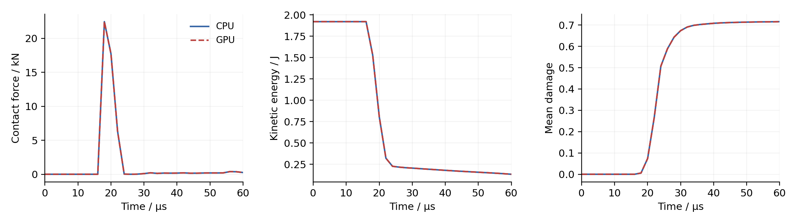
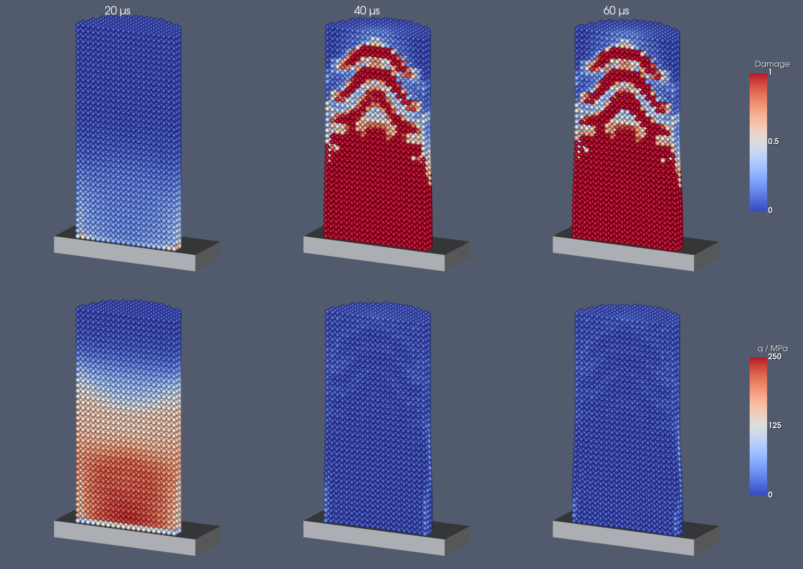

# HJC Taylor-bar impact with SYCL

A concrete cylinder strikes a fixed wall at 30 m/s. The geometry, material
parameters and 60 microsecond duration follow the
[CPU HJC example](../../../3d_examples/test_3d_taylor_bar_hjc/README.md).
This example uses the same HJC constitutive update on the host and device.
Its CK wall contact reproduces the surface-contact law of the CPU example.

## Build and run

Install the dependencies described in the repository's build instructions.
For a SYCL build, use the Intel compiler and select a target supported by
your device. For example, `spir64` allows runtime device selection:

```sh
cmake -S . -B build-sycl -DCMAKE_BUILD_TYPE=Release \
  -DCMAKE_CXX_COMPILER=icpx -DSPHINXSYS_USE_SYCL=ON \
  -DSPHINXSYS_SYCL_TARGETS=spir64 -DSPHINXSYS_2D=OFF \
  -DSPHINXSYS_BUILD_OPTIMIZATION_EXAMPLES=OFF \
  -DSPHINXSYS_BUILD_EXTRA_SOURCE_AND_TESTS=OFF \
  -DSPHINXSYS_BUILD_PYTHON_INTERFACE=OFF
cmake --build build-sycl --target test_3d_taylor_bar_hjc_sycl test_hjc_sycl
```

SPHinXsys uses single precision for SYCL. Configure a CPU build with
`SPHINXSYS_USE_SYCL=OFF` and `SPHINXSYS_USE_FLOAT=ON` for a comparison at
the same precision. Build `test_3d_taylor_bar_hjc` for the classic CPU
reference and `test_3d_taylor_bar_hjc_sycl` for the CK CPU calculation.

Run each calculation in its own directory:

```sh
mkdir impact-gpu
cd impact-gpu
ONEAPI_DEVICE_SELECTOR=level_zero:gpu \
  ../build-sycl/tests/tests_sycl/3d_examples/test_3d_taylor_bar_hjc_sycl/test_3d_taylor_bar_hjc_sycl
```

The default particle spacing is 0.5 mm. `--spacing`, `--speed`, `--cfl`
and `--end-time` control the calculation; the maximum CFL is 0.2.
`history.csv` records contact force, axial velocity, damage, kinetic
energy and the minimum deformation determinant at 31 fixed times.
VTP files contain the particle damage, stress and compaction fields.

```sh
ctest --test-dir build-sycl -R '^(test_hjc_sycl|test_3d_taylor_bar_hjc_sycl)$' --output-on-failure
python tests/tests_sycl/3d_examples/test_3d_taylor_bar_hjc_sycl/plot.py impact-cpu impact-gpu --output figures
```

The impact regression uses 1 mm spacing and the classic CPU example's energy
and mean-damage reference data. CMake copies that existing baseline and changes
only the damage recording name to match the CK recorder. Reference values,
variances and run counts are unchanged. CPU single- and double-precision runs
and both GPU backends were checked against this same baseline. Ordinary runs
do not require the reference files.
The material tests compare prescribed loading paths with the CPU material
interface and check rigid rotation, irreversible history and invalid inputs.

## Response and particle fields

The figures use 0.5 mm spacing (12,640 concrete particles), single precision,
and the Level Zero GPU backend. The CPU comparison uses the classic CPU example.
The OpenCL GPU backend was checked separately. The differences below describe
these runs at 31 common output times; they are not accuracy bounds for other
devices or loading paths. The classic CPU history also contains intermediate
integration steps, which the plotter samples at the device output times.

| Largest sampled CPU/GPU difference | Level Zero | OpenCL |
| --- | ---: | ---: |
| Contact force | 4.78 N | 5.17 N |
| Kinetic energy | 1.27e-4 J | 1.30e-4 J |
| Mean damage | 2.52e-4 | 1.76e-4 |





The cutaway shows particle values without smoothing, using damage 0–1 and
equivalent stress 0–250 MPa, as in the classic CPU illustration. Initial
particle identities and positions were checked before comparing fields.
At 60 microseconds, the single-precision CPU/GPU damage RMS difference is
0.022–0.026, with a maximum difference of about 0.48 across the two backends.
The larger differences develop after softening; small differences in global
curves do not establish pointwise agreement or convergence of a fracture pattern.

A separate double-precision classic CPU/CK CPU comparison isolates the
implementation change: the largest sampled force difference is 0.74 N and
mean-damage difference is 5.15e-5. Final particlewise damage differs by
0.00136 RMS and 0.024 maximum. CK's tabulated inner kernel and neighbor
summation order differ from the classic implementation, so bitwise equality
is not expected. Changing precision also affects local damage in the classic
CPU calculation; the results here do not establish identical local fields.

## Numerical details

`HJCIntegration1stHalfCK` retains the incremental logarithmic strain,
objective stress rotation, total Lagrangian force and pair damping used by
the CPU HJC implementation. `HJCAcousticTimeStepCK` accounts for the evolving
EOS modulus. The second half step uses `StructureIntegration2ndHalf`.

`ClassicWallContactForceCK` uses the CPU surface-contact law: the analytic
Wendland C2 kernel at the mean smoothing length, the kernel offset at the mean
particle spacing, force along the particle-pair direction, and no velocity
impedance term. A copied mask retains the initial `BodySurfaceLayer` selection
of three particle layers. The helper supports one fixed wall with uniform,
isotropic Wendland C2 adaptations; it does not change `RepulsionForceCK`.
The same geometry and initial gap therefore reproduce the CPU contact timing.

Device updates write `HJCIntegrationStatus`. The example checks it after
every first half step and stops on an invalid constitutive state. An invalid
update does not commit material history; it does not roll back the complete
particle time step.

The HJC assumptions and limitations remain those of the CPU example.
Damage is local and particles are retained after full damage. The example
demonstrates constitutive integration rather than a calibrated fracture test.
The coarse regression and fine illustration are not a mesh-convergence study.

Single precision can accumulate stress drift during many small rigid rotations.
Near complete damage, the small remaining strength makes this drift capable of
producing additional plastic strain and damage. This also occurs in the host
single-precision update; use a double-precision comparison when studying such
loading paths. In a 4096-step pure-rotation material-point check with initial
damage 0.99, GPU damage increased by about 0.0018 even though the prescribed
motion contained no strain.

## References

1. Holmquist, T. J., Johnson, G. R., and Cook, W. H. (1993).
   *A computational constitutive model for concrete subjected to large strains,
   high strain rates, and high pressures*. Proceedings of the 14th International
   Symposium on Ballistics, Quebec, pp. 591–600.
2. Meyer, C. S. (2011). [*Development of Geomaterial Parameters for Numerical
   Simulations Using the Holmquist-Johnson-Cook Constitutive Model for Concrete*](https://www.govinfo.gov/content/pkg/GOVPUB-D101-PURL-gpo10967/pdf/GOVPUB-D101-PURL-gpo10967.pdf).
   ARL-TR-5556.
