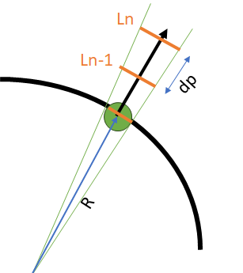

# Algorithm for one-sided FSI problem
The basic idea is to retrieve kernel completeness by using dummy shell contact particles. The algorithm is summarized below:

# Shell curvature
We can compute H and K by:

$$H=\frac{1}{2}\nabla \cdot \mathbf{n}_r$$

$$K=\frac{1}{2}((\nabla \cdot \mathbf{n}_r)^2-\sum_i \sum_j (\frac{\partial n_j}{\partial x_i})^2)$$

where $\mathbf{n}_r$ is the normal direction of the surface. 

For the initial configuration, the gradient of normal can be calculated as:

$$\nabla^0{\mathbf{n}^0}=-\sum_j{(\mathbf{n}^0_i-\mathbf{n}^0_j) \times \nabla^0W_{ij}V_j^0}$$

Here $\nabla^0$ is the gradient in the initial global coordinate.

Note that the bending deformation tensor in the current global configuration is defined as:

$$\mathbb{F}_2=-\sum_j[(\mathbf{n}_i-\mathbf{n}_i^0)-(\mathbf{n}_j-\mathbf{n}_j^0)] \times \nabla^0W_{ij}V_j^0
=\nabla^0{\mathbf{n}}-\nabla^0{\mathbf{n}^0}$$

The $\mathbf{n}$ used in the calculation of bending deformation is actually the pseudo normal, but here we assume that the changing of real and pseudo normal is very close to each other.

Thus $\nabla^0{\mathbf{n}}$ can be computed from the local bending deformation gradient $\mathbb{F}_2^L$:

$$\nabla^0{\mathbf{n}}=\nabla^0{\mathbf{n}^0}+(\mathbb{Q}^0)^T \cdot \mathbb{F}_2^L \cdot \mathbb{Q}^0$$

We can reuse $\mathbb{F}_2^L$ (`F_bending_[index_i]`).

Calculating in the initial global configuration instead of the current one will definitely bring error, but since the curvature is only used for approximate volume change, we will use this formulation at the moment.

The gradient in the current configuration can be computed by:

$$\nabla{\mathbf{n}}=(F_1^{-T}\nabla^0){\mathbf{n}}=-\sum_j(\mathbf{n}_i-\mathbf{n}_j)
 \times F_m^{-T} \cdot \mathbf{e}_{ij}^0dW_{ij}^0V_j^0=
-\sum_j(\mathbf{n}_i-\mathbf{n}_j)
 \cdot [dW_{ij}^0V_j^0(\mathbf{e}_{ij}^0)^T \cdot F_m^{-1}] $$
 
$$F_1^{-1}=(\mathbb{Q}^0)^T \cdot (\mathbb{F}_1^L)^{-1} \cdot \mathbb{Q}^0$$

where $\mathbb{F}_1^L$ is `F_[index_i]`.

# Update volume change

The change in the volume of so-called dummy particles are updated as a cone. For the 2D case, the length of the particle along the normal direction can be written as:

$$l^n=\alpha (R+ndp)$$

where superscript $n$ refers to the nth dummy particle, $dp$ is the particle reference resolution, curve radius $R=1/k$ and $\alpha$ is the angle of the cone. Then the length ratio between the n+1-th and n-th dummy particle reads:

$$\frac{l^{n+1}}{l^n}=1+\frac{1}{R/dp+n}$$

For 2D, the volume (length) of the nth particle can thus be updated as:

$$V^{n+1}=V^n \cdot \frac{l^{n+1}}{l^n}$$

For 3D case, we use the mean curvature to approximate the volume change. Assuming that the length of particle in the 2 principle planes are all varying according to the mean curvature, the volume (area) change reads:

$$V^{n+1}=V^n \cdot (\frac{l^{n+1}}{l^n})^2$$

# Reference
- Nitschke, Ingo, Axel Voigt, and Jörg Wensch. "A finite element approach to incompressible two-phase flow on manifolds." Journal of Fluid Mechanics 708 (2012): 418-438.