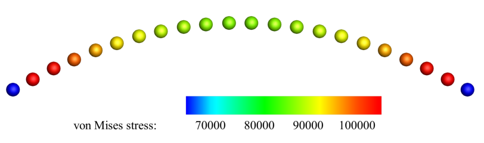

By introducing the Uflyand-Mindlin shell formulation, 
we proposed a simple total Lagrangian SPH method for plate/shell structures,
which is an enhancement of the classical stabilized SPH method commonly used for 3D continua. 
This method allows the modeling of moderately thin structure using only one layer of particles on the plate/shell mid-surface. 
The proposed SPH-based plate/shell modeling is of high-efficiency compared to the classical continuum SPH modeling.

==================================================================================
Example 10: Shell cases: a 2D thin plate
==================================================================================

Here, we consider a upward point force applys on a 2D plate, 
when the displacements of the two ends of this plate are fixed. 
Note that the quasi-static analysis is performed here.

First, we provide the parameters for geometric modeling and numerical setup.

.. code-block:: cpp

	/**
	 * @file 	2d_plate.cpp
	 * @brief 	This is the benchmark test of the shell.
	 * @details  We consider point force force apply on a 2D plate.
	 * @author 	Dong Wu, Chi Zhang and Xiangyu Hu
	 */

	#include "sphinxsys.h"

	using namespace SPH;

	//------------------------------------------------------------------------------
	// global parameters for the case
	//------------------------------------------------------------------------------
	Real PL = 10.0;									  /** Length of the square plate. */
	Vec2d n_0 = Vec2d(0.0, 1.0);					  /** Pseudo-normal. */
	Real thickness = 1.0;							  /** Thickness of the square plate. */
	int particle_number = 40;						  /** Particle number in the direction of the length */
	Real resolution_ref = PL / (Real)particle_number; /** Initial reference particle spacing. */
	int BWD = 1;									  /** number of boundary particles layers . */
	Real BW = resolution_ref * (Real)BWD;			  /** Boundary width, determined by specific layer of boundary particles. */
	BoundingBox system_domain_bounds(Vec2d(-BW, -0.5 * resolution_ref), Vec2d(PL + BW, 0.5 * resolution_ref));
	StdVec<Vecd> observation_location = {Vecd(0.5 * PL, 0.0)};

There is one more angular DOF (Degree of Freedom) for 2D thin structure dynamics than that for 2D solid dynamics. 
And we get the pseudo normal direction by rotating the normal direction according to this angular DOF.
So we should define the initial normal direction, :code:`n_0`.
:code:`resolution_ref` gives the reference of initial particle spacing, 
and :code:`BW` gives the boundary width.
:code:`system_domain_bounds` defines the calculation domain of this case.

Then we give the material properties and load applied.

.. code-block:: cpp

	//----------------------------------------------------------------------
	//	Material properties of the fluid.
	//----------------------------------------------------------------------
	Real rho0_s = 1.0;				   /** Normalized density. */
	Real Youngs_modulus = 1.3024653e6; /** Normalized Youngs Modulus. */
	Real poisson = 0.3;				   /** Poisson ratio. */
	Real physical_viscosity = 400.0;   /** physical damping, here we choose the same value as numerical viscosity. */
	//----------------------------------------------------------------------
	//	Point forces properties
	//----------------------------------------------------------------------
	Real F_full = 50.0e3;
	std::vector<Vecd> point_force{Vec2d(0.0, F_full)};
	std::vector<Vecd> reference_position{Vec2d(0.5 * PL, 0.0)};
	Real time_to_full_external_force = 0.05;

Here we give the physical viscosity for getting quasi-static numerical results. 
:code:`time_to_full_external_force` means the external load increases linearly 
from :code:`Vec2d(0.0, 0.0)` to the specified value :code:`point_force` in the time of :code:`time_to_full_external_force` 
and then remains constant.

We can generate particles directly or by Lattice. 
For the piece of code below, 
we define to generate particles directly by giving each particle position and volume. 

.. code-block:: cpp

	//----------------------------------------------------------------------
	//	Derived classes used in the case
	//----------------------------------------------------------------------
	class PlateParticleGenerator : public SurfaceParticleGenerator
	{
	public:
		explicit PlateParticleGenerator(SPHBody &sph_body) : SurfaceParticleGenerator(sph_body){};
		virtual void initializeGeometricVariables() override
		{
			// the plate and boundary
			for (int i = 0; i < (particle_number + 2 * BWD); i++)
			{
				Real x = resolution_ref * i - BW + resolution_ref * 0.5;
				initializePositionAndVolume(Vecd(x, 0.0), resolution_ref);
				initializeSurfaceProperties(n_0, thickness);
			}
		};
	};
		
	class BoundaryGeometry : public BodyPartByParticle
	{
	public:
		BoundaryGeometry(SPHBody &body, const std::string &body_part_name)
			: BodyPartByParticle(body, body_part_name)
		{
			TaggingParticleMethod tagging_particle_method = std::bind(&BoundaryGeometry::tagManually, this, _1);
			tagParticles(tagging_particle_method);
		};
		virtual ~BoundaryGeometry(){};

	private:
		void tagManually(size_t index_i)
		{
			if (base_particles_->pos_n_[index_i][0] < 0.0 || base_particles_->pos_n_[index_i][0] > PL)
			{
				body_part_particles_.push_back(index_i);
			}
		};
	};

Here, we initialize each particle's position, volume, normal and thickness. 
Note that the volume is :code:`resolution_ref` for 2D shell particles.
And we also define the initial pseudo-normal and thickness for each particle.
Then we define a new class :code:`BoundaryGeometry`, 
derived from the class :code:`BodyPartByParticle`, 
to tag the boundary particles.

Here we come to the :code:`int main()` function. 
In the first part of :code:`main` function, 
an object of :code:`SPHSystem` is created, and :code:`plate_body` and :code:`plate_observer` is defined.

.. code-block:: cpp

	//----------------------------------------------------------------------
	//	Build up -- a SPHSystem
	//----------------------------------------------------------------------
	SPHSystem system(system_domain_bounds, resolution_ref);
	//----------------------------------------------------------------------
	//	Creating body, materials and particles.
	//----------------------------------------------------------------------
	SolidBody plate_body(system, makeShared<DefaultShape>("PlateBody"));
	plate_body.defineParticlesAndMaterial<ShellParticles, LinearElasticSolid>(rho0_s, Youngs_modulus, poisson);
	plate_body.generateParticles<PlateParticleGenerator>();
	plate_body.addBodyStateForRecording<Vecd>("PriorAcceleration");

	ProbeBody plate_observer(system, "PlateObserver");
	plate_observer.generateParticles<ObserverParticleGenerator>(observation_location);
	//----------------------------------------------------------------------
	//	Define body relation map.
	//	The contact map gives the topological connections between the bodies.
	//	Basically the the range of bodies to build neighbor particle lists.
	//----------------------------------------------------------------------
	BodyRelationInner plate_body_inner(plate_body);
	BodyRelationContact plate_observer_contact(plate_observer, {&plate_body});

The material, particles and bodies are created. 
Then, the observer body and the collection of topological relations,
which specifies for each body the possible interacting bodies, 
are defined. 

.. code-block:: cpp

	/** Creat a plate body. */
	Plate *plate_body = new Plate(system, "PlateBody", new ParticleAdaptation(1.15, 0), new ParticleGeneratorDirect());
	/** elastic soild material properties */
	PlateMaterial *plate_material = new PlateMaterial();
	/** Creat particles for the elastic body. */
	ShellParticles plate_body_particles(plate_body, plate_material, PT);

When defining :code:`plate_body`, four parameters are inputed.
In :code:`ParticleAdaptation(1.15, 0)`, 1.15 is the smooth length ratio, 
which means the cutoff radius for searching neighbor particls is 2.3 * :code:`resolution_ref`.
And 0 is global refinement level, which means the particle spacing is still :code:`resolution_ref`.
If 0 is changed to 1, the particle spacing will be half :code:`resolution_ref`.
And then the observer body and contact map are defined.
Using class :code:`InnerBodyRelation` means :code:`plate_body_inner` defines the inner data connections.
And using class :code:`ContactBodyRelation` means :code:`plate_observer_contact` 
defines the :code:`palte_observer` has data connections with :code:`plate_body`,
e.g. the :code:`palte_observer` gets data from :code:`plate_body`.
After this, all the physical dynamics are defined in the form of particle discretization.

.. code-block:: cpp

	//----------------------------------------------------------------------
	//	Define all numerical methods which are used in this case.
	//----------------------------------------------------------------------
	/** Corrected configuration. */
	thin_structure_dynamics::ShellCorrectConfiguration corrected_configuration(plate_body_inner);
	/** Time step size. */
	thin_structure_dynamics::ShellAcousticTimeStepSize computing_time_step_size(plate_body);
	/** stress relaxation. */
	thin_structure_dynamics::ShellStressRelaxationFirstHalf stress_relaxation_first_half(plate_body_inner, 3, true);
	thin_structure_dynamics::ShellStressRelaxationSecondHalf stress_relaxation_second_half(plate_body_inner);
	thin_structure_dynamics::DistributingPointForcesToShell
		apply_point_force(plate_body, point_force, reference_position, time_to_full_external_force, resolution_ref);
	/** Constrain the Boundary. */
	BoundaryGeometry boundary_geometry(plate_body, "BoundaryGeometry");
	thin_structure_dynamics::ConstrainShellBodyRegion constrain_holder(plate_body, boundary_geometry);
	DampingWithRandomChoice<DampingPairwiseInner<Vec2d>>
		plate_position_damping(0.2, plate_body_inner, "Velocity", physical_viscosity);
	DampingWithRandomChoice<DampingPairwiseInner<Vec2d>>
		plate_rotation_damping(0.2, plate_body_inner, "AngularVelocity", physical_viscosity);

First, the correted configuration is defined to ensure the first-order consistency, 
which will be executed only once.
Then, the methods that will used for multiple times are defined. 
They are the SPH algorithms for the time step criteria, thin structure dynamics, 
point force, boundary condition and physical damping.
Note that the time step is dependent on plate thickness and material properties,
and physical damping is applied for quasi-steady analysis.

Before the computation, we also define the outputs, 
including the particle states and obervations.

.. code-block:: cpp

	//----------------------------------------------------------------------
	//	Define the methods for I/O operations and observations of the simulation.
	//----------------------------------------------------------------------
	InOutput in_output(system);
	BodyStatesRecordingToPlt write_states(in_output, system.real_bodies_);
	RegressionTestDynamicTimeWarping<ObservedQuantityRecording<Vecd>>
		write_plate_max_displacement("Position", in_output, plate_observer_contact);

The :code:`Plt` files can be read directly by the Tecplot.
You can also save the files in ParaView format by changing :code:`WriteBodyStatesToPlt` to :code:`WriteBodyStatesToVtp`.
The observation data are written in simple data format 
and are used to check the accuracy of the simulation results in the regression tests.

The initial conditions, 
including the cell-linked list, particle configuration, corrected configuration and wetghts of applying point force,  
are executed once before the main loop.

.. code-block:: cpp

	//----------------------------------------------------------------------
	//	Prepare the simulation with cell linked list, configuration
	//	and case specified initial condition if necessary.
	//----------------------------------------------------------------------
	system.initializeSystemCellLinkedLists();
	system.initializeSystemConfigurations();
	corrected_configuration.parallel_exec();
	apply_point_force.getWeight();
	//----------------------------------------------------------------------
	//	First output before the main loop.
	//----------------------------------------------------------------------
	write_states.writeToFile(0);
	write_plate_max_displacement.writeToFile(0);

For solid dynamics, we do not change the cell-linked list and particle configuration. 
So they are calculated only once before the simulation.
After that, we output the initial body states and observation data.

The basic control parameter for the simulation is defined in the following, 
such as total simulation time 
and interval for writing output files. 

.. code-block:: cpp

	//----------------------------------------------------------------------
	//	Basic control parameters for time stepping.
	//----------------------------------------------------------------------
	int ite = 0;
	Real end_time = 0.8;
	Real output_period = end_time / 100.0;
	Real dt = 0.0;
	/** Statistics for computing time. */
	tick_count t1 = tick_count::now();
	tick_count::interval_t interval;
	//----------------------------------------------------------------------
	//	Main loop of time stepping starts here.
	//----------------------------------------------------------------------
	while (GlobalStaticVariables::physical_time_ < end_time)
	{
		Real integral_time = 0.0;
		while (integral_time < output_period)
		{
			if (ite % 1000 == 0)
			{
				std::cout << "N=" << ite << " Time: "
						  << GlobalStaticVariables::physical_time_ << "	dt: "
						  << dt << "\n";
			}
			apply_point_force.getForce();
			apply_point_force.parallel_exec(dt);
			stress_relaxation_first_half.parallel_exec(dt);
			constrain_holder.parallel_exec(dt);
			plate_position_damping.parallel_exec(dt);
			plate_rotation_damping.parallel_exec(dt);
			constrain_holder.parallel_exec(dt);
			stress_relaxation_second_half.parallel_exec(dt);

			ite++;
			dt = computing_time_step_size.parallel_exec();
			integral_time += dt;
			GlobalStaticVariables::physical_time_ += dt;
		}
		write_plate_max_displacement.writeToFile(ite);
		tick_count t2 = tick_count::now();
		write_states.writeToFile();
		tick_count t3 = tick_count::now();
		interval += t3 - t2;
	}
	tick_count t4 = tick_count::now();

	tick_count::interval_t tt;
	tt = t4 - t1 - interval;
	std::cout << "Total wall time for computation: " << tt.seconds() << " seconds." << std::endl;

	write_plate_max_displacement.newResultTest();

	return 0;

During the looping outputs are scheduled.
On screen output will be the number of time steps, 
the current physical time and acoustic time-step size.
After the simulation is terminated, 
the statistics of computation time and the accuracy of the observation data are output on the screen.
Note that the total computation time has excluded the time for writing files.

After the simulation process, one can use the Tecplot to read the result files.
The following figure shows the von Mises stresses of this 2D thin plate.

   The von Mises stresses of 2D thin plate.

