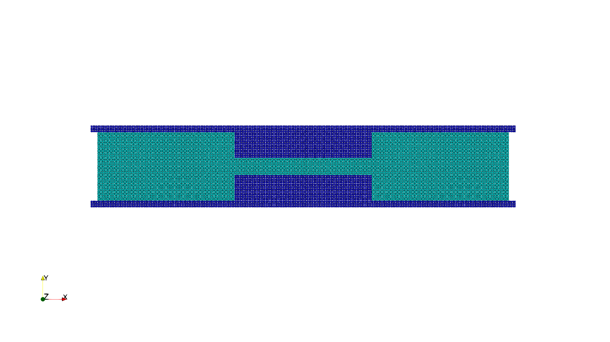

This is the one of the basic test cases, also the first case for
understanding SPH method for non-Newtonian low Reynolds number flows.

======================
Example 17: 2D throat
======================

As shown in the figure, the schematic sketch of the initial setup.

   Initial configuration

First, we provide the parameters for geometric modeling and numerical setup.

.. code-block:: cpp

	#include "sphinxsys.h"
	using namespace SPH;

	Real DH = 4.0;					//channel height
	Real DT = 1.0;					//throat height
	Real DL = 24.0;					//channel length
	Real resolution_ref = 0.1;		//particle spacing
	Real BW = resolution_ref * 4.0; //boundary width
	/** Domain bounds of the system. */
	BoundingBox system_domain_bounds(Vec2d(-0.5 * DL - BW, -0.5 * DH - BW),
									 Vec2d(0.5 * DL + BW, 0.5 * DH + BW));

:code:`DH` is the channel height,
:code:`DT` is the throat height,
:code:`DL` is the channel length,
:code:`resolution_ref` gives the reference of initial particle spacing, 
:code:`BW` gives the boundary width,
:code:`system_domain_bounds` defines the domain of this case.

Then we give the material properties.

.. code-block:: cpp

	Real rho0_f = 1.0;
	Real gravity_g = 1.0;     /**< Gravity force of fluid. */
	Real Re = 0.001;		  /**< Reynolds number defined in the channel */
	Real mu_f = rho0_f * sqrt(0.5 * rho0_f * powerN(0.5 * DH, 3) * gravity_g / Re);
	Real U_c = 0.5 * powerN(0.5 * DH, 2) * gravity_g * rho0_f / mu_f;
	Real U_f = U_c * DH / DT;
	Real c_f = 10.0 * (U_f, sqrt(mu_f / rho0_f * U_f / DT));
	Real mu_p_f = 0.6 * mu_f;
	Real lambda_f = 10.0;

:code:`rho0_f` is the density of the fluid,
:code:`gravity_g` is gravity force of fluid,
:code:`Re` is Reynolds number defined in the channel,
:code:`mu_f` is viscosity, 
:code:`U_c` is the maximum velocity in the channel,
:code:`U_f` is the maximum velocity in the throat, 
:code:`c_f` is the sound of speed, 
:code:`mu_p_f` is the polymeric viscosity, 
:code:`lambda_f` is the relaxation time, 
and in this case, all parameters are non-dimensional.

Here, we create the fluid and wall bodies.

.. code-block:: cpp

	//----------------------------------------------------------------------
	// Create fluid body
	//----------------------------------------------------------------------
	class FluidBlock : public FluidBody
	{
	public:
		FluidBlock(SPHSystem &system, const std::string &body_name)
			: FluidBody(system, body_name)
		{
			std::vector<Vecd> pnts;
			pnts.push_back(Vecd(-0.5 * DL, -0.5 * DH));
			pnts.push_back(Vecd(-0.5 * DL, 0.5 * DH));
			pnts.push_back(Vecd(-DL / 6.0, 0.5 * DH));
			pnts.push_back(Vecd(-DL / 6.0, -0.5 * DH));
			pnts.push_back(Vecd(-0.5 * DL, -0.5 * DH));

			std::vector<Vecd> pnts1;
			pnts1.push_back(Vecd(-DL / 6.0 - BW, -0.5 * DT));
			pnts1.push_back(Vecd(-DL / 6.0 - BW, 0.5 * DT));
			pnts1.push_back(Vecd(DL / 6.0 + BW, 0.5 * DT));
			pnts1.push_back(Vecd(DL / 6.0 + BW, -0.5 * DT));
			pnts1.push_back(Vecd(-DL / 6.0 - BW, -0.5 * DT));

			std::vector<Vecd> pnts2;
			pnts2.push_back(Vecd(DL / 6.0, -0.5 * DH));
			pnts2.push_back(Vecd(DL / 6.0, 0.5 * DH));
			pnts2.push_back(Vecd(0.5 * DL, 0.5 * DH));
			pnts2.push_back(Vecd(0.5 * DL, -0.5 * DH));
			pnts2.push_back(Vecd(DL / 6.0, -0.5 * DH));

			MultiPolygon multi_polygon;
			multi_polygon.addAPolygon(pnts, ShapeBooleanOps::add);
			multi_polygon.addAPolygon(pnts1, ShapeBooleanOps::add);
			multi_polygon.addAPolygon(pnts2, ShapeBooleanOps::add);

			body_shape_.add<MultiPolygonShape>(multi_polygon);
		}
	};

	//----------------------------------------------------------------------
	// Create wall body
	//----------------------------------------------------------------------
	class WallBoundary : public SolidBody
	{
	public:
		WallBoundary(SPHSystem &system, const std::string &body_name)
			: SolidBody(system, body_name)
		{
			std::vector<Vecd> pnts3;
			pnts3.push_back(Vecd(-0.5 * DL - BW, -0.5 * DH - BW));
			pnts3.push_back(Vecd(-0.5 * DL - BW, 0.5 * DH + BW));
			pnts3.push_back(Vecd(0.5 * DL + BW, 0.5 * DH + BW));
			pnts3.push_back(Vecd(0.5 * DL + BW, -0.5 * DH - BW));
			pnts3.push_back(Vecd(-0.5 * DL - BW, -0.5 * DH - BW));

			std::vector<Vecd> pnts;
			pnts.push_back(Vecd(-0.5 * DL - 2.0 * BW, -0.5 * DH));
			pnts.push_back(Vecd(-0.5 * DL - 2.0 * BW, 0.5 * DH));
			pnts.push_back(Vecd(-DL / 6.0, 0.5 * DH));
			pnts.push_back(Vecd(-DL / 6.0, -0.5 * DH));
			pnts.push_back(Vecd(-0.5 * DL - 2.0 * BW, -0.5 * DH));

			std::vector<Vecd> pnts1;
			pnts1.push_back(Vecd(-DL / 6.0 - BW, -0.5 * DT));
			pnts1.push_back(Vecd(-DL / 6.0 - BW, 0.5 * DT));
			pnts1.push_back(Vecd(DL / 6.0 + BW, 0.5 * DT));
			pnts1.push_back(Vecd(DL / 6.0 + BW, -0.5 * DT));
			pnts1.push_back(Vecd(-DL / 6.0 - BW, -0.5 * DT));

			std::vector<Vecd> pnts2;
			pnts2.push_back(Vecd(DL / 6.0, -0.5 * DH));
			pnts2.push_back(Vecd(DL / 6.0, 0.5 * DH));
			pnts2.push_back(Vecd(0.5 * DL + 2.0 * BW, 0.5 * DH));
			pnts2.push_back(Vecd(0.5 * DL + 2.0 * BW, -0.5 * DH));
			pnts2.push_back(Vecd(DL / 6.0, -0.5 * DH));

			MultiPolygon multi_polygon;
			multi_polygon.addAPolygon(pnts3, ShapeBooleanOps::add);
			multi_polygon.addAPolygon(pnts, ShapeBooleanOps::sub);
			multi_polygon.addAPolygon(pnts1, ShapeBooleanOps::sub);
			multi_polygon.addAPolygon(pnts2, ShapeBooleanOps::sub);

			body_shape_.add<MultiPolygonShape>(multi_polygon);
		}
	};
	
After completing the initial geometric modeling and numerical setup, we come to the :code:`int main()` function. 

.. code-block:: cpp

	SPHSystem system(system_domain_bounds, resolution_ref);

	GlobalStaticVariables::physical_time_ = 0.0;

	In_Output in_output(system);

In the first part of :code:`main` function, an object of :code:`SPHSystem` is created, the starting time :code:`GlobalStaticVariables::physical_time_ = 0.0` and outout enviroment :code:`In_Output in_output(system)` are set.

Then create body, materials and particles for fluid channel and solid wall

.. code-block:: cpp

	FluidBlock fluid_block(system, "FluidBody");
	ViscoelasticFluidParticles fluid_particles(fluid_block, makeShared<Oldroyd_B_Fluid>(rho0_f, c_f, mu_f, lambda_f, mu_p_f));

	WallBoundary wall_boundary(system, "Wall");
	SolidParticles wall_particles(wall_boundary);

:code:`Oldroyd_B_Fluid` is a non-Newtonian flow material.

Define the contact map.

.. code-block:: cpp

	BodyRelationInner fluid_block_inner(fluid_block);
	ComplexBodyRelation fluid_block_complex(fluid_block_inner, {&wall_boundary});

Using class :code:`BodyRelationInner` means :code:`beam_body_inner` defines the inner data connections.
And using class :code:`ComplexBodyRelation` means the relation combined an inner and a contactbody relation.

Define outputs functions

.. code-block:: cpp

	BodyStatesRecordingToVtp write_real_body_states(in_output, system.real_bodies_);

Then the main algorithm is defined, including the general methods: time stepping based on fluid dynamics, fluid dynamics and boundary conditions.

.. code-block:: cpp

	PeriodicConditionInAxisDirectionUsingGhostParticles periodic_condition(fluid_block, xAxis);
	//evaluation of density by summation approach
	fluid_dynamics::DensitySummationComplex update_density_by_summation(fluid_block_complex);
	//time step size without considering sound wave speed and viscosity
	fluid_dynamics::AdvectionTimeStepSizeForImplicitViscosity get_fluid_advection_time_step_size(fluid_block, U_f);
	//time step size with considering sound wave speed
	fluid_dynamics::AcousticTimeStepSize get_fluid_time_step_size(fluid_block);
	//pressure relaxation using verlet time stepping
	fluid_dynamics::PressureRelaxationWithWallOldroyd_B pressure_relaxation(fluid_block_complex);
	pressure_relaxation.pre_processes_.push_back(&periodic_condition.ghost_update_);
	fluid_dynamics::DensityRelaxationWithWallOldroyd_B density_relaxation(fluid_block_complex);
	density_relaxation.pre_processes_.push_back(&periodic_condition.ghost_update_);
	//define external force
	Gravity gravity(Vecd(gravity_g, 0.0));
	TimeStepInitialization initialize_a_fluid_step(fluid_block, gravity);
	fluid_dynamics::ViscousAccelerationWithWall viscous_acceleration(fluid_block_complex);
	//computing viscous effect implicitly and with update velocity directly other than viscous acceleration
	DampingPairwiseWithWall<Vec2d, DampingPairwiseInner>
		implicit_viscous_damping(fluid_block_complex, "Velocity", mu_f);
	//impose transport velocity
	fluid_dynamics::TransportVelocityCorrectionComplex transport_velocity_correction(fluid_block_complex);
	//computing vorticity in the flow
	fluid_dynamics::VorticityInner compute_vorticity(fluid_block_inner);

:code:`PeriodicConditionInAxisDirectionUsingGhostParticles` : to impose the perodic condintion on the inlet and outlet.
:code:`DensitySummationComplex` : to compute density through summation approch.
:code:`AdvectionTimeStepSizeForImplicitViscosity` : to compute the advection time step size.
:code:`AcousticTimeStepSize` : to compute acoustic time step size.
:code:`PressureRelaxationWithWallOldroyd_B` : to compute the acceleration due to the elastic force.
:code:`DensityRelaxationWithWallOldroyd_B` : to compute the change rate of elastic stress and elastic stress.
:code:`ViscousAccelerationWithWall` : to compute the viscous acceleration.
:code:`DampingPairwiseWithWall` : a quantity damping by a pairwise splitting scheme.
:code:`TransportVelocityCorrectionComplex` : to eliminate the tensile instability.
:code:`VorticityInner` : to compute the vorticity of the flow.

Initialization includes cell linked lists and configuration for bodies and surface normal direction.

.. code-block:: cpp

	system.initializeSystemCellLinkedLists();
	//initial periodic boundary condition
	periodic_condition.ghost_creation_.parallel_exec();
	system.initializeSystemConfigurations();
	//prepare quantities will be used once only
	wall_particles.initializeNormalDirectionFromBodyShape();

Finally, the time-stepping loop.

.. code-block:: cpp

	int number_of_iterations = 0;
	int screen_output_interval = 100;
	Real End_Time = 5;	
	Real D_Time = 0.01; //time step size for ouput file
	Real dt = 0.0;     //default acoustic time step sizes
	//statistics for computing time
	tick_count t1 = tick_count::now();
	tick_count::interval_t interval;
	//----------------------------------------------------------------------
	//	First output before the main loop.
	//----------------------------------------------------------------------
	write_real_body_states.writeToFile();
	//----------------------------------------------------------------------
	//	Main loop starts here.
	//----------------------------------------------------------------------
	while (GlobalStaticVariables::physical_time_ < End_Time)
	{
		Real integration_time = 0.0;
		//integrate time (loop) until the next output time
		while (integration_time < D_Time)
		{

			initialize_a_fluid_step.parallel_exec();
			Real Dt = get_fluid_advection_time_step_size.parallel_exec();
			update_density_by_summation.parallel_exec();
			transport_velocity_correction.parallel_exec(Dt);

			Real relaxation_time = 0.0;
			while (relaxation_time < Dt)
			{
				dt = SMIN(get_fluid_time_step_size.parallel_exec(), Dt);
				implicit_viscous_damping.parallel_exec(dt);
				pressure_relaxation.parallel_exec(dt);
				density_relaxation.parallel_exec(dt);

				relaxation_time += dt;
				integration_time += dt;
				GlobalStaticVariables::physical_time_ += dt;
			}

			if (number_of_iterations % screen_output_interval == 0)
			{
				std::cout << std::fixed << std::setprecision(9) << "N=" << number_of_iterations << "	Time = "
						  << GlobalStaticVariables::physical_time_
						  << "	Dt = " << Dt << "	dt = " << dt << "\n";
			}
			number_of_iterations++;

			//water block configuration and periodic condition
			periodic_condition.bounding_.parallel_exec();
			fluid_block.updateCellLinkedList();
			periodic_condition.ghost_creation_.parallel_exec();
			fluid_block_complex.updateConfiguration();
		}

		tick_count t2 = tick_count::now();
		compute_vorticity.parallel_exec();
		write_real_body_states.writeToFile();
		tick_count t3 = tick_count::now();
		interval += t3 - t2;
	}
	tick_count t4 = tick_count::now();

	tick_count::interval_t tt;
	tt = t4 - t1 - interval;
	std::cout << "Total wall time for computation: " << tt.seconds() << " seconds." << std::endl;

	return 0;

:code:`periodic_condition.bounding_.parallel_exec()`, :code:`fluid_block.updateCellLinkedList()`, 
:code:`periodic_condition.ghost_creation_.parallel_exec()` and :code:`fluid_block_complex.updateConfiguration()` means
the cell link list and configuration need to be updated every :code:`Dt` time step. 

During the looping, outputs are scheduled.
On screen output will be the number of time steps, 
the current physical time and acoustic time-step size.
After the simulation is terminated, the statistics of computation time are outputed to the screen.
Note that the total computation time has excluded the time for writing files.

After the simulation process, you can use the Paraview to read the result files.
The following figure shows the velocity field.

.. figure:: ../figures/throat_Velocity.png
   :width: 600 px
   :align: center

   The velocity field of throat.

