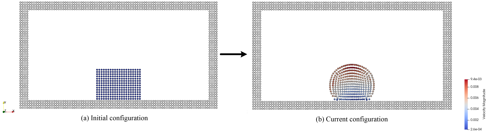

In this example,
we’ll introduce 2D two-phase flow including wetting effect.

=======================
Example 18: 2D wetting
=======================

We start by initializing a water droplet as a square. 
The droplet contacts with the wall and air and deforms under the action of surface tension. 
The result is shown below.

   The deformation of a water droplet under the wetting effect.

Let’s go through the program line by line and see how it works. 
It begins with the include statement:

.. code-block:: cpp

	/**
	 * @file 	wetting.cpp
	 * @brief 	2D two-phase flow for weeting effect.
	 * @details This is the one of the basic test cases for understanding SPH method for multi-phase simulation.
	 * @author 	Chi Zhang and Xiangyu Hu
	 */
	#include "wetting.h"
	#include "sphinxsys.h"
	using namespace SPH;

The :code:`sphinxsys.h` gets us all the declarations we need to write a SPHinXsys-using application.
And the :code:`SPH` namespace includes nearly all of the symbols used by SPHinXsys.
The :code:`wetting.h` defines the numerical parameters and body definition for this 2D two-phase wetting flow.
Now we go to the header file, :code:`wetting.h`.

.. code-block:: cpp

	/**
	 * @file 	wetting.h
	 * @brief 	Numerical parameters and body definition for 2D two-phase wetting flow.
	 * @author 	Chi Zhang and Xiangyu Hu
	 */
	#include "sphinxsys.h" // SPHinXsys Library.
	using namespace SPH;   // Namespace cite here.
	//----------------------------------------------------------------------
	//	Basic geometry parameters and numerical setup.
	//----------------------------------------------------------------------
	Real DL = 2.0;						   /**< Tank length. */
	Real DH = 1.0;						   /**< Tank height. */
	Real particle_spacing_ref = DL / 40.0; /**< Initial reference particle spacing. */
	Real BW = particle_spacing_ref * 4;	   /**< Extending width for BCs. */
	/** Domain bounds of the system. */
	BoundingBox system_domain_bounds(Vec2d(-BW, -BW), Vec2d(DL + BW, DH + BW));

The first part provides the parameters for the geometric modeling.
Here, :code:`particle_spacing_ref` gives the reference initial particle spacing. 
:code:`BW` is the size (thickness) of a wall boundary, which is usually 4 times of particle spacing. 
We give the the coordinates of lower and upper bounds of the domain 
in :code:`system_domain_bounds` 
which will be used as the bounds for a mesh used for building cell linked lists.

We also provide parameters for physical modeling, 
such as material properties of the fluid and physical parameters of this wetting problem.

.. code-block:: cpp

	//----------------------------------------------------------------------
	//	Material properties of the fluid.
	//----------------------------------------------------------------------
	Real rho0_f = 1.0;								  /**< Reference density of water. */
	Real rho0_a = 1.0e-3;							  /**< Reference density of air. */
	Real gravity_g = 0.0;							  /**< Gravity force of fluid. */
	Real U_max = 1.0;								  /**< Characteristic velocity. */
	Real c_f = 10.0 * U_max;						  /**< Reference sound speed. */
	Real mu_f = 5.0e-2;								  /**< Water viscosity. */
	Real mu_a = 5.0e-5;								  /**< Air viscosity. */
	Real contact_angle = (150.0 / 180.0) * 3.1415926; /**< Contact angle with Wall. */
	Real tension_force = 0.008;

As we are using a weakly compressible model for imposing incompressibility, 
the maximum speed in the flow and artificial speed of sound are estimated.
The contact angle with wall is also give here.

Then, we define the realization of :code:`SPHBody` s.
First, the geometric shapes, 
water_block_shape, outer_wall_shape, and inner_wall_shape, 
are defined form the coordinates based on the geometric parameters.

.. code-block:: cpp

	//----------------------------------------------------------------------
	//	Geometric shapes used in the system.
	//----------------------------------------------------------------------
	/** create a water block shape */
	std::vector<Vecd> createWaterBlockShape()
	{
		//geometry
		std::vector<Vecd> water_block_shape;
		water_block_shape.push_back(Vecd(0.375 * DL, 0.0));
		water_block_shape.push_back(Vecd(0.375 * DL, 0.35 * DH));
		water_block_shape.push_back(Vecd(0.625 * DL, 0.35 * DH));
		water_block_shape.push_back(Vecd(0.625 * DL, 0.0));
		water_block_shape.push_back(Vecd(0.375 * DL, 0.0));
		return water_block_shape;
	}
	/** create outer wall shape */
	std::vector<Vecd> createOuterWallShape()
	{
		std::vector<Vecd> outer_wall_shape;
		outer_wall_shape.push_back(Vecd(-BW, -BW));
		outer_wall_shape.push_back(Vecd(-BW, DH + BW));
		outer_wall_shape.push_back(Vecd(DL + BW, DH + BW));
		outer_wall_shape.push_back(Vecd(DL + BW, -BW));
		outer_wall_shape.push_back(Vecd(-BW, -BW));

		return outer_wall_shape;
	}
	/** create inner wall shape */
	std::vector<Vecd> createInnerWallShape()
	{
		std::vector<Vecd> inner_wall_shape;
		inner_wall_shape.push_back(Vecd(0.0, 0.0));
		inner_wall_shape.push_back(Vecd(0.0, DH));
		inner_wall_shape.push_back(Vecd(DL, DH));
		inner_wall_shape.push_back(Vecd(DL, 0.0));
		inner_wall_shape.push_back(Vecd(0.0, 0.0));

		return inner_wall_shape;
	}
	//----------------------------------------------------------------------
	//	Water block body with cases-dependent geometries (ComplexShape).
	//----------------------------------------------------------------------
	class WaterBlock : public FluidBody
	{
	public:
		WaterBlock(SPHSystem &sph_system, const string &body_name)
			: FluidBody(sph_system, body_name, makeShared<SPHAdaptation>(1.3, 1))
		{
			/** Geomtry definition. */
			MultiPolygon multi_polygon;
			multi_polygon.addAPolygon(createWaterBlockShape(), ShapeBooleanOps::add);
			body_shape_.add<MultiPolygonShape>(multi_polygon);
		}
	};
	//----------------------------------------------------------------------
	//	Air block body with cases-dependent geometries (ComplexShape).
	//----------------------------------------------------------------------
	class AirBlock : public FluidBody
	{
	public:
		AirBlock(SPHSystem &sph_system, const std::string &body_name)
			: FluidBody(sph_system, body_name, makeShared<SPHAdaptation>(1.3, 1.0))
		{
			/** Geomtry definition. */
			MultiPolygon multi_polygon;
			multi_polygon.addAPolygon(createInnerWallShape(), ShapeBooleanOps::add);
			multi_polygon.addAPolygon(createWaterBlockShape(), ShapeBooleanOps::sub);
			body_shape_.add<MultiPolygonShape>(multi_polygon);
		}
	};
	//----------------------------------------------------------------------
	//	Wall boundary body definition.
	//----------------------------------------------------------------------
	class WallBoundary : public SolidBody
	{
	public:
		WallBoundary(SPHSystem &sph_system, const std::string &body_name)
			: SolidBody(sph_system, body_name, makeShared<SPHAdaptation>(1.3, 1))
		{
			/** Geomtry definition. */
			std::vector<Vecd> outer_shape = createOuterWallShape();
			std::vector<Vecd> inner_shape = createInnerWallShape();
			MultiPolygon multi_polygon;
			multi_polygon.addAPolygon(outer_shape, ShapeBooleanOps::add);
			multi_polygon.addAPolygon(inner_shape, ShapeBooleanOps::sub);
			body_shape_.add<MultiPolygonShape>(multi_polygon);
		}
	};

The :code:`WaterBlock`, :code:`AirBlock`and  :code:`WallBoundary`, 
which are the derived class of :code:`FluidBody` and :code:`SolidBody` respectively, 
are difined with boolean operation, 
such as :code:`add` and :code:`sub`.

After all :code:`SPHBody` s are defined, here comes to the :code:`int main()` function 
which is given in the :code:`wetting.cpp` file.
In the first part of :code:`main` function, 
an object of :code:`SPHSystem` is created, 
whether the computation begin from restart files is checked, 
and input/output environment is initialized.

.. code-block:: cpp

	//----------------------------------------------------------------------
	//	Build up the environment of a SPHSystem.
	//----------------------------------------------------------------------
	SPHSystem sph_system(system_domain_bounds, particle_spacing_ref);
	/** Set the starting time. */
	GlobalStaticVariables::physical_time_ = 0.0;
	/** Tag for computation from restart files. 0: not from restart files. */
	sph_system.restart_step_ = 0;
	/** I/O environment. */
	In_Output in_output(sph_system);
	//----------------------------------------------------------------------
	//	Creating body, materials and particles.
	//----------------------------------------------------------------------
	WaterBlock water_block(sph_system, "WaterBody");
	FluidParticles water_particles(water_block, makeShared<WeaklyCompressibleFluid>(rho0_f, c_f, mu_f));

	AirBlock air_block(sph_system, "AirBody");
	FluidParticles air_particles(air_block, makeShared<WeaklyCompressibleFluid>(rho0_a, c_f, mu_a));

	WallBoundary wall_boundary(sph_system, "Wall");
	SolidParticles wall_particles(wall_boundary);
	//----------------------------------------------------------------------
	//	Define body relation map.
	//	The contact map gives the topological connections between the bodies.
	//	Basically the the range of bodies to build neighbor particle lists.
	//----------------------------------------------------------------------
	ComplexBodyRelation water_air_complex(water_block, {&air_block});
	BodyRelationContact water_wall_contact(water_block, {&wall_boundary});
	ComplexBodyRelation air_water_complex(air_block, {&water_block});
	BodyRelationContact air_wall_contact(air_block, {&wall_boundary});

The material, particles and bodies are also created for water block, air block and wall. 
Then, the collection of topological relations,
which specifies for each body the possible interacting bodies, 
are defined. 

After this, the physical dynamics of system is defined 
as method classes in the form of particle discretization.

.. code-block:: cpp

	//----------------------------------------------------------------------
	//	Define the main numerical methods used in the simulation.
	//	Note that there may be data dependence on the constructors of these methods.
	//----------------------------------------------------------------------
	/** Define external force. */
	Gravity gravity(Vecd(0.0, -gravity_g));
	/** Initialize particle acceleration. */
	TimeStepInitialization initialize_a_water_step(water_block, gravity);
	TimeStepInitialization initialize_a_air_step(air_block, gravity);
	/** Evaluation of density by summation approach. */
	fluid_dynamics::DensitySummationFreeSurfaceComplex
		update_water_density_by_summation(water_air_complex.inner_relation_, water_wall_contact);
	fluid_dynamics::DensitySummationComplex
		update_air_density_by_summation(air_water_complex, air_wall_contact);
	/** transsport formulation for regularizing particle distribution. */
	fluid_dynamics::TransportVelocityCorrectionComplex
		air_transport_correction(air_water_complex, air_wall_contact);
	/** Time step size without considering sound wave speed. */
	fluid_dynamics::AdvectionTimeStepSize get_water_advection_time_step_size(water_block, U_max);
	fluid_dynamics::AdvectionTimeStepSize get_air_advection_time_step_size(air_block, U_max);
	/** Time step size with considering sound wave speed. */
	fluid_dynamics::AcousticTimeStepSize get_water_time_step_size(water_block);
	fluid_dynamics::AcousticTimeStepSize get_air_time_step_size(air_block);
	/** Pressure relaxation for water by using position verlet time stepping. */
	fluid_dynamics::PressureRelaxationRiemannWithWall
		water_pressure_relaxation(water_air_complex.inner_relation_, water_wall_contact);
	fluid_dynamics::DensityRelaxationRiemannWithWall
		water_density_relaxation(water_air_complex.inner_relation_, water_wall_contact);
	/** Extend Pressure relaxation is used for air. */
	fluid_dynamics::ExtendMultiPhasePressureRelaxationRiemannWithWall
		air_pressure_relaxation(air_water_complex, air_wall_contact, 2.0);
	fluid_dynamics::MultiPhaseDensityRelaxationRiemannWithWall
		air_density_relaxation(air_water_complex, air_wall_contact);
	/** Viscous acceleration. */
	fluid_dynamics::ViscousAccelerationMultiPhase
		air_viscous_acceleration(air_water_complex);
	fluid_dynamics::ViscousAccelerationMultiPhase
		water_viscous_acceleration(water_air_complex);
	/** Suface tension and wetting effects. */
	fluid_dynamics::FreeSurfaceIndicationComplex
		surface_detection(water_air_complex.inner_relation_, water_wall_contact);
	fluid_dynamics::ColorFunctionGradientComplex
		color_gradient(water_air_complex.inner_relation_, water_wall_contact);
	fluid_dynamics::ColorFunctionGradientInterplationInner
		color_gradient_interpolation(water_air_complex.inner_relation_);
	fluid_dynamics::SurfaceTensionAccelerationInner
		surface_tension_acceleration(water_air_complex.inner_relation_, tension_force);
	/** Wetting effects. */
	fluid_dynamics::SurfaceNormWithWall
		wetting_norm(water_wall_contact, contact_angle);

First, the gravity of water and air is defined.
Then, the methods that will used for multiple times are defined.
They are the SPH algorithms for the fluid dynamics, the time step criteria, surface tension and wetting effect.

After the dynamics, we also define the outputs, 
including the particle states, restart files.

.. code-block:: cpp

	//----------------------------------------------------------------------
	//	Define the methods for I/O operations, observations
	//	and regression tests of the simulation.
	//----------------------------------------------------------------------
	/** Output the body states. */
	BodyStatesRecordingToVtp body_states_recording(in_output, sph_system.real_bodies_);
	/** Output the body states for restart simulation. */
	RestartIO restart_io(in_output, sph_system.real_bodies_);

The :code:`Vtp` files can be read directly by the open-source visualization code ParaView.
You also have the option to save the files in Tecplot format. 
The restart files are in :code:`XML` data format. 

Before the computation, 
we need to prepare the simulation with the cell linked list, configuration and the wall normal direction.

.. code-block:: cpp

	//----------------------------------------------------------------------
	//	Prepare the simulation with cell linked list, configuration
	//	and case specified initial condition if necessary.
	//----------------------------------------------------------------------
	sph_system.initializeSystemCellLinkedLists();
	sph_system.initializeSystemConfigurations();
	wall_particles.initializeNormalDirectionFromBodyShape();

Finally, the time stepping will almost start. 
However, if the computation begin from restart files. 
The system will be reset.  

.. code-block:: cpp

	//----------------------------------------------------------------------
	//	Load restart file if necessary.
	//----------------------------------------------------------------------
	/** If the starting time is not zero, please setup the restart time step ro read in restart states. */
	if (sph_system.restart_step_ != 0)
	{
		GlobalStaticVariables::physical_time_ = restart_io.readRestartFiles(sph_system.restart_step_);
		water_block.updateCellLinkedList();
		air_block.updateCellLinkedList();
		water_air_complex.updateConfiguration();
		water_wall_contact.updateConfiguration();
		air_water_complex.updateConfiguration();
		air_wall_contact.updateConfiguration();
	}

Note that, because the particles have been moved in the previous simulation, 
one need to update the cell-linked list and particle configuration.

The basic control parameter for the simulation is defined,
such as the restart file, output frequency, total simulation time, 
interval for writing output files, etc. 

.. code-block:: cpp

	//----------------------------------------------------------------------
	//	Setup for time-stepping control
	//----------------------------------------------------------------------
	size_t number_of_iterations = sph_system.restart_step_;
	int screen_output_interval = 100;
	int restart_output_interval = screen_output_interval * 10;
	Real End_Time = 5.0;		 /**< End time. */
	Real D_Time = End_Time / 50; /**< Time stamps for output of body states. */
	Real dt = 0.0;				 /**< Default acoustic time step sizes. */
	/** statistics for computing CPU time. */
	tick_count t1 = tick_count::now();
	tick_count::interval_t interval;
	tick_count::interval_t interval_computing_time_step;
	tick_count::interval_t interval_computing_pressure_relaxation;
	tick_count::interval_t interval_updating_configuration;
	tick_count time_instance;
	//----------------------------------------------------------------------
	//	First output before the main loop.
	//----------------------------------------------------------------------
	body_states_recording.writeToFile();

Also the statistic for computation time is initialized and the initial body states are outputed.

Here comes the time-stepping loops. 
The computation is carried out with a dual-criteria time-stepping scheme,
as discussed in SPHinXsys's theory section.

.. code-block:: cpp

	//----------------------------------------------------------------------
	//	Main loop starts here.
	//----------------------------------------------------------------------
	while (GlobalStaticVariables::physical_time_ < End_Time)
	{
		Real integration_time = 0.0;
		/** Integrate time (loop) until the next output time. */
		while (integration_time < D_Time)
		{
			/** Acceleration due to viscous force and gravity. */
			time_instance = tick_count::now();
			initialize_a_water_step.parallel_exec();
			initialize_a_air_step.parallel_exec();

			Real Dt_f = get_water_advection_time_step_size.parallel_exec();
			Real Dt_a = get_air_advection_time_step_size.parallel_exec();
			Real Dt = SMIN(Dt_f, Dt_a);

			update_water_density_by_summation.parallel_exec();
			update_air_density_by_summation.parallel_exec();
			air_transport_correction.parallel_exec(Dt);

			air_viscous_acceleration.parallel_exec();
			water_viscous_acceleration.parallel_exec();

			surface_detection.parallel_exec();
			color_gradient.parallel_exec();
			color_gradient_interpolation.parallel_exec();
			wetting_norm.parallel_exec();
			surface_tension_acceleration.parallel_exec();

			interval_computing_time_step += tick_count::now() - time_instance;

			/** Dynamics including pressure relaxation. */
			time_instance = tick_count::now();
			Real relaxation_time = 0.0;
			while (relaxation_time < Dt)
			{
				Real dt_f = get_water_time_step_size.parallel_exec();
				Real dt_a = get_air_time_step_size.parallel_exec();
				dt = SMIN(SMIN(dt_f, dt_a), Dt);

				water_pressure_relaxation.parallel_exec(dt);
				air_pressure_relaxation.parallel_exec(dt);

				water_density_relaxation.parallel_exec(dt);
				air_density_relaxation.parallel_exec(dt);

				relaxation_time += dt;
				integration_time += dt;
				GlobalStaticVariables::physical_time_ += dt;
			}
			interval_computing_pressure_relaxation += tick_count::now() - time_instance;

			if (number_of_iterations % screen_output_interval == 0)
			{
				std::cout << std::fixed << std::setprecision(9) << "N=" << number_of_iterations << "	Time = "
						  << GlobalStaticVariables::physical_time_
						  << "	Dt = " << Dt << "	dt = " << dt << "\n";

				if (number_of_iterations % restart_output_interval == 0)
					restart_io.writeToFile(number_of_iterations);
			}
			number_of_iterations++;

			/** Update cell linked list and configuration. */
			time_instance = tick_count::now();

			water_block.updateCellLinkedList();
			water_air_complex.updateConfiguration();
			water_wall_contact.updateConfiguration();

			air_block.updateCellLinkedList();
			air_water_complex.updateConfiguration();
			air_wall_contact.updateConfiguration();

			interval_updating_configuration += tick_count::now() - time_instance;
		}

		tick_count t2 = tick_count::now();
		body_states_recording.writeToFile();
		tick_count t3 = tick_count::now();
		interval += t3 - t2;
	}

	tick_count t4 = tick_count::now();

	tick_count::interval_t tt;
	tt = t4 - t1 - interval;
	std::cout << "Total wall time for computation: " << tt.seconds()
			  << " seconds." << std::endl;
	std::cout << std::fixed << std::setprecision(9) << "interval_computing_time_step ="
			  << interval_computing_time_step.seconds() << "\n";
	std::cout << std::fixed << std::setprecision(9) << "interval_computing_pressure_relaxation = "
			  << interval_computing_pressure_relaxation.seconds() << "\n";
	std::cout << std::fixed << std::setprecision(9) << "interval_updating_configuration = "
			  << interval_updating_configuration.seconds() << "\n";

	return 0;

During the looping outputs are scheduled.
On screen output will be the number of time steps, 
the current physical time, and the advection and acoustic time-step sizes.
After the simulation is terminated, the statistics of computation time are output on the screen.