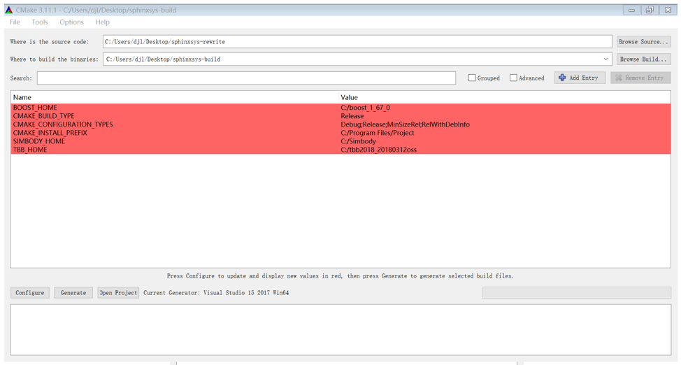

This section describes the installation procedure for the pre-compiled binaries of the SPHinXsys. 
If you want to build from source instead, please see the separate document "How to Build Simbody from Source". 
That document is included in the source zip file.

========================
How to install SPHinXsys
========================

We’ll start here with general information, then give platform-specific instructions in the next sections ("Linux and Mac OX S" and 
"Windows"). Be sure to check the online installation instructions that are alongside the download package for last-minute information.

Where can I find the downloads
------------------------------

Access is granted on request via email: xiangyu.hu@tum.de

What is in the download zip files
---------------------------------

The downloads include libraries, header files, documentation and example programs for SPHinXsys. 
The installation is organized as a hierarchy of directories. 
The top level directory has 5 subdirectories: lib, include, doc, and case test. 
The downloads contain static and dynamic versions of each library, in both debug and optimized form. 
All the examples are available precompiled, and source and build scripts for them are in examples/src. 

Which download do I want
-------------------------

There are separate download packages for each of the supported platforms (Linux, Mac OS X, and Windows).
There is also a source package but if you want to build from source you are reading the wrong document – see above.

What if I have a problem
-------------------------

If you have problems, e.g., bug report and contribute to the development of SPHinXsys, 
please email to xiangyu.hu@tum.de (Xiangyu Hu) or c.zhang@tum.de (Chi Zhang).

Installation overview
---------------------

Here is the general procedure

  - Set up your machine with the required prerequisites.
  - Download the appropriate .zip package from the Downloads page.
  - Unzip into the installation directory (can be anywhere but we’ll suggest default locations).
  - Set path and environment variables as needed.
  - Run installation test programs to verify.
  - SimBody library 3.6.0 or higher.

The next three sections provided details specific to each of the three platforms for which we provide binaries: Linux, Mac, Windows. You only need to read one of these sections.

Dependencies
--------------

SPHinXsys depends on the following:

  - cross-platform building: Cmake 3.14.0 or later. See the `Cmake <https://cmake.org/>`_ webpage.
  - compiler: Visual Studio 2017 (Windows only), gcc 4.9 or later (typically on Linux), or Apple Clang (1001.0.46.3)  or later
  - google test framework
  - BOOST library (newest version)
  - TBB library (newest version)
  - Simbody library 3.6.0 or later
  - linear algebra: LAPACK 3.5.0 or later and BLAS

Installing on Unix (Linux or Mac OS X)
---------------------------------------

The only prerequisite on Mac OS X is that you have the developer kit installed, 
which you probably do already.
At a minimum, the Accelerate framework must be installed 
because that includes Lapack ad Blas libraries on which Simbody depends. 
If you download the developer kit, those libraries are installed as well.

On Linux system, LAPACK and BLAS is require, and we refer `to here
<http://www.netlib.org/lapack/>`_ and `here
<http://www.netlib.org/blas/>`_ for more details.

To install google test, in the case we have installed Cmake, if you have ROOT authority (Ubuntu):

  $ sudo apt-get install libgtest-dev

Note that this package only install source files. 
You have to compile the code yourself to create the necessary library files. 
These source files should be located at /usr/src/gtest. Browse to this folder and use cmake to compile the library:
  
  $ cd /usr/src/gtest/gtest
  $ sudo mkdir build
  $ cd build
  $ sudo cmake ..
  $ sudo make
  $ sudo cp libgtest* /usr/lib/

Other wise (NO ROOT Linux):

  $ git clone https://github.com/google/googletest.git -b release-1.11.0
  $ cd googletest  
  $ mkdir build
  $ cd build
  $ cmake ../ -DCMAKE_INSTALL_PREFIX=$HOME/gtest
  $ make -j8
  $ make install
Allow to be found by cmake: 
  $ echo 'export GTEST_ROOT=$HOME/gtest' >> ~/.bashrc

The installation of Simbody, refers to `this link
<https://github.com/simbody/simbody#linux-or-mac-using-make>`_.
After installing Simbody correctly, set environment variable:

  -  For Mac OS X::

		$ echo 'export TBB_HOME=/path/to/tbb' >> ~/.bash_profile

  -  For Linux::

		$ echo 'export TBB_HOME=/path/to/tbb' >> ~/.bashrc
		$ echo 'export LIBRARY_PATH=$SIMBODY_HOME/lib64:$LIBRARY_PATH' >> ~/.bashrc
		$ echo 'export LD_LIBRARY_PATH=$LIBRARY_PATH:$LD_LIBRARY_PATH' >> ~/.bashrc
		$ echo 'export CPLUS_INCLUDE_PATH=$SIMBODY_HOME/include:$CPLUS_INCLUDE_PATH' >> ~/.bashrc

Download a release version of TBB from `their GitHub
<https://github.com/01org/tbb/releases>`_ and then unzip it to the appropriate directory on your computer and set environment variable:

  - Mac OS X::

		$ echo 'export TBB_HOME=/path/to/tbb' >> ~/.bash_profile

  - Linux::

		$ echo 'export TBB_HOME=/path/to/tbb' >> ~/.bashrc

Download a release version of BOOST from their `webpage
<https://www.boost.org/users/download/>`_ and then unzip it to the appropriate directory on your computer and set environment variable:

  - Mac OS X::

		$ echo 'export BOOST_HOME=/path/to/boost' >> ~/.bash_profile

  -  Linux::

		$ echo 'export BOOST_HOME=/path/to/boost' >> ~/.bashrc

Download the sphinxsys-linux or sphinxsys-max, and then unzip it to the appropriate directory on your computer and set environment variable \begin{itemize}

  - Mac OS X::

		$ echo 'export SPHINXSYS_HOME=/path/to/sphinxsyslibaray' >> ~/.bash_profile

  -  Linux::

		$ echo 'export SPHINXSYS_HOME=/path/to/sphinxsyslibrary' >> ~/.bashrc

and then make a build directory like sphinxsys-build with the following command:: 

    $ mkdir $HOME/sphinxsys-build
    $ cd $HOME/sphinxsys-build
    
using the following commend to build the SPHinXsys and run all the tests with the following command::

		$  cmake /path/to/sphinxsys-alpha -DCMAKE_BUILD_TYPE=RelWithDebInfo
		$ make -j
		$ ctest

You can play with SPHinXsys, for example run a specific test case by::
  
    $ cd /path/to/sphinxsys-build/cases_test/test_2d_dambreak
    $ make -j 
    $ cd /bin
    $ ./test_2d_dambreak

Right now, you can play with SPHinXsys by change the parameters. GOOD LUCK!

Installing on Windows
---------------------

We provide pre-built binaries for use with Visual Studio 2017. 
If you have an earlier or later version of Visual Studio, or if you are using Visual Studio Express you will likely need to build from source (not hard). See the separate build from source document referenced at the start of this chapter.

The only prerequisite on Windows is that you have a development environment (Visual Studio) and a way to unzip the .zip package. If you don’t have one already, you’ll need to install software that can perform the unzip operation. 
The installation of Simbody on Windows is refer to `Simbody's page
<https://github.com/simbody/simbody#windows-using-visual-studio>`_, 
and after that please set the system environment variable SIMBODY_HOME to the simbody prefix directory and the simbody bin path to environmental variable( System variable).

Install google test, we download the release version from the github repository: <https://github.com/google/googletest/releases>, build and install it.
For this, you will extract the source and create a new build directory. Using Cmake, you will configure and generate a Visual Studio project. 
Be sure that, in Cmake GUI,  you have clicked the two options: build_shared_libs and install_gtest. The install prefix you can choose the default one 
(in windows program files and, in this case, you later need run Visual Studio as administrator) or other new directory. 
Open the generated project in Visual Studio, build all and install both for Debug and ReleaseWithDebugInfo targets.
Then, you need setup Windows system environment variables: GTEST_HOME with the value of the install prefix directory.
Also you need add the bin directory as new path. the dll files inside need to found when running the tests.    

Install TBB, actually extract the file to the assigned folder , e.g. $C:/ tbb_2019$
set environment variable: TBB_HOME to the tbb directory, and set the path $path/to/tbb/bin/intel64/vc14$ to environmental variable (System variables).

Install boost, actually extract the file to the assigned folder, e.g. $C:/boost, and set environment: BOOST_HOME to its directory

Download the sphinxsys-win file,
and then unzip it to the appropriate directory on your computer and set environment variable BOOST_HOME to its directory.
Using cmake for configure project as follows 

 

   Cmake configure sphinxsys library

After configuration, one can use Visual Studio to play with SPHinXsys. GOOD LUCK!

Installing on Ubunutu Linux using the dependency-free version
-------------------------------------------------------------

Note: Do not clone the submodules if you are using the default installation!

Get all submodules, run this command in the command line of the SPHinXsys project folder::

	$ git submodule update --init --recursive

Edit the CMake variables to define which dependency to use. Simbody and/or TBB can be built by the project. 
If one is not built by the project, install that dependency in the usual way as written before.

	- Go to SPHinXsys/cmake/Dependency_settings.cmake
	- Set BUILD_WITH_DEPENDENCIES to 1
	- Set BUILD_WITH_SIMBODY to 1 if Simbody should be built by the project
	- Set BUILD_WITH_ONETBB to 1 if TBB should be built by the project
	- Set ONLY_3D to 1 if the 2D libraries and test cases are not needed. Note that Boost is still needed if this variable is set to 0
	- Do not modify the other variables

Build the SPHinXsys project as described in the previous section.

