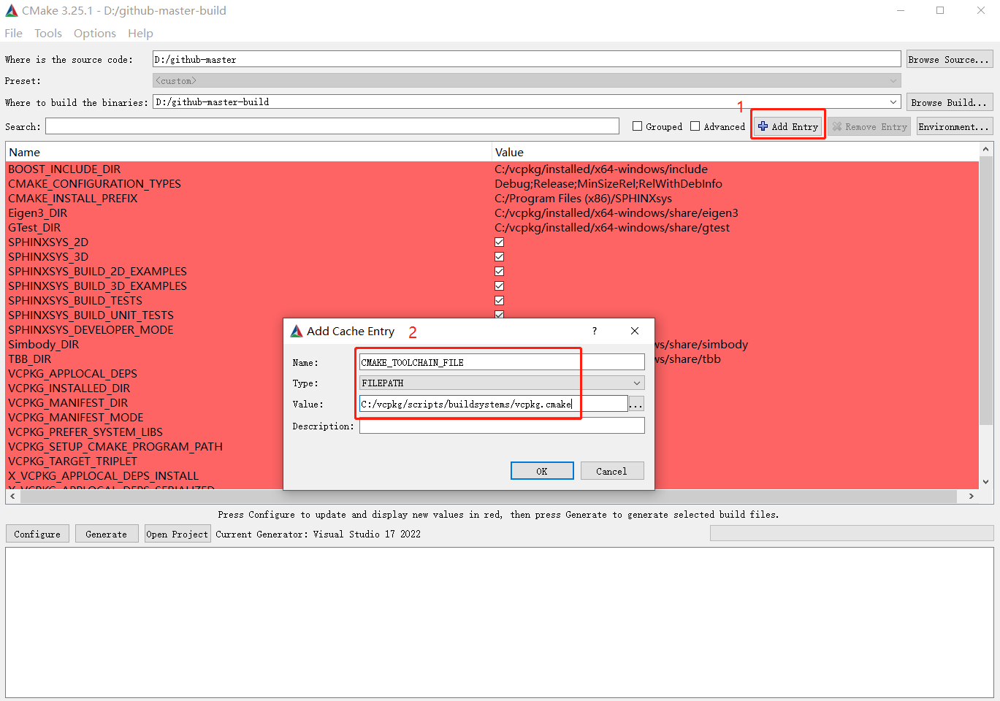

========================
How to install SPHinXsys
========================

SPHinXsys is an open-source library hosted on Github https://github.com/Xiangyu-Hu/SPHinXsys.
If you face problems about installation, want to report bugs, or any other difficulties, 
please report them https://github.com/Xiangyu-Hu/SPHinXsys/issues 

Requirements
------------

SPHinXsys depends on the following:

* CMake 3.16 or later but before 4.0
* C++17 compliant compiler

* Visual Studio 2017 15.7 or later (Windows)
* GCC 8 or later (Linux)
* Python3
* Git
* vcpkg (please use the branch "2024.11.16", or the same one that we have used in CI: (line 29) https://github.com/Xiangyu-Hu/SPHinXsys/blob/master/.github/workflows/ci.yml)

Installing on Ubuntu
---------------------------------------

The procedure is given for Ubuntu 20.04 LTS and considers a user having sudo privileges.
This should be identical on any more recent versions.
The home directory :code:`$HOME` is chosen as the working directory, adapt accordingly if it differs. 

Installing dependencies
^^^^^^^^^^^^^^^^^^^^^^^

In the terminal, install the required system dependencies

..  code-block:: bash

        sudo apt update
        sudo apt upgrade
        sudo apt install -y apt-utils           # package management related utility programs
        sudo apt install -y build-essential     # GCC compilation development suite and Make
        sudo apt install -y curl zip unzip tar  # when starting on a barebone Ubuntu image for bootstrapping vcpkg
        sudo apt install -y pkg-config          # for installing libraries with vcpkg
        sudo apt install -y git                 
        sudo apt install -y cmake               
        sudo apt install -y ccache              # ccache is a compiler cache. It speeds up recompilation by caching previous compilations
        sudo apt install -y python3-dev
        sudo apt install -y gfortran
        sudo apt-get install autoconf automake autoconf-archive

If you want a debugger for development purposes:

..  code-block:: bash

    sudo apt install -y gdb

From here, pick a workspace where the library and any dependent code will be downloaded. 
The following block will install the direct dependencies required by SPHinXsys in user-space:

..  code-block:: bash
    
    cd $HOME
    git clone -b 2024.11.16 https://www.github.com/microsoft/vcpkg.git
    cd vcpkg
    ./bootstrap-vcpkg.sh
    ./vcpkg install --clean-after-build \
        eigen3                          \
        tbb                             \
        boost-program-options           \
        boost-geometry                  \
        simbody                         \
        gtest                           \
        pybind11                        \
        spdlog

Note that, some libraries can be installed simply by apt install, such as eigen3, tbb and boost.
It seems that only the simbody and gtest should be installed by using vcpkg.
By default, vcpkg targets the architecture *x64* and installs the *static* version of the libraries on Linux-based systems.
To install the *shared* versions, do the following:

..  code-block:: bash

    cd $HOME
    cd vcpkg
    ./vcpkg install --clean-after-build         \
        eigen3:x64-linux-dynamic                \
        tbb:x64-linux-dynamic                   \
        boost-program-options:x64-linux-dynamic \
        boost-geometry:x64-linux-dynamic        \
        simbody:x64-linux-dynamic               \
        gtest:x64-linux-dynamic                 \
        pybind11:x64-linux-dynamic              \
        spdlog:x64-linux-dynamic
    cd ..

Otherwise, please refer to the official `vcpkg documentation <https://vcpkg.io/en/docs/examples/overlay-triplets-linux-dynamic.html>`_

Also Note that, if you encounter an error, you may need to check the exact log file to find the detailed error message.

Building SPHinXsys
^^^^^^^^^^^^^^^^^^^^^

..  code-block:: bash
    
    cd $HOME
    git clone https://github.com/Xiangyu-Hu/SPHinXsys.git sphinxsys
    cd sphinxsys
    cmake   -G "Unix Makefiles"                                                         \
            -D CMAKE_BUILD_TYPE=Release                                                 \
            -D CMAKE_C_COMPILER=gcc -D CMAKE_CXX_COMPILER=g++                           \
            -D CMAKE_TOOLCHAIN_FILE="$HOME/vcpkg/scripts/buildsystems/vcpkg.cmake"      \
            -D CMAKE_C_COMPILER_LAUNCHER=ccache -D CMAKE_CXX_COMPILER_LAUNCHER=ccache   \
            -S .                                                                        \
            -B ./build
    cmake   --build build/ 

If you prefer to use other installed compiler in your Linux system, 
you can just change :code:`gcc` and :code:`g++` to your favorite ones. 

If you are using VS Code as your development platform, please make sure the CMake Tool plugin is installed 
and the corresponding icon shown in the GUI. 
Please choose Configure as :code:`unspecified` 
as you will let the above CMake script decide how to build SPHinXsys.
Note that, if you face an issue and need to rerun the above script, please make sure the CMakeCache.txt 
in :code:`build` folder is deleted as it saves the last run information and may lead to the same issue as before.            

Running the tests and examples
^^^^^^^^^^^^^^^^^^^^^^^^^^^^^^

To run the whole test suite:

..  code-block:: bash

    cd $HOME
    cd sphinxsys/build
    ctest -j 1 # Run each test sequentially because SPHinXsys uses all cores

    
Notice that :code:`ctest` **must run sequentially** because SPHinXsys already uses all available cores.

For running a specific case, for example, the **2d_dambreak**:

..  code-block:: bash

    cd $HOME
    cd sphinxsys/build/tests/2d_examples/test_2d_dambreak
    make -j 7 # Where 7 is the number of parallel compilation processes, adapt according to your CPU  
    cd bin
    ./test_2d_dambreak

Installing SYCL version on Ubuntu
---------------------------------------

Note that since the current Windows Subsystem for Linux (WSL1 or WSL2) does not support Unified Shared Memory (USM), 
the current SYCL version only runs on full Linux.

First Step: Install Intel oneAPI
^^^^^^^^^^^^^^^^^^^^^^^^^^^^^^^^

Go to "https://www.intel.com/content/www/us/en/developer/tools/oneapi/base-toolkit-download.html" 
and choose the appropriate system and method to install Intel oneAPI.
For instance, we choose Linux(For now, only full Linux can run SPHinXsys SYCL version) and offline installer, 
then we get following instructions:

..  code-block:: pwsh

    wget https://registrationcenter-download.intel.com/akdlm/IRC_NAS/20f4e6a1-6b0b-4752-b8c1-e5eacba10e01/l_BaseKit_p_2024.0.0.49564_offline.sh
    sudo sh ./l_BaseKit_p_2024.0.0.49564_offline.sh

Run these two commands in sequence, and then the GUI interface of the installer will open. 
Just use the default settings (the warning of the Prerequistes Check can be ignored).

The sign of successful installation is to open the terminal and enter:

..  code-block:: pwsh
    
    source /opt/intel/oneapi/setvars.sh --include-intel-llvm
 
If it shows that "oneAPI environment initialized", the installation is successful.
Note that you need to activate the oneAPI environment every time you open a new terminal.
Or you can add the above command to the "~/.bashrc" file, 
so that the oneAPI environment can be automatically activated when the terminal is opened.

Second Step: Install the GPU driver and CUDA (for the NVIDIA GPU)
^^^^^^^^^^^^^^^^^^^^^^^^^^^^^^^^^^^^^^^^^^^^^^^^^^^^^^^^^^^^^^^^^

There are so many tutorials and ways to install NVIDIA driver and CUDA on the Internet, 
such as official documents "https://docs.nvidia.com/cuda/cuda-installation-guide-linux/index.html#runfile-overview". 

Here we list only one of them:

Driver: Open the "Software & Updates" that comes with Ubuntu, then select "Additional Drivers", and finally select the appropriate driver. 
Click "Apply Changes", and the system will restart and automatically complete the driver update for you.
(Note that this is valid on Ubuntu 22.04.3LTS. If something unexpected happens, you can try other methods to install the NVIDIA driver.)
The sign of successful installation is to open the terminal and enter "nvidia-smi". 
If the graphics card information can be printed correctly, the installation is successful.

CUDA: Go to "https://developer.nvidia.com/cuda-downloads" and choose the appropriate system and method to install CUDA.
For instance, we choose Ubuntu and runfile (local) installer, 
then we get following instructions:

..  code-block:: pwsh

    wget https://developer.download.nvidia.com/compute/cuda/12.3.1/local_installers/cuda_12.3.1_545.23.08_linux.run
    sudo sh cuda_12.3.1_545.23.08_linux.run

Run these two commands in sequence. 
Please note that there will be a few seconds of waiting after you execute this command, this is normal. 
These system will first ask to choose "abort" or "continue" the installation,
as it detected that the driver has been installed before. 
You should choose to "continue" and cancel out the installing driver later.
After you see options such as "accept", "decline", etc., you can enter "accept" to continue.
Another interface will open. 
You can cancel out the installation of the driver that comes with CUDA 
because we have already installed it before.

After CUDA is installed, go to the "~/.bashrc" file, add the following instructions at the end of the file:

..  code-block:: pwsh

    export CUDA_HOME=/usr/local/cuda
    export LD_LIBRARY_PATH=${LD_LIBRARY_PATH}:${CUDA_HOME}/lib64
    export PATH=${CUDA_HOME}/bin:${PATH}

Then, open the terminal and enter "source ~/.bashrc" to make the changes take effect.
The sign of successful installation is to open the terminal and enter "nvcc -V". 
If the CUDA information can be printed correctly, the installation is successful.

Third Step: Install the oneAPI Plugin for NVIDIA GPU 
^^^^^^^^^^^^^^^^^^^^^^^^^^^^^^^^^^^^^^^^^^^^^^^^^^^^

Since oneAPI officially does not currently support graphics cards from other manufacturers, 
we need to install the corresponding plug-ins so that NVIDIA or AMD graphics cards can be detected by SYCL. 
There is a detailed official document explaining how to install this plugin:
"https://developer.codeplay.com/products/oneapi/nvidia/2024.0.0/guides/get-started-guide-nvidia"

The sign of successful installation is to open the terminal and enter "sycl-ls". 
If it can detect your graphics card information, the installation is successful.
(You need to activate the oneAPI environment first.)

Final Step: Building SPHinXsys-SYCL
^^^^^^^^^^^^^^^^^^^^^^^^^^^^^^^^^^^

Clone the sycl branch of SPHinXsys:

..  code-block:: pwsh

    git clone -b sycl https://github.com/Xiangyu-Hu/SPHinXsys.git SPHinXsysSYCL
    cd SPHinXsysSYCL
    cmake   -G "Unix Makefiles"                                                     \
        -D CMAKE_BUILD_TYPE=Release                                                 \
        -D CMAKE_C_COMPILER=icx -D CMAKE_CXX_COMPILER=icpx                          \
        -D CMAKE_TOOLCHAIN_FILE="$HOME/vcpkg/scripts/buildsystems/vcpkg.cmake"      \
        -D CMAKE_C_COMPILER_LAUNCHER=ccache -D CMAKE_CXX_COMPILER_LAUNCHER=ccache   \
        -D SPHINXSYS_USE_SYCL=ON                                                    \
        -D SPHINXSYS_SYCL_TARGETS=nvptx64-nvidia-cuda                               \
        -S .                                                                        \
        -B ./build
    cmake --build build/ --target test_2d_dambreak_sycl

Then, you can run it:

..  code-block:: pwsh

    cd build/tests/2d_examples/test_2d_dambreak_sycl/bin/
    ./test_2d_dambreak_sycl

Installing on Windows
---------------------------------------

Pre-requisites
^^^^^^^^^^^^^^^^^^^^^^^^

* Windows 7 or newer
* `Git <https://git-scm.com/download/win>`_
* `Visual Studio 2017 or newer <https://visualstudio.microsoft.com/vs/community/>`_ with C++ environment installed
* `CMake <https://cmake.org/>`_
* `Python3 <https://www.python.org/>`_

Installing dependencies
^^^^^^^^^^^^^^^^^^^^^^^
Open Windows PowerShell or Git CMD, and then run the commands below one by one. 
(Before you run these commands, you can change the installation path by using the command :code:`cd ..`, etc.)

First clone the vcpkg repository to your home directory.

..  code-block:: pwsh
    
    git clone -b 2024.11.16 https://www.github.com/microsoft/vcpkg.git
    cd vcpkg
    .\bootstrap-vcpkg.bat
    .\vcpkg install --clean-after-build         \
        eigen3:x64-windows                      \
        tbb:x64-windows                         \
        boost-program-options:x64-windows       \
        boost-geometry:x64-windows              \
        simbody:x64-windows gtest:x64-windows   \
        pybind11:x64-windows                    \
        spdlog:x64-windows
    .\vcpkg integrate install

You can also install it by using Git Bash. 
In this way, you need to change the command :code:`.\bootstrap-vcpkg.bat` to :code:`./bootstrap-vcpkg.bat` ,
i.e., you need to use the slash :code:`/` instead of the backslash:code:`\`, as follows:

..  code-block:: bash
    
    git clone -b 2024.11.16 https://www.github.com/microsoft/vcpkg.git
    cd vcpkg
    ./bootstrap-vcpkg.bat
    ./vcpkg install --clean-after-build             \
        eigen3:x64-windows                          \
        tbb:x64-windows                             \
        boost-program-options:x64-windows           \
        boost-geometry:x64-windows                  \
        simbody:x64-windows                         \
        gtest:x64-windows                           \
        pybind11:x64-windows                        \
        spdlog:x64-windows
    ./vcpkg integrate install

Please make sure that the name of the directory for cloning vcpkg has only using plain characters, 
especially without spaces.  Otherwise, some dependent libraries, such as tbb, can not being built successfully.
By default, vcpkg targets the architecture *x64* and installs the *dynamic* version of the libraries on Windows system.
To install the *static* versions, replace the former install line by the following:

..  code-block:: pwsh

    .\vcpkg install --clean-after-build          \
        eigen3:x64-windows-static                \
        tbb:x64-windows-static                   \
        boost-program-options:x64-windows-static \
        boost-geometry:x64-windows-static        \
        simbody:x64-windows-static               \
        gtest:x64-windows-static                 \
        pybind11:x64-windows-static              \
        spdlog:x64-windows-static

For any other combination, please refer to the official `architecture documentation <https://vcpkg.io/en/docs/users/triplets.html>` .
Also Note that, if you encounter an error, you may need to check the exact log file to find the detailed error message.

Building SPHinXsys with Visual Studio
^^^^^^^^^^^^^^^^^^^^^^^^^^^^^^^^^^^^^

First clone the repository to your home directory:

..  code-block:: pwsh
    
    git clone https://github.com/Xiangyu-Hu/SPHinXsys.git sphinxsys

Building SPHinXsys via cmake-gui.exe
^^^^^^^^^^^^^^^^^^^^^^^^^^^^^^^^^^^^

See the figure below. Prior configuring, you must **Add Entry** and set :code:`CMAKE_TOOLCHAIN_FILE` variable 
with a :code:`FILEPATH` type pointing to :code:`<workspace>\vcpkg\scripts\buildsystems\vcpkg.cmake` .
Then, open the solution file (:code:`.sln`) generated in the :code:`build\` folder with Visual Studio.

   CMake configures SPHinXsys library

Installing on macOS (latest) 
---------------------------------------
The procedure is given for MAC OS 13.0.1  and clang 14.0.0 (clang-1400.0.29.202).
With the assumption that you have installed Command Line Tools and python3. 

Installing dependencies
^^^^^^^^^^^^^^^^^^^^^^^

In the terminal, install the required system dependencies, homebrew, with it, 
you can install cmake, pkg-config, and others. 
Note that gfortran is essential for lapack_reference, which is needed for simbody. 

..  code-block:: bash

        /bin/bash -c "$(curl -fsSL https://raw.githubusercontent.com/Homebrew/install/HEAD/install.sh)"
        brew update 
        brew install cmake
        brew install pkg-config
        brew install ccache
        brew install gfortran
        brew install ninja
        brew install autoconf automake autoconf-archive

From here, pick a workspace where the library and any dependent code will be downloaded. 
The following block will install the direct dependencies required by SPHinXsys in user-space:

..  code-block:: bash
    
    cd $HOME
    git clone -b 2024.11.16 https://www.github.com/microsoft/vcpkg.git
    cd vcpkg
    ./bootstrap-vcpkg.sh -disableMetrics
    ./vcpkg env --triplet=x64-osx
    ./vcpkg install --clean-after-build         \
        eigen3                                  \
        tbb                                     \
        boost-program-options                   \
        boost-geometry                          \
        simbody                                 \
        gtest                                   \
        pybind11                                \
        spdlog

Note that, if you are using ARM Mac (M1 or later chips), 
you should use the triplet :code:`arm64-osx` instead of :code:`x64-osx`.

Building SPHinXsys
^^^^^^^^^^^^^^^^^^^^^

..  code-block:: bash
    
    git clone https://github.com/Xiangyu-Hu/SPHinXsys.git sphinxsys
    cd sphinxsys
    cmake   -G Ninja                                                                    \
            -D CMAKE_BUILD_TYPE=Release                                                 \
            -D CMAKE_C_COMPILER=clang -D CMAKE_CXX_COMPILER=clang++                     \
            -D CMAKE_TOOLCHAIN_FILE="$HOME/vcpkg/scripts/buildsystems/vcpkg.cmake"      \
            -D CMAKE_C_COMPILER_LAUNCHER=ccache -D CMAKE_CXX_COMPILER_LAUNCHER=ccache   \
            -S .                                                                        \
            -B ./build
    cmake   --build build/ 

Running the tests and examples
^^^^^^^^^^^^^^^^^^^^^^^^^^^^^^

They are the same as in Ubuntu Linux (See above).  
