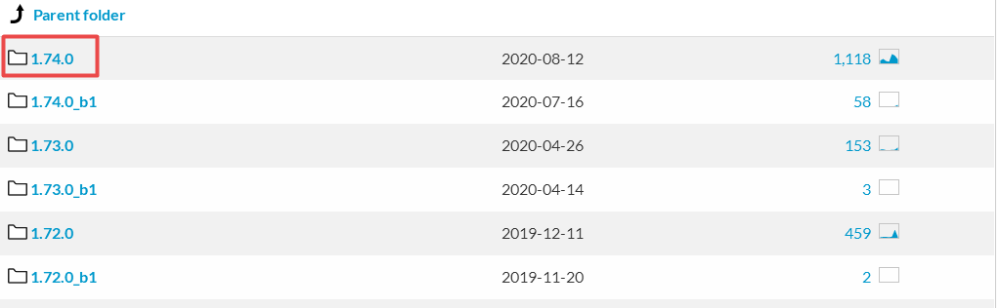
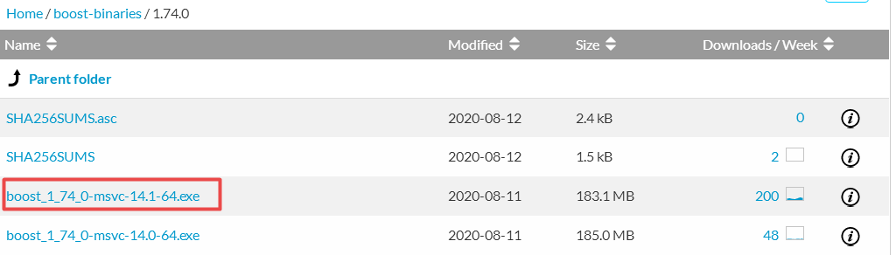

This section describes the installation procedure of SPHinXsys. 

========================
How to install SPHinXsys
========================

We will start here with general information, then give platform-specific instructions in the next sections 
("Ubuntu Linux, Windows and other Linux or Unix systems). 

Where can I find the downloads
------------------------------

SPHinXsys is an open-source library hosted on Githhub https://github.com/Xiangyu-Hu/SPHinXsys/.
You can clone the master branch or download the release .zip or .tar files.

What if I have a problem
-------------------------

If you have problems, e.g., installing issue, bug report and contribute to the development of SPHinXsys, 
please email to xiangyu.hu@tum.de (Xiangyu Hu) or c.zhang@tum.de (Chi Zhang).

Dependencies
--------------

SPHinXsys depends on the following:

  - Cmake 3.16.0 or later. See the `Cmake <https://cmake.org/>`_ webpage.
  - compiler: Visual Studio 2017 or later (Windows), gcc 4.9 or later (Linux)
  - google test framework
  - BOOST library (newest version)
  - TBB library (newest version)
  - linear algebra: LAPACK 3.5.0 or later and BLAS
  - Simbody library 3.6.0 or later
  - Eigen 3 or later

Installation overview
---------------------

Here is the general procedure

  - Set up your machine with the required prerequisites.
  - Clone the source from githiub master branch or download the appropriate .zip package from the release page.
  - Unzip into the installation directory (can be anywhere but we will suggest default locations).
  - Set path and environment variables as needed.
  - Run Cmake to configure and generate the SPHinXsys project.
  - Make and run the test set to verify the installation.

The next three sections provide the details specific to each of three platforms,
i.e. Ubuntu Linux (recommanded), Windows and other Linux or Unix systems.

You only need to read one of these sections.

Installing on Ubuntu Linux
---------------------------------------

In order for beginners to experience SPHinXsys in the Ubuntu Linux system, 
the following installation tutorial will explain how to start from a newly 
installed Ubuntu system, install all the required programs step by step, 
and finally complete the installation of SPHinXsys.
The installation is on Ubuntu 20.04 LTS with root right.

Please note that before any installation from **apt** and **apt-get**, 
you need to run **update** or even **upgrade** command to resynchronize or update newest packages.

In the Terminal, and type::

    $ sudo apt-get update
    $ sudo apt-get upgrade

to update in system packages.  
If you have not installed **wget** for downloading files yet, 
you can install it by typing the command below::

    $ sudo apt-get update
    $ sudo apt-get install wget

If you have not install **g++** compiler, 
you can install it by installing the **build-essential** package::

    $ sudo apt-get install build-essential

Make sure if you have **git**, otherwise install it on your computer by typing::

    $ sudo apt-get install git

If you would like to use debug module, check the **gdb** is in your computer or not by typing::

    $ whereis -b gdb

Normally you will find **gdb** after you install *build-essential* package,
if not, install **gdb** by typing command below::

    $ sudo apt-get install gdb

Now we need to install **CMake**, if you do not have it in your system by typing::

    $ sudo apt-get install cmake

After the **CMake** is successfully installed, you can verify its installation and 
also if the correct version is installed, through the following command::

    $ cmake --version

Now move to **LAPACK** and **BLAS**. Don't forget to move to root folder by typing::

    $ cd

Install Lapack and Blas by typing the command below::

    $ sudo apt-get install libblas-dev liblapack-dev

In the new version of **SPHinXsys**, the **Gtest** is introduced for functional test,
to intall **Gtest**, following the stpes below::

    $ sudo apt-get install libgtest-dev
    $ cd /usr/src/gtest
    $ sudo cmake CMakeLists.txt
    $ sudo make

Move to root folder. Comes to the **Boost** and **TBB** libraries::

    $ sudo apt-get install libtbb-dev
    $ sudo apt-get install libboost-all-dev

and set the environment by::

    $ echo 'export TBB_HOME=/usr/lib/x86_64-linux-gnu' >> ~/.bashrc
    $ echo 'export BOOST_HOME=/usr/lib/x86_64-linux-gnu' >> ~/.bashrc

Notice that during the installation of Boost, you might be asked to choose the aera and the city.

**SPHinXsys** use **Simbody** to calculate the multi-body dynamics, thus we need to install **Simbody**.
Here are the optional steps for visualizer of **Simbody**::

    $ sudo apt-get install libglu1-mesa-dev freeglut3-dev mesa-common-dev
    $ sudo apt-get install libxi-dev libxmu-dev

Download a release version of **Simbody** by typing the commands::

    $ wget https://github.com/simbody/simbody/archive/Simbody-3.7.tar.gz  
    $ tar xvzf Simbody-3.7.tar.gz

Make build and install directory::

    $ mkdir $HOME/simbody-build
    $ mkdir $HOME/simbody

and go the build folder::

    $ cd $HOME/simbody-build

Configure and generate Make files::

    $ cmake $HOME/simbody-Simbody-3.7 -DCMAKE_INSTALL_PREFIX=$HOME/simbody 
      -DCMAKE_BUILD_TYPE=RelWithDebInfo 
      -DBUILD_VISUALIZER=on -DBUILD_STATIC_LIBRARIES=on 

Notice that the above command is a whole command, cannot be executed separately, 
and pay attention to the space between different commands.

Then build **Simbody** by::

    $ make -j8

Note that here the :code:`-j8` means that I use 8 cores to run in parallel.
Please consider not to use all cores on your computer to run this command.

If you want you can test **Simbody**::

    $ ctest -j8

Install **Simbdoy**::

    $ make -j8 install

Then we make **Simbody** can be found by **CMake**::

    $ echo 'export SIMBODY_HOME=$HOME/simbody' >> ~/.bashrc

Set environment variables::

    $ echo 'export LD_LIBRARY_PATH=$LD_LIBRARY_PATH:$SIMBODY_HOME/lib' >> ~/.bashrc
    $ echo 'export CPLUS_INCLUDE_PATH=$CPLUS_INCLUDE_PATH:$SIMBODY_HOME/include' >> ~/.bashrc

If you want to use debug module of **Simbody** later in your work, 
you can modify the **DCMAKE_BUILD_TYPE** equals to **Debug**, build and install **Simbody** again by::

    $ cmake $HOME/simbody-Simbody-3.7 -DCMAKE_INSTALL_PREFIX=$HOME/simbody 
      -DCMAKE_BUILD_TYPE=Debug -DBUILD_VISUALIZER=on -DBUILD_STATIC_LIBRARIES=on 
    $ make -j8
    $ make -j8 install

Update and check environment setup before installing SPHinXsys. 
The following commands could update the environment and report the corresponding paths::

    $ source ~/.bashrc
    $ echo $SIMBODY_HOME
    $ echo $TBB_HOME
    $ echo $BOOST_HOME 

Now we can move to the last part, install **SPHinXsys**, don't forget to move to root folder.
Download the latest version of **SPHinXsys** by the command below::

    $ git clone https://github.com/Xiangyu-Hu/SPHinXsys.git

The Eigen 3 library is a submodule in SPHinXsys.
You can go the the folder 3rd_party to initilize the the submodule, by typing::

    $ git submodule init
    $ git submodule update

to ensure eigen 3 library is ready. 
There are two other submodules in SPHInXsys, i.e. simbody and wasmtbb, 
these are advanced components that you do not need for now.  

If you install SPHinXsys from .tar file from relase version.
You need unzip the source and download eigen 3 source from <https://eigen.tuxfamily.org>
and copy all files into the folder 3rd_party/eigen in SPHinXsys source.

Make build directory for **SPHinXsys**::

    $ mkdir $HOME/sphinxsys-build

go to the build folder::

    $ cd $HOME/sphinxsys-build

Configure and generate Make files::

    $ cmake $HOME/SPHinXsys -DCMAKE_BUILD_TYPE=RelWithDebInfo

Notice that the path :code:`$HOME/SPHinXsys` should be path of SPHinXsys source code, you need to confirm it.

Now you can build, test all cases of **SPHinXsys** by follwoing commands::

    $ make -j7
    $ ctest
    
Please pay attention here the :code:`ctest` without parallel execution, that is becasuse the **SPHinXsys**
has the build-in function for parallel computing, if you run :code:`ctest` with :code:`-jx`, you may get some test 
cases failed.
Again, `-j7` means that I am using a 8 cores machine.  Please do not use all cores for compiling.  

or  you can choose a specific case for running, for example, the **2d_dambreak**::

    $ cd $HOME/sphinxsys-build/tests/2d_examples/test_2d_dambreak
    $ make -j7
    $ cd bin
    $ ./test_2d_dambreak

Rigth now, you have the **SPHinXsys** successfully installed in your computer, Have fun with it!

Installing on Windows
---------------------------------------

The prerequisite on Windows is that you have a c++ development environment (Visual Studio 2017 (recommanded) or later version) and a way to unzip the `.zip` package.

Step1: Install CMake

	CMake is cross-plateform project manager and generates files for a project.

	- Install CMake on Windows and extract the file to the assigned folder, details refering to `CMake's page <https://cmake.org/>`_. 
	- After installation, please set the CMake bin path to environmental variables (System variables).

Step2: Install Tbb

	- Download TBB (Thread Building Blocks) `Tbb's page <https://github.com/oneapi-src/oneTBB/releases/tag/2019_U9>`_.
	- Extract the file to the assigned folder.
	- Set environment variables: TBB_HOME to the tbb directory (User variables), and set the path $TbbDirectory/bin/intel64/vc14$ to environmental variables (System variables).

.. figure:: figures/TBB.png
   :width: 600 px
   :align: center

Step3: Install Boost

	- Download Boost `Boost's page <https://sourceforge.net/projects/boost/files/boost-binaries/>`_. Choose the right version according to your visual studio verson (For VS 2017 you choose msvc-14.1-64, VS2019 msvc-14.2-64.).
	- Extract the file to the assigned folder. 
	- Set environment: BOOST_HOME to its directory (User variables), and the path $BoostDirectory/lib64-msvc-14.1$ to enviromental variables (System variables).

Step4: Install Simbody

	- The installation of Simbody on Windows is refer to `Simbody's page <https://github.com/simbody/simbody#windows-using-visual-studio>`_.
	- Extract the source and create a new build directory. 
	- Using CMake, you will configure and generate a Visual Studio project and then open the project in Visual Studio. The install prefix you can choose the default one or other new directory. 
	- Note that if you choose the default installation prefix (the system disk C:/), you need to run Visual Studio as administrator and then open the Simbody.sln file in the build directory instead of directly click `Open Project` in CMake GUI.
	- Then build `ALL_BUILD` and `INSTALL` with `Debug` and `ReleaseWithDebugInfo` modes respectively in Visual Studio, refering to the following figure.
	- After that, please set the system environment variable SIMBODY_HOME to the simbody prefix directory (User variables) and the simbody bin path to environmental variables (System variables).
	- Note that `pthreadVC2_x64.dll` and `pthreadVC2_x64.lib` are lost in the latest Simbody version. You need to copy these two files from the old version, Simbody 3.5, and then put these files into the Simbody installation folder, $**/Simbody/bin$ and $**/Simbody/lib$. 

.. figure:: figures/Simbody_1.png
   :width: 600 px
   :align: center

Step5: Install Goole test

	- Install google test, we download the release version from the github repository: <https://github.com/google/googletest/releases>, build and install it.
	- For this, you will extract the source and create a new build directory. Using CMake, you will configure and generate a Visual Studio project. Be sure that, in CMake GUI, you have to click the two options: `build_shared_libs` and `install_gtest`. The install prefix you can choose the default one or other new directory. 
	- Note that if you choose the default installation prefix (the system disk C:/), you need to run Visual Studio as administrator and then open the googletest-distribution.sln file in the build directory instead of directly click 'Open Project' in CMake GUI.
	- Similar to the installation of Simbody, build `ALL_BUILD` and `INSTALL` with `Debug` and `ReleaseWithDebugInfo` modes respectively.
	- Set up Windows system environment variables: GTEST_HOME with the value of the install prefix directory (User variables). Also you need add the bin directory as new path. the dll files inside need to found when running the tests.    

Step6: Install Eigen

	The Eigen library is a submodule in SPHinXsys.
	If you install SPHinXsys from .zip or .tar file from relase version.
	You need unzip the source and download eigen 3 source from <https://eigen.tuxfamily.org>
	and copy all files into the folder 3rd_party/eigen in SPHinXsys source.
	There are two other submodules in SPHInXsys, i.e. simbody and wasmtbb, 
	these are advanced components that you do not need for now. 

Step7: SPHinXsys

	- Download the release version of SPHinXsys <https://github.com/Xiangyu-Hu/SPHinXsys/releases>, and then unzip it to the appropriate directory on your computer and create a new build directory.
	- Please note that you should use simple name for the directory, especially not including number '0', which may trigger a bug in Cmake and leads to linking error in Visual Studio. 
	- Use CMake to build project file. Configure with the option Visual Studio 2017 x64, generate the project and open the project by Visual Studio. 
	- Using CMake for configure project as follows 

.. figure:: figures/cmake-sphinxsys.png
   :width: 600 px
   :align: center

   CMake configure SPHinXsys library
   
You can use Visual Studio to play with SPHinXsys. GOOD LUCK!

Installing on Unix (Linux or Mac OS X)
---------------------------------------

The only prerequisite on Mac OS X is that you have the developer kit installed, 
which you probably do already.
At a minimum, the Accelerate framework must be installed 
because that includes Lapack ad Blas libraries on which Simbody depends. 
If you download the developer kit, those libraries are installed as well.

On Linux system, LAPACK and BLAS is require, and we refer `to here
<http://www.netlib.org/lapack/>`_ and `here
<http://www.netlib.org/blas/>`_ for more details.

To install google test, in the case we have installed Cmake, if you have ROOT authority (Ubuntu)::

  $ sudo apt-get install libgtest-dev
  $ cd /usr/src/gtest/
  $ sudo cmake CMakeLists.txt
  $ sudo make
  $ cd lib/
  $ sudo cp libgtest* /usr/lib/

Other wise (NO ROOT Linux)::

	$ git clone https://github.com/google/googletest.git -b release-1.11.0
	$ cd googletest  
	$ mkdir build
	$ cd build
	$ cmake ../ -DCMAKE_INSTALL_PREFIX=$HOME/gtest
	$ make -j8
	$ make install

Allow to be found by cmake::

	$ echo 'export GTEST_ROOT=$HOME/gtest' >> ~/.bashrc

The installation of Simbody, refers to `this link
<https://github.com/simbody/simbody#linux-or-mac-using-make>`_.
After installing Simbody correctly, set environment variable:

  -  For Mac OS X::

		$ echo 'export SIMBODY_HOME=/path/to/simbody' >> ~/.bash_profile

  -  For Linux::

		$ echo 'export SIMBODY_HOME=/path/to/simbody' >> ~/.bashrc
		$ echo 'export LIBRARY_PATH=$SIMBODY_HOME/lib64:$LIBRARY_PATH' >> ~/.bashrc
		$ echo 'export LD_LIBRARY_PATH=$LIBRARY_PATH:$LD_LIBRARY_PATH' >> ~/.bashrc
		$ echo 'export CPLUS_INCLUDE_PATH=$SIMBODY_HOME/include:$CPLUS_INCLUDE_PATH' >> ~/.bashrc

Download a release version of TBB from `their GitHub
<https://github.com/01org/tbb/releases>`_ and then unzip it to the appropriate directory on your computer and set environment variable:

  - Mac OS X::

		$ echo 'export TBB_HOME=/path/to/tbb' >> ~/.bash_profile

  - Linux::

		$ echo 'export TBB_HOME=/path/to/tbb' >> ~/.bashrc

Download a release version of BOOST from their `webpage
<https://www.boost.org/users/download/>`_ and then unzip it to the appropriate directory on your computer and set environment variable:

  - Mac OS X::

		$ echo 'export BOOST_HOME=/path/to/boost' >> ~/.bash_profile

  -  Linux::

		$ echo 'export BOOST_HOME=/path/to/boost' >> ~/.bashrc

Download the sphinxsys-linux or sphinxsys-max, and then unzip it to the appropriate directory on your computer and set environment variable \begin{itemize}

  - Mac OS X::

		$ echo 'export SPHINXSYS_HOME=/path/to/sphinxsyslibaray' >> ~/.bash_profile

  -  Linux::

		$ echo 'export SPHINXSYS_HOME=/path/to/sphinxsyslibrary' >> ~/.bashrc

and then make a build directory like sphinxsys-build with the following command:: 

    $ mkdir $HOME/sphinxsys-build
    $ cd $HOME/sphinxsys-build
    
using the following commend to build the SPHinXsys and run all the tests with the following command::

		$ cmake /path/to/sphinxsys-alpha -DCMAKE_BUILD_TYPE=RelWithDebInfo
		$ make -j
		$ ctest

You can play with SPHinXsys, for example run a specific test case by::
  
    $ cd /path/to/sphinxsys-build/cases_test/test_2d_dambreak
    $ make -j 
    $ cd /bin
    $ ./test_2d_dambreak

Right now, you can play with SPHinXsys by change the parameters. GOOD LUCK!

Installing on Ubuntu Linux using the dependency-free version
-------------------------------------------------------------

Note: Do not clone the submodules if you are using the default installation!

Get all submodules, run this command in the command line of the SPHinXsys project folder::

	$ git submodule update --init --recursive

Edit the CMake variables to define which dependency to use. Simbody and/or TBB can be built by the project. 
If one is not built by the project, install that dependency in the usual way as written before.

	- Go to SPHinXsys/cmake/Dependency_settings.cmake
	- Set BUILD_WITH_DEPENDENCIES to 1
	- Set BUILD_WITH_SIMBODY to 1 if Simbody should be built by the project
	- Set BUILD_WITH_ONETBB to 1 if TBB should be built by the project
	- Set ONLY_3D to 1 if the 2D libraries and test cases are not needed. Note that Boost is still needed if this variable is set to 0
	- Do not modify the other variables

Build the SPHinXsys project as described in the previous section.

